# Security-Informed Safety Assurance Case — Northgate General Hospital

---

## Assurance Case Structure (Goal Structuring Notation)

The following diagram presents the top-level structure of the security-informed safety assurance case for Northgate General Hospital, using Goal Structuring Notation (GSN) concepts rendered in Mermaid. Node prefixes indicate GSN element types: **G** = Goal, **S** = Strategy, **C** = Claim (security-informed safety claim), **E** = Evidence, **Ctx** = Context, **R** = Residual Risk.

```mermaid
graph TD
    G1["<b>G1: Top-Level Goal</b><br/>Patient safety at Northgate General<br/>Hospital is not materially compromised<br/>as a result of a cyber attack<br/>on clinical ICT systems"]

    Ctx1["<b>Ctx1: Scope</b><br/>Northgate General Hospital<br/>clinical ICT environment as<br/>described in system architecture"]
    Ctx2["<b>Ctx2: Assumption</b><br/>Threat actors include financially<br/>motivated ransomware groups,<br/>supply-chain compromise, and<br/>negligent insiders"]

    G1 --- Ctx1
    G1 --- Ctx2

    S1["<b>S1: Strategy</b><br/>Argue over three sub-goals<br/>corresponding to the three<br/>security-to-safety pathways<br/>identified in hazard analysis"]

    G1 --> S1

    S1 --> G2["<b>G2: Sub-Goal 1</b><br/>Medical device integrity<br/>is maintained under all<br/>network conditions"]
    S1 --> G3["<b>G3: Sub-Goal 2</b><br/>Clinical data integrity and<br/>availability meets clinical<br/>safety requirements"]
    S1 --> G4["<b>G4: Sub-Goal 3</b><br/>Enterprise IT compromise<br/>does not propagate to<br/>safety-critical clinical systems"]

    %% Sub-Goal 1: Medical Device Integrity
    G2 --> C1["<b>C1: CLAIM-HC-003</b><br/>Drug library change control<br/>preserves dose safety"]
    G2 --> C4["<b>C4: CLAIM-HC-004</b><br/>Alarm config auditing<br/>maintains monitoring"]
    G2 --> C2["<b>C2: CLAIM-HC-002</b><br/>Firmware integrity prevents<br/>device manipulation"]

    C1 --> E1["<b>E1</b><br/>Drug library change audit<br/>trail + pharmacy sign-off"]
    C1 --> E2["<b>E2</b><br/>Automated version comparison<br/>deployed vs authorised"]
    C4 --> E3["<b>E3</b><br/>Daily alarm threshold<br/>audit reports"]
    C4 --> E4["<b>E4</b><br/>Automated deviation<br/>alert records"]
    C2 --> E5["<b>E5</b><br/>Manufacturer code signing<br/>attestation"]
    C2 --> E6["<b>E6</b><br/>Unsigned firmware<br/>rejection test results"]

    G2 --- R1["<b>R1: Residual Risk</b><br/>Zero-day exploit in device<br/>firmware bypasses signing<br/>(accepted — mitigated by<br/>network segmentation)"]

    %% Sub-Goal 2: Clinical Data Integrity
    G3 --> C8["<b>C8: CLAIM-HC-008</b><br/>PACS integrity controls<br/>prevent diagnostic error"]
    G3 --> C6["<b>C6: CLAIM-HC-006</b><br/>Immutable backups enable<br/>safety-preserving recovery"]
    G3 --> C10["<b>C10: CLAIM-HC-010</b><br/>Clinical fallback procedures<br/>maintain safe care"]

    C8 --> E7["<b>E7</b><br/>PACS integrity verification<br/>testing results"]
    C8 --> E8["<b>E8</b><br/>Metadata modification<br/>audit alert testing"]
    C6 --> E9["<b>E9</b><br/>Backup architecture<br/>documentation (immutability)"]
    C6 --> E10["<b>E10</b><br/>Quarterly restoration<br/>test results"]
    C10 --> E11["<b>E11</b><br/>Fallback procedure<br/>documentation + drill results"]

    G3 --- R2["<b>R2: Residual Risk</b><br/>Undetected data corruption<br/>in EHR prior to backup<br/>(accepted — mitigated by<br/>clinical data reconciliation)"]

    %% Sub-Goal 3: Enterprise Isolation
    G4 --> C1b["<b>C1b: CLAIM-HC-001</b><br/>Network segmentation<br/>protects device integrity"]
    G4 --> C5["<b>C5: CLAIM-HC-005</b><br/>Vendor access controls<br/>prevent supply-chain path"]
    G4 --> C7["<b>C7: CLAIM-HC-007</b><br/>Integrated incident response<br/>prevents containment-<br/>induced hazards"]

    C1b --> E12["<b>E12</b><br/>Firewall rule audit<br/>(no cross-zone exceptions)"]
    C1b --> E13["<b>E13</b><br/>Penetration test — enterprise<br/>to clinical zone blocked"]
    C5 --> E14["<b>E14</b><br/>Vendor access logs<br/>(scheduled windows only)"]
    C5 --> E15["<b>E15</b><br/>MFA enforcement records<br/>for vendor sessions"]
    C7 --> E16["<b>E16</b><br/>Joint IT/Clinical Engineering<br/>tabletop exercise reports"]
    C7 --> E17["<b>E17</b><br/>Incident response plan with<br/>clinical impact assessment"]

    G4 --- R3["<b>R3: Residual Risk</b><br/>Novel cross-zone attack<br/>bypasses firewall via<br/>application-layer exploit<br/>(accepted — mitigated by<br/>clinical zone monitoring)"]

    style G1 fill:#d4edda,stroke:#155724,color:#155724
    style G2 fill:#d4edda,stroke:#155724,color:#155724
    style G3 fill:#d4edda,stroke:#155724,color:#155724
    style G4 fill:#d4edda,stroke:#155724,color:#155724
    style S1 fill:#cce5ff,stroke:#004085,color:#004085
    style Ctx1 fill:#fff3cd,stroke:#856404,color:#856404
    style Ctx2 fill:#fff3cd,stroke:#856404,color:#856404
    style R1 fill:#f8d7da,stroke:#721c24,color:#721c24
    style R2 fill:#f8d7da,stroke:#721c24,color:#721c24
    style R3 fill:#f8d7da,stroke:#721c24,color:#721c24
```

---

## Narrative Explanation

### Structure of the Argument

The assurance case is structured around a single top-level safety goal (**G1**): that patient safety at Northgate General Hospital is not materially compromised as a result of a cyber attack on clinical ICT systems. This goal is deliberately scoped to cyber-originated safety hazards — it does not address all patient safety risks, only those arising from the intersection of cybersecurity and clinical system integrity.

The argument is decomposed through a single strategy (**S1**) into three sub-goals, each corresponding to a distinct pathway through which a cyber attack could lead to patient harm:

**Sub-Goal G2 (Medical Device Integrity)** addresses the most direct pathway — an attacker manipulating the behaviour of networked clinical devices. This covers the infusion pump drug library corruption, patient monitor alarm threshold manipulation, and firmware tampering scenarios described in Scenario 02. The supporting claims (CLAIM-HC-002, CLAIM-HC-003, CLAIM-HC-004) argue that specific security controls — firmware signing, drug library change monitoring, and alarm configuration auditing — maintain the integrity of device safety functions.

**Sub-Goal G3 (Clinical Data Integrity and Availability)** addresses the pathway through clinical information systems — corruption or loss of EHR data, PACS imaging, and prescribing information that leads to clinical decision errors. This covers the consequences of both the ransomware (Scenario 01) and integrity (Scenario 02) attacks on clinical data. The supporting claims (CLAIM-HC-006, CLAIM-HC-008, CLAIM-HC-010) argue that immutable backups, PACS integrity controls, and clinical fallback procedures ensure that clinicians can continue to deliver safe care even when electronic systems are compromised.

**Sub-Goal G4 (Enterprise Isolation)** addresses the architectural question — whether a compromise of the enterprise IT zone can reach safety-critical clinical systems. This is the "prevent propagation" argument, and it is the most critical sub-goal because it underpins the other two. If the enterprise-to-clinical boundary holds, the attack scenarios described in both Scenario 01 and Scenario 02 are significantly harder to execute. The supporting claims (CLAIM-HC-001, CLAIM-HC-005, CLAIM-HC-007) argue that network segmentation, vendor access controls, and integrated incident response prevent enterprise compromise from cascading to the clinical zone.

### Context and Assumptions

The assurance case operates within two explicit contextual elements:

**Ctx1 (Scope)** bounds the argument to the Northgate General Hospital clinical ICT environment as documented in the system architecture. This means the case addresses the specific systems, network topology, and device fleet described — not a generic hospital environment.

**Ctx2 (Threat Assumption)** specifies the threat actors considered: financially motivated ransomware groups (the DarkVault profile), supply-chain compromise via medical device vendor access, and negligent insiders (the Craig Ellison profile). The assurance case does not claim to address all possible threat actors — notably, it does not specifically argue against a determined nation-state actor with zero-day capabilities, though several of the controls (segmentation, firmware integrity, alarm auditing) would provide defence in depth.

### Evidence Nodes

Each claim is supported by specific evidence nodes that correspond to verifiable artefacts: audit reports, test results, documentation, and exercise records. The evidence nodes are not aspirational — they describe artefacts that the Trust must produce and maintain to support the assurance case. The distinction between a claim and its evidence is important: the claim is the logical argument ("if this control is maintained, then this safety property holds"), while the evidence demonstrates that the control is, in fact, maintained.

### Residual Risks

Three residual risks are explicitly identified:

**R1 (Zero-day firmware exploit)**: A vulnerability in medical device firmware that is unknown to the manufacturer and therefore not addressed by code signing could allow an attacker to deploy malicious firmware that passes integrity checks. This risk is accepted because it is mitigated by network segmentation (making it difficult for an attacker to reach the device in the first place) and because the alternative — not using networked medical devices — is not clinically feasible.

**R2 (Undetected data corruption)**: If the EHR database is subtly corrupted before the last clean backup is taken, restoring from backup will restore corrupted data. This risk is accepted because it is mitigated by clinical data reconciliation processes (comparing restored data against paper records and pharmacy dispensing logs) and because the probability of subtle, undetected corruption (as opposed to obvious ransomware encryption) is lower.

**R3 (Novel cross-zone attack)**: A sophisticated attacker may discover an application-layer exploit that bypasses the firewall separating enterprise and clinical zones — for example, an exploit in the EHR-to-device-management data flow that abuses a permitted cross-zone communication channel. This risk is accepted because it is mitigated by clinical zone monitoring (REQ-HC-SEC-019) and because completely eliminating cross-zone data flows would break clinical workflows.

### The Patching Constraint Problem

A fundamental tension runs through this assurance case: the conflict between cybersecurity best practice and safety assurance for medical devices. Cybersecurity demands that known vulnerabilities be patched promptly. Safety assurance demands that changes to safety-certified software be validated before deployment, a process governed by IEC 62304 that can take weeks or months.

This creates a structural conflict. An infusion pump with a known cybersecurity vulnerability cannot be patched immediately because the patch might affect the pump's safety-critical dosing function. Yet leaving the vulnerability unpatched exposes the pump to the very cyber threats that the assurance case seeks to address.

The assurance case manages this conflict through a layered defence strategy: network segmentation (G4) reduces the probability of an attacker reaching the vulnerable device; firmware integrity verification (C2) prevents unauthorised modifications; drug library change monitoring (C1) detects tampering with the most safety-critical configuration; and vendor access controls (C5) secure the legitimate update pathway. None of these controls individually resolves the patching paradox, but their combination provides a defensible argument that patient safety is maintained during the vulnerability window — provided the controls are demonstrably in place and effective.

### Limitations

This assurance case is a teaching artefact, not a production safety case. A real-world security-informed safety case would require:

- Formal hazard analysis using ISO 14971 risk management process
- Quantified risk assessment with defined tolerability criteria
- Manufacturer participation in claims about device-level controls
- Periodic review and update as the threat landscape evolves
- Independent assessment and challenge by a qualified assessor
- Integration with the Trust's broader clinical risk management framework

The assurance case also does not address the human factors dimension — the impact of cyber incidents on clinical staff workload, stress, and decision-making quality, all of which affect patient safety during a crisis.
