# Detailed Security-Informed Safety Case — Northgate General Hospital (CAE)

---

## 1. Introduction and Scope

### Top-Level Safety Goal

This security-informed safety case argues that **patient safety at Northgate General Hospital is not materially compromised as a result of a cyber attack on clinical ICT systems** (Goal G1). The scope boundary encompasses the Northgate General Hospital clinical ICT environment as defined in the system architecture: the enterprise IT zone hosting EHR, email, Active Directory, and administrative systems; the clinical/medical device zone housing 480 infusion pumps, 320 patient monitors, 60 ventilators, PACS imaging, and associated management consoles; the external zone including internet connectivity, NHS HSCN, and vendor remote-access connections; and the legacy flat segment comprising three inpatient wards not yet migrated to the dedicated clinical VLAN.

### Threat Context

The threat actors considered in this assurance case are:

- **DarkVault** — a financially motivated ransomware-as-a-service group operating a double-extortion model. DarkVault affiliates target healthcare organisations because of their low tolerance for downtime. Their attack tooling includes custom loaders, commodity RATs, and a proprietary ransomware encryptor. Their lateral movement techniques are indiscriminate — any reachable host is a target for encryption.
- **Supply-chain compromise via medical device vendor access** — the infusion pump manufacturer maintains a persistent VPN connection to the clinical zone for firmware updates and remote troubleshooting. Compromise of the vendor's credentials provides direct network access to the clinical device zone, bypassing the enterprise perimeter entirely.
- **Negligent insider (Craig Ellison)** — a contract network engineer whose poor credential hygiene (password reuse, sharing VPN credentials) directly contributed to the attack surface that DarkVault exploited.

### CAE Framework

This document uses the **Claims, Arguments, Evidence (CAE)** framework to structure the safety case:

- **Claims** are security-informed safety propositions — statements of the form "if security control X is maintained, then safety property Y holds."
- **Arguments** are structured reasoning that connects a claim to its supporting evidence, using explicit reasoning patterns that explain *why* the evidence is sufficient to support the claim.
- **Evidence** is the artefact, test result, observation, or record that substantiates an argument.

### Scope Boundaries

This assurance case addresses **cyber-originated safety hazards only**. It does not address equipment failure from non-cyber causes (mechanical wear, power supply failure), clinical error unrelated to cyber compromise (human factors in routine care), natural disaster or physical security breach, patient safety hazards arising from data confidentiality breach alone (where the harm is privacy-related rather than clinical). The case is bounded by the two attack scenarios documented in the information pack: Scenario 01 (ransomware propagation leading to clinical device availability loss) and Scenario 02 (device integrity compromise through manipulation of networked clinical devices).

---

## 2. CAE Methodology

### Claim Derivation

The ten security-informed safety claims (CLAIM-HC-001 through CLAIM-HC-010) are drawn from the requirements analysis and bridge the cybersecurity requirements (REQ-HC-SEC-001 through REQ-HC-SEC-030) and the functional safety requirements (REQ-HC-SAF-001 through REQ-HC-SAF-014). Each claim takes the form: "Provided that security control X is maintained, safety property Y holds."

### Argument Patterns

Arguments are developed using four structured reasoning patterns:

1. **Direct evidence argument**: "Evidence E demonstrates that control C is effective; therefore the claim holds." Used where a single control directly addresses the hazard.
2. **Defence-in-depth argument**: "Even if control C1 fails, controls C2 and C3 provide independent protection; therefore the claim holds under single-point failure." Used where safety depends on layered controls.
3. **Compensating control argument**: "Primary control C is not fully effective (gap G exists), but compensating control CC reduces risk to a tolerable level." Used where known limitations exist.
4. **Operational continuity argument**: "Evidence shows control C remains effective during degraded conditions (network outage, failover, manual mode)." Used where the safety argument must hold during the very conditions a cyber attack creates.

### Evidence Categorisation

Evidence is categorised into four types:

| Type | Description | Examples |
|------|-------------|---------|
| **Design** | Architecture, configuration, and design artefacts | Network architecture diagrams, firewall rule sets, firmware signing specifications |
| **Test** | Results from structured testing activities | Penetration test reports, functional test results, restoration drills |
| **Operational** | Outputs from ongoing monitoring and audit | Audit logs, SIEM alerts, configuration drift reports |
| **Process** | Documentation of procedures, training, and governance | Incident response plans, training records, governance meeting minutes |

### Confidence Assessment

Confidence is assessed per evidence node using a three-level qualitative scale:

- **High**: Evidence is independently collected, regularly refreshed, and covers the full scope of the claim.
- **Medium**: Evidence is collected internally, refreshed periodically, or covers most but not all scenarios.
- **Low**: Evidence is infrequent, self-assessed, or has known gaps in coverage.

### Defeaters

Defeaters — conditions under which a claim would not hold — are explicitly identified for every claim. Each defeater is assessed as mitigated, partially mitigated, or accepted as residual risk.

---

## 3. Top-Level Goal and Decomposition Strategy

### GSN Structure

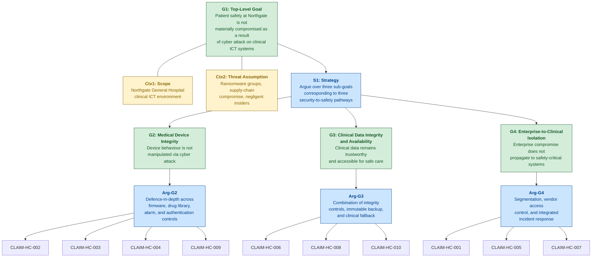

### Decomposition Rationale

The three sub-goals correspond to the three pathways through which a cyber attack can lead to patient harm, as identified in the scenario hazard analysis:

1. **G2 — Medical Device Integrity**: A cyber attacker manipulates device behaviour directly — corrupting drug libraries, altering alarm thresholds, deploying backdoored firmware, or sending unauthorised commands. This is the pathway described in Scenario 02 (Steps 5–8, 10–12).
2. **G3 — Clinical Data Integrity and Availability**: A cyber attack corrupts or removes access to clinical information systems — EHR, PACS, prescribing data — leading to clinical decisions based on unreliable or absent information. This is the pathway described in both Scenario 01 (Steps 9–12) and Scenario 02 (Step 7).
3. **G4 — Enterprise-to-Clinical Isolation**: An attacker who compromises the enterprise IT zone is able to reach the clinical device zone. This is the enabling pathway for both Scenarios 01 and 02, described in Scenario 01 (Steps 8–10) and Scenario 02 (Step 1).

These three pathways are not fully independent — G4 (isolation) is a prerequisite defence for both G2 and G3. If enterprise-to-clinical isolation holds, the attack surface for device manipulation and data corruption is substantially reduced. The decomposition therefore exhibits a layered structure where G4 acts as a perimeter argument, while G2 and G3 provide depth arguments for the case where the perimeter is breached.

---

## 4. Sub-Goal G2: Medical Device Integrity — Full CAE Decomposition

### A. Sub-Goal Statement and Context

**Sub-Goal G2**: Medical device integrity is maintained under all network conditions — the behaviour of infusion pumps, patient monitors, and ventilators is not manipulated through cyber attack.

This sub-goal addresses Scenario 02 (device integrity compromise) directly and Scenario 01 (ransomware) indirectly (where loss of management console availability degrades device safety functions). The sub-goal is argued under the assumption that the clinical device zone may be reached by an attacker who has bypassed the enterprise-to-clinical boundary (either through incomplete segmentation, dual-homed workstations, or compromised vendor access).

---

### B. CLAIM-HC-002: Firmware Integrity Prevents Device Manipulation

#### Claim Rationale

CLAIM-HC-002 is necessary because firmware manipulation is the most persistent and dangerous form of medical device compromise. In Scenario 02 (Step 8), the attacker pushes backdoored firmware to a subset of infusion pumps via the fleet management console. The modified firmware includes a remote command execution backdoor that persists across device reboots. If CLAIM-HC-002 were false — if firmware integrity verification were absent — an attacker with access to the clinical network could permanently compromise any medical device, turning it into a remotely controllable instrument capable of delivering incorrect doses, suppressing alarms, or reporting falsified physiological data. The safety hazard is REQ-HC-SAF-011: firmware integrity verification is a foundational requirement for all networked medical devices.

#### Argument

**Argument pattern: Defence-in-depth**

The argument for CLAIM-HC-002 proceeds in two layers. The primary layer is a direct evidence argument: the infusion pump manufacturer implements cryptographic code signing for all firmware images. Each firmware update is signed with the manufacturer's private key during the build process, and the device verifies the signature against a stored public key before accepting the update. Evidence E5 (manufacturer attestation) and E6 (rejection test results) demonstrate that this control is implemented and effective — unsigned or modified firmware images are rejected by the device.

The secondary layer provides depth against scenarios where the primary control is insufficient. Even if an attacker bypassed code signing (through a zero-day vulnerability in the verification implementation, or through compromise of the manufacturer's signing key), two additional controls limit the impact. First, the fleet management console maintains an authorised firmware version register (Evidence E19), enabling automated detection of version discrepancies across the pump fleet. A device reporting an unexpected firmware version would trigger an alert to clinical engineering. Second, network segmentation (argued under G4) limits the attacker's ability to reach devices in the first place — the firmware attack requires prior access to the clinical zone, which is independently defended. This defence-in-depth structure ensures that the claim holds under single-point failure of the code signing mechanism.

The argument does not claim absolute protection against all firmware attacks. A sophisticated supply-chain attack that compromises the manufacturer's signing infrastructure would bypass both the device-level verification and the version register (since the compromised firmware would carry a valid signature). This scenario is identified as Defeater D1.

#### Evidence Nodes

**E5: Manufacturer Code Signing Attestation**
- **Type**: Design
- **Description**: Written attestation from the infusion pump manufacturer confirming that all firmware images are cryptographically signed using RSA-2048 during the secure build process, with the signing key stored in a hardware security module (HSM).
- **Collection method**: Obtained from manufacturer during procurement; renewed annually or upon request.
- **Recurrence**: Annual attestation renewal; updated following any change to the signing process.
- **Confidence**: Medium — manufacturer self-attestation; not independently audited by the Trust.
- **Traceability**: REQ-HC-SEC-017, REQ-HC-SAF-011

**E6: Unsigned Firmware Rejection Test Results**
- **Type**: Test
- **Description**: Results of controlled testing in which unsigned, tampered, and expired-signature firmware images were pushed to representative infusion pump units via the fleet management console. All three categories were rejected by the device with appropriate error logging.
- **Collection method**: Conducted by clinical engineering team using manufacturer-provided test images in a non-production environment.
- **Recurrence**: Annually, and following any firmware update or device hardware revision.
- **Confidence**: High — independently conducted by Trust staff; covers multiple failure scenarios; documented and repeatable.
- **Traceability**: REQ-HC-SEC-017, REQ-HC-SAF-011

**E19: Firmware Version Register and Discrepancy Alerting**
- **Type**: Operational
- **Description**: The fleet management console maintains an asset register of expected firmware versions for each pump. A daily automated comparison identifies devices reporting versions that differ from the expected baseline and generates alerts to clinical engineering.
- **Collection method**: Automated report generated by fleet management console.
- **Recurrence**: Daily automated check; weekly summary review by clinical engineering.
- **Confidence**: Medium — depends on fleet management console availability (which may be compromised in Scenario 01). Paper-based fallback firmware audit exists but is quarterly.
- **Traceability**: REQ-HC-SEC-017, REQ-HC-SEC-020, REQ-HC-SAF-011

#### Defeaters

**D1: Supply-chain compromise of manufacturer signing key**. If an attacker compromises the manufacturer's firmware signing infrastructure (the HSM or the build pipeline), they could produce firmware that carries a valid cryptographic signature but contains malicious code. This would bypass both the device-level verification (E5/E6) and the version register (E19, since the update would be presented as a legitimate version). **Status**: Partially mitigated. Supply chain security assessment (REQ-HC-SEC-027) and manufacturer cooperation requirements (REQ-HC-SEC-026) reduce but do not eliminate this risk. Accepted as contributing to residual risk R1.

**D2: Zero-day vulnerability in firmware verification implementation**. A flaw in the device's signature verification code could allow a crafted firmware image to pass verification despite not carrying a valid signature. **Status**: Partially mitigated. Network segmentation (CLAIM-HC-001) limits the attacker's ability to reach the device; firmware version register (E19) provides a secondary detection mechanism. Accepted as contributing to residual risk R1.

#### Mermaid Diagram

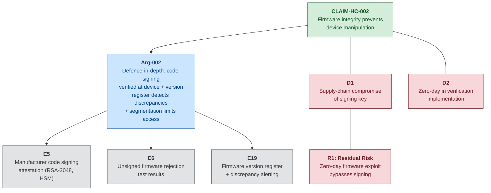

---

### B. CLAIM-HC-003: Drug Library Change Control Preserves Dose Safety

#### Claim Rationale

CLAIM-HC-003 addresses the most safety-critical data element on a networked infusion pump: the drug library. The drug library defines maximum and minimum dose rates, concentrations, and hard dosing limits for each medication. It is the automated equivalent of a pharmacist standing at the bedside verifying every dose. In Scenario 02 (Step 5), the attacker modifies drug library entries — increasing the morphine maximum rate from 4 mg/hr to 40 mg/hr, altering heparin concentration, and removing a chemotherapy hard limit. In Step 10, this modification directly causes a ten-fold morphine overdose. If CLAIM-HC-003 were false, any attacker with access to the fleet management console could silently remove the guardrails that protect patients from dosing errors.

#### Argument

**Argument pattern: Direct evidence + Operational continuity**

The argument for CLAIM-HC-003 relies on two complementary mechanisms. First, a direct evidence argument: every drug library change is recorded in an automated audit trail on the fleet management console (Evidence E1), which logs the timestamp, user identity, parameter changed, old value, and new value. Each library modification requires countersignature from a registered pharmacist before deployment to the pump fleet (Evidence E1). An automated comparison tool verifies the deployed drug library version against the pharmacist-approved authorised version (Evidence E2), detecting any discrepancy.

Second, an operational continuity argument addresses the scenario where the fleet management console itself is compromised. If the console is encrypted (Scenario 01) or its audit logs are tampered with (Scenario 02, Step 9), the primary audit mechanism is unavailable. The compensating control is the pharmacy governance process: the hospital pharmacy independently maintains the authorised drug library as a standalone record. Any pump reporting a drug library version that has not been approved through pharmacy governance is flagged during manual ward rounds. Additionally, infusion pumps retain the ability to enforce hard dose limits from their locally stored last-known-good drug library even if the fleet management console is offline — provided the local library has not been directly corrupted.

The argument acknowledges a critical gap: in Scenario 02, the attacker modifies the drug library database directly via harvested service account credentials, then clears the audit trail. The change appears to be a legitimate "drug library update" from the management console's perspective. Detection therefore depends on the automated version comparison tool (E2) running before the corrupted library is deployed to pumps, or on manual pharmacy verification during ward rounds.

#### Evidence Nodes

**E1: Drug Library Change Audit Trail + Pharmacy Sign-Off**
- **Type**: Operational
- **Description**: Automated log of all drug library modifications on the infusion pump fleet management console, including timestamp, user identity, parameter changed, old value, and new value. Each change requires countersignature from a registered pharmacist before deployment to the pump fleet.
- **Collection method**: Automated extraction from fleet management console audit database; pharmacist sign-off recorded in hospital pharmacy system.
- **Recurrence**: Continuous (every change logged); monthly summary reports reviewed by Clinical Engineering and Pharmacy.
- **Confidence**: Medium — automated and tamper-evident under normal operation, but Scenario 02 (Step 9) demonstrates that the audit log can be modified by an attacker with workstation-level access. Dual-authority (pharmacy sign-off) provides an independent check.
- **Traceability**: REQ-HC-SEC-020, REQ-HC-SAF-001, REQ-HC-SAF-002

**E2: Automated Version Comparison — Deployed vs. Authorised**
- **Type**: Operational
- **Description**: An automated tool that compares the drug library version hash currently deployed on each pump against the pharmacist-approved master version. Discrepancies generate an immediate alert to pharmacy governance and clinical engineering.
- **Collection method**: Automated comparison triggered on each library deployment event and as a scheduled background check every four hours.
- **Recurrence**: Event-triggered plus four-hourly scheduled comparison.
- **Confidence**: High — automated, hash-based comparison; independent of the fleet management console audit trail. Would detect the Scenario 02 manipulation if running before the corrupted library propagates.
- **Traceability**: REQ-HC-SEC-020, REQ-HC-SAF-001, REQ-HC-SAF-002

#### Defeaters

**D3: Attacker modifies drug library database directly, bypassing audit trail (Scenario 02, Steps 5 and 9)**. The attacker uses harvested service account credentials to modify the database and clears the audit log. **Status**: Partially mitigated. The automated version comparison tool (E2) provides an independent detection mechanism, and pharmacy governance maintains an offline canonical version. However, there is a time window between the modification and the next scheduled comparison during which the corrupted library could be deployed. Residual risk accepted.

**D4: Fleet management console unavailable (Scenario 01)**. If the console is encrypted by ransomware, both the audit trail (E1) and the automated comparison (E2) are unavailable. Pumps continue operating on their locally stored library, which is safe if it has not been previously corrupted — but new prescriptions requiring dose adjustments must be programmed manually, reintroducing transcription error risk. **Status**: Mitigated by clinical fallback procedures (CLAIM-HC-010) and dual authorisation for manual dose entry (REQ-HC-SAF-014).

#### Mermaid Diagram

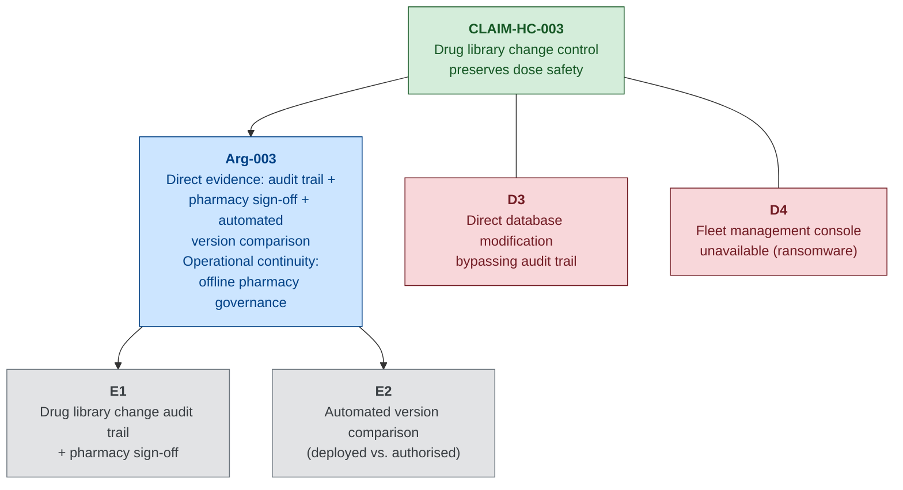

---

### B. CLAIM-HC-004: Alarm Configuration Auditing Maintains Monitoring Effectiveness

#### Claim Rationale

CLAIM-HC-004 addresses the hazard of silent alarm manipulation. In Scenario 02 (Step 6), the attacker modifies patient monitor alarm thresholds — raising the heart rate upper alarm to 200bpm and lowering the SpO2 low alarm to 75%. In Step 12, a patient develops hypoxia (SpO2 drops to 82%) but no alarm sounds because the threshold has been set at 75%. The twelve-minute delay in detection could cause a cardiac arrest. Alarm threshold manipulation is particularly dangerous because the *absence* of an alarm is not itself alarming — clinicians interact with alarms reactively, not proactively. If CLAIM-HC-004 were false, any attacker with central station access could silently disable the early warning system for patient deterioration.

#### Argument

**Argument pattern: Direct evidence + Compensating control**

The primary argument is direct evidence: alarm thresholds on all patient monitors are audited against clinical governance-approved defaults at least daily (Evidence E3). The audit compares current device-level alarm settings against the ward-level default profile approved by the Clinical Governance Committee. Any deviation generates an automated alert to the ward manager and clinical engineering team (Evidence E4).

The compensating control argument addresses the scenario where the central station — which aggregates alarm data — is itself compromised (Scenario 01, when it is encrypted). In this case, bedside monitors maintain independent local alarming (REQ-HC-SAF-003). Alarms sound at the individual bedside regardless of central station status. The safety degradation is in aggregation and visibility to the nursing station, not in alarm function itself. Ward staffing protocols require periodic bedside rounds that provide direct observation as a clinical safety net independent of electronic monitoring.

#### Evidence Nodes

**E3: Daily Alarm Configuration Audit Reports**
- **Type**: Operational
- **Description**: Automated script executed daily that queries alarm threshold settings from each connected patient monitor and compares them against the clinical governance-approved default profile for the relevant ward type (medical, surgical, critical care).
- **Collection method**: Automated query via the patient monitoring central station; results logged and reviewed by clinical engineering.
- **Recurrence**: Daily automated audit; results reviewed by ward manager and clinical engineering each morning.
- **Confidence**: High — automated, comprehensive (covers all connected monitors), and independently verifiable against clinical governance records.
- **Traceability**: REQ-HC-SEC-021, REQ-HC-SAF-003, REQ-HC-SAF-004

**E4: Automated Deviation Alert Records**
- **Type**: Operational
- **Description**: Records of alerts generated when any patient monitor's alarm threshold deviates from the approved default profile by more than the defined tolerance (±10% for heart rate, ±5% for SpO2). Each alert includes the monitor identifier, parameter, expected value, actual value, and timestamp.
- **Collection method**: Automated alerting from the central station audit module; alerts forwarded to ward manager and clinical engineering simultaneously.
- **Recurrence**: Continuous (triggered on detection of any deviation); monthly trend report reviewed by Clinical Governance Committee.
- **Confidence**: Medium — effective when central station is operational, but the alerting mechanism itself depends on the central station being online. Scenario 01 demonstrates this dependency.
- **Traceability**: REQ-HC-SEC-021, REQ-HC-SAF-003, REQ-HC-SAF-004

#### Defeaters

**D5: Central station compromised — audit and alerting unavailable**. If the central station is encrypted (Scenario 01) or the attacker modifies the audit baseline (Scenario 02, more sophisticated variant), the daily audit and deviation alerting are ineffective. **Status**: Partially mitigated. Bedside monitors maintain independent local alarming (REQ-HC-SAF-003). Clinical fallback procedures (CLAIM-HC-010) provide manual observation as a safety net. Risk is that the *threshold manipulation* persists undetected until the central station is restored and the audit re-runs.

**D6: Attacker modifies the clinical governance baseline profile**. If the attacker alters both the device thresholds and the reference profile used for comparison, the audit would report no deviations. **Status**: Partially mitigated. The Clinical Governance Committee maintains an independent paper record of approved alarm profiles. Cross-referencing the electronic baseline against the paper record during quarterly governance review would detect this tampering, but with a significant delay.

#### Mermaid Diagram

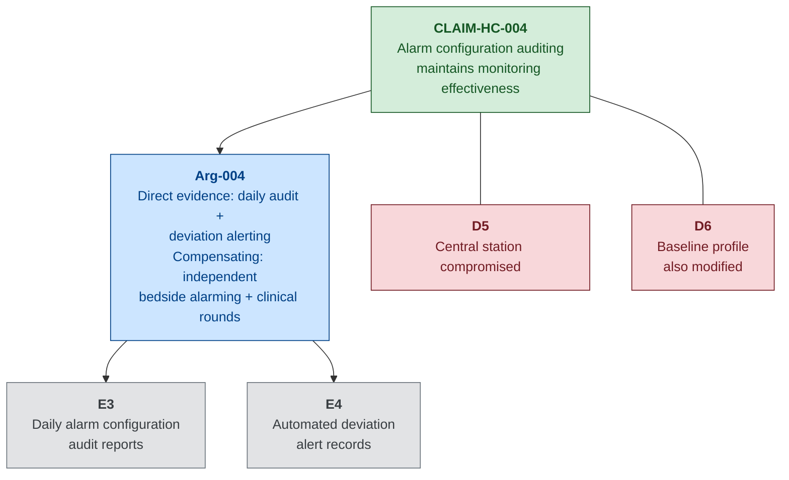

---

### B. CLAIM-HC-009: Device Authentication Prevents Unauthorised Command Execution

#### Claim Rationale

CLAIM-HC-009 addresses the fundamental access control question for clinical devices: can an attacker send commands to an infusion pump, ventilator, or patient monitor from a compromised workstation on the clinical VLAN? In Scenario 02 (Steps 3–5), the attacker exploits a vulnerable clinical workstation and harvests the fleet management service account credentials, then uses those credentials to push drug library modifications to pumps. If CLAIM-HC-009 were false — if devices accepted commands from any source without authentication — the attacker would not even need to harvest credentials; any network-level access to the clinical VLAN would be sufficient to command any device.

#### Argument

**Argument pattern: Direct evidence + Compensating control**

The direct evidence argument is that medical devices are configured to authenticate the source of configuration commands before accepting modifications. Evidence E20 demonstrates that commands from unauthorised sources (workstations not registered in the device management application's allow list) are rejected by the devices. Clinical workstation access is controlled through role-based access (Evidence E21), and the device management application restricts command execution to authenticated sessions only.

The compensating control argument acknowledges a critical limitation: the current infusion pump fleet uses a shared service account for the fleet management application rather than per-user authentication. This means that an attacker who harvests the service account credentials (Scenario 02, Step 4) can execute commands that appear legitimate to the devices. The compensating control is that all commands executed through the management application are logged (Evidence E1 — drug library audit trail), and the device management session must originate from a registered workstation. The combination of session-origin verification and command logging provides a detection mechanism even when the service account is compromised.

#### Evidence Nodes

**E20: Device Authentication Testing**
- **Type**: Test
- **Description**: Results of controlled testing in which configuration commands (dose parameter changes, alarm threshold modifications, firmware update requests) were sent to representative infusion pumps and patient monitors from unauthorised sources — workstations not registered in the fleet management allow list, and raw network commands crafted using protocol analysis tools.
- **Collection method**: Conducted by clinical engineering in a test environment, with manufacturer technical support participation.
- **Recurrence**: Annually, and following any device firmware update or management console upgrade.
- **Confidence**: Medium — tests cover the documented authentication mechanisms, but cannot guarantee detection of undocumented command interfaces or vendor debugging modes.
- **Traceability**: REQ-HC-SEC-016, REQ-HC-SAF-001, REQ-HC-SAF-004

**E21: Clinical Workstation Access Control Verification**
- **Type**: Operational
- **Description**: Quarterly verification that clinical workstations registered for device management access are correctly configured with role-based access controls, and that no unauthorised workstations have been added to the management application's allow list.
- **Collection method**: Manual audit by clinical engineering comparing the management console's registered workstation list against the approved asset register.
- **Recurrence**: Quarterly.
- **Confidence**: Medium — point-in-time verification; does not provide continuous assurance between audits.
- **Traceability**: REQ-HC-SEC-016, REQ-HC-SEC-004

#### Defeaters

**D7: Shared service account credential compromise (Scenario 02, Step 4)**. The fleet management application uses a shared service account rather than per-user authentication. An attacker who harvests this credential can issue commands that the devices regard as legitimate. **Status**: Partially mitigated. Command logging (E1) and session-origin verification provide detection, but there is a window between command execution and detection during which unsafe commands may be executed. This is the attack vector exploited in Scenario 02.

**D8: Undocumented device command interfaces**. Medical devices may have debugging interfaces, maintenance modes, or vendor-specific command channels that bypass the documented authentication mechanisms. **Status**: Partially mitigated. Supply chain security assessment (REQ-HC-SEC-027) includes pre-deployment assessment of device command interfaces, but cannot guarantee completeness for proprietary firmware.

#### Mermaid Diagram

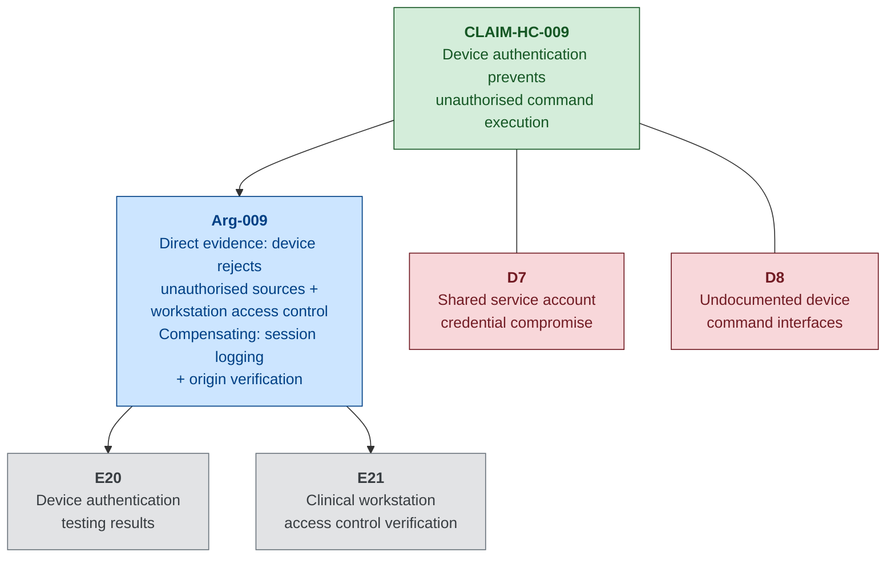

---

## 5. Sub-Goal G3: Clinical Data Integrity and Availability — Full CAE Decomposition

### A. Sub-Goal Statement and Context

**Sub-Goal G3**: Clinical data integrity and availability meets clinical safety requirements — clinicians have access to trustworthy clinical information, or can deliver safe care through fallback procedures when electronic systems are unavailable.

This sub-goal addresses both Scenario 01 (where ransomware encryption removes access to EHR, PACS, and prescribing systems) and Scenario 02 (where PACS imaging data is manipulated to create diagnostic errors). The sub-goal is argued under the assumption that clinical information systems may become unavailable (Scenario 01) or may present unreliable data (Scenario 02), and that the safety case must address both availability loss and integrity violation.

---

### B. CLAIM-HC-006: Immutable Backups Enable Safety-Preserving Recovery

#### Claim Rationale

CLAIM-HC-006 addresses the recoverability dimension of clinical data availability. In Scenario 01 (Step 7), the attacker encrypts the on-site backup NAS and wipes the tape library controller, destroying all on-site backup copies. The Trust's ability to restore safety-critical clinical systems (EHR, PACS, device management configurations) within clinically acceptable timeframes depends entirely on the existence of off-site or immutable backups that cannot be reached from the production network. If CLAIM-HC-006 were false — if all backups were network-accessible and mutable — a ransomware attack would result in permanent data loss, potentially extending the period of degraded clinical operations from days to weeks.

#### Argument

**Argument pattern: Direct evidence + Operational continuity**

The direct evidence argument is that critical system backups are stored on immutable or air-gapped media implementing the 3-2-1 backup rule (three copies, two media types, one off-site). Evidence E9 documents the backup architecture showing that in addition to the on-site NAS and tape infrastructure, a third backup copy is maintained on off-site immutable cloud storage with write-once-read-many (WORM) retention policies and a separate authentication domain. This off-site copy is not accessible from the production network through normal credentials.

The operational continuity argument demonstrates that restoration from these immutable backups is practically feasible within defined recovery time objectives. Evidence E10 documents quarterly restoration exercises in which safety-critical systems (EHR, PACS, device management) are restored from the off-site immutable copy and verified for data integrity and operational correctness. The restoration priority order follows REQ-HC-SAF-012, placing patient monitoring and device management systems ahead of administrative systems.

#### Evidence Nodes

**E9: Backup Architecture Documentation (Immutability)**
- **Type**: Design
- **Description**: Technical documentation of the Trust's backup architecture, showing three-tier backup strategy: (1) on-site NAS with daily snapshots, (2) on-site tape library with weekly full backups, (3) off-site immutable cloud storage with WORM retention policies, separate IAM credentials not accessible from the enterprise Active Directory domain, and 90-day minimum retention period.
- **Collection method**: Maintained by the infrastructure team; reviewed and updated quarterly.
- **Recurrence**: Quarterly review; updated following any change to backup infrastructure.
- **Confidence**: High — architecture is documented, independently verifiable, and the immutability mechanism (WORM) is enforced by the cloud storage provider.
- **Traceability**: REQ-HC-SEC-012, REQ-HC-SAF-010, REQ-HC-SAF-012

**E10: Quarterly Restoration Test Results**
- **Type**: Test
- **Description**: Results of quarterly restoration exercises in which the EHR, PACS, and device management console are restored from the off-site immutable backup to a test environment. Each exercise measures: restoration time against the defined RTO, data integrity verification (hash comparison of restored databases against backup checksums), and functional verification (clinicians confirm that restored systems behave correctly).
- **Collection method**: Structured exercise conducted by infrastructure team with participation from clinical engineering and clinical representatives.
- **Recurrence**: Quarterly.
- **Confidence**: High — independently conducted, covers the full restoration workflow, and includes functional verification by clinical users.
- **Traceability**: REQ-HC-SEC-013, REQ-HC-SAF-010, REQ-HC-SAF-012

#### Defeaters

**D9: Undetected data corruption prior to backup**. If the EHR database or PACS archive is subtly corrupted before the last clean backup is taken (Scenario 02 — PACS metadata manipulation), restoring from backup will restore the corrupted data. **Status**: Partially mitigated. The backup retention policy (90-day WORM) allows restoration to a point before the corruption occurred, provided the corruption is detected within the retention window. Clinical data reconciliation processes (comparing restored data against paper records and pharmacy dispensing logs) provide a secondary verification mechanism. Accepted as residual risk R2.

**D10: Off-site backup authentication compromise**. If an attacker compromises the credentials for the off-site immutable storage (which are on a separate IAM domain), they could potentially delete or corrupt the off-site copies. **Status**: Mitigated. The off-site storage uses MFA, is on a separate identity domain, and WORM policies prevent deletion within the retention period even by the storage administrator.

#### Mermaid Diagram

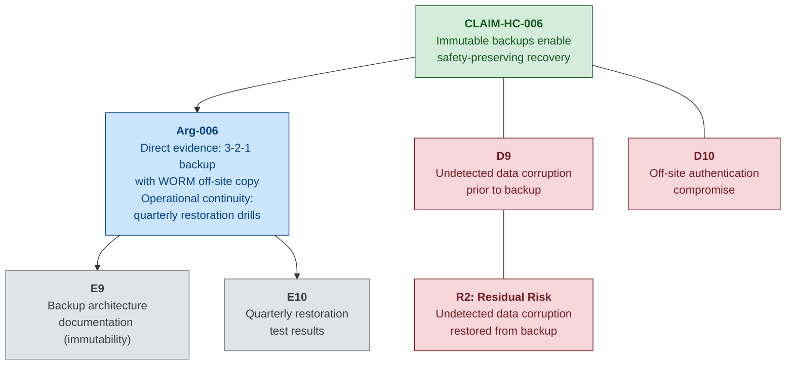

---

### B. CLAIM-HC-008: PACS Integrity Controls Prevent Diagnostic Error

#### Claim Rationale

CLAIM-HC-008 addresses the integrity of diagnostic imaging — one of the most safety-critical clinical data categories. In Scenario 02 (Step 7), the attacker manipulates PACS metadata to swap patient identifiers on CT images and subtly modifies a chest X-ray to obscure a pulmonary nodule. In Step 11, these manipulations lead to a missed diagnosis (the obscured nodule is discovered three months later) and a near-miss wrong-patient event caught by a surgeon during a procedure. If CLAIM-HC-008 were false, clinicians would have no mechanism to detect imaging data integrity violations, and treatment decisions would be made on falsified diagnostic information.

#### Argument

**Argument pattern: Defence-in-depth**

The argument for CLAIM-HC-008 operates at two levels. The primary defence is technical: PACS image-patient identity bindings are cryptographically protected using DICOM digital signatures (Evidence E7). Any modification to the patient identifier fields in a DICOM header after the image is committed to the archive generates an audit alert requiring clinical confirmation before the modified image can be presented in a clinical context (Evidence E8).

The secondary defence is procedural: the radiology workflow includes a mandatory identity cross-check where the reporting radiologist verifies the patient identifier on the image against the radiology information system worklist before finalising the report. The surgical safety checklist (WHO standard, locally adapted) provides a final identity verification step before any procedure, catching wrong-patient errors at the point of care.

The argument acknowledges that content-level image manipulation (altering pixel data rather than metadata) is substantially harder to detect. DICOM digital signatures cover header integrity but may not detect subtle pixel-level modifications unless the signature also covers the pixel data stream. The argument relies on the combination of technical integrity controls and clinical verification procedures to reduce this risk to a tolerable level.

#### Evidence Nodes

**E7: PACS Integrity Verification Testing Results**
- **Type**: Test
- **Description**: Results of structured testing of the PACS integrity verification mechanism. Tests included: (a) modification of patient identifier fields in stored DICOM headers — detection confirmed; (b) modification of study-level metadata (date, modality, body part) — detection confirmed; (c) substitution of image pixel data from a different study — detection confirmed for whole-image substitution, partial detection for localised pixel modification.
- **Collection method**: Conducted by clinical engineering with radiology department participation, using test images in a non-production PACS environment.
- **Recurrence**: Annually, and following any PACS software upgrade.
- **Confidence**: Medium — header-level integrity protection is well-tested; pixel-level integrity protection has known limitations for subtle modifications.
- **Traceability**: REQ-HC-SAF-007

**E8: Metadata Modification Audit Alert Testing**
- **Type**: Test
- **Description**: Results of testing the alert mechanism triggered when DICOM metadata is modified post-commit. Verified that alerts are generated, delivered to the radiology department lead and PACS administrator within defined SLA (15 minutes), and that the modified image is flagged in the clinical viewer with a visual integrity warning.
- **Collection method**: Simulated metadata modification in non-production environment; alert delivery and clinical viewer behaviour observed and documented.
- **Recurrence**: Annually.
- **Confidence**: High — alert delivery is automated and independently verifiable; clinical viewer flagging provides a visible indicator to clinicians.
- **Traceability**: REQ-HC-SAF-007

#### Defeaters

**D11: Subtle pixel-level image manipulation without metadata change**. An attacker who modifies image pixel data (e.g., obscuring a lesion) without altering metadata fields may evade DICOM header integrity checks. **Status**: Partially mitigated. Full-image substitution is detected (E7c); localised pixel modification has limited detection. Clinical peer review (double-reading for cancer screening) and clinical-radiological correlation provide secondary detection but may not catch every case. Accepted as a limitation of current PACS integrity technology.

**D12: PACS system compromise enabling integrity control bypass**. If the attacker gains administrative access to the PACS server, they may be able to disable the integrity verification mechanism or modify images while the mechanism is suspended. **Status**: Partially mitigated by network segmentation (CLAIM-HC-001) and clinical zone monitoring (REQ-HC-SEC-019). The PACS administrator account uses separate credentials from the domain, reducing the attack surface.

#### Mermaid Diagram

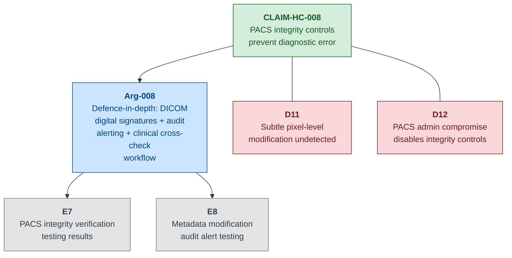

---

### B. CLAIM-HC-010: Clinical Fallback Procedures Maintain Safe Care During Outage

#### Claim Rationale

CLAIM-HC-010 is the safety net claim — it addresses what happens when the other claims partially or wholly fail, and clinicians must deliver care without electronic systems. In Scenario 01 (Steps 10–12), the loss of the EHR, fleet management console, and patient monitoring central station forces clinicians to improvise paper-based workarounds. The result is a transcription error causing a ten-fold dosing discrepancy (Step 12). If CLAIM-HC-010 were false — if no pre-defined fallback procedures existed — every cyber incident affecting clinical systems would require real-time improvisation, dramatically increasing the probability of clinical error.

#### Argument

**Argument pattern: Operational continuity**

This claim rests entirely on operational continuity — demonstrating that the Trust can maintain safe clinical care during the very conditions that a cyber attack creates. The argument has three components.

First, documented clinical fallback procedures exist for all major clinical functions and are physically accessible in each clinical area without dependence on electronic systems (Evidence E11 — procedure documentation). These procedures cover paper-based prescribing, manual pump programming, bedside-only patient monitoring, paper observation charts, and manual allergy verification.

Second, clinical staff are trained and tested on these procedures through biannual fallback procedure drills (Evidence E11 — drill results). The drills simulate a complete loss of electronic clinical systems and assess staff competence in paper-based processes, including the transition from electronic to manual workflows and the reverse transition when systems are restored.

Third, the procedures include a defined process for recognising and correcting errors introduced during the manual phase (REQ-HC-SAF-010), including post-incident data reconciliation to identify discrepancies between paper records created during the outage and the electronic records restored from backup.

#### Evidence Nodes

**E11: Fallback Procedure Documentation + Drill Results**
- **Type**: Process
- **Description**: Comprehensive clinical fallback procedure documentation maintained in each ward area (printed, laminated, stored in clearly marked fallback folders). Covers: paper-based prescribing templates, manual infusion pump programming checklists, bedside observation charts, emergency drug dosing reference cards, manual allergy verification procedure. Biannual drill results document staff participation rates, error rates during manual processes, time-to-transition metrics, and a clinical safety assessment.
- **Collection method**: Procedures authored and maintained by clinical governance team; drills planned and facilitated by clinical education team; results assessed by a multidisciplinary panel.
- **Recurrence**: Procedures reviewed annually; drills conducted biannually (every six months).
- **Confidence**: Medium — procedure documentation is comprehensive, but drill results consistently show that staff unfamiliar with paper processes make more errors during the transition period. The most recent drill achieved 78% staff participation, with 3 simulated dosing discrepancies identified during the paper-based prescribing exercise (all caught by the double-check process).
- **Traceability**: REQ-HC-SEC-023, REQ-HC-SAF-008, REQ-HC-SAF-010

#### Defeaters

**D13: Staff not trained or unfamiliar with fallback procedures**. Agency staff, new staff, or staff who did not participate in recent drills may be unable to execute fallback procedures safely under pressure. **Status**: Partially mitigated. Mandatory induction includes fallback procedure training; biannual drills provide refresher training. 78% drill participation leaves a 22% gap. Accepted as a limitation — full participation is an operational target, not yet achieved.

**D14: Fallback procedures themselves introduce safety errors**. Paper-based prescribing reintroduces transcription errors, removes electronic allergy checking, and creates handwriting legibility issues. The fallback is safer than no procedure at all, but materially less safe than electronic prescribing. **Status**: Partially mitigated by double-check requirements (REQ-HC-SAF-014) and additional pharmacy staffing during incidents. Accepted as an inherent limitation of manual clinical processes.

#### Mermaid Diagram

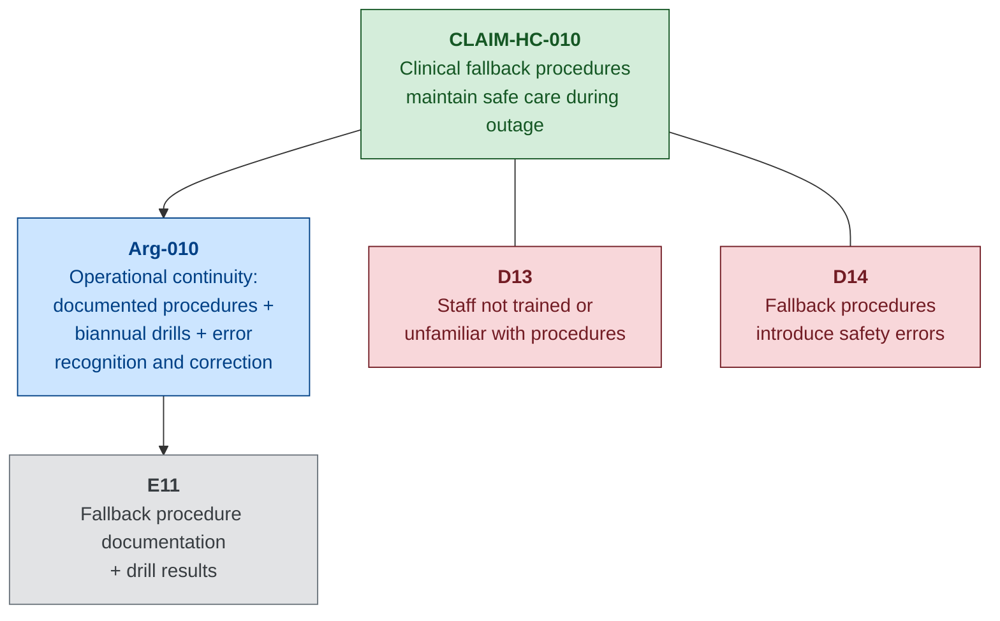

---

## 6. Sub-Goal G4: Enterprise-to-Clinical Isolation — Full CAE Decomposition

### A. Sub-Goal Statement and Context

**Sub-Goal G4**: Enterprise IT compromise does not propagate to safety-critical clinical systems — the architectural boundary between the enterprise zone and the clinical/medical device zone prevents an attacker who has compromised enterprise systems from reaching devices that directly affect patient safety.

This sub-goal addresses the enabling pathway for both Scenario 01 (Steps 8–10: ransomware crosses via dual-homed workstations to clinical zone) and Scenario 02 (Step 1: attacker enters clinical zone via compromised vendor VPN). G4 is the most critical sub-goal because it underpins G2 and G3 — if enterprise-to-clinical isolation holds, the attack surface for device manipulation and data corruption is substantially reduced.

---

### B. CLAIM-HC-001: Network Segmentation Protects Device Integrity

#### Claim Rationale

CLAIM-HC-001 is the foundational architectural claim. The network boundary between the enterprise IT zone and the clinical/medical device zone is the primary control that prevents the security-to-safety pathway. In Scenario 01 (Step 8), the attacker crosses this boundary via dual-homed clinical workstations with legacy firewall exception rules. In both scenarios, the incomplete segmentation (three wards remaining on a flat Layer-2 segment) provides direct, unfiltered access from enterprise workstations to medical devices. If CLAIM-HC-001 were false — if no segmentation existed — any enterprise compromise would automatically compromise the clinical device zone.

#### Argument

**Argument pattern: Direct evidence + Defence-in-depth**

The primary argument is direct evidence that the segmentation is in place and effective. Evidence E12 documents a firewall rule audit confirming that no cross-zone exception rules remain in effect — all legacy bidirectional access rules for dual-homed workstations have been removed, and cross-zone traffic is restricted to explicitly defined, minimal data flows (EHR prescription data, DICOM image transfer). Evidence E13 documents the results of an independent penetration test demonstrating that an attacker positioned in the enterprise zone cannot reach clinical devices through the firewall.

The defence-in-depth layer addresses the scenario where a novel application-layer exploit bypasses the firewall through a permitted data flow (e.g., a vulnerability in the EHR-to-device-management interface). Clinical zone monitoring (REQ-HC-SEC-019) provides a detection mechanism for anomalous traffic patterns within the clinical zone, even if the traffic arrived through a permissible conduit. Additionally, the elimination of dual-homed workstations (REQ-HC-SEC-008) removes the primary cross-zone attack vector that enabled the Northgate incident.

#### Evidence Nodes

**E12: Firewall Rule Audit (No Cross-Zone Exceptions)**
- **Type**: Design
- **Description**: Results of a comprehensive firewall rule audit confirming that all legacy exception rules permitting bidirectional access between specific clinical workstations and the enterprise zone have been removed. The audit verifies that the firewall rule set implements an explicit allow-list policy with only the minimum required cross-zone data flows: EHR-to-device-management prescription data (outbound, application-layer filtered), DICOM image transfer from clinical modalities to PACS (outbound only), and SIEM log forwarding from clinical zone to enterprise SIEM (outbound only).
- **Collection method**: Conducted by a qualified firewall administrator with independent verification by a second administrator. Rule set exported and compared against the approved baseline.
- **Recurrence**: Quarterly audit with continuous change monitoring (firewall generates alerts for any rule modification).
- **Confidence**: High — dual-verified, comprehensive, with continuous change monitoring preventing configuration drift between audits.
- **Traceability**: REQ-HC-SEC-007, REQ-HC-SEC-008, REQ-HC-SAF-001, REQ-HC-SAF-009

**E13: Penetration Test — Enterprise to Clinical Zone Blocked**
- **Type**: Test
- **Description**: Results of an independent penetration test conducted by a CREST-accredited third party. The test scope included all enterprise-to-clinical zone attack vectors: direct network probing through the firewall, exploitation of permitted cross-zone data flows, scanning for residual dual-homed workstations, and attempted pivoting through clinical zone via application-layer attacks. The test confirmed that no enterprise-to-clinical traversal was achievable through the firewall. Two informational findings were noted regarding the permitted EHR-to-device data flow, but neither was exploitable.
- **Collection method**: Commissioned by the Trust's Information Security Manager; conducted by an external CREST-accredited penetration testing firm.
- **Recurrence**: Annually; additionally triggered following any significant network architecture change.
- **Confidence**: High — independently conducted by a qualified third party; comprehensive scope covering both network-layer and application-layer vectors.
- **Traceability**: REQ-HC-SEC-007, REQ-HC-SEC-008, REQ-HC-SEC-014, REQ-HC-SAF-001

#### Defeaters

**D15: Novel cross-zone exploit via permitted data flow**. The firewall permits certain application-layer data flows (EHR-to-device, DICOM). An attacker who discovers a vulnerability in the receiving application could use a permitted data flow as a covert channel to inject commands into the clinical zone. **Status**: Partially mitigated. Clinical zone monitoring (REQ-HC-SEC-019) and application whitelisting on clinical workstations (REQ-HC-SEC-011) provide secondary detection and prevention. Accepted as residual risk R3.

**D16: Configuration drift re-introduces exception rules**. Over time, operational pressures may lead to the re-introduction of firewall exception rules (as happened in the original Northgate scenario, where legacy rules were maintained for workflow continuity). **Status**: Mitigated. Continuous firewall change monitoring (E12) generates alerts for any rule modification. Quarterly audit with dual verification ensures any drift is detected and remediated within the audit cycle. Joint IT/Clinical Engineering governance committee (REQ-HC-SEC-024) provides organisational oversight of cross-zone access requests.

#### Mermaid Diagram

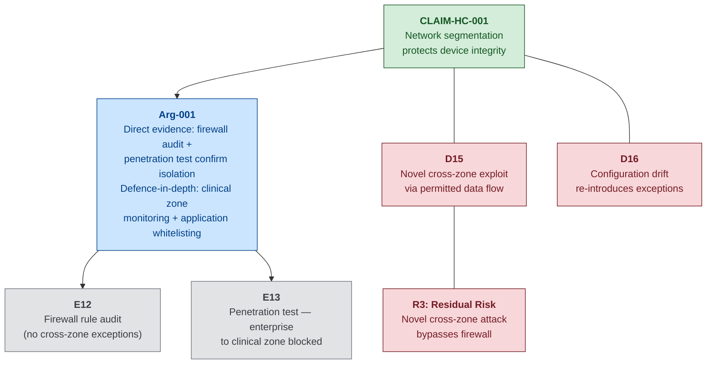

---

### B. CLAIM-HC-005: Vendor Access Controls Prevent Supply-Chain Attack Path

#### Claim Rationale

CLAIM-HC-005 addresses the alternative entry point that bypasses enterprise-to-clinical segmentation entirely: the infusion pump manufacturer's persistent VPN connection. In Scenario 02 (Step 1), the attacker compromises the vendor's remote-access credentials through a supply-chain phishing attack against a field service engineer. The vendor VPN terminates directly in the clinical zone, providing unrestricted network access to all clinical devices. If CLAIM-HC-005 were false — if vendor access were uncontrolled — the segmentation defended by CLAIM-HC-001 would be irrelevant; the attacker would simply enter the clinical zone through the vendor's front door.

#### Argument

**Argument pattern: Defence-in-depth**

The argument for CLAIM-HC-005 applies three layers of control. First, vendor remote-access connections require multi-factor authentication (Evidence E15), ensuring that credential compromise alone is insufficient for access. Second, vendor VPN sessions are activated only during scheduled maintenance windows and are deactivated outside those windows (Evidence E14), limiting the time window during which the access path is available. Third, active vendor sessions are monitored in real time with automated alerting for session anomalies — connections from unexpected IP addresses, activity outside the scheduled window, or access to devices not covered by the maintenance work order (Evidence E14).

#### Evidence Nodes

**E14: Vendor Access Logs (Scheduled Windows Only)**
- **Type**: Operational
- **Description**: Audit logs from the vendor remote-access gateway demonstrating that all vendor VPN sessions were activated within scheduled maintenance windows only, and that no sessions were recorded outside these windows. Logs include session start/end times, source IP address, devices accessed, and actions performed.
- **Collection method**: Automated extraction from vendor VPN gateway; monthly summary reviewed by clinical engineering.
- **Recurrence**: Continuous logging; monthly review.
- **Confidence**: High — automated, comprehensive, and independently verifiable against the scheduled maintenance calendar.
- **Traceability**: REQ-HC-SEC-018, REQ-HC-SAF-001, REQ-HC-SAF-009

**E15: MFA Enforcement Records for Vendor Sessions**
- **Type**: Operational
- **Description**: Records from the vendor VPN gateway's authentication system confirming that all vendor sessions were authenticated with MFA (password + hardware token or authenticator application). Records include the authentication method used for each session.
- **Collection method**: Automated extraction from VPN gateway authentication logs.
- **Recurrence**: Continuous; monthly compliance summary.
- **Confidence**: High — MFA enforcement is a system-level configuration that cannot be bypassed by the vendor without gateway administrator cooperation.
- **Traceability**: REQ-HC-SEC-018, REQ-HC-SAF-001

#### Defeaters

**D17: Vendor credential and MFA compromise (combined)**. A sophisticated supply-chain attack that compromises both the vendor's password *and* their MFA device (e.g., SIM-swapping, push-fatigue, or malware on the engineer's workstation that proxies the MFA challenge) could bypass the MFA requirement. **Status**: Partially mitigated. Scheduled-window activation limits the time window for exploitation; real-time session monitoring detects anomalous activity. Residual risk accepted — MFA significantly raises the bar but is not impenetrable.

**D18: Vendor uses maintenance window for unsanctioned access**. The vendor, acting within a legitimate session, could access devices or perform actions beyond the scope of the maintenance work order. **Status**: Partially mitigated. Session monitoring compares accessed devices against the work order scope. Vendor contract terms (REQ-HC-SEC-026) impose obligations and audit rights. However, fine-grained action-level monitoring is limited by the granularity of device-level logging.

#### Mermaid Diagram

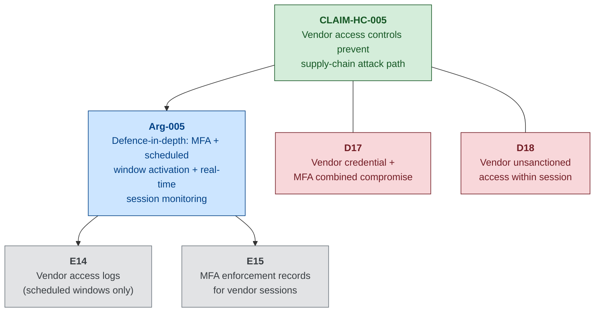

---

### B. CLAIM-HC-007: Integrated Incident Response Prevents Containment-Induced Safety Hazards

#### Claim Rationale

CLAIM-HC-007 addresses a second-order hazard: the risk that incident *response* actions themselves create patient safety hazards. In Scenario 01 (Day 2 afternoon), the Trust's emergency response team debates whether to sever the enterprise-to-clinical network link. Severing the connection protects clinical devices from further compromise — but also disconnects clinicians from the EHR and prevents the infusion pump fleet management system from receiving commands, forcing all programming to manual operation. The decision to sever at 14:30 was taken without a pre-planned framework for evaluating clinical safety consequences of IT containment actions. If CLAIM-HC-007 were false, every containment decision would be an ad hoc improvisation under crisis pressure, increasing the probability that a well-intentioned IT security action inadvertently harms patients.

#### Argument

**Argument pattern: Process evidence + Operational continuity**

The argument for CLAIM-HC-007 relies entirely on process evidence — demonstrating that the Trust has developed, documented, and rehearsed an incident response plan that explicitly integrates IT security containment decisions with clinical safety impact assessments. Evidence E17 documents the plan itself, which includes: a clinical impact assessment checklist that must be completed before any network isolation action; pre-defined decision trees for common containment scenarios (isolate clinical zone, isolate specific wards, disable vendor access); and escalation procedures to the joint IT/Clinical Engineering governance committee.

Evidence E16 documents the results of joint IT/Clinical Engineering tabletop exercises in which the response team rehearses containment scenarios, evaluates clinical safety consequences, and makes coordinated decisions. The exercises are designed to surface tensions between IT containment priorities and clinical safety priorities, and to ensure that decision-makers from both domains understand each other's constraints.

#### Evidence Nodes

**E16: Joint IT/Clinical Engineering Tabletop Exercise Reports**
- **Type**: Process
- **Description**: Reports from biannual tabletop exercises in which IT security, clinical engineering, and clinical leadership rehearse responding to a cyber incident affecting clinical systems. Each exercise presents a scenario (based on Scenarios 01 and 02) and requires participants to make containment decisions while evaluating clinical safety impact. Reports document decisions made, clinical impact assessments performed, time-to-decision metrics, and identified improvement actions.
- **Collection method**: Facilitated by the Trust's risk management team; observed by an independent assessor.
- **Recurrence**: Biannually (every six months).
- **Confidence**: Medium — exercises demonstrate capability and identify gaps, but tabletop exercises are inherently less realistic than live exercises. Staff turnover means that not all decision-makers have participated in recent exercises.
- **Traceability**: REQ-HC-SEC-022, REQ-HC-SAF-009, REQ-HC-SAF-010

**E17: Incident Response Plan with Clinical Impact Assessment**
- **Type**: Process
- **Description**: The Trust's integrated incident response plan, maintained as a controlled document. The plan includes: (a) clinical impact assessment checklist for each containment action category; (b) decision trees for common scenarios; (c) pre-defined communication templates for clinical staff notification; (d) escalation matrix to relevant governance committee; (e) post-incident clinical review procedure.
- **Collection method**: Authored by IT Security with clinical engineering and clinical governance input; reviewed and approved by the joint governance committee.
- **Recurrence**: Plan reviewed annually; updated following any incident, exercise, or significant system change.
- **Confidence**: Medium — plan exists and is maintained, but its real-world effectiveness has not been tested in a live incident (the Northgate scenario is the first such test). Tabletop exercises (E16) provide the closest approximation.
- **Traceability**: REQ-HC-SEC-022, REQ-HC-SAF-009, REQ-HC-SAF-010

#### Defeaters

**D19: Response plan not followed under crisis pressure**. In a genuine major incident, time pressure, incomplete information, and the stress of active patient safety events may cause decision-makers to bypass the planned clinical impact assessment process and make ad hoc containment decisions. **Status**: Partially mitigated. Tabletop exercises (E16) build familiarity with the process. Printed decision trees are available in the incident response pack (independent of electronic systems). However, the scenario described in the Northgate incident — where the CIO had to make a time-critical decision while patient safety events were already occurring — illustrates the realistic pressure.

**D20: Novel containment scenario not covered by decision trees**. The pre-defined decision trees cover common scenarios but cannot anticipate every possible containment combination. A novel attack vector or unexpected system dependency could create a containment decision with clinical consequences not addressed in the plan. **Status**: Partially mitigated. The escalation matrix provides a fallback to the clinical governance committee for scenarios outside the decision trees. Post-incident review (E17e) captures novel scenarios for incorporation into future plan revisions.

#### Mermaid Diagram

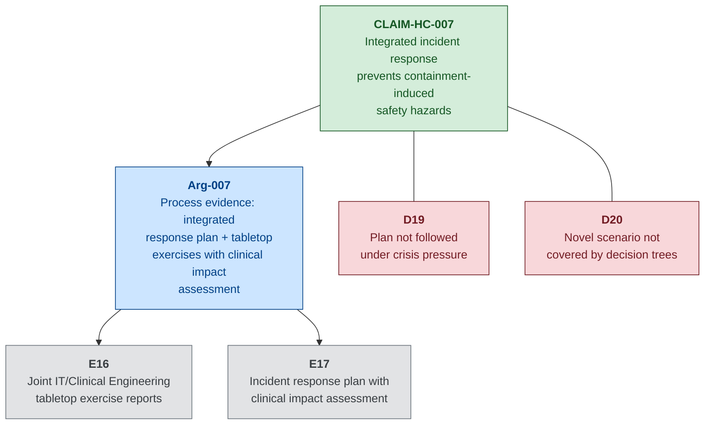

---

## 7. Cross-Cutting Argument: The Patching Constraint

### The Fundamental Tension

A defining challenge in healthcare cybersecurity is the conflict between patching urgency and safety assurance. Cybersecurity best practice demands that known vulnerabilities be patched promptly — every day a vulnerability remains unpatched extends the window of exploitation. Safety assurance for medical devices, governed by IEC 62304, demands that changes to safety-certified software be validated before deployment — a process that can require weeks or months of testing and re-certification. A security patch to an infusion pump's firmware might fix a critical vulnerability, but it might also affect the pump's dosing accuracy, alarm behaviour, or communication reliability. Deploying the patch without safety re-validation risks introducing a safety defect; refusing to deploy it risks leaving the device exploitable.

This creates two mutually exclusive strategies for any given vulnerability disclosure:

### Strategy A: Patch Immediately

**Argument**: The cybersecurity risk of delay outweighs the interim safety risk. Deploy the security patch to the infusion pump fleet immediately. Manage the interim safety risk (the period between patch deployment and completion of safety re-validation) through compensating clinical controls.

**Compensating safety controls during the interim**:
- Clinical monitoring: increase bedside observation frequency for patients on patched pumps until re-validation is complete.
- Manual dose verification: require a second clinician to independently verify every dose delivered by a patched pump against the paper prescription.
- Reduced device trust level: clinical protocols treat patched pumps as partially untrusted devices, triggering additional clinical checks.

**Evidence Nodes**:
- **E22: Clinical monitoring protocol for interim-patched devices** (Process) — documented protocol specifying increased bedside observation frequency and manual verification requirements for devices running unvalidated patches.
- **E23: Manufacturer interim safety guidance** (Design) — manufacturer-provided guidance on the scope of the patch and its potential clinical impact, including any known interactions with safety-critical functions.

**Residual risk**: The patch introduces a subtle safety defect (e.g., altered dosing accuracy at specific flow rates) that is not detected by the compensating clinical controls during the interim period. This is identified as Residual Risk R4.

### Strategy B: Defer Patch

**Argument**: The safety risk of deploying an unvalidated patch outweighs the cybersecurity risk of delay. Defer the patch until full IEC 62304-compliant safety re-validation is complete. Manage the interim cybersecurity risk (the window of known vulnerability) through compensating network and monitoring controls.

**Compensating cybersecurity controls during the interim**:
- Enhanced network isolation: tighten firewall rules for the clinical zone, restricting permitted cross-zone data flows to the minimum required.
- Enhanced monitoring: deploy additional monitoring on the clinical VLAN specifically targeting known exploitation indicators for the disclosed vulnerability.
- Vendor access restriction: disable vendor remote access entirely until the patched firmware is validated and deployed.

**Evidence Nodes**:
- **E24: Enhanced isolation configuration during deferral** (Design) — firewall rule modification records showing additional restrictions applied during the vulnerability window.
- **E25: Vulnerability-specific monitoring rules** (Operational) — IDS/IPS signatures or SIEM correlation rules deployed specifically to detect exploitation attempts for the disclosed vulnerability.

**Residual risk**: The known vulnerability is exploited by an attacker during the deferral window despite the compensating network controls. This is identified as Residual Risk R5.

### Mermaid Diagram

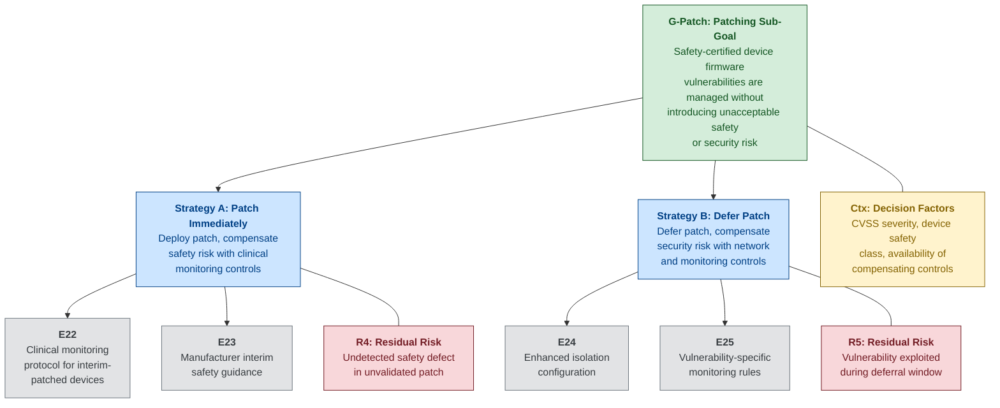

### Strategy Selection Guidance

The choice between Strategy A and Strategy B depends on four factors:

1. **Vulnerability severity (CVSS score and exploitability)**: A critical vulnerability with known active exploitation (CVSS ≥ 9.0, public exploit code available) favours Strategy A — the cybersecurity risk of delay is very high. A moderate vulnerability with no known exploit (CVSS 4.0–6.9, theoretical impact) may favour Strategy B — there is more time for proper validation.

2. **Device safety class (IEC 62304)**: For Class C devices (failure could cause death or serious injury, such as infusion pump dosing control), the re-validation burden under IEC 62304 is highest, but so is the consequence of a safety defect introduced by the patch. Strategy B is generally preferred unless the vulnerability is actively exploited. For Class A devices (no injury possible), Strategy A can be adopted with minimal compensating controls.

3. **Availability of compensating controls**: Strategy A requires robust clinical compensating controls (additional monitoring, manual verification). If the clinical area lacks the staffing to implement these controls (e.g., during a nightshift on an understaffed ward), Strategy A becomes less tenable. Strategy B requires robust network compensating controls (enhanced isolation, vulnerability-specific monitoring). If the clinical zone's monitoring infrastructure is immature, Strategy B becomes less tenable.

4. **Manufacturer cooperation**: If the manufacturer provides interim safety guidance (E23) confirming that the patch does not affect safety-critical functions, Strategy A's residual risk is substantially reduced. If the manufacturer cannot or will not provide this guidance, Strategy A proceeds with higher uncertainty.

**Recommendation for Northgate**: For the infusion pump fleet (IEC 62304 Class C software), the default strategy should be **Strategy B (defer patch)**, unless the vulnerability is assessed as critical severity with active exploitation. In that exceptional case, Strategy A should be adopted with enhanced clinical monitoring and with the consent of the joint IT/Clinical Engineering governance committee, documented as a formal risk acceptance with a defined time limit for completing safety re-validation.

---

## 8. Defeaters and Counter-Arguments

### Summary Table

| Defeater ID | Claim(s) Affected | Defeater Condition | Mitigation | Status |
|-------------|-------------------|--------------------|------------|--------|
| D1 | CLAIM-HC-002 | Supply-chain compromise of manufacturer firmware signing key | Supply chain security assessment (REQ-HC-SEC-027); manufacturer cooperation (REQ-HC-SEC-026) | Accepted (R1) |
| D2 | CLAIM-HC-002 | Zero-day vulnerability in firmware verification implementation | Network segmentation limits access; firmware version register detects discrepancy | Accepted (R1) |
| D3 | CLAIM-HC-003 | Direct database modification bypassing audit trail (Scenario 02) | Automated version comparison (E2); offline pharmacy governance record | Partially mitigated |
| D4 | CLAIM-HC-003 | Fleet management console unavailable (Scenario 01) | Clinical fallback procedures (CLAIM-HC-010); dual authorisation (REQ-HC-SAF-014) | Mitigated |
| D5 | CLAIM-HC-004 | Central station compromised — audit and alerting unavailable | Independent bedside alarming (REQ-HC-SAF-003); clinical fallback procedures | Partially mitigated |
| D6 | CLAIM-HC-004 | Attacker modifies clinical governance baseline profile alongside device thresholds | Independent paper record of approved profiles; quarterly governance review | Partially mitigated |
| D7 | CLAIM-HC-009 | Shared service account credential compromise | Command logging (E1); session-origin verification | Partially mitigated |
| D8 | CLAIM-HC-009 | Undocumented device command interfaces (debugging modes, vendor ports) | Pre-deployment security assessment (REQ-HC-SEC-027) | Partially mitigated |
| D9 | CLAIM-HC-006 | Undetected data corruption prior to backup | 90-day WORM retention; clinical data reconciliation | Accepted (R2) |
| D10 | CLAIM-HC-006 | Off-site backup authentication compromise | Separate IAM domain; MFA; WORM retention prevents deletion | Mitigated |
| D11 | CLAIM-HC-008 | Subtle pixel-level image manipulation without metadata change | Clinical peer review; DICOM pixel data signatures (partial) | Partially mitigated |
| D12 | CLAIM-HC-008 | PACS admin compromise disables integrity controls | Network segmentation; separate PACS admin credentials | Partially mitigated |
| D13 | CLAIM-HC-010 | Staff not trained or unfamiliar with fallback procedures | Mandatory induction; biannual drills (78% participation) | Partially mitigated |
| D14 | CLAIM-HC-010 | Fallback procedures introduce safety errors (transcription, legibility) | Double-check requirements (REQ-HC-SAF-014); additional pharmacy staffing | Accepted (inherent limitation) |
| D15 | CLAIM-HC-001 | Novel cross-zone exploit via permitted application-layer data flow | Clinical zone monitoring (REQ-HC-SEC-019); application whitelisting (REQ-HC-SEC-011) | Accepted (R3) |
| D16 | CLAIM-HC-001 | Configuration drift re-introduces firewall exception rules | Continuous change monitoring; quarterly dual-verified audit | Mitigated |
| D17 | CLAIM-HC-005 | Vendor credential + MFA combined compromise | Scheduled-window activation; real-time session monitoring | Partially mitigated |
| D18 | CLAIM-HC-005 | Vendor unsanctioned access within legitimate session | Session monitoring against work order scope; contractual audit rights | Partially mitigated |
| D19 | CLAIM-HC-007 | Response plan not followed under crisis pressure | Tabletop exercises; printed decision trees independent of electronic systems | Partially mitigated |
| D20 | CLAIM-HC-007 | Novel containment scenario not covered by decision trees | Escalation to governance committee; post-incident plan revision | Partially mitigated |

### Defeater Landscape Analysis

The most concerning defeaters are those that affect the detection layer rather than the prevention layer. **D3** (direct database modification bypassing the drug library audit trail) is the most safety-critical defeater because it targets the detection mechanism that protects the most dangerous safety function (infusion pump dose limits). The four-hour window between automated version comparisons represents a time-bounded opportunity for the attacker to push a corrupted drug library to pumps before the discrepancy is detected. Reducing this window — through continuous real-time hash comparison or through event-triggered verification on every drug library deployment — would substantially strengthen the argument for CLAIM-HC-003.

**D5** and **D6** (central station compromise and baseline manipulation) expose a structural weakness: the alarm auditing system (CLAIM-HC-004) depends on the very infrastructure that may be compromised during an attack. When the central station is encrypted, the safety argument for alarm integrity pivots entirely to independent bedside alarming and manual clinical observation — a significant reduction in monitoring capability that is only partially compensated by fallback procedures.

The organisational and operational defeaters (**D13**, **D14**, **D19**) are collectively the most underestimated category. Technical controls can be tested, audited, and verified. Human compliance — whether staff follow fallback procedures, whether double-checks are genuinely independent, whether the response plan is followed under pressure — is inherently less certain. The 78% drill participation rate (D13) and the documented failure modes of paper-based prescribing (D14) represent irreducible uncertainties in the human element of the safety argument.

The supply-chain defeaters (**D1**, **D17**, **D18**) deserve attention because they represent attack vectors that bypass the Trust's own controls entirely. A compromise of the manufacturer's firmware signing key (D1) or a combined credential-and-MFA compromise of the vendor's remote access (D17) would enter the clinical zone through trusted channels, rendering many of the Trust's perimeter controls irrelevant. These defeaters underscore the importance of the in-band detection and monitoring controls (firmware version register, device log aggregation, anomaly detection within the clinical zone) that operate regardless of how the attacker gained access.

---

## 9. Confidence Assessment

### Per-Element Assessment

| Element | Confidence | Key Factors |
|---------|-----------|-------------|
| G2: Medical Device Integrity | **Medium-High** | Strong design evidence (firmware code signing, drug library controls); weaker operational evidence (daily audits depend on staffing levels and console availability). Shared service account (D7) is a known weakness in device authentication. |
| G3: Clinical Data Integrity and Availability | **Medium** | Backup immutability is well-evidenced (E9, E10) and High confidence for recoverability. PACS integrity controls are newer and less tested — pixel-level manipulation remains a gap (D11). Fallback procedures are comprehensively documented but drill results show imperfect staff compliance (78% participation, simulated errors during paper prescribing). |
| G4: Enterprise-to-Clinical Isolation | **Medium-High** | Penetration testing (E13) provides strong, independently-verified point-in-time evidence. Firewall audit with continuous change monitoring (E12) provides ongoing assurance. Vendor access controls (E14, E15) are robust. Weakest link is the application-layer cross-zone data flows that the firewall must permit (D15). |
| G1: Top-Level Goal | **Medium** | The defence-in-depth structure across all three sub-goals provides collective resilience. No single sub-goal has Low confidence. The weakest points are: (1) the time-bounded detection gap for drug library manipulation (D3); (2) the dependency of alarm auditing on the central station being online (D5); and (3) the inherent limitations of paper-based clinical fallback (D14). |

### Confidence Improvement Pathway

To raise overall confidence from Medium to Medium-High, the following improvements would be needed:

1. **Continuous drug library hash verification**: Replace the four-hourly scheduled comparison (E2) with continuous, event-triggered verification on every drug library deployment. This would close the time-bounded window identified in D3.

2. **Independent alarm audit mechanism**: Deploy a secondary alarm threshold verification mechanism that operates independently of the patient monitoring central station — for example, a standalone audit agent that queries bedside monitors directly.

3. **Per-user device command authentication**: Replace the shared fleet management service account with per-user authentication for device command execution, closing the vulnerability identified in D7.

4. **Increased fallback drill participation**: Achieve ≥90% staff participation in fallback procedure drills. Consider mandatory participation as a condition of clinical employment.

5. **Independent third-party assurance case review**: Commission a qualified independent assessor to challenge the assurance case structure, test the evidence claims, and identify gaps not visible to the case authors.

---

## 10. Traceability Matrix

| Claim | Cybersecurity Requirement(s) | Safety Requirement(s) | Evidence | Attack Scenario Reference |
|-------|-----------------------------|-----------------------|----------|--------------------------|
| CLAIM-HC-001 | REQ-HC-SEC-007, REQ-HC-SEC-008, REQ-HC-SEC-014 | REQ-HC-SAF-001, REQ-HC-SAF-003, REQ-HC-SAF-005, REQ-HC-SAF-009 | E12, E13 | Scenario 01, Steps 8–10 |
| CLAIM-HC-002 | REQ-HC-SEC-017 | REQ-HC-SAF-011 | E5, E6, E19 | Scenario 02, Step 8 |
| CLAIM-HC-003 | REQ-HC-SEC-020 | REQ-HC-SAF-001, REQ-HC-SAF-002 | E1, E2 | Scenario 02, Steps 5, 10 |
| CLAIM-HC-004 | REQ-HC-SEC-021 | REQ-HC-SAF-003, REQ-HC-SAF-004 | E3, E4 | Scenario 02, Steps 6, 12 |
| CLAIM-HC-005 | REQ-HC-SEC-018 | REQ-HC-SAF-001, REQ-HC-SAF-009 | E14, E15 | Scenario 02, Step 1 |
| CLAIM-HC-006 | REQ-HC-SEC-012, REQ-HC-SEC-013 | REQ-HC-SAF-010, REQ-HC-SAF-012 | E9, E10 | Scenario 01, Step 7 |
| CLAIM-HC-007 | REQ-HC-SEC-022 | REQ-HC-SAF-009, REQ-HC-SAF-010 | E16, E17 | Scenario 01, Step 13 |
| CLAIM-HC-008 | REQ-HC-SEC-019 | REQ-HC-SAF-007 | E7, E8 | Scenario 02, Steps 7, 11 |
| CLAIM-HC-009 | REQ-HC-SEC-016 | REQ-HC-SAF-001, REQ-HC-SAF-004 | E20, E21 | Scenario 02, Steps 3–5 |
| CLAIM-HC-010 | REQ-HC-SEC-023 | REQ-HC-SAF-008, REQ-HC-SAF-010 | E11 | Scenario 01, Steps 11–13 |

### Requirement Coverage Analysis

**Cybersecurity requirements covered**: REQ-HC-SEC-007, 008, 012, 013, 014, 016, 017, 018, 019, 020, 021, 022, 023 (13 of 30).

**Cybersecurity requirements not directly covered by claims**: REQ-HC-SEC-001 through 006 (enterprise identity and access management, perimeter and email security), REQ-HC-SEC-009 through 011 (internal monitoring, EDR, application whitelisting), REQ-HC-SEC-015 (device communication encryption), REQ-HC-SEC-024 through 030 (governance, supply chain, training, vulnerability scanning). These requirements support the assurance case indirectly — they reduce the probability of an attacker reaching the clinical zone — but are not argued as direct safety claims because they operate in the enterprise zone rather than at the security-safety interface.

**Safety requirements covered**: REQ-HC-SAF-001, 002, 003, 004, 005, 007, 008, 009, 010, 011, 012 (11 of 14).

**Safety requirements not directly covered**: REQ-HC-SAF-006 (clinical data integrity for prescribing — addressed indirectly through CLAIM-HC-006 and CLAIM-HC-010), REQ-HC-SAF-013 (post-incident device integrity verification — addressed as a recovery-phase activity rather than a preventive claim), REQ-HC-SAF-014 (dual authorisation for safety-critical overrides — referenced as a compensating control in multiple claims but not argued as its own claim).

---

## 11. Assurance Case Limitations and Open Questions

### 1. Scope Limitations

This assurance case addresses cyber-originated safety hazards as defined by two specific attack scenarios. It does not address:

- **Insider threat from clinical staff** with legitimate system access who deliberately manipulate device configurations or clinical data. The threat model considers negligent insiders (Craig Ellison) and external attackers, but a malicious clinician with legitimate access to the infusion pump management console could bypass many of the controls argued in this case.
- **Physical security breaches** that provide direct physical access to medical devices. An attacker with physical access to an infusion pump could modify its configuration directly, bypassing all network-level controls.
- **Cyber attacks not covered by the threat model** — particularly attacks from determined nation-state actors with zero-day capabilities and patient-harm intent. The assurance case argues against financially motivated and opportunistic attackers; it does not claim resilience against a targeted, patient-specific attack.
- **Safety hazards from equipment failure** unrelated to cyber compromise (mechanical failure, power supply issues, electromagnetic interference).
- **Broader clinical process failures** that may be exacerbated by but not caused by cyber incidents (staffing shortages, communication breakdowns, handover errors).

### 2. Evidence Gaps

Several evidence nodes describe artefacts that are aspirational or represent best-practice targets rather than verified current state in this fictional scenario:

- **E13 (Penetration test)**: The described annual CREST-accredited penetration test is a target state. At the time of the Northgate incident, no penetration test of the enterprise-to-clinical boundary had been conducted.
- **E7 (PACS integrity verification)**: DICOM digital signatures are depicted as implemented, but many real-world PACS deployments do not support image-level cryptographic integrity verification. This evidence node represents an ideal rather than current common practice.
- **E19 (Firmware version register)**: Automated firmware version discrepancy detection is depicted, but many hospital clinical engineering departments rely on manual, spreadsheet-based asset registers that are updated infrequently.
- **E22-E25 (Patching constraint evidence)**: The clinical monitoring protocol for interim-patched devices and enhanced isolation during patch deferral are policy-level controls that may not yet exist as documented procedures.

These gaps are pedagogically intentional — learners should recognise the distinction between the evidence that *should* exist to support the assurance case and the evidence that *typically* exists in real healthcare environments.

### 3. Dynamic Assurance

A safety case is not a static document. The following events should trigger reassessment and potential revision of this assurance case:

- **New vulnerability disclosure** affecting any medical device in the clinical fleet (triggers re-evaluation of CLAIM-HC-002 and the patching constraint argument).
- **System change** — any modification to the network architecture, firewall rules, device fleet composition, or clinical information systems (triggers re-evaluation of the relevant claims and evidence).
- **Incident** — any cyber security incident affecting the Trust, whether or not it reaches the clinical zone (triggers review of the Defeater landscape and evidence currency).
- **Regulatory change** — updates to MHRA guidance, IEC 62304, IEC 62443, NIS Regulations, or NHS DSPT requirements (triggers review of regulatory compliance underpinning evidence confidence).
- **Organisational change** — changes to governance structures, staffing levels, or vendor contracts (triggers review of process evidence, particularly E16, E17, and E11).

The recommended reassessment cadence in the absence of triggering events is annual, aligned with the DSPT submission cycle.

### 4. Inter-Case Connections

This healthcare safety case connects to the other two case studies in the CyBOK Phase 7 SIS project:

- **Case 2 (Energy — Albion Energy Storage)**: A medical device manufacturer may also supply ICS components to the energy sector. The IEC 62443 standards that underpin the network segmentation argument (CLAIM-HC-001) and vendor access controls (CLAIM-HC-005) are the same standards used in the energy case for SCADA/ICS security. Learners should recognise that the security-informed safety methodology is cross-sector, even though the specific hazards differ (patient harm vs. thermal runaway).
- **Case 3 (Cyber Insurance — Meridian)**: An insurer might require this assurance case — or evidence of its existence — as a policy condition for cyber insurance coverage. The evidence catalogue (File 2) provides the kind of structured evidence summary that an insurer would use to assess risk and set premiums. Learners should consider what happens to the insurance claim process if the assurance case is found to be materially incomplete or if evidence nodes are outdated at the time of an incident.

### 5. Open Questions for Learners

1. **What happens to CLAIM-HC-001 if a dual-homed clinical workstation is discovered during a routine audit?** The firewall rule audit (E12) confirms no exception rules exist, but a workstation with two physical network interfaces could bypass the firewall entirely. How would the Trust detect this, and what is the appropriate response?

2. **CLAIM-HC-003 relies on pharmacy governance as an independent verification mechanism. What if the pharmacy governance process is itself compromised?** For example, if the attacker social-engineers a pharmacist into approving a malicious drug library update, the automated comparison (E2) would report no discrepancy because the "approved" and "deployed" versions match.

3. **The patching constraint (Section 7) assumes that the manufacturer provides timely security patches for medical device firmware. In practice, many device manufacturers do not — especially for legacy devices approaching end-of-life. How should the assurance case be modified if the manufacturer has ceased providing patches?** Which of the two strategies (A or B) is viable in this scenario?

4. **The alarm threshold auditing (CLAIM-HC-004) runs daily. Could an attacker execute a time-bounded attack — modifying thresholds after the morning audit, exploiting the window, and restoring the original thresholds before the next day's audit?** What additional controls would detect this?

5. **The clinical fallback procedures (CLAIM-HC-010) achieve 78% staff drill participation. Is this acceptable?** What participation rate would be required to claim "all clinical staff are competent in fallback procedures"? What are the practical barriers to 100% participation in a 24/7 hospital environment?

6. **The assurance case treats the three sub-goals as semi-independent, but the Northgate incident demonstrates compounding effects — simultaneous failure of monitoring, prescribing, and clinical records is worse than any individual failure. Does the CAE structure adequately represent this compound risk?** How would it need to be modified to explicitly address multi-system failure scenarios?
