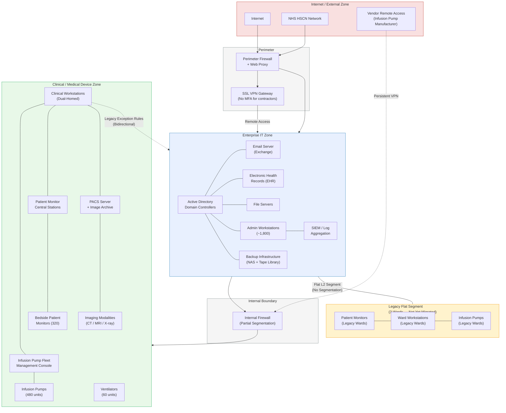

# Network Architecture — Northgate General Hospital

---

## Network Diagram

---

## Architecture Explanation

### Zone Design

Northgate's network follows a three-zone architecture common in NHS trusts that have undergone partial modernisation. The **Enterprise IT Zone** (blue) hosts all administrative and business systems, including Active Directory, email, the EHR platform, file services, and backup infrastructure. This zone is protected from the internet by a perimeter firewall with web proxy and content filtering. Remote access is provided through an SSL VPN gateway — the same gateway that, at the time of the incident, did not enforce multi-factor authentication for contractor accounts.

The **Clinical / Medical Device Zone** (green) houses the hospital's networked medical devices and the systems that manage them. This zone was designed as a segregated environment with its own VLAN infrastructure, separated from the enterprise zone by an internal next-generation firewall. The firewall enforces allow-list rules for cross-zone traffic — in principle, only specific data flows (EHR prescription data to the fleet management console, DICOM images from modalities to PACS) should traverse the boundary.

### The Segmentation Gap

The critical weakness lies in the incomplete migration. The **Legacy Flat Segment** (amber) represents the three inpatient wards that had not yet been migrated to the new clinical VLAN at the time of the incident. Devices on these wards — patient monitors, infusion pumps, and ward workstations — share a flat Layer-2 broadcast domain with enterprise workstations. There is no firewall or access control between them. This means that any compromise of an enterprise workstation on these floor segments provides direct, unfiltered network access to medical devices.

Additionally, a set of **dual-homed clinical workstations** (shown with dashed bidirectional links) maintain interfaces on both zones. These were provisioned as a pragmatic workaround: clinicians needed to access both the EHR (enterprise zone) and the infusion pump management console (clinical zone) from the same terminal. Legacy firewall exception rules permit this bidirectional traffic. These dual-homed machines are the primary cross-zone attack vector — a compromise of any one of them provides an attacker with a bridgehead into the clinical device network.

### Security-Safety Implications

The architecture has three properties that are directly relevant to the security-informed safety argument:

1. **Medical device dependence on enterprise services**: Infusion pumps and patient monitors ultimately depend on data originating in the enterprise zone (prescriptions, patient demographics). A loss of the enterprise zone therefore cascades to clinical device functionality.

2. **The IT/OT boundary is porous**: The internal firewall is the intended trust boundary between IT and clinical OT systems, but the dual-homed workstations and legacy flat segments undermine it. An attacker who reaches the clinical zone inherits the weak authentication and unencrypted protocol environment of legacy medical devices.

3. **Vendor remote access bypasses segmentation**: The infusion pump manufacturer's persistent VPN connection terminates directly in the clinical zone, providing an alternative entry point that bypasses the enterprise perimeter entirely. If the vendor's own credentials are compromised, the clinical zone is directly exposed.
