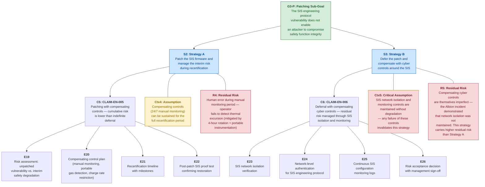

# Security-Informed Safety Assurance Case — Albion Energy Storage Facility

---

## Assurance Case Structure (Goal Structuring Notation)

The following diagram presents the top-level structure of the security-informed safety assurance case for Albion Energy Storage Ltd, using Goal Structuring Notation (GSN) concepts rendered in Mermaid. Node prefixes indicate GSN element types: **G** = Goal, **S** = Strategy, **C** = Claim (security-informed safety claim), **E** = Evidence, **Ctx** = Context, **R** = Residual Risk, **P** = Patching Constraint Argument.

```mermaid
graph TD
    G1["<b>G1: Top-Level Goal</b><br/>The Albion Energy Storage facility<br/>does not create a physical hazard<br/>to personnel, equipment, or the grid<br/>as a result of a cyber attack on<br/>its control systems"]

    Ctx1["<b>Ctx1: Scope</b><br/>Albion Storage Facility<br/>SCADA/ICS environment as<br/>described in system architecture"]
    Ctx2["<b>Ctx2: Threat Model</b><br/>Threat actors include initial<br/>access brokers, state-sponsored<br/>APT groups, and compromised<br/>contractors"]

    G1 --- Ctx1
    G1 --- Ctx2

    S1["<b>S1: Strategy</b><br/>Argue over three sub-goals<br/>corresponding to the three<br/>layers of defence against<br/>cyber-to-physical hazard"]

    G1 --> S1

    S1 --> G2["<b>G2: Sub-Goal 1</b><br/>The IT/OT boundary prevents<br/>enterprise IT compromise from<br/>reaching safety-critical<br/>control systems"]
    S1 --> G3["<b>G3: Sub-Goal 2</b><br/>Safety Instrumented System<br/>integrity is maintained under<br/>all network conditions including<br/>loss of network connectivity"]
    S1 --> G4["<b>G4: Sub-Goal 3</b><br/>Control system commands<br/>cannot be issued from<br/>unauthorised sources"]

    %% Sub-Goal 1: IT/OT Boundary
    G2 --> C1["<b>C1: CLAIM-EN-001</b><br/>IT/OT boundary protects<br/>control system integrity"]
    G2 --> C11["<b>C11: CLAIM-EN-011</b><br/>Cross-sector dependency<br/>management prevents<br/>cascading failure"]
    G2 --> C12["<b>C12: CLAIM-EN-012</b><br/>Supply chain integrity<br/>prevents compromised<br/>safety components"]

    C1 --> E1["<b>E1</b><br/>IT/OT penetration test<br/>(enterprise to SCADA blocked)"]
    C1 --> E2["<b>E2</b><br/>Firewall rule audit<br/>(no legacy ICS protocol rules)"]
    C1 --> E3["<b>E3</b><br/>Jump server config audit<br/>(unidirectional enforcement)"]
    C11 --> E4["<b>E4</b><br/>Cross-sector dependency<br/>risk assessment"]
    C11 --> E5["<b>E5</b><br/>Shared infrastructure<br/>segmentation audit"]
    C12 --> E6["<b>E6</b><br/>Firmware hash verification<br/>records at delivery"]

    G2 --- Ctx3["<b>Ctx3: Assumption</b><br/>IT/OT boundary configuration<br/>is audited quarterly and<br/>revalidated after any change"]

    G2 --- R1["<b>R1: Residual Risk</b><br/>Novel application-layer exploit<br/>traverses boundary via permitted<br/>OPC-UA or Modbus traffic<br/>(accepted — mitigated by ICS<br/>anomaly detection on SCADA net)"]

    %% Sub-Goal 2: SIS Integrity
    G3 --> C2["<b>C2: CLAIM-EN-002</b><br/>SIS network isolation<br/>preserves safety function<br/>independence"]
    G3 --> C7["<b>C7: CLAIM-EN-007</b><br/>Independent sensor validation<br/>detects data falsification"]
    G3 --> C8["<b>C8: CLAIM-EN-008</b><br/>Hardwired ESD provides<br/>cyber-independent ultimate<br/>safety boundary"]

    C2 --> E7["<b>E7</b><br/>SIS physical network isolation<br/>diagram and verification"]
    C2 --> E8["<b>E8</b><br/>Penetration test — SIS<br/>unreachable from SCADA net"]
    C2 --> E9["<b>E9</b><br/>SIS proof test with<br/>SCADA disconnected"]
    C7 --> E10["<b>E10</b><br/>Cross-validation system<br/>test results"]
    C8 --> E11["<b>E11</b><br/>Hardwired ESD circuit<br/>independence verification"]
    C8 --> E12["<b>E12</b><br/>ESD proof test with all<br/>digital systems powered off"]

    G3 --- R2["<b>R2: Residual Risk</b><br/>SIS sensor hardware failure<br/>coincident with cyber attack<br/>(accepted — SIL 2 reliability<br/>accounts for random hardware<br/>failure probability)"]

    %% Sub-Goal 3: Command Authorisation
    G4 --> C3["<b>C3: CLAIM-EN-003</b><br/>PLC programme integrity<br/>prevents control logic<br/>manipulation"]
    G4 --> C4["<b>C4: CLAIM-EN-004</b><br/>Modbus/TCP command<br/>authentication prevents<br/>sensor data falsification"]
    G4 --> C9["<b>C9: CLAIM-EN-009</b><br/>Vendor/contractor access<br/>controls prevent insider<br/>OT attack"]

    C3 --> E13["<b>E13</b><br/>PLC programme hash<br/>comparison logs"]
    C3 --> E14["<b>E14</b><br/>Dual-authorisation records<br/>for PLC changes"]
    C4 --> E15["<b>E15</b><br/>Modbus authentication<br/>mechanism test results"]
    C4 --> E16["<b>E16</b><br/>SCADA source whitelist<br/>configuration audit"]
    C9 --> E17["<b>E17</b><br/>Contractor access management<br/>system audit"]
    C9 --> E18["<b>E18</b><br/>Session recording archive<br/>for contractor OT access"]

    G4 --- R3["<b>R3: Residual Risk</b><br/>Compromised authorised user<br/>with valid dual-authorisation<br/>partner (accepted — mitigated<br/>by session recording and<br/>anomaly detection)"]

    style G1 fill:#d4edda,stroke:#155724,color:#155724
    style G2 fill:#d4edda,stroke:#155724,color:#155724
    style G3 fill:#d4edda,stroke:#155724,color:#155724
    style G4 fill:#d4edda,stroke:#155724,color:#155724
    style S1 fill:#cce5ff,stroke:#004085,color:#004085
    style Ctx1 fill:#fff3cd,stroke:#856404,color:#856404
    style Ctx2 fill:#fff3cd,stroke:#856404,color:#856404
    style Ctx3 fill:#fff3cd,stroke:#856404,color:#856404
    style R1 fill:#f8d7da,stroke:#721c24,color:#721c24
    style R2 fill:#f8d7da,stroke:#721c24,color:#721c24
    style R3 fill:#f8d7da,stroke:#721c24,color:#721c24
```

---

## Patching Constraint Sub-Argument

The following diagram presents the dedicated sub-argument addressing the SIS patching constraint — the defining security-informed safety tension for ICS environments. This sub-argument sits under G3 (SIS Integrity) and presents two alternative strategies, only one of which can be active at any time.

---

## Narrative Explanation

### Structure of the Argument

The assurance case is structured around a single top-level safety goal (**G1**): the Albion Energy Storage facility does not create a physical hazard to personnel, equipment, or the national grid as a result of a cyber attack on its control systems. This goal is deliberately scoped to cyber-originated physical hazards — it does not address all operational risks (equipment failure, natural events, human error unrelated to cyber), only those arising from the intersection of cybersecurity and industrial safety.

The argument decomposes through a single strategy (**S1**) into three sub-goals, each corresponding to a distinct defensive layer in the cyber-to-physical hazard pathway:

**Sub-Goal G2 (IT/OT Boundary)** addresses the architectural question — whether a compromise of the enterprise IT network can reach the safety-critical SCADA and control systems. This is the outermost defensive layer. The supporting claims argue that proper IT/OT segmentation (CLAIM-EN-001), cross-sector dependency management (CLAIM-EN-011), and supply chain integrity (CLAIM-EN-012) collectively prevent an enterprise-zone attacker from accessing the control environment. The evidence required includes penetration testing, firewall audits, and supply chain verification.

This sub-goal directly addresses the three architectural failures that made the Albion incident possible: the dual-homed historian, the bidirectional jump server, and the legacy Modbus/TCP firewall rules. If G2 had been fully satisfied at the time of the incident — that is, if the IT/OT boundary had been properly implemented — the attacker would not have been able to reach the SCADA server from the enterprise network foothold.

**Sub-Goal G3 (SIS Integrity)** addresses the most critical safety layer — whether the Safety Instrumented System will function correctly even if the control system is compromised. The supporting claims argue that SIS network isolation (CLAIM-EN-002) ensures the SIS is unreachable from the SCADA network, independent sensor validation (CLAIM-EN-007) detects data falsification, and the hardwired ESD system (CLAIM-EN-008) provides an ultimate safety boundary that cannot be compromised via any network-based attack.

G3 includes the **patching constraint sub-argument** — a dedicated section that addresses the SIS firmware vulnerability and presents two alternative strategies for managing it. This is the most original and pedagogically important part of the assurance case.

**Sub-Goal G4 (Command Authorisation)** addresses whether control system commands can be issued from unauthorised sources — the "even if the attacker reaches the SCADA network, can they actually control anything?" question. The supporting claims argue that PLC programme integrity verification (CLAIM-EN-003), Modbus/TCP command authentication (CLAIM-EN-004), and vendor/contractor access controls (CLAIM-EN-009) prevent unauthorised command execution.

### The Patching Constraint Argument

The patching constraint sub-argument is the centrepiece of the assurance case from a Security-Informed Safety teaching perspective. It presents two strategies for managing a known vulnerability in a safety-certified component, and neither strategy is risk-free:

**Strategy A (Patch and Recertify)** — represented by CLAIM-EN-005 — argues that applying the patch is the correct long-term decision, accepting a temporary increase in safety risk during the recertification period. The argument requires evidence that compensating controls (continuous manual monitoring, portable gas detection, charge rate restrictions) can adequately substitute for the automated SIS protection during recertification. The residual risk is human error during the manual monitoring period.

**Strategy B (Defer and Compensate)** — represented by CLAIM-EN-006 — argues that deferring the patch preserves the certified safety function, with compensating cyber controls (SIS network isolation, network-level access control for the engineering protocol, configuration monitoring) managing the vulnerability risk. The residual risk is that the compensating controls are themselves imperfect — and the Albion incident vividly demonstrated this: the SIS was accessible from the SCADA network despite the design intent for isolation, and the engineering protocol was exploited without detection.

The assurance case does not prescribe which strategy is correct — this is a genuine risk management decision that depends on the specific facility, its operational context, and its organisational risk appetite. What the case does demonstrate is that the decision must be made explicitly, with documented risk assessments and defined compensating controls, rather than by default through indefinite deferral (which is what happened at Albion).

### What the Assurance Case Demonstrates

The assurance case demonstrates several key principles about the relationship between IT security controls and OT safety:

1. **Security controls are safety evidence.** Every claim in the assurance case depends on a cybersecurity control. Network segmentation, access control, firmware integrity, and monitoring are not merely IT security measures — they are evidence nodes in a safety argument. When a security control fails, the safety argument that depends on it is weakened or invalidated.

2. **Defence in depth maps to layers of protection.** The three sub-goals correspond to three independent layers of defence. G2 (boundary) should prevent the attacker from reaching OT at all. G3 (SIS) should ensure safety even if OT is compromised. G4 (authorisation) should prevent unauthorised commands even if the attacker is on the OT network. In the Albion incident, G2 failed, G4 was not implemented, and G3 was compromised through the engineering protocol vulnerability. Only the hardwired ESD (the innermost evidence node of G3) remained intact.

3. **The argument breaks down where security and safety requirements conflict.** The patching constraint is the point where the security argument ("patch this vulnerability") and the safety argument ("do not modify this certified component") cannot both be satisfied simultaneously. The assurance case makes this conflict explicit and requires a documented decision with compensating controls — rather than allowing the conflict to be resolved by default through inaction.

### Where the Argument Breaks Down — Residual Risks

Three explicit residual risks are identified in the main argument:

**R1** — A novel application-layer exploit could traverse the IT/OT boundary via permitted protocol traffic (OPC-UA or Modbus). This risk is accepted because it requires a significantly more sophisticated attack than the boundary misconfigurations exploited in the Albion incident, and it is partially mitigated by ICS anomaly detection on the SCADA network (which would detect unusual command patterns even if the source appeared legitimate).

**R2** — A random SIS sensor hardware failure coinciding with a cyber attack could prevent the SIS from detecting a dangerous condition even if the SIS logic is uncompromised. This risk is quantified within the SIL 2 reliability framework — the probability of failure on demand is between $10^{-3}$ and $10^{-2}$, and this probability bound accounts for random hardware failure.

**R3** — A compromised authorised user with a valid dual-authorisation partner could issue malicious PLC commands that pass all authentication and integrity checks. This insider threat residual risk is mitigated by session recording and behavioural anomaly detection, but cannot be eliminated entirely by technical controls.

Two further residual risks (**R4** and **R5**) are specific to the patching constraint strategies and are discussed in the sub-argument above.

### The Defining Tension

The Albion assurance case ultimately illustrates that security-informed safety is not about achieving perfect security or perfect safety in isolation. It is about understanding where cybers security controls are load-bearing elements in a safety argument, making the dependencies explicit, and managing the inevitable tensions — particularly the patching constraint — through deliberate, documented, risk-informed decisions rather than through neglect or default.
