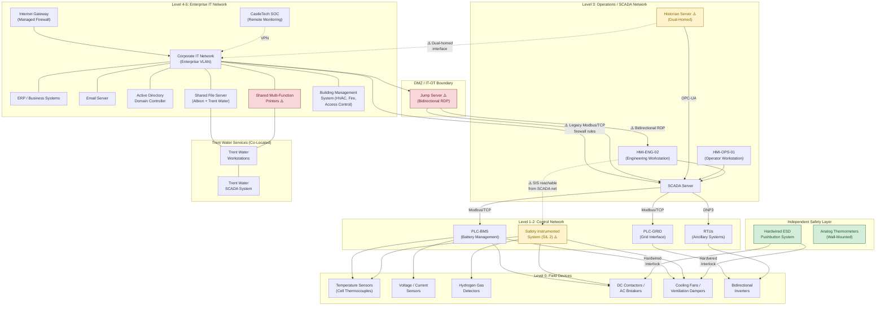

# Network Architecture — Albion Energy Storage Facility

---

## Network Topology Diagram

The following diagram represents the Albion Energy Storage Facility's network architecture, organised by Purdue Reference Model levels. Solid lines indicate intended communication pathways; dashed lines indicate pathways that should not exist but do (misconfigurations or legacy rules that create the attack surface exploited in the Albion incident).

**Diagram key**: Red-shaded nodes (⚠️) represent compromised or exploited components. Yellow-shaded nodes represent components with known vulnerabilities. Green-shaded nodes represent independent safety barriers that cannot be compromised via network attack.

---

## Network Architecture Explanation

### The IT/OT Boundary — and Why It Is Imperfect

The intended IT/OT boundary runs between the enterprise IT network (Level 4–5) and the SCADA/operations network (Level 3), with the jump server positioned as a DMZ access point. In a well-implemented architecture, this boundary would enforce strict data flow rules — ideally using a hardware data diode or unidirectional security gateway to ensure that process data can flow from OT to IT for analytics and reporting, but that no commands, sessions, or arbitrary traffic can flow from IT into OT.

At Albion, this boundary is compromised in three ways. First, the jump server permits bidirectional RDP sessions — it was configured during the smart grid upgrade to allow engineering staff to remote-desktop into OT workstations from the corporate network, a convenience that also permits an attacker with enterprise network access to reach the SCADA environment directly. Second, the historian server is dual-homed, with network interfaces on both the SCADA and enterprise networks — providing a passive data path that can be repurposed as an active relay for ICS protocol traffic. Third, legacy firewall rules persist from the commissioning period that permit Modbus/TCP traffic between the enterprise maintenance VLAN and the SCADA server — rules that were intended to be temporary but were never removed after commissioning was complete.

### SCADA-to-PLC Communication

The SCADA server communicates with PLC-BMS and PLC-GRID using Modbus/TCP — an industrial protocol that carries register read and write commands over TCP/IP. Modbus/TCP provides no built-in authentication, encryption, or integrity verification: any device that can establish a TCP connection to a PLC's Modbus port can issue read or write commands to its registers. The SCADA server polls PLC registers at regular intervals (typically every 1–5 seconds) to update the HMI displays and historian records, and writes to PLC registers when operators issue control commands. The RTUs communicate with the SCADA server using DNP3 (Distributed Network Protocol 3), which provides basic message authentication through challenge-response mechanisms but is not encrypted.

### The Safety Instrumented System

The SIS operates on a dedicated safety PLC, certified to SIL 2 under IEC 61511, and is intended to function independently of the main SCADA control system. It has its own sensor inputs (hardwired temperature, gas, and fault current sensors) and its own actuator outputs (DC contactors, cooling fans, ventilation dampers, fire suppression). The design intent is that even if the SCADA system is completely compromised, the SIS will independently detect unsafe conditions and initiate emergency shutdown.

However, the SIS safety PLC's engineering port is accessible from the same network segment as the SCADA server and engineering workstations. This means that an attacker who gains access to the Level 3 SCADA network can also reach the SIS engineering interface — undermining the intended independence. The engineering protocol on the SIS does not require authentication and does not log modifications, a vulnerability addressed by an available but unapplied firmware update. The hardwired ESD pushbutton system provides the ultimate safety boundary: it is electrically interlocked and completely independent of any programmable or networked system.

### Shared Network Segment with Trent Water Services

Trent Water Services workstations share the enterprise IT network's office VLAN, with access to the common file server and shared printers. While Trent Water's water pumping SCADA system is logically separate from Albion's SCADA network, the shared IT infrastructure creates a lateral movement pathway. An attacker who compromises the shared file server or printers can potentially reach both Albion and Trent Water IT environments — and from there, both organisations' OT systems if additional boundary weaknesses exist. This cross-organisational, cross-sector dependency was not formally risk-assessed during the site-sharing arrangement.
