# Assurance Case Overview — Meridian Cyber Insurance Coverage Determination

## Structure

The Case 3 assurance case is fundamentally different from the safety engineering arguments in Cases 1 and 2. It is not a safety argument demonstrating that a system is acceptably safe. Instead, it is an **insurance liability argument** demonstrating that Meridian's coverage decision in respect of the Albion incident is validly supported by evidence. The structure uses Goal Structuring Notation (GSN) conventions — goals, strategies, evidence, and context nodes — but the top-level claim concerns coverage validity rather than safety adequacy.

---

## GSN Diagram

```mermaid
graph TB
    G0["<b>G0: Top-Level Goal</b><br/>Meridian's coverage decision in respect<br/>of the Albion incident is validly supported<br/>by evidence of (a) the event falling within<br/>covered losses, (b) policyholder compliance<br/>with security obligations, and (c) claimed<br/>losses being attributable to the insured event"]

    S0["<b>S0: Strategy</b><br/>Decompose coverage decision<br/>into three independent<br/>sub-arguments"]

    G0 --> S0

    %% Sub-goal 1: Covered event
    G1["<b>G1: Sub-Goal 1</b><br/>The Albion incident falls within<br/>the scope of covered events<br/>(not excluded)"]

    S0 --> G1

    S1["<b>S1: Strategy</b><br/>Assess incident against<br/>insuring clause, exclusion<br/>schedule, and policy definitions"]

    G1 --> S1

    G1_1["<b>G1.1</b><br/>The incident meets the<br/>definition of a 'cyber event'<br/>under the policy"]
    G1_2["<b>G1.2</b><br/>The act-of-war exclusion<br/>does not apply"]
    G1_3["<b>G1.3</b><br/>Physical damage from the<br/>cyber event is affirmatively<br/>covered (LMA21 compliant)"]

    S1 --> G1_1
    S1 --> G1_2
    S1 --> G1_3

    E1_1["<b>E1.1</b><br/>Forensic report confirming<br/>unauthorised access to and<br/>manipulation of Albion's<br/>computer systems"]
    E1_2["<b>E1.2</b><br/>NCSC attribution assessment<br/>(moderate-to-high confidence,<br/>state-sponsored APT)"]
    E1_3["<b>E1.3</b><br/>Legal opinion on LMA5567A<br/>threshold ('major detrimental<br/>impact' not met)"]
    E1_4["<b>E1.4</b><br/>Policy wording confirming<br/>affirmative cyber coverage<br/>for physical damage"]

    G1_1 --> E1_1
    G1_2 --> E1_2
    G1_2 --> E1_3
    G1_3 --> E1_4

    C1["<b>C1: Context</b><br/>Attribution confidence is<br/>moderate-to-high (intelligence<br/>standard), not beyond reasonable<br/>doubt (legal standard)"]

    G1_2 --> C1

    %% Sub-goal 2: Warranty compliance
    G2["<b>G2: Sub-Goal 2</b><br/>Albion met its security<br/>warranty obligations at the<br/>time of the incident"]

    S0 --> G2

    S2["<b>S2: Strategy</b><br/>Assess each warranty<br/>condition against forensic<br/>evidence of Albion's<br/>security posture"]

    G2 --> S2

    G2_1["<b>G2.1</b><br/>IT/OT segmentation warranty<br/>(W-07) was complied with"]
    G2_2["<b>G2.2</b><br/>Patch management warranty<br/>(W-03) was complied with<br/>(SIS patch deferral)"]
    G2_3["<b>G2.3</b><br/>Access control warranty<br/>(W-09 / W-12) was<br/>complied with"]

    S2 --> G2_1
    S2 --> G2_2
    S2 --> G2_3

    E2_1["<b>E2.1</b><br/>Forensic evidence: dual-homed<br/>historian, bidirectional jump<br/>server, legacy Modbus rules<br/>all present and exploited"]
    E2_2["<b>E2.2</b><br/>Albion risk register entry:<br/>SIS patch deferred pending<br/>IEC 61511 recertification"]
    E2_3["<b>E2.3</b><br/>Forensic evidence: no<br/>compensating controls for<br/>SIS patch deferral"]
    E2_4["<b>E2.4</b><br/>Forensic evidence: dormant<br/>contractor account active,<br/>CastleTech service account<br/>with cross-site privileges"]

    G2_1 --> E2_1
    G2_2 --> E2_2
    G2_2 --> E2_3
    G2_3 --> E2_4

    C2["<b>C2: Context</b><br/>Under Insurance Act 2015,<br/>warranty breach suspends<br/>cover only if causally<br/>connected to the loss"]

    G2 --> C2

    R2["<b>R2: Residual Risk</b><br/>G2.1 is NOT satisfied:<br/>W-07 was breached.<br/>G2.2 is ARGUABLE.<br/>G2.3 is NOT satisfied.<br/>Proportionate deduction<br/>applied (25%)"]

    G2 --> R2

    %% Sub-goal 3: Loss attribution
    G3["<b>G3: Sub-Goal 3</b><br/>Claimed losses are causally<br/>attributable to the<br/>insured cyber event"]

    S0 --> G3

    S3["<b>S3: Strategy</b><br/>Verify causal chain from<br/>cyber event to each<br/>loss category"]

    G3 --> S3

    G3_1["<b>G3.1</b><br/>Incident response costs<br/>are attributable to<br/>the cyber event"]
    G3_2["<b>G3.2</b><br/>Business interruption<br/>losses are attributable<br/>to the cyber event"]
    G3_3["<b>G3.3</b><br/>Physical equipment damage<br/>is attributable to<br/>the cyber event"]

    S3 --> G3_1
    S3 --> G3_2
    S3 --> G3_3

    E3_1["<b>E3.1</b><br/>Forensic report: complete<br/>attack chain from printer<br/>backdoor to battery<br/>thermal excursion"]
    E3_2["<b>E3.2</b><br/>Loss adjustment report:<br/>£4.8M business interruption<br/>during six-week outage"]
    E3_3["<b>E3.3</b><br/>Engineering assessment:<br/>battery cell degradation<br/>caused by overcharge<br/>condition"]
    E3_4["<b>E3.4</b><br/>National Grid ESO contract:<br/>penalty schedule for<br/>non-delivery of ancillary<br/>services"]

    G3_1 --> E3_1
    G3_2 --> E3_2
    G3_2 --> E3_4
    G3_3 --> E3_3

    C3["<b>C3: Context</b><br/>Disputed: whether SIS<br/>recertification downtime<br/>is incident-attributable or<br/>pre-existing maintenance<br/>obligation"]

    G3_2 --> C3

    %% Nation-state sub-argument
    G4["<b>G4: Special Sub-Argument</b><br/>The nation-state attribution<br/>problem is addressed within<br/>the coverage determination"]

    S0 --> G4

    S4["<b>S4: Strategy</b><br/>Assess attribution evidence<br/>against the legal threshold<br/>for 'act of war' under<br/>English law and LMA5567A"]

    G4 --> S4

    G4_1["<b>G4.1</b><br/>Attribution evidence is<br/>evaluated and documented"]
    G4_2["<b>G4.2</b><br/>Legal threshold for<br/>exclusion is defined<br/>and applied"]
    G4_3["<b>G4.3</b><br/>Residual attribution<br/>ambiguity is accepted<br/>as underwriting risk"]

    S4 --> G4_1
    S4 --> G4_2
    S4 --> G4_3

    E4_1["<b>E4.1</b><br/>NCSC technical assessment:<br/>GREYMANTLE indicators,<br/>moderate-to-high confidence"]
    E4_2["<b>E4.2</b><br/>CTI analysis: two-actor<br/>model (IAB + APT),<br/>commercially motivated<br/>initial access"]
    E4_3["<b>E4.3</b><br/>Legal opinion: 'major<br/>detrimental impact'<br/>threshold not met for<br/>single-site incident"]

    G4_1 --> E4_1
    G4_1 --> E4_2
    G4_2 --> E4_3

    R4["<b>R4: Residual Risk</b><br/>If NCSC strengthens<br/>attribution or government<br/>formally designates the<br/>attack, exclusion analysis<br/>may need to be revisited"]

    G4_3 --> R4

    %% Styling
    classDef goal fill:#2e86c1,stroke:#1a5276,color:#fff
    classDef strategy fill:#27ae60,stroke:#1e8449,color:#fff
    classDef evidence fill:#f39c12,stroke:#d68910,color:#000
    classDef context fill:#8e44ad,stroke:#6c3483,color:#fff
    classDef residual fill:#e74c3c,stroke:#c0392b,color:#fff

    class G0,G1,G1_1,G1_2,G1_3,G2,G2_1,G2_2,G2_3,G3,G3_1,G3_2,G3_3,G4,G4_1,G4_2,G4_3 goal
    class S0,S1,S2,S3,S4 strategy
    class E1_1,E1_2,E1_3,E1_4,E2_1,E2_2,E2_3,E2_4,E3_1,E3_2,E3_3,E3_4,E4_1,E4_2,E4_3 evidence
    class C1,C2,C3 context
    class R2,R4 residual
```

---

## Narrative Explanation

### How This Assurance Case Differs from Cases 1 and 2

In Cases 1 (Healthcare) and 2 (Energy), the assurance case is a safety engineering argument. The top-level goal is something like: "The system is acceptably safe with respect to the identified cyber-physical hazards." The evidence includes safety analyses, security control implementations, and test results demonstrating that safety requirements are met. The argument follows Goal Structuring Notation (GSN) conventions established in safety engineering practice, and its audience is a safety assurance assessor or regulator.

The Case 3 assurance case serves a different purpose. Its top-level goal is about the validity of an insurance coverage decision — whether Meridian's determination to pay, reduce, or decline the Albion claim is supported by evidence and reasoning. The audience is not a safety regulator but a claims committee, a Lloyd's syndicate board, and potentially an arbitration panel. The goal structure decomposes into: (a) was the event covered? (b) was the policyholder compliant? (c) are the losses attributable? These are legal and commercial questions, not safety engineering questions — but they depend on exactly the same technical evidence (forensic reports, security control assessments, safety system configurations) that would underpin a safety assurance case.

This structural parallel is the pedagogic payoff: learners see that the same body of technical evidence can support both a safety argument and an insurance argument, but the two arguments may reach different conclusions from the same facts. Albion's SIS firmware deferral, for example, is a reasonable safety decision in Case 2 (maintaining the certified safety function) but a problematic warranty compliance issue in Case 3 (failing to implement compensating controls as required by the policy).

### The Multi-Organisational Nature of Security-Informed Safety

The Case 3 assurance case demonstrates that security-informed safety is not the sole responsibility of the system operator. Meridian — an organisation that has never visited the Albion control room during an operational shift — holds risk information, sets security conditions, and makes coverage decisions that materially affect the safety of the Albion facility. The warranty schedule in Meridian's policy functions as an indirect safety requirements specification: it mandates IT/OT segmentation, SIS independence, patch management, and access control — all requirements that a safety engineer would recognise as security-informed safety measures. But the enforcement mechanism is contractual and financial (coverage implications) rather than regulatory and technical (safety certification).

The assurance case makes this multi-organisational structure explicit. Evidence nodes in the Case 3 GSN reference the same forensic reports and technical assessments that would appear in a Case 2 safety assurance case, but they are evaluated through a different lens. A safety assessor asks: "Were the safety controls adequate?" An insurance assessor asks: "Were the warranty conditions met?" The answers may differ — and the gap between them reveals the structural limitations of using insurance as an indirect safety governance mechanism.

### The Evidence Model and Information Asymmetry

The evidence base for the Case 3 assurance case is characterised by information asymmetry. Meridian relies on evidence that Albion controls: forensic data, security posture records, financial loss documentation. The assurance case's evidence nodes (forensic reports, risk register entries, telemetry data) represent information that was shared through the cooperation clause and the forensic investigation — but the scope of sharing was negotiated, not unconditional.

A stronger evidence model — one approaching the "shared monitoring" concept where both insurer and policyholder have access to the same undisputed data — would reduce the adversarial quality of the claims process. If Meridian had continuous, real-time visibility into Albion's OT security posture (not just quarterly reports), warranty compliance could be assessed proactively rather than retrospectively. The evidence nodes in the assurance case would be populated by contemporaneous monitoring data rather than post-incident forensic reconstruction. This would strengthen both the safety case (earlier detection of security deficiencies) and the insurance case (less disputed evidence at claims stage).

However, extending insurer monitoring to OT environments creates its own risks — the insurer's access to policyholder SCADA data introduces new attack vectors and trust boundary challenges, as discussed in the system architecture documentation. The assurance case acknowledges this as an unresolved design tension in the evidence model.

### The Fundamental Tension

The Case 3 assurance case exposes a fundamental tension in the insurer's role as an indirect safety stakeholder: **the insurer wants to encourage safety-critical security controls but cannot directly enforce them.**

Meridian set warranty conditions requiring IT/OT segmentation, SIS independence, and patch management. These conditions align with safety engineering best practice and functional safety standards. But Meridian's enforcement mechanism is retrospective and contractual — it can reduce coverage after a loss, but it cannot compel the policyholder to act before a loss occurs. When Albion's twelve-month remediation deadline passed without completion, Meridian had two options: refuse to renew the policy (removing the financial incentive for security investment and leaving Albion uninsured for a risk that had not yet materialised) or continue coverage with the warranty in place (maintaining the incentive structure but accepting the interim risk). Meridian chose the latter — and the incident occurred during the gap between the deadline expiry and the eventual remediation.

The assurance case represents this tension through Sub-Goal G2 (warranty compliance), which concludes with a residual risk node rather than a satisfied goal. The warranty was breached, but the breach was known to both parties, and the enforcement mechanism — a proportionate deduction rather than a full denial — reflects the commercial reality that overly aggressive warranty enforcement undermines the insurer-policyholder relationship and the incentive structure that the warranty was designed to create.

This is the core teaching point: insurance warranties function as indirect safety controls, but their effectiveness depends on the credibility of enforcement. If policyholders believe that warranties will never be enforced, the incentive disappears. If policyholders believe that warranties will be enforced disproportionately, they may underreport risks or avoid buying insurance altogether. The assurance case structure — with its evidence nodes, context assumptions, and residual risks — makes this balance visible and discussable.
