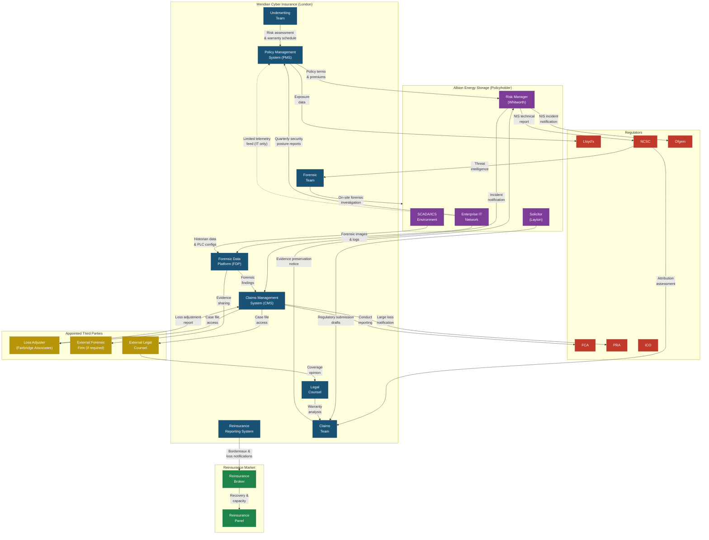

# Network Architecture — Meridian Cyber Insurance

## Organisational Data Flow Diagram

For Case 3, the "network architecture" is best understood as an organisational data flow diagram rather than a traditional IT network topology. The diagram below shows the principal systems, organisations, and data flows involved in Meridian's insurance operations and incident response.

## Key Data Flows and Trust Boundary Issues

### Pre-Incident Data Flows

During the active coverage period, data flows between Meridian and Albion are structured and controlled. Albion submits quarterly security posture reports through Meridian's secure portal — these reports include network architecture documentation, vulnerability scan summaries, warranty compliance status, and material change notifications. Meridian also receives a limited, automated telemetry feed from Albion's enterprise IT environment: endpoint detection alerts and firewall summary logs transmitted via an API integration. This telemetry does not extend to Albion's SCADA/OT environment. The pre-incident data flows are governed by the policy contract and a supplementary data processing agreement that specifies what Meridian may collect, how long it may retain the data, and with whom it may share it. The trust boundary here is contractual — Meridian relies on the accuracy of Albion's self-reported security posture, supplemented by the limited telemetry and periodic audit rights.

### Incident and Investigation Data Flows

When the Albion incident occurs, the data flow regime changes dramatically. The incident notification passes from Albion's Risk Manager to Meridian's Claims Management System, triggering a cascade of information requests. Meridian's forensic team requires access to Albion's enterprise IT logs, historian time-series data, PLC configuration backups, and SIS setpoint records — data that is far more sensitive and granular than anything exchanged during the normal policy period. The loss adjuster requires financial records, contract terms, and equipment replacement quotes. These flows cross the trust boundary between insurer and policyholder in both directions: Meridian sends an evidence preservation notice (an instruction that constrains Albion's operational freedom), and Albion provides forensic data that could be used to support or deny its own claim.

The trust boundary issue is acute at the OT/SCADA layer. Marcus Webb, Albion's OT Security Manager, resists providing unrestricted access to SCADA configurations and PLC logic — this data reveals proprietary process control parameters and, if mishandled, could itself create security risks. The forensic team's access is therefore negotiated and scoped, introducing the possibility that not all relevant evidence is captured.

### Regulatory and Attribution Data Flows

Regulatory data flows create a three-way trust challenge. Albion reports to Ofgem and NCSC under the NIS Regulations — these submissions contain factual descriptions of the incident that Meridian wants to review for consistency but does not control. The NCSC shares threat intelligence and attribution assessments with both Albion and Meridian, but on a traffic-light-protocol basis that restricts further dissemination. The attribution data is particularly sensitive: if the NCSC's assessment classifies the attack as state-sponsored, this information could trigger Meridian's act-of-war exclusion — creating a situation where intelligence intended to help the victim could financially harm it through the insurance mechanism.

### Reinsurance Data Flows

When the Albion claim approaches the £5 million reinsurance attachment point, Meridian's Reinsurance Reporting System generates notifications to the reinsurance broker. These notifications contain summary claim details — enough for the reinsurer to assess its exposure, but not the full forensic dataset or policyholder-identifiable information. The reinsurer relies on Meridian's claims assessment: a further trust delegation in the chain.
