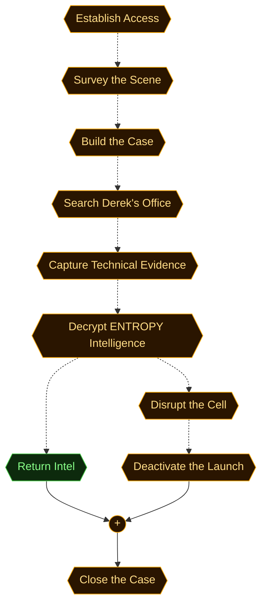
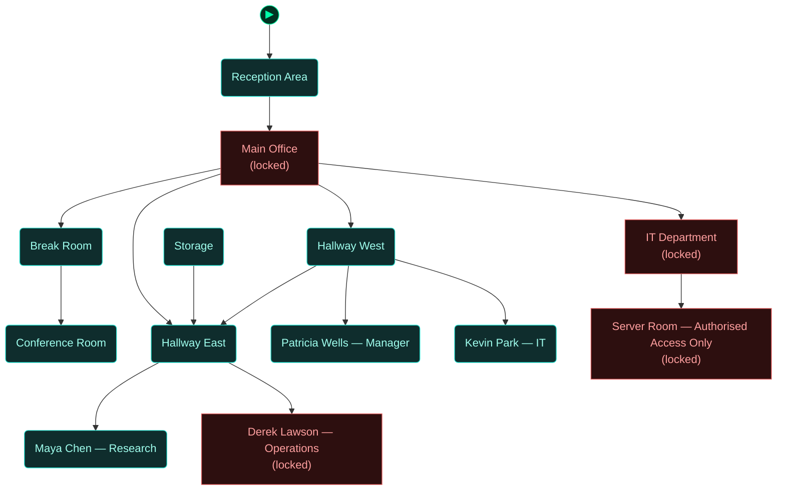

<!-- Auto-generated by scripts/generate_dungeon_graph.rb — do not edit by hand -->

# m01_first_contact — Scenario Graph Reference

Infiltrate Viral Dynamics Media to investigate suspected ENTROPY operations. Gather evidence of disinformation campaigns while maintaining cover as an IT contractor.

## Scenario Statistics

| Metric | Value |
|---|---|
| Story aims | 10 |
| Total tasks | 28 (3 optional) |
| VM flag challenges | 3 |
| Physical locks | 13 |
| AND-gate convergences | 3 |
| Rooms | 13 |
| Puzzle graph nodes / edges | 50 / 67 |
| Story graph nodes / edges | 11 / 11 |

## Critical Path

9 hops through story aims — minimum mandatory sequence to reach mission completion:

**Establish Access → Survey the Scene → Build the Case → Search Derek's Office → Capture Technical Evidence → Decrypt ENTROPY Intelligence → Disrupt the Cell → Deactivate the Launch → + → Close the Case**

## How to Read These Diagrams

| Shape | Colour | Meaning |
|---|---|---|
| Rounded rectangle | Teal | Room / physical area |
| Rectangle | Red | Lock, barrier, or interactive terminal |
| Diamond | Orange | Inventory item or credential |
| Diamond | Red/Pink | NPC or physical key |
| Diamond | Purple | VM flag (challenge completion token) |
| Rectangle | Blue | VM challenge |
| Ribbon | Amber | NPC conversation / action gate |
| Hexagon | Green | Story aim (objective) |
| Hexagon | Amber | Critical path node |
| Circle | Grey | AND gate (all inputs required) |
| Subroutine rect `[[…]]` | Green | Container (holds items) |
| Rounded rectangle | Amber | NPC in room (Rooms & Contents only) |

Edges: `-->` solid = hard dependency; `-.->` dashed = soft / narrative dependency or optional path.

The `▶` node marks the player's starting room.

## Puzzle Graph

Physical lock–key dependency chain. Shows which items, codes, and NPC interactions are required to open each lock, and which locks gate access to each room or object. Use this to trace solvability, spot circular dependencies, and check that every key is reachable before the lock that needs it.

```mermaid
flowchart TD

  classDef room      fill:#0f2d2d,stroke:#22ddcc,color:#a0ffee
  classDef lock      fill:#2d0f0f,stroke:#e66060,color:#ffa0a0
  classDef key       fill:#2d0812,stroke:#e66060,color:#ffa0a0
  classDef item      fill:#2d1200,stroke:#e89030,color:#ffcc80
  classDef gate      fill:#111,stroke:#666,color:#eee
  classDef vm        fill:#0c1f40,stroke:#4a90d9,color:#a0c8ff
  classDef flag      fill:#1a0c2d,stroke:#9060d0,color:#cc99ff
  classDef action    fill:#1a1200,stroke:#cc9922,color:#ffee88
  classDef aim       fill:#0d2a0d,stroke:#44cc44,color:#88ff88
  classDef aim_gate  fill:#111111,stroke:#44cc44,color:#44cc44
  classDef container fill:#1a2d1a,stroke:#60b060,color:#a0e0a0
  classDef npc       fill:#2d1f0d,stroke:#d0a050,color:#ffe0a0
  classDef critical  fill:#2a1500,stroke:#ffaa00,color:#ffdd88
  classDef start     fill:#003322,stroke:#00ffaa,color:#00ffaa

  node_start(("▶"))
  node_start --> reception_area

  door_main_office_area["Main Office<br/>Key lock"]
  main_office_area("Main Office")
  door_it_room["IT Department<br/>PIN lock"]
  it_room("IT Department")
  door_derek_office["Derek Lawson — Operations<br/>Key lock"]
  derek_office("Derek Lawson — Operations")
  door_server_room["Server Room — Authorised Access Only<br/>RFID lock"]
  server_room("Server Room — Authorised Access Only")
  reception_area("Reception Area")
  reception_desk_phone{"Reception Desk Phone"}
  npc_sarah_o_brien{"Sarah O'Brien"}
  main_office_key{"Main Office Key"}
  lock_main_filing_cabinet["Main Filing Cabinet<br/>PIN lock"]
  maintenance_checklist{"Maintenance Checklist"}
  storage_closet("Storage")
  lock_derek_storage_safe["Derek's Safe<br/>PIN lock"]
  my_passwords{"My Passwords"}
  lock_vm_launcher_intro_linux["VM Access Terminal<br/>SSH credentials needed"]
  maintenance_log_backup{"Maintenance Log (Backup)"}
  break_room("Break Room")
  anniversary_card{"Anniversary Card"}
  lock_derek_computer["Derek Computer"]
  lock_derek_cabinet["Derek Cabinet"]
  npc_kevin_park{"Kevin Park"}
  lock_pick_kit{"Lock Pick Kit"}
  lock_patricia_briefcase["Patricia Briefcase"]
  server_room_keycard{"Server Room Keycard"}
  manager_office("Patricia Wells — Manager")
  derek_s_office_key{"Derek's Office Key"}
  cyberchef_workstation{"CyberChef Workstation"}
  kevin_office("Kevin Park — IT")
  lock_kevin_s_workstation["Kevin's Workstation<br/>Password lock"]
  out_of_office_note{"Out of Office Note"}
  personal_notes_safe{"Personal Notes - Safe"}
  lock_derek_personal_safe["Derek Personal Safe"]
  encoded_note_1{"Encoded Note (1)"}
  encoded_note_2{"Encoded Note (2)"}
  lock_entropy_encrypted_archive["ENTROPY Encrypted Archive<br/>Flag lock"]
  andgate1((" + "))
  andgate2((" + "))
  vmch_submit_ssh_flag["Unlock the ENTROPY encrypted archive"]
  vmfl_submit_ssh_flag{"Ssh Flag"}
  vmch_submit_linux_flag["Submit directory traversal evidence"]
  vmfl_submit_linux_flag{"Linux Flag"}
  vmch_submit_sudo_flag["Submit encoded deployment intelligence"]
  vmfl_submit_sudo_flag{"Sudo Flag"}
  hallway_west("Hallway West")
  hallway_east("Hallway East")
  conference_room("Conference Room")
  maya_office("Maya Chen — Research")

  door_main_office_area --> main_office_area
  door_it_room --> it_room
  door_derek_office --> derek_office
  door_server_room --> server_room
  reception_area --> reception_desk_phone
  reception_desk_phone --> door_it_room
  reception_area --> npc_sarah_o_brien
  npc_sarah_o_brien --> main_office_key
  main_office_key --> door_main_office_area
  main_office_area --> lock_main_filing_cabinet
  main_office_area -.-> maintenance_checklist
  maintenance_checklist -.-> door_it_room
  storage_closet --> lock_derek_storage_safe
  lock_derek_storage_safe --> my_passwords
  my_passwords --> lock_vm_launcher_intro_linux
  storage_closet -.-> maintenance_log_backup
  maintenance_log_backup -.-> door_it_room
  break_room -.-> anniversary_card
  anniversary_card -.-> lock_derek_computer
  anniversary_card -.-> lock_derek_cabinet
  it_room --> npc_kevin_park
  npc_kevin_park --> lock_pick_kit
  lock_pick_kit --> lock_patricia_briefcase
  lock_pick_kit --> door_derek_office
  npc_kevin_park --> server_room_keycard
  server_room_keycard --> door_server_room
  manager_office --> lock_patricia_briefcase
  lock_patricia_briefcase --> derek_s_office_key
  derek_s_office_key --> door_derek_office
  lock_patricia_briefcase --> cyberchef_workstation
  kevin_office --> lock_kevin_s_workstation
  kevin_office -.-> out_of_office_note
  out_of_office_note -.-> door_it_room
  derek_office --> lock_derek_computer
  lock_derek_computer --> personal_notes_safe
  personal_notes_safe --> lock_derek_personal_safe
  derek_office --> encoded_note_1
  derek_office --> encoded_note_2
  derek_office --> lock_derek_personal_safe
  derek_office --> lock_derek_cabinet
  server_room --> lock_entropy_encrypted_archive
  cyberchef_workstation -.-> andgate1
  andgate1 --> lock_derek_storage_safe
  encoded_note_1 --> andgate1
  cyberchef_workstation -.-> andgate2
  andgate2 --> lock_derek_computer
  andgate2 --> lock_derek_cabinet
  encoded_note_2 --> andgate2
  vmch_submit_ssh_flag --> vmfl_submit_ssh_flag
  vmfl_submit_ssh_flag --> lock_entropy_encrypted_archive
  vmch_submit_linux_flag --> vmfl_submit_linux_flag
  vmfl_submit_ssh_flag -.-> vmch_submit_linux_flag
  vmch_submit_sudo_flag --> vmfl_submit_sudo_flag
  vmfl_submit_linux_flag -.-> vmch_submit_sudo_flag
  lock_vm_launcher_intro_linux --> vmch_submit_ssh_flag
  server_room --> lock_vm_launcher_intro_linux
  main_office_area --> reception_area
  main_office_area --> hallway_west
  main_office_area --> hallway_east
  main_office_area --> break_room
  storage_closet --> hallway_east
  break_room --> conference_room
  hallway_west --> manager_office
  hallway_west --> kevin_office
  hallway_west --> hallway_east
  hallway_east --> maya_office
  derek_office --> hallway_east

  class door_main_office_area,door_it_room,door_derek_office,door_server_room,lock_main_filing_cabinet,lock_derek_storage_safe,lock_vm_launcher_intro_linux,lock_derek_computer,lock_derek_cabinet,lock_patricia_briefcase,lock_kevin_s_workstation,lock_derek_personal_safe,lock_entropy_encrypted_archive lock
  class main_office_area,it_room,derek_office,server_room,reception_area,storage_closet,break_room,manager_office,kevin_office,hallway_west,hallway_east,conference_room,maya_office room
  class reception_desk_phone,maintenance_checklist,my_passwords,maintenance_log_backup,anniversary_card,cyberchef_workstation,out_of_office_note,personal_notes_safe,encoded_note_1,encoded_note_2 item
  class npc_sarah_o_brien,main_office_key,npc_kevin_park,lock_pick_kit,server_room_keycard,derek_s_office_key key
  class andgate1,andgate2 gate
  class vmch_submit_ssh_flag,vmch_submit_linux_flag,vmch_submit_sudo_flag vm
  class vmfl_submit_ssh_flag,vmfl_submit_linux_flag,vmfl_submit_sudo_flag flag

  classDef optional stroke-dasharray:5 2
  class maintenance_checklist,maintenance_log_backup,anniversary_card,out_of_office_note optional
  class node_start start
```

## Story Aims

Narrative objective flow. Shows story aims and their unlock conditions. Critical path aims are highlighted in amber. Use this to check aim sequencing, identify gaps between objectives, and verify that the player always has a clear next goal.

## Story + Puzzle (Integrated)

Puzzle graph and story aims combined, with bridge edges connecting physical puzzle progress to story aim completion. Use this to verify that physical actions drive narrative progress and that no aim is left floating without a puzzle prerequisite.

```mermaid
flowchart TD

  classDef room      fill:#0f2d2d,stroke:#22ddcc,color:#a0ffee
  classDef lock      fill:#2d0f0f,stroke:#e66060,color:#ffa0a0
  classDef key       fill:#2d0812,stroke:#e66060,color:#ffa0a0
  classDef item      fill:#2d1200,stroke:#e89030,color:#ffcc80
  classDef gate      fill:#111,stroke:#666,color:#eee
  classDef vm        fill:#0c1f40,stroke:#4a90d9,color:#a0c8ff
  classDef flag      fill:#1a0c2d,stroke:#9060d0,color:#cc99ff
  classDef action    fill:#1a1200,stroke:#cc9922,color:#ffee88
  classDef aim       fill:#0d2a0d,stroke:#44cc44,color:#88ff88
  classDef aim_gate  fill:#111111,stroke:#44cc44,color:#44cc44
  classDef container fill:#1a2d1a,stroke:#60b060,color:#a0e0a0
  classDef npc       fill:#2d1f0d,stroke:#d0a050,color:#ffe0a0
  classDef critical  fill:#2a1500,stroke:#ffaa00,color:#ffdd88
  classDef start     fill:#003322,stroke:#00ffaa,color:#00ffaa

  node_start(("▶"))
  node_start --> reception_area

  door_main_office_area["Main Office<br/>Key lock"]
  main_office_area("Main Office")
  door_it_room["IT Department<br/>PIN lock"]
  it_room("IT Department")
  door_derek_office["Derek Lawson — Operations<br/>Key lock"]
  derek_office("Derek Lawson — Operations")
  door_server_room["Server Room — Authorised Access Only<br/>RFID lock"]
  server_room("Server Room — Authorised Access Only")
  reception_area("Reception Area")
  reception_desk_phone{"Reception Desk Phone"}
  npc_sarah_o_brien{"Sarah O'Brien"}
  main_office_key{"Main Office Key"}
  lock_main_filing_cabinet["Main Filing Cabinet<br/>PIN lock"]
  maintenance_checklist{"Maintenance Checklist"}
  storage_closet("Storage")
  lock_derek_storage_safe["Derek's Safe<br/>PIN lock"]
  my_passwords{"My Passwords"}
  lock_vm_launcher_intro_linux["VM Access Terminal<br/>SSH credentials needed"]
  maintenance_log_backup{"Maintenance Log (Backup)"}
  break_room("Break Room")
  anniversary_card{"Anniversary Card"}
  lock_derek_computer["Derek Computer"]
  lock_derek_cabinet["Derek Cabinet"]
  npc_kevin_park{"Kevin Park"}
  lock_pick_kit{"Lock Pick Kit"}
  lock_patricia_briefcase["Patricia Briefcase"]
  server_room_keycard{"Server Room Keycard"}
  manager_office("Patricia Wells — Manager")
  derek_s_office_key{"Derek's Office Key"}
  cyberchef_workstation{"CyberChef Workstation"}
  kevin_office("Kevin Park — IT")
  lock_kevin_s_workstation["Kevin's Workstation<br/>Password lock"]
  out_of_office_note{"Out of Office Note"}
  personal_notes_safe{"Personal Notes - Safe"}
  lock_derek_personal_safe["Derek Personal Safe"]
  encoded_note_1{"Encoded Note (1)"}
  encoded_note_2{"Encoded Note (2)"}
  lock_entropy_encrypted_archive["ENTROPY Encrypted Archive<br/>Flag lock"]
  andgate1((" + "))
  andgate2((" + "))
  vmch_submit_ssh_flag["Unlock the ENTROPY encrypted archive"]
  vmfl_submit_ssh_flag{"Ssh Flag"}
  vmch_submit_linux_flag["Submit directory traversal evidence"]
  vmfl_submit_linux_flag{"Linux Flag"}
  vmch_submit_sudo_flag["Submit encoded deployment intelligence"]
  vmfl_submit_sudo_flag{"Sudo Flag"}
  hallway_west("Hallway West")
  hallway_east("Hallway East")
  conference_room("Conference Room")
  maya_office("Maya Chen — Research")
  aim_establish_access{{"Establish Access"}}
  aim_survey_offices{{"Survey the Scene"}}
  aim_build_the_case{{"Build the Case"}}
  aim_search_derek_office{{"Search Derek's Office"}}
  aim_capture_technical_evidence{{"Capture Technical Evidence"}}
  aim_decrypt_entropy_intel{{"Decrypt ENTROPY Intelligence"}}
  aim_return_intel{{"Return Intel"}}
  aim_disrupt_the_cell{{"Disrupt the Cell"}}
  aim_deactivate_the_launch{{"Deactivate the Launch"}}
  aim_close_the_case{{"Close the Case"}}
  aim_andgate_close_the_case((" + "))

  door_main_office_area --> main_office_area
  door_it_room --> it_room
  door_derek_office --> derek_office
  door_server_room --> server_room
  reception_area --> reception_desk_phone
  reception_desk_phone --> door_it_room
  reception_area --> npc_sarah_o_brien
  npc_sarah_o_brien --> main_office_key
  main_office_key --> door_main_office_area
  main_office_area --> lock_main_filing_cabinet
  main_office_area -.-> maintenance_checklist
  maintenance_checklist -.-> door_it_room
  storage_closet --> lock_derek_storage_safe
  lock_derek_storage_safe --> my_passwords
  my_passwords --> lock_vm_launcher_intro_linux
  storage_closet -.-> maintenance_log_backup
  maintenance_log_backup -.-> door_it_room
  break_room -.-> anniversary_card
  anniversary_card -.-> lock_derek_computer
  anniversary_card -.-> lock_derek_cabinet
  it_room --> npc_kevin_park
  npc_kevin_park --> lock_pick_kit
  lock_pick_kit --> lock_patricia_briefcase
  lock_pick_kit --> door_derek_office
  npc_kevin_park --> server_room_keycard
  server_room_keycard --> door_server_room
  manager_office --> lock_patricia_briefcase
  lock_patricia_briefcase --> derek_s_office_key
  derek_s_office_key --> door_derek_office
  lock_patricia_briefcase --> cyberchef_workstation
  kevin_office --> lock_kevin_s_workstation
  kevin_office -.-> out_of_office_note
  out_of_office_note -.-> door_it_room
  derek_office --> lock_derek_computer
  lock_derek_computer --> personal_notes_safe
  personal_notes_safe --> lock_derek_personal_safe
  derek_office --> encoded_note_1
  derek_office --> encoded_note_2
  derek_office --> lock_derek_personal_safe
  derek_office --> lock_derek_cabinet
  server_room --> lock_entropy_encrypted_archive
  cyberchef_workstation -.-> andgate1
  andgate1 --> lock_derek_storage_safe
  encoded_note_1 --> andgate1
  cyberchef_workstation -.-> andgate2
  andgate2 --> lock_derek_computer
  andgate2 --> lock_derek_cabinet
  encoded_note_2 --> andgate2
  vmch_submit_ssh_flag --> vmfl_submit_ssh_flag
  vmfl_submit_ssh_flag --> lock_entropy_encrypted_archive
  vmch_submit_linux_flag --> vmfl_submit_linux_flag
  vmfl_submit_ssh_flag -.-> vmch_submit_linux_flag
  vmch_submit_sudo_flag --> vmfl_submit_sudo_flag
  vmfl_submit_linux_flag -.-> vmch_submit_sudo_flag
  lock_vm_launcher_intro_linux --> vmch_submit_ssh_flag
  server_room --> lock_vm_launcher_intro_linux
  main_office_area --> reception_area
  main_office_area --> hallway_west
  main_office_area --> hallway_east
  main_office_area --> break_room
  storage_closet --> hallway_east
  break_room --> conference_room
  hallway_west --> manager_office
  hallway_west --> kevin_office
  hallway_west --> hallway_east
  hallway_east --> maya_office
  derek_office --> hallway_east
  aim_establish_access -.-> aim_survey_offices
  aim_survey_offices -.-> aim_build_the_case
  aim_build_the_case -.-> aim_search_derek_office
  aim_search_derek_office -.-> aim_capture_technical_evidence
  aim_capture_technical_evidence -.-> aim_decrypt_entropy_intel
  aim_decrypt_entropy_intel -.-> aim_return_intel
  aim_decrypt_entropy_intel -.-> aim_disrupt_the_cell
  aim_disrupt_the_cell -.-> aim_deactivate_the_launch
  aim_return_intel --> aim_andgate_close_the_case
  aim_deactivate_the_launch --> aim_andgate_close_the_case
  aim_andgate_close_the_case --> aim_close_the_case
  door_main_office_area -.-> aim_establish_access
  main_office_area -.-> aim_survey_offices
  door_it_room -.-> aim_survey_offices
  door_it_room -.-> aim_build_the_case
  derek_s_office_key -.-> aim_build_the_case
  lock_pick_kit -.-> aim_build_the_case
  door_derek_office -.-> aim_search_derek_office
  derek_office -.-> aim_capture_technical_evidence
  lock_derek_computer -.-> aim_search_derek_office
  lock_derek_cabinet -.-> aim_search_derek_office
  lock_derek_personal_safe -.-> aim_search_derek_office
  lock_derek_storage_safe -.-> aim_search_derek_office
  door_server_room -.-> aim_capture_technical_evidence
  vmfl_submit_ssh_flag -.-> aim_capture_technical_evidence
  vmfl_submit_ssh_flag -.-> aim_decrypt_entropy_intel
  vmfl_submit_linux_flag -.-> aim_capture_technical_evidence
  vmfl_submit_sudo_flag -.-> aim_capture_technical_evidence
  lock_entropy_encrypted_archive -.-> aim_decrypt_entropy_intel

  class door_main_office_area,door_it_room,door_derek_office,door_server_room,lock_main_filing_cabinet,lock_derek_storage_safe,lock_vm_launcher_intro_linux,lock_derek_computer,lock_derek_cabinet,lock_patricia_briefcase,lock_kevin_s_workstation,lock_derek_personal_safe,lock_entropy_encrypted_archive lock
  class main_office_area,it_room,derek_office,server_room,reception_area,storage_closet,break_room,manager_office,kevin_office,hallway_west,hallway_east,conference_room,maya_office room
  class reception_desk_phone,maintenance_checklist,my_passwords,maintenance_log_backup,anniversary_card,cyberchef_workstation,out_of_office_note,personal_notes_safe,encoded_note_1,encoded_note_2 item
  class npc_sarah_o_brien,main_office_key,npc_kevin_park,lock_pick_kit,server_room_keycard,derek_s_office_key key
  class andgate1,andgate2 gate
  class vmch_submit_ssh_flag,vmch_submit_linux_flag,vmch_submit_sudo_flag vm
  class vmfl_submit_ssh_flag,vmfl_submit_linux_flag,vmfl_submit_sudo_flag flag
  class aim_establish_access,aim_survey_offices,aim_build_the_case,aim_search_derek_office,aim_capture_technical_evidence,aim_decrypt_entropy_intel,aim_disrupt_the_cell,aim_deactivate_the_launch,aim_close_the_case,aim_andgate_close_the_case critical
  class aim_return_intel aim

  classDef optional stroke-dasharray:5 2
  class maintenance_checklist,maintenance_log_backup,anniversary_card,out_of_office_note optional
  class node_start start
```

## Rooms

Physical room layout with all connections. Locked rooms are shown in red. Use this to check room reachability, identify dead-end rooms with no content, and understand the spatial structure of the scenario.

## Rooms & Contents

Physical room layout with all objects, containers, NPCs, and held items. Use this to check clue distribution across rooms, verify that hints are placed before the locks they solve, and spot rooms that are under- or over-loaded with content.

```mermaid
flowchart TD

  classDef room      fill:#0f2d2d,stroke:#22ddcc,color:#a0ffee
  classDef lock      fill:#2d0f0f,stroke:#e66060,color:#ffa0a0
  classDef key       fill:#2d0812,stroke:#e66060,color:#ffa0a0
  classDef item      fill:#2d1200,stroke:#e89030,color:#ffcc80
  classDef gate      fill:#111,stroke:#666,color:#eee
  classDef vm        fill:#0c1f40,stroke:#4a90d9,color:#a0c8ff
  classDef flag      fill:#1a0c2d,stroke:#9060d0,color:#cc99ff
  classDef action    fill:#1a1200,stroke:#cc9922,color:#ffee88
  classDef aim       fill:#0d2a0d,stroke:#44cc44,color:#88ff88
  classDef aim_gate  fill:#111111,stroke:#44cc44,color:#44cc44
  classDef container fill:#1a2d1a,stroke:#60b060,color:#a0e0a0
  classDef npc       fill:#2d1f0d,stroke:#d0a050,color:#ffe0a0
  classDef critical  fill:#2a1500,stroke:#ffaa00,color:#ffdd88
  classDef start     fill:#003322,stroke:#00ffaa,color:#00ffaa

  node_start(("▶"))
  node_start --> reception_area

  reception_area("Reception Area")
  main_office_area["Main Office<br/>(locked)"]
  storage_closet("Storage")
  break_room("Break Room")
  conference_room("Conference Room")
  it_room["IT Department<br/>(locked)"]
  hallway_west("Hallway West")
  hallway_east("Hallway East")
  manager_office("Patricia Wells — Manager")
  kevin_office("Kevin Park — IT")
  maya_office("Maya Chen — Research")
  derek_office["Derek Lawson — Operations<br/>(locked)"]
  server_room["Server Room — Authorised Access Only<br/>(locked)"]
  rc_reception_desk_phone_1{"Reception Desk Phone"}
  rc_obj2_2{"Building Directory"}
  rc_obj3_3{"Visitor Sign-In Log"}
  rc_npc_agent_hax_4("Agent HaX")
  rc_npc_sarah_o_brien_5("Sarah O'Brien")
  rc_obj6_6{"Visitor Badge"}
  rc_obj7_7{"Main Office Key"}
  rc_npc_agent_hax_8("Agent HaX")
  rc_npc_agent_hax_9("Agent HaX")
  rc_obj10_10[["Main Filing Cabinet"]]
  rc_obj11_11{"Pencil Cup"}
  rc_obj12_12{"Stapler"}
  rc_obj13_13{"Pen Set"}
  rc_obj14_14{"Viral Dynamics Business Outline"}
  rc_obj15_15{"Office Chalkboard"}
  rc_obj16_16{"Office Chalkboard"}
  rc_obj17_17[["Office Recycling Bin"]]
  rc_obj18_18{"Maintenance Checklist"}
  rc_derek_storage_safe_19[["Derek's Safe"]]
  rc_obj20_20{"Storage Receipt"}
  rc_obj21_21{"My Passwords"}
  rc_obj22_22{"Maintenance Log (Backup)"}
  rc_obj23_23{"Office Gossip"}
  rc_obj24_24{"Break Room Calendar"}
  rc_obj25_25[["Recycling Bin"]]
  rc_obj26_26{"Anniversary Card"}
  rc_obj27_27{"Coffee Shop Receipt"}
  rc_obj28_28{"Sticky Note on Fridge"}
  rc_npc_derek_lawson_29("Derek Lawson")
  rc_obj30_30{"ENTROPY Launch Device"}
  rc_obj31_31{"Meeting Calendar"}
  rc_obj32_32[["Paper Bin"]]
  rc_obj33_33{"ZDS Meeting Notes"}
  rc_obj34_34{"Campaign Timeline"}
  rc_obj35_35[["IT Monitoring Station"]]
  rc_obj36_36{"Server Access Log"}
  rc_obj37_37{"IT Security Concerns"}
  rc_npc_kevin_park_38("Kevin Park")
  rc_obj39_39{"Lock Pick Kit"}
  rc_obj40_40{"Server Room Keycard"}
  rc_obj41_41{"Lock Pick Instructions"}
  rc_patricia_briefcase_42[["Patricia's Briefcase"]]
  rc_obj43_43{"Derek's Office Key"}
  rc_obj44_44{"Patricia's Investigation Notes"}
  rc_cyberchef_workstation_45{"CyberChef Workstation"}
  rc_obj46_46{"Patricia's Note — CyberChef"}
  rc_obj47_47{"ENTROPY Infiltration Timeline"}
  rc_patricia_desk_phone_48{"Patricia's Desk Phone"}
  rc_obj49_49{"Termination Letter"}
  rc_obj50_50[["Kevin's Workstation"]]
  rc_obj51_51{"Server Access Log"}
  rc_obj52_52{"Draft Email (Unsent)"}
  rc_obj53_53{"Out of Office Note"}
  rc_obj54_54{"IT Incident Log"}
  rc_obj55_55{"Disinformation Research"}
  rc_obj56_56{"SAFETYNET Contact"}
  rc_npc_maya_chen_57("Maya Chen")
  rc_derek_computer_58[["Derek's Computer"]]
  rc_obj59_59{"IT Security Anomaly Report"}
  rc_obj60_60{"Recovered Email - K.Park"}
  rc_obj61_61{"Personal Notes - Safe"}
  rc_contingency_files_62{"CONTINGENCY - IT Audit Response"}
  rc_obj63_63{"Encoded Note (1)"}
  rc_obj64_64{"Encoded Note (2)"}
  rc_derek_personal_safe_65[["Derek's Personal Safe"]]
  rc_obj66_66{"The Architect's Letter"}
  rc_derek_cabinet_67[["Derek's Filing Cabinet"]]
  rc_obj68_68{"Operation Shatter Casualty Projections"}
  rc_obj69_69{"Social Fabric Manifesto"}
  rc_obj70_70{"Campaign Materials"}
  rc_obj71_71{"Derek's Calendar"}
  rc_vm_launcher_intro_linux_72{"VM Access Terminal"}
  rc_flag_station_dropsite_73{"SAFETYNET Drop-Site Terminal"}
  rc_entropy_encrypted_archive_74[["ENTROPY Encrypted Archive"]]
  rc_obj75_75{"Operation Shatter: Architect's Authorization"}
  rc_obj76_76{"ENTROPY Network Architecture"}
  rc_obj77_77{"Operation Shatter Target Database"}

  reception_area --> main_office_area
  main_office_area --> hallway_west
  main_office_area --> hallway_east
  main_office_area --> it_room
  main_office_area --> break_room
  storage_closet --> hallway_east
  break_room --> conference_room
  it_room --> server_room
  hallway_west --> manager_office
  hallway_west --> kevin_office
  hallway_west --> hallway_east
  hallway_east --> maya_office
  hallway_east --> derek_office
  reception_area --> rc_reception_desk_phone_1
  reception_area --> rc_obj2_2
  reception_area --> rc_obj3_3
  reception_area --> rc_npc_agent_hax_4
  reception_area --> rc_npc_sarah_o_brien_5
  rc_npc_sarah_o_brien_5 --> rc_obj6_6
  rc_npc_sarah_o_brien_5 --> rc_obj7_7
  reception_area --> rc_npc_agent_hax_8
  reception_area --> rc_npc_agent_hax_9
  main_office_area --> rc_obj10_10
  rc_obj10_10 --> rc_obj11_11
  rc_obj10_10 --> rc_obj12_12
  rc_obj10_10 --> rc_obj13_13
  rc_obj10_10 --> rc_obj14_14
  main_office_area --> rc_obj15_15
  main_office_area --> rc_obj16_16
  main_office_area --> rc_obj17_17
  rc_obj17_17 --> rc_obj18_18
  storage_closet --> rc_derek_storage_safe_19
  rc_derek_storage_safe_19 --> rc_obj20_20
  rc_derek_storage_safe_19 --> rc_obj21_21
  storage_closet --> rc_obj22_22
  break_room --> rc_obj23_23
  break_room --> rc_obj24_24
  break_room --> rc_obj25_25
  rc_obj25_25 --> rc_obj26_26
  rc_obj25_25 --> rc_obj27_27
  rc_obj25_25 --> rc_obj28_28
  break_room --> rc_npc_derek_lawson_29
  rc_npc_derek_lawson_29 --> rc_obj30_30
  conference_room --> rc_obj31_31
  conference_room --> rc_obj32_32
  rc_obj32_32 --> rc_obj33_33
  rc_obj32_32 --> rc_obj34_34
  it_room --> rc_obj35_35
  rc_obj35_35 --> rc_obj36_36
  it_room --> rc_obj37_37
  it_room --> rc_npc_kevin_park_38
  rc_npc_kevin_park_38 --> rc_obj39_39
  rc_npc_kevin_park_38 --> rc_obj40_40
  rc_npc_kevin_park_38 --> rc_obj41_41
  manager_office --> rc_patricia_briefcase_42
  rc_patricia_briefcase_42 --> rc_obj43_43
  rc_patricia_briefcase_42 --> rc_obj44_44
  rc_patricia_briefcase_42 --> rc_cyberchef_workstation_45
  rc_patricia_briefcase_42 --> rc_obj46_46
  rc_patricia_briefcase_42 --> rc_obj47_47
  manager_office --> rc_patricia_desk_phone_48
  manager_office --> rc_obj49_49
  kevin_office --> rc_obj50_50
  rc_obj50_50 --> rc_obj51_51
  rc_obj50_50 --> rc_obj52_52
  kevin_office --> rc_obj53_53
  kevin_office --> rc_obj54_54
  maya_office --> rc_obj55_55
  maya_office --> rc_obj56_56
  maya_office --> rc_npc_maya_chen_57
  derek_office --> rc_derek_computer_58
  rc_derek_computer_58 --> rc_obj59_59
  rc_derek_computer_58 --> rc_obj60_60
  rc_derek_computer_58 --> rc_obj61_61
  rc_derek_computer_58 --> rc_contingency_files_62
  derek_office --> rc_obj63_63
  derek_office --> rc_obj64_64
  derek_office --> rc_derek_personal_safe_65
  rc_derek_personal_safe_65 --> rc_obj66_66
  derek_office --> rc_derek_cabinet_67
  rc_derek_cabinet_67 --> rc_obj68_68
  rc_derek_cabinet_67 --> rc_obj69_69
  rc_derek_cabinet_67 --> rc_obj70_70
  derek_office --> rc_obj71_71
  server_room --> rc_vm_launcher_intro_linux_72
  server_room --> rc_flag_station_dropsite_73
  server_room --> rc_entropy_encrypted_archive_74
  rc_entropy_encrypted_archive_74 --> rc_obj75_75
  rc_entropy_encrypted_archive_74 --> rc_obj76_76
  rc_entropy_encrypted_archive_74 --> rc_obj77_77

  class reception_area,storage_closet,break_room,conference_room,hallway_west,hallway_east,manager_office,kevin_office,maya_office room
  class main_office_area,it_room,derek_office,server_room lock
  class rc_reception_desk_phone_1,rc_obj2_2,rc_obj3_3,rc_obj6_6,rc_obj7_7,rc_obj11_11,rc_obj12_12,rc_obj13_13,rc_obj14_14,rc_obj15_15,rc_obj16_16,rc_obj18_18,rc_obj20_20,rc_obj21_21,rc_obj22_22,rc_obj23_23,rc_obj24_24,rc_obj26_26,rc_obj27_27,rc_obj28_28,rc_obj30_30,rc_obj31_31,rc_obj33_33,rc_obj34_34,rc_obj36_36,rc_obj37_37,rc_obj39_39,rc_obj40_40,rc_obj41_41,rc_obj43_43,rc_obj44_44,rc_cyberchef_workstation_45,rc_obj46_46,rc_obj47_47,rc_patricia_desk_phone_48,rc_obj49_49,rc_obj51_51,rc_obj52_52,rc_obj53_53,rc_obj54_54,rc_obj55_55,rc_obj56_56,rc_obj59_59,rc_obj60_60,rc_obj61_61,rc_contingency_files_62,rc_obj63_63,rc_obj64_64,rc_obj66_66,rc_obj68_68,rc_obj69_69,rc_obj70_70,rc_obj71_71,rc_vm_launcher_intro_linux_72,rc_flag_station_dropsite_73,rc_obj75_75,rc_obj76_76,rc_obj77_77 item
  class rc_npc_agent_hax_4,rc_npc_sarah_o_brien_5,rc_npc_agent_hax_8,rc_npc_agent_hax_9,rc_npc_derek_lawson_29,rc_npc_kevin_park_38,rc_npc_maya_chen_57 npc
  class rc_obj10_10,rc_obj17_17,rc_derek_storage_safe_19,rc_obj25_25,rc_obj32_32,rc_obj35_35,rc_patricia_briefcase_42,rc_obj50_50,rc_derek_computer_58,rc_derek_personal_safe_65,rc_derek_cabinet_67,rc_entropy_encrypted_archive_74 container
  class node_start start
```

