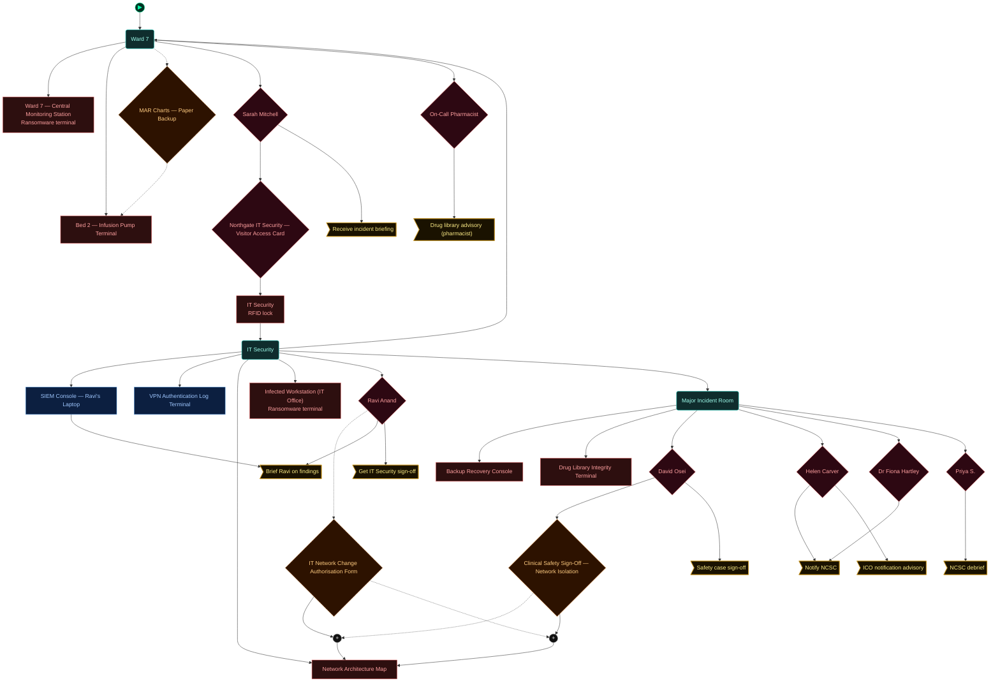
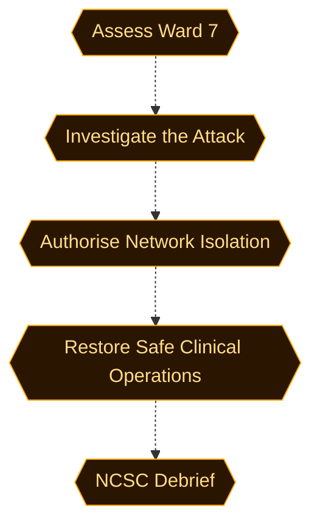
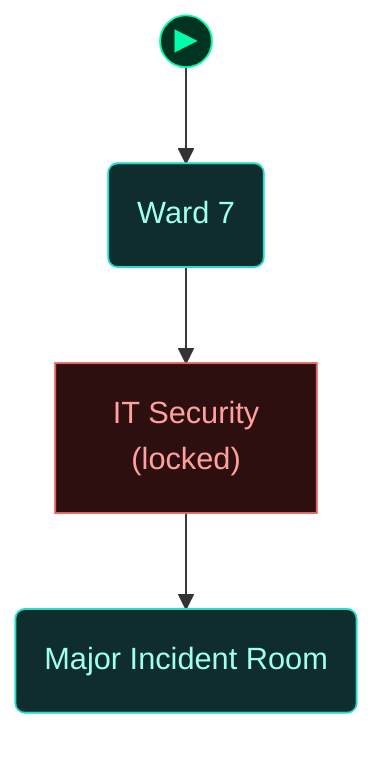

<!-- Auto-generated by scripts/generate_dungeon_graph.rb — do not edit by hand -->

# sis01_healthcare — Scenario Graph Reference

Day 2, 07:30. You have been called in to help manage a Major Incident at Northgate General Hospital NHS Trust. Ransomware deployed at 22:15 Monday night has encrypted workstations across the enterprise network — and reached part of the clinical zone. Ward 7 central monitoring has been offline since 22:30. The IT team has been awake all night. You are not here to investigate how it happened. You are here to manage what it means right now.

## Scenario Statistics

| Metric | Value |
|---|---|
| Story aims | 5 |
| Total tasks | 17 (3 optional) |
| VM flag challenges | 0 |
| Physical locks | 7 |
| AND-gate convergences | 2 |
| Rooms | 3 |
| Puzzle graph nodes / edges | 33 / 40 |
| Story graph nodes / edges | 5 / 4 |

## Critical Path

4 hops through story aims — minimum mandatory sequence to reach mission completion:

**Assess Ward 7 → Investigate the Attack → Authorise Network Isolation → Restore Safe Clinical Operations → NCSC Debrief**

## How to Read These Diagrams

| Shape | Colour | Meaning |
|---|---|---|
| Rounded rectangle | Teal | Room / physical area |
| Rectangle | Red | Lock, barrier, or interactive terminal |
| Diamond | Orange | Inventory item or credential |
| Diamond | Red/Pink | NPC or physical key |
| Diamond | Purple | VM flag (challenge completion token) |
| Rectangle | Blue | VM challenge |
| Ribbon | Amber | NPC conversation / action gate |
| Hexagon | Green | Story aim (objective) |
| Hexagon | Amber | Critical path node |
| Circle | Grey | AND gate (all inputs required) |
| Subroutine rect `[[…]]` | Green | Container (holds items) |
| Rounded rectangle | Amber | NPC in room (Rooms & Contents only) |

Edges: `-->` solid = hard dependency; `-.->` dashed = soft / narrative dependency or optional path.

The `▶` node marks the player's starting room.

## Puzzle Graph

Physical lock–key dependency chain. Shows which items, codes, and NPC interactions are required to open each lock, and which locks gate access to each room or object. Use this to trace solvability, spot circular dependencies, and check that every key is reachable before the lock that needs it.

## Story Aims

Narrative objective flow. Shows story aims and their unlock conditions. Critical path aims are highlighted in amber. Use this to check aim sequencing, identify gaps between objectives, and verify that the player always has a clear next goal.

## Story + Puzzle (Integrated)

Puzzle graph and story aims combined, with bridge edges connecting physical puzzle progress to story aim completion. Use this to verify that physical actions drive narrative progress and that no aim is left floating without a puzzle prerequisite.

```mermaid
flowchart TD

  classDef room      fill:#0f2d2d,stroke:#22ddcc,color:#a0ffee
  classDef lock      fill:#2d0f0f,stroke:#e66060,color:#ffa0a0
  classDef key       fill:#2d0812,stroke:#e66060,color:#ffa0a0
  classDef item      fill:#2d1200,stroke:#e89030,color:#ffcc80
  classDef gate      fill:#111,stroke:#666,color:#eee
  classDef vm        fill:#0c1f40,stroke:#4a90d9,color:#a0c8ff
  classDef flag      fill:#1a0c2d,stroke:#9060d0,color:#cc99ff
  classDef action    fill:#1a1200,stroke:#cc9922,color:#ffee88
  classDef aim       fill:#0d2a0d,stroke:#44cc44,color:#88ff88
  classDef aim_gate  fill:#111111,stroke:#44cc44,color:#44cc44
  classDef container fill:#1a2d1a,stroke:#60b060,color:#a0e0a0
  classDef npc       fill:#2d1f0d,stroke:#d0a050,color:#ffe0a0
  classDef critical  fill:#2a1500,stroke:#ffaa00,color:#ffdd88
  classDef start     fill:#003322,stroke:#00ffaa,color:#00ffaa

  node_start(("▶"))
  node_start --> ward_7

  door_it_security_office["IT Security<br/>RFID lock"]
  it_security_office("IT Security")
  ward_7("Ward 7")
  lock_ward_monitoring_station["Ward 7 — Central Monitoring Station<br/>Ransomware terminal"]
  lock_bed2_pump_terminal["Bed 2 — Infusion Pump Terminal"]
  mar_charts_paper_backup{"MAR Charts — Paper Backup"}
  npc_sarah_mitchell{"Sarah Mitchell"}
  northgate_it_security_visitor_access_card{"Northgate IT Security — Visitor Access Card"}
  action_talk_to_sarah>"Receive incident briefing"]
  npc_on_call_pharmacist{"On-Call Pharmacist"}
  action_warn_sarah>"Drug library advisory (pharmacist)"]
  siem_console_ravi_s_laptop["SIEM Console — Ravi's Laptop"]
  vpn_authentication_log_terminal["VPN Authentication Log Terminal"]
  lock_network_map_screen["Network Architecture Map"]
  lock_infected_workstation_it_office["Infected Workstation (IT Office)<br/>Ransomware terminal"]
  npc_ravi_anand{"Ravi Anand"}
  it_network_change_authorisation_form{"IT Network Change Authorisation Form"}
  action_brief_ravi>"Brief Ravi on findings"]
  action_ravi_signoff>"Get IT Security sign-off"]
  major_incident_room("Major Incident Room")
  lock_backup_console["Backup Recovery Console"]
  lock_drug_library_checker["Drug Library Integrity Terminal"]
  npc_david_osei{"David Osei"}
  clinical_safety_sign_off_network_isolation{"Clinical Safety Sign-Off — Network Isolation"}
  action_david_safety_case>"Safety case sign-off"]
  npc_helen_carver{"Helen Carver"}
  action_notify_ncsc>"Notify NCSC"]
  action_helen_ico_advisory>"ICO notification advisory"]
  npc_dr_fiona_hartley{"Dr Fiona Hartley"}
  npc_priya_s{"Priya S."}
  action_attend_debrief>"NCSC debrief"]
  andgate1((" + "))
  andgate2((" + "))
  aim_assess_ward{{"Assess Ward 7"}}
  aim_investigate_attack{{"Investigate the Attack"}}
  aim_authorise_isolation{{"Authorise Network Isolation"}}
  aim_restore_operations{{"Restore Safe Clinical Operations"}}
  aim_ncsc_debrief{{"NCSC Debrief"}}

  door_it_security_office --> it_security_office
  ward_7 --> lock_ward_monitoring_station
  ward_7 --> lock_bed2_pump_terminal
  ward_7 -.-> mar_charts_paper_backup
  mar_charts_paper_backup -.-> lock_bed2_pump_terminal
  ward_7 --> npc_sarah_mitchell
  npc_sarah_mitchell --> northgate_it_security_visitor_access_card
  northgate_it_security_visitor_access_card --> door_it_security_office
  npc_sarah_mitchell --> action_talk_to_sarah
  ward_7 --> npc_on_call_pharmacist
  npc_on_call_pharmacist --> action_warn_sarah
  it_security_office --> siem_console_ravi_s_laptop
  it_security_office --> vpn_authentication_log_terminal
  it_security_office --> lock_network_map_screen
  it_security_office --> lock_infected_workstation_it_office
  it_security_office --> npc_ravi_anand
  npc_ravi_anand -.-> it_network_change_authorisation_form
  npc_ravi_anand --> action_brief_ravi
  npc_ravi_anand --> action_ravi_signoff
  major_incident_room --> lock_backup_console
  major_incident_room --> lock_drug_library_checker
  major_incident_room --> npc_david_osei
  npc_david_osei --> clinical_safety_sign_off_network_isolation
  npc_david_osei --> action_david_safety_case
  major_incident_room --> npc_helen_carver
  npc_helen_carver --> action_notify_ncsc
  npc_helen_carver --> action_helen_ico_advisory
  major_incident_room --> npc_dr_fiona_hartley
  npc_dr_fiona_hartley --> action_notify_ncsc
  major_incident_room --> npc_priya_s
  npc_priya_s --> action_attend_debrief
  clinical_safety_sign_off_network_isolation -.-> andgate1
  andgate1 --> lock_network_map_screen
  it_network_change_authorisation_form --> andgate1
  it_network_change_authorisation_form -.-> andgate2
  andgate2 --> lock_network_map_screen
  clinical_safety_sign_off_network_isolation --> andgate2
  it_security_office --> ward_7
  it_security_office --> major_incident_room
  siem_console_ravi_s_laptop --> action_brief_ravi
  aim_assess_ward -.-> aim_investigate_attack
  aim_investigate_attack -.-> aim_authorise_isolation
  aim_authorise_isolation -.-> aim_restore_operations
  aim_restore_operations -.-> aim_ncsc_debrief
  action_talk_to_sarah -.-> aim_assess_ward
  action_warn_sarah -.-> aim_restore_operations
  action_brief_ravi -.-> aim_investigate_attack
  action_ravi_signoff -.-> aim_authorise_isolation
  action_david_safety_case -.-> aim_authorise_isolation
  action_notify_ncsc -.-> aim_restore_operations
  action_helen_ico_advisory -.-> aim_restore_operations
  action_attend_debrief -.-> aim_ncsc_debrief
  lock_bed2_pump_terminal -.-> aim_restore_operations
  lock_network_map_screen -.-> aim_authorise_isolation
  lock_backup_console -.-> aim_restore_operations
  lock_drug_library_checker -.-> aim_restore_operations

  class door_it_security_office,lock_ward_monitoring_station,lock_bed2_pump_terminal,lock_network_map_screen,lock_infected_workstation_it_office,lock_backup_console,lock_drug_library_checker lock
  class it_security_office,ward_7,major_incident_room room
  class mar_charts_paper_backup,it_network_change_authorisation_form,clinical_safety_sign_off_network_isolation item
  class npc_sarah_mitchell,northgate_it_security_visitor_access_card,npc_on_call_pharmacist,npc_ravi_anand,npc_david_osei,npc_helen_carver,npc_dr_fiona_hartley,npc_priya_s key
  class action_talk_to_sarah,action_warn_sarah,action_brief_ravi,action_ravi_signoff,action_david_safety_case,action_notify_ncsc,action_helen_ico_advisory,action_attend_debrief action
  class siem_console_ravi_s_laptop,vpn_authentication_log_terminal vm
  class andgate1,andgate2 gate
  class aim_assess_ward,aim_investigate_attack,aim_authorise_isolation,aim_restore_operations,aim_ncsc_debrief critical

  classDef optional stroke-dasharray:5 2
  class mar_charts_paper_backup,it_network_change_authorisation_form optional
  class node_start start
```

## Rooms

Physical room layout with all connections. Locked rooms are shown in red. Use this to check room reachability, identify dead-end rooms with no content, and understand the spatial structure of the scenario.

## Rooms & Contents

Physical room layout with all objects, containers, NPCs, and held items. Use this to check clue distribution across rooms, verify that hints are placed before the locks they solve, and spot rooms that are under- or over-loaded with content.

```mermaid
flowchart TD

  classDef room      fill:#0f2d2d,stroke:#22ddcc,color:#a0ffee
  classDef lock      fill:#2d0f0f,stroke:#e66060,color:#ffa0a0
  classDef key       fill:#2d0812,stroke:#e66060,color:#ffa0a0
  classDef item      fill:#2d1200,stroke:#e89030,color:#ffcc80
  classDef gate      fill:#111,stroke:#666,color:#eee
  classDef vm        fill:#0c1f40,stroke:#4a90d9,color:#a0c8ff
  classDef flag      fill:#1a0c2d,stroke:#9060d0,color:#cc99ff
  classDef action    fill:#1a1200,stroke:#cc9922,color:#ffee88
  classDef aim       fill:#0d2a0d,stroke:#44cc44,color:#88ff88
  classDef aim_gate  fill:#111111,stroke:#44cc44,color:#44cc44
  classDef container fill:#1a2d1a,stroke:#60b060,color:#a0e0a0
  classDef npc       fill:#2d1f0d,stroke:#d0a050,color:#ffe0a0
  classDef critical  fill:#2a1500,stroke:#ffaa00,color:#ffdd88
  classDef start     fill:#003322,stroke:#00ffaa,color:#00ffaa

  node_start(("▶"))
  node_start --> ward_7

  ward_7("Ward 7")
  it_security_office["IT Security<br/>(locked)"]
  major_incident_room("Major Incident Room")
  rc_ward_monitoring_station_1{"Ward 7 — Central Monitoring Station"}
  rc_bed2_pump_terminal_2{"Bed 2 — Infusion Pump Terminal"}
  rc_mar_charts_stack_3{"MAR Charts — Paper Backup"}
  rc_obj4_4{"Nursing Handover Notes"}
  rc_ward_desk_phone_5{"Ward 7 Desk Phone"}
  rc_ehr_terminal_6{"EHR Prescribing Terminal"}
  rc_bed1_vitals_7{"Bed 1 — Bedside Monitor"}
  rc_bed2_vitals_8{"Bed 2 — Bedside Monitor"}
  rc_bed3_monitor_9{"Bed 3 — Bedside Monitor"}
  rc_bed4_monitor_10{"Bed 4 — Bedside Monitor (Cardiac)"}
  rc_bed5_vitals_11{"Bed 5 — Bedside Monitor"}
  rc_bed6_vitals_12{"Bed 6 — Bedside Monitor"}
  rc_npc_sarah_mitchell_13("Sarah Mitchell")
  rc_obj14_14{"Northgate IT Security — Visitor Access Card"}
  rc_npc_staff_nurse_15("Staff Nurse")
  rc_npc_mr_t_ahmed_16("Mr T. Ahmed")
  rc_npc_ms_a_okafor_17("Ms A. Okafor")
  rc_npc_mrs_kowalski_18("Mrs Kowalski")
  rc_npc_on_call_pharmacist_19("On-Call Pharmacist")
  rc_siem_console_20{"SIEM Console — Ravi's Laptop"}
  rc_vpn_terminal_21{"VPN Authentication Log Terminal"}
  rc_network_map_screen_22{"Network Architecture Map"}
  rc_obj23_23{"Infected Workstation (IT Office)"}
  rc_obj24_24{"VPN Log Printout"}
  rc_obj25_25{"Incident Timeline (Draft)"}
  rc_npc_ravi_anand_26("Ravi Anand")
  rc_obj27_27{"IT Network Change Authorisation Form"}
  rc_command_board_28{"Major Incident Command Board"}
  rc_backup_console_29[["Backup Recovery Console"]]
  rc_obj30_30{"Backup Status Report"}
  rc_drug_library_checker_31{"Drug Library Integrity Terminal"}
  rc_pump_manufacturer_binder_32{"ALARIS GP — Manufacturer Safety Documentation"}
  rc_dual_auth_panel_33[["Network Isolation — Dual Authorisation Panel"]]
  rc_obj34_34{"Network Isolation Authorisation Slip"}
  rc_obj35_35{"Printed Ransom Note"}
  rc_obj36_36{"ICO Notification Deadline"}
  rc_obj37_37{"Safety Case Extract (CLAIM-HC-001, HC-003, HC-007)"}
  rc_obj38_38{"Vendor Remote Access Exception Register"}
  rc_obj39_39{"Internal Audit Follow-Up — Backup and Governance Gaps"}
  rc_npc_david_osei_40("David Osei")
  rc_obj41_41{"Clinical Safety Sign-Off — Network Isolation"}
  rc_npc_helen_carver_42("Helen Carver")
  rc_npc_dr_fiona_hartley_43("Dr Fiona Hartley")
  rc_npc_priya_s_44("Priya S.")

  ward_7 --> it_security_office
  it_security_office --> major_incident_room
  ward_7 --> rc_ward_monitoring_station_1
  ward_7 --> rc_bed2_pump_terminal_2
  ward_7 --> rc_mar_charts_stack_3
  ward_7 --> rc_obj4_4
  ward_7 --> rc_ward_desk_phone_5
  ward_7 --> rc_ehr_terminal_6
  ward_7 --> rc_bed1_vitals_7
  ward_7 --> rc_bed2_vitals_8
  ward_7 --> rc_bed3_monitor_9
  ward_7 --> rc_bed4_monitor_10
  ward_7 --> rc_bed5_vitals_11
  ward_7 --> rc_bed6_vitals_12
  ward_7 --> rc_npc_sarah_mitchell_13
  rc_npc_sarah_mitchell_13 --> rc_obj14_14
  ward_7 --> rc_npc_staff_nurse_15
  ward_7 --> rc_npc_mr_t_ahmed_16
  ward_7 --> rc_npc_ms_a_okafor_17
  ward_7 --> rc_npc_mrs_kowalski_18
  ward_7 --> rc_npc_on_call_pharmacist_19
  it_security_office --> rc_siem_console_20
  it_security_office --> rc_vpn_terminal_21
  it_security_office --> rc_network_map_screen_22
  it_security_office --> rc_obj23_23
  it_security_office --> rc_obj24_24
  it_security_office --> rc_obj25_25
  it_security_office --> rc_npc_ravi_anand_26
  rc_npc_ravi_anand_26 --> rc_obj27_27
  major_incident_room --> rc_command_board_28
  major_incident_room --> rc_backup_console_29
  rc_backup_console_29 --> rc_obj30_30
  major_incident_room --> rc_drug_library_checker_31
  major_incident_room --> rc_pump_manufacturer_binder_32
  major_incident_room --> rc_dual_auth_panel_33
  rc_dual_auth_panel_33 --> rc_obj34_34
  major_incident_room --> rc_obj35_35
  major_incident_room --> rc_obj36_36
  major_incident_room --> rc_obj37_37
  major_incident_room --> rc_obj38_38
  major_incident_room --> rc_obj39_39
  major_incident_room --> rc_npc_david_osei_40
  rc_npc_david_osei_40 --> rc_obj41_41
  major_incident_room --> rc_npc_helen_carver_42
  major_incident_room --> rc_npc_dr_fiona_hartley_43
  major_incident_room --> rc_npc_priya_s_44

  class ward_7,major_incident_room room
  class it_security_office lock
  class rc_ward_monitoring_station_1,rc_bed2_pump_terminal_2,rc_mar_charts_stack_3,rc_obj4_4,rc_ward_desk_phone_5,rc_ehr_terminal_6,rc_bed1_vitals_7,rc_bed2_vitals_8,rc_bed3_monitor_9,rc_bed4_monitor_10,rc_bed5_vitals_11,rc_bed6_vitals_12,rc_obj14_14,rc_siem_console_20,rc_vpn_terminal_21,rc_network_map_screen_22,rc_obj23_23,rc_obj24_24,rc_obj25_25,rc_obj27_27,rc_command_board_28,rc_obj30_30,rc_drug_library_checker_31,rc_pump_manufacturer_binder_32,rc_obj34_34,rc_obj35_35,rc_obj36_36,rc_obj37_37,rc_obj38_38,rc_obj39_39,rc_obj41_41 item
  class rc_npc_sarah_mitchell_13,rc_npc_staff_nurse_15,rc_npc_mr_t_ahmed_16,rc_npc_ms_a_okafor_17,rc_npc_mrs_kowalski_18,rc_npc_on_call_pharmacist_19,rc_npc_ravi_anand_26,rc_npc_david_osei_40,rc_npc_helen_carver_42,rc_npc_dr_fiona_hartley_43,rc_npc_priya_s_44 npc
  class rc_backup_console_29,rc_dual_auth_panel_33 container
  class node_start start
```

