# SIS01 Healthcare: Information Pack

This information pack contains comprehensive background information about the Northgate General Hospital scenario, including system architecture, regulatory frameworks, requirements, and incident details.

---

## File: ./assurance_cases/assurance_case_overview.md

# Security-Informed Safety Assurance Case — Northgate General Hospital

---

## Assurance Case Structure (Goal Structuring Notation)

The following diagram presents the top-level structure of the security-informed safety assurance case for Northgate General Hospital, using Goal Structuring Notation (GSN) concepts rendered in Mermaid. Node prefixes indicate GSN element types: **G** = Goal, **S** = Strategy, **C** = Claim (security-informed safety claim), **E** = Evidence, **Ctx** = Context, **R** = Residual Risk.

```mermaid
graph TD
    G1["<b>G1: Top-Level Goal</b><br/>Patient safety at Northgate General<br/>Hospital is not materially compromised<br/>as a result of a cyber attack<br/>on clinical ICT systems"]

    Ctx1["<b>Ctx1: Scope</b><br/>Northgate General Hospital<br/>clinical ICT environment as<br/>described in system architecture"]
    Ctx2["<b>Ctx2: Assumption</b><br/>Threat actors include financially<br/>motivated ransomware groups,<br/>supply-chain compromise, and<br/>negligent insiders"]

    G1 --- Ctx1
    G1 --- Ctx2

    S1["<b>S1: Strategy</b><br/>Argue over three sub-goals<br/>corresponding to the three<br/>security-to-safety pathways<br/>identified in hazard analysis"]

    G1 --> S1

    S1 --> G2["<b>G2: Sub-Goal 1</b><br/>Medical device integrity<br/>is maintained under all<br/>network conditions"]
    S1 --> G3["<b>G3: Sub-Goal 2</b><br/>Clinical data integrity and<br/>availability meets clinical<br/>safety requirements"]
    S1 --> G4["<b>G4: Sub-Goal 3</b><br/>Enterprise IT compromise<br/>does not propagate to<br/>safety-critical clinical systems"]

    %% Sub-Goal 1: Medical Device Integrity
    G2 --> C1["<b>C1: CLAIM-HC-003</b><br/>Drug library change control<br/>preserves dose safety"]
    G2 --> C4["<b>C4: CLAIM-HC-004</b><br/>Alarm config auditing<br/>maintains monitoring"]
    G2 --> C2["<b>C2: CLAIM-HC-002</b><br/>Firmware integrity prevents<br/>device manipulation"]

    C1 --> E1["<b>E1</b><br/>Drug library change audit<br/>trail + pharmacy sign-off"]
    C1 --> E2["<b>E2</b><br/>Automated version comparison<br/>deployed vs authorised"]
    C4 --> E3["<b>E3</b><br/>Daily alarm threshold<br/>audit reports"]
    C4 --> E4["<b>E4</b><br/>Automated deviation<br/>alert records"]
    C2 --> E5["<b>E5</b><br/>Manufacturer code signing<br/>attestation"]
    C2 --> E6["<b>E6</b><br/>Unsigned firmware<br/>rejection test results"]

    G2 --- R1["<b>R1: Residual Risk</b><br/>Zero-day exploit in device<br/>firmware bypasses signing<br/>(accepted — mitigated by<br/>network segmentation)"]

    %% Sub-Goal 2: Clinical Data Integrity
    G3 --> C8["<b>C8: CLAIM-HC-008</b><br/>PACS integrity controls<br/>prevent diagnostic error"]
    G3 --> C6["<b>C6: CLAIM-HC-006</b><br/>Immutable backups enable<br/>safety-preserving recovery"]
    G3 --> C10["<b>C10: CLAIM-HC-010</b><br/>Clinical fallback procedures<br/>maintain safe care"]

    C8 --> E7["<b>E7</b><br/>PACS integrity verification<br/>testing results"]
    C8 --> E8["<b>E8</b><br/>Metadata modification<br/>audit alert testing"]
    C6 --> E9["<b>E9</b><br/>Backup architecture<br/>documentation (immutability)"]
    C6 --> E10["<b>E10</b><br/>Quarterly restoration<br/>test results"]
    C10 --> E11["<b>E11</b><br/>Fallback procedure<br/>documentation + drill results"]

    G3 --- R2["<b>R2: Residual Risk</b><br/>Undetected data corruption<br/>in EHR prior to backup<br/>(accepted — mitigated by<br/>clinical data reconciliation)"]

    %% Sub-Goal 3: Enterprise Isolation
    G4 --> C1b["<b>C1b: CLAIM-HC-001</b><br/>Network segmentation<br/>protects device integrity"]
    G4 --> C5["<b>C5: CLAIM-HC-005</b><br/>Vendor access controls<br/>prevent supply-chain path"]
    G4 --> C7["<b>C7: CLAIM-HC-007</b><br/>Integrated incident response<br/>prevents containment-<br/>induced hazards"]

    C1b --> E12["<b>E12</b><br/>Firewall rule audit<br/>(no cross-zone exceptions)"]
    C1b --> E13["<b>E13</b><br/>Penetration test — enterprise<br/>to clinical zone blocked"]
    C5 --> E14["<b>E14</b><br/>Vendor access logs<br/>(scheduled windows only)"]
    C5 --> E15["<b>E15</b><br/>MFA enforcement records<br/>for vendor sessions"]
    C7 --> E16["<b>E16</b><br/>Joint IT/Clinical Engineering<br/>tabletop exercise reports"]
    C7 --> E17["<b>E17</b><br/>Incident response plan with<br/>clinical impact assessment"]

    G4 --- R3["<b>R3: Residual Risk</b><br/>Novel cross-zone attack<br/>bypasses firewall via<br/>application-layer exploit<br/>(accepted — mitigated by<br/>clinical zone monitoring)"]

    style G1 fill:#d4edda,stroke:#155724,color:#155724
    style G2 fill:#d4edda,stroke:#155724,color:#155724
    style G3 fill:#d4edda,stroke:#155724,color:#155724
    style G4 fill:#d4edda,stroke:#155724,color:#155724
    style S1 fill:#cce5ff,stroke:#004085,color:#004085
    style Ctx1 fill:#fff3cd,stroke:#856404,color:#856404
    style Ctx2 fill:#fff3cd,stroke:#856404,color:#856404
    style R1 fill:#f8d7da,stroke:#721c24,color:#721c24
    style R2 fill:#f8d7da,stroke:#721c24,color:#721c24
    style R3 fill:#f8d7da,stroke:#721c24,color:#721c24
```

---

## Narrative Explanation

### Structure of the Argument

The assurance case is structured around a single top-level safety goal (**G1**): that patient safety at Northgate General Hospital is not materially compromised as a result of a cyber attack on clinical ICT systems. This goal is deliberately scoped to cyber-originated safety hazards — it does not address all patient safety risks, only those arising from the intersection of cybersecurity and clinical system integrity.

The argument is decomposed through a single strategy (**S1**) into three sub-goals, each corresponding to a distinct pathway through which a cyber attack could lead to patient harm:

**Sub-Goal G2 (Medical Device Integrity)** addresses the most direct pathway — an attacker manipulating the behaviour of networked clinical devices. This covers the infusion pump drug library corruption, patient monitor alarm threshold manipulation, and firmware tampering scenarios described in Scenario 02. The supporting claims (CLAIM-HC-002, CLAIM-HC-003, CLAIM-HC-004) argue that specific security controls — firmware signing, drug library change monitoring, and alarm configuration auditing — maintain the integrity of device safety functions.

**Sub-Goal G3 (Clinical Data Integrity and Availability)** addresses the pathway through clinical information systems — corruption or loss of EHR data, PACS imaging, and prescribing information that leads to clinical decision errors. This covers the consequences of both the ransomware (Scenario 01) and integrity (Scenario 02) attacks on clinical data. The supporting claims (CLAIM-HC-006, CLAIM-HC-008, CLAIM-HC-010) argue that immutable backups, PACS integrity controls, and clinical fallback procedures ensure that clinicians can continue to deliver safe care even when electronic systems are compromised.

**Sub-Goal G4 (Enterprise Isolation)** addresses the architectural question — whether a compromise of the enterprise IT zone can reach safety-critical clinical systems. This is the "prevent propagation" argument, and it is the most critical sub-goal because it underpins the other two. If the enterprise-to-clinical boundary holds, the attack scenarios described in both Scenario 01 and Scenario 02 are significantly harder to execute. The supporting claims (CLAIM-HC-001, CLAIM-HC-005, CLAIM-HC-007) argue that network segmentation, vendor access controls, and integrated incident response prevent enterprise compromise from cascading to the clinical zone.

### Context and Assumptions

The assurance case operates within two explicit contextual elements:

**Ctx1 (Scope)** bounds the argument to the Northgate General Hospital clinical ICT environment as documented in the system architecture. This means the case addresses the specific systems, network topology, and device fleet described — not a generic hospital environment.

**Ctx2 (Threat Assumption)** specifies the threat actors considered: financially motivated ransomware groups (the DarkVault profile), supply-chain compromise via medical device vendor access, and negligent insiders (the Craig Ellison profile). The assurance case does not claim to address all possible threat actors — notably, it does not specifically argue against a determined nation-state actor with zero-day capabilities, though several of the controls (segmentation, firmware integrity, alarm auditing) would provide defence in depth.

### Evidence Nodes

Each claim is supported by specific evidence nodes that correspond to verifiable artefacts: audit reports, test results, documentation, and exercise records. The evidence nodes are not aspirational — they describe artefacts that the Trust must produce and maintain to support the assurance case. The distinction between a claim and its evidence is important: the claim is the logical argument ("if this control is maintained, then this safety property holds"), while the evidence demonstrates that the control is, in fact, maintained.

### Residual Risks

Three residual risks are explicitly identified:

**R1 (Zero-day firmware exploit)**: A vulnerability in medical device firmware that is unknown to the manufacturer and therefore not addressed by code signing could allow an attacker to deploy malicious firmware that passes integrity checks. This risk is accepted because it is mitigated by network segmentation (making it difficult for an attacker to reach the device in the first place) and because the alternative — not using networked medical devices — is not clinically feasible.

**R2 (Undetected data corruption)**: If the EHR database is subtly corrupted before the last clean backup is taken, restoring from backup will restore corrupted data. This risk is accepted because it is mitigated by clinical data reconciliation processes (comparing restored data against paper records and pharmacy dispensing logs) and because the probability of subtle, undetected corruption (as opposed to obvious ransomware encryption) is lower.

**R3 (Novel cross-zone attack)**: A sophisticated attacker may discover an application-layer exploit that bypasses the firewall separating enterprise and clinical zones — for example, an exploit in the EHR-to-device-management data flow that abuses a permitted cross-zone communication channel. This risk is accepted because it is mitigated by clinical zone monitoring (REQ-HC-SEC-019) and because completely eliminating cross-zone data flows would break clinical workflows.

### The Patching Constraint Problem

A fundamental tension runs through this assurance case: the conflict between cybersecurity best practice and safety assurance for medical devices. Cybersecurity demands that known vulnerabilities be patched promptly. Safety assurance demands that changes to safety-certified software be validated before deployment, a process governed by IEC 62304 that can take weeks or months.

This creates a structural conflict. An infusion pump with a known cybersecurity vulnerability cannot be patched immediately because the patch might affect the pump's safety-critical dosing function. Yet leaving the vulnerability unpatched exposes the pump to the very cyber threats that the assurance case seeks to address.

The assurance case manages this conflict through a layered defence strategy: network segmentation (G4) reduces the probability of an attacker reaching the vulnerable device; firmware integrity verification (C2) prevents unauthorised modifications; drug library change monitoring (C1) detects tampering with the most safety-critical configuration; and vendor access controls (C5) secure the legitimate update pathway. None of these controls individually resolves the patching paradox, but their combination provides a defensible argument that patient safety is maintained during the vulnerability window — provided the controls are demonstrably in place and effective.

### Limitations

This assurance case is a teaching artefact, not a production safety case. A real-world security-informed safety case would require:

- Formal hazard analysis using ISO 14971 risk management process
- Quantified risk assessment with defined tolerability criteria
- Manufacturer participation in claims about device-level controls
- Periodic review and update as the threat landscape evolves
- Independent assessment and challenge by a qualified assessor
- Integration with the Trust's broader clinical risk management framework

The assurance case also does not address the human factors dimension — the impact of cyber incidents on clinical staff workload, stress, and decision-making quality, all of which affect patient safety during a crisis.

## File: ./assurance_cases/cae_evidence_catalogue.md

# Evidence Catalogue — Northgate General Hospital Security-Informed Safety Case

This catalogue lists every evidence node referenced in the detailed CAE case ([detailed_cae_case.md](detailed_cae_case.md)). Evidence nodes are numbered sequentially (E1–E25) and grouped by the claim they primarily support. Some evidence nodes support multiple claims.

---

## Medical Device Integrity Evidence (Sub-Goal G2)

---

### E1: Drug Library Change Audit Trail + Pharmacy Sign-Off

- **Type**: Operational
- **Supports**: CLAIM-HC-003 (Drug library change control preserves dose safety)
- **Description**: Automated log of all drug library modifications on the infusion pump fleet management console, including timestamp, user identity, parameter changed, old value, new value. Each change requires countersignature from a registered pharmacist before deployment to the pump fleet. The audit trail is stored in a database on the fleet management console and is retained for a minimum of 12 months.
- **Collection Method**: Automated extraction from fleet management console audit database; pharmacist sign-off recorded in hospital pharmacy system. Monthly summary reports generated for joint review by Clinical Engineering and Pharmacy.
- **Recurrence**: Continuous (every change logged); monthly summary reports reviewed by Clinical Engineering and Pharmacy.
- **Confidence**: Medium — automated and tamper-evident under normal operation. However, Scenario 02 (Step 9) demonstrates that an attacker with workstation-level access can modify the audit log directly. Dual-authority pharmacy sign-off provides an independent check that operates outside the fleet management console.
- **Dependencies**: Requires fleet management console to be operational and network-accessible. If console is offline (as in Scenario 01), audit trail is unavailable until restored. Paper-based fallback audit exists but is lower confidence.
- **Traceability**: REQ-HC-SEC-020, REQ-HC-SAF-001, REQ-HC-SAF-002
- **Scenario Relevance**: In Scenario 02 (Step 5), the attacker modifies drug library maximum dose limits. In Step 9, the attacker clears the audit trail to cover tracks. This evidence would detect the change if the audit system is functioning and the attacker has not tampered with it. The pharmacy sign-off mechanism provides an independent detection layer that the attacker would need to separately compromise.

---

### E2: Automated Version Comparison — Deployed vs. Authorised Drug Library

- **Type**: Operational
- **Supports**: CLAIM-HC-003 (Drug library change control preserves dose safety)
- **Description**: An automated tool that compares the drug library version hash currently deployed on each infusion pump against the pharmacist-approved master version. The comparison uses cryptographic hash matching (SHA-256) to detect any modification to the drug library content, regardless of whether the change was recorded in the audit trail. Discrepancies generate an immediate alert to pharmacy governance and clinical engineering.
- **Collection Method**: Automated comparison triggered on each drug library deployment event. Additionally runs as a scheduled background check every four hours, querying each pump's current drug library hash via the fleet management API.
- **Recurrence**: Event-triggered plus four-hourly scheduled comparison.
- **Confidence**: High — automated, hash-based comparison that is independent of the fleet management console audit trail. Would detect the Scenario 02 manipulation if the comparison runs before the corrupted library propagates to all pumps. The four-hour interval represents the maximum undetected exposure window.
- **Dependencies**: Requires fleet management console to be operational for scheduled checks. Event-triggered comparison requires the deployment event to be routed through the comparison tool (bypass is possible if the attacker deploys the drug library via a mechanism that does not trigger the event).
- **Traceability**: REQ-HC-SEC-020, REQ-HC-SAF-001, REQ-HC-SAF-002
- **Scenario Relevance**: This is the primary detective control against the Scenario 02 drug library manipulation (Step 5). The attacker's drug library modification would be detected at the next scheduled comparison (within 4 hours maximum) as a hash mismatch, even though the audit trail was subsequently cleared (Step 9).

---

### E3: Daily Alarm Configuration Audit Reports

- **Type**: Operational
- **Supports**: CLAIM-HC-004 (Alarm configuration auditing maintains monitoring effectiveness)
- **Description**: Automated script executed daily at 06:00 that queries alarm threshold settings from each connected patient monitor via the ward central station. Settings are compared against the clinical governance-approved default profile for the relevant ward type (medical ward, surgical ward, critical care unit). The report lists any monitor whose alarm thresholds deviate from the approved profile, including the specific parameter, expected value, and current value.
- **Collection Method**: Automated query via the patient monitoring central station management interface; results logged as a structured report and distributed to the ward manager and clinical engineering team lead via secure email.
- **Recurrence**: Daily automated audit at 06:00; results reviewed by the ward manager during morning handover.
- **Confidence**: High — automated, comprehensive (covers all connected monitors), independently verifiable against the clinical governance committee's approved alarm profile document. Does not depend on individual clinician awareness.
- **Dependencies**: Requires the patient monitoring central station to be operational. If the central station is encrypted (Scenario 01) or the attacker has compromised the audit script (more sophisticated variant of Scenario 02), the daily audit would not execute.
- **Traceability**: REQ-HC-SEC-021, REQ-HC-SAF-003, REQ-HC-SAF-004
- **Scenario Relevance**: In Scenario 02 (Step 6), the attacker modifies alarm thresholds on the central station. If the modification occurs after the 06:00 daily audit, it would not be detected until the following day's audit — a window of approximately 24 hours. If the modification occurs before the audit, it would be detected in the morning report.

---

### E4: Automated Deviation Alert Records

- **Type**: Operational
- **Supports**: CLAIM-HC-004 (Alarm configuration auditing maintains monitoring effectiveness)
- **Description**: Records of alerts generated when any patient monitor alarm threshold deviates from the approved default profile by more than the defined tolerance (±10% for heart rate limits, ±5% for SpO2 limits, ±2°C for temperature limits). Each alert includes the monitor identifier, ward, parameter, expected value, actual value, timestamp, and severity classification. Alerts are generated in near-real-time by the central station's monitoring module.
- **Collection Method**: Automated alerting from the central station audit module; alerts forwarded simultaneously to the ward manager (pager/mobile notification) and clinical engineering (email + dashboard).
- **Recurrence**: Continuous (triggered on detection of any deviation); monthly trend report reviewed by Clinical Governance Committee.
- **Confidence**: Medium — effective when the central station is operational, but the alerting mechanism depends on the central station software running correctly. If the central station is compromised or offline, deviation alerts are not generated. The defined tolerances may not catch small, incremental threshold changes that individually fall within tolerance but cumulatively move the threshold to a dangerous value.
- **Dependencies**: Central station must be operational and connected to the monitors. Alert delivery depends on the paging and email infrastructure.
- **Traceability**: REQ-HC-SEC-021, REQ-HC-SAF-003, REQ-HC-SAF-004
- **Scenario Relevance**: In Scenario 02, the attacker raises the heart rate alarm from 130 to 200 bpm (53% increase) and lowers SpO2 from 90% to 75% (17% decrease). Both changes exceed the defined tolerances and would trigger deviation alerts if the central station's audit module is operational. The attack in Scenario 02 may circumvent this by compromising the central station directly.

---

### E5: Manufacturer Code Signing Attestation

- **Type**: Design
- **Supports**: CLAIM-HC-002 (Firmware integrity prevents device manipulation)
- **Description**: Written attestation from the infusion pump manufacturer confirming that all firmware images are cryptographically signed using RSA-2048 during the secure build process. The signing key is stored in a FIPS 140-2 Level 3 hardware security module (HSM) at the manufacturer's secure development facility. The attestation covers the firmware signing workflow, key management procedures, and the device-side verification process.
- **Collection Method**: Obtained from the manufacturer during the procurement process as part of the supply chain security assessment (REQ-HC-SEC-027). Renewal requested annually as part of the maintenance contract review.
- **Recurrence**: Annual attestation renewal; updated following any change to the manufacturer's signing process or key infrastructure.
- **Confidence**: Medium — the attestation is a manufacturer self-declaration. The Trust does not independently audit the manufacturer's HSM, build pipeline, or key management process. Confidence would increase to High if an independent third-party audit of the manufacturer's signing infrastructure were provided.
- **Dependencies**: Depends on the manufacturer's continued compliance with their own stated processes. A change of manufacturer ownership, build infrastructure, or key management practices would invalidate the attestation until renewed.
- **Traceability**: REQ-HC-SEC-017, REQ-HC-SAF-011
- **Scenario Relevance**: In Scenario 02 (Step 8), the attacker pushes modified firmware to pumps. The firmware update mechanism described in Scenario 02 does not verify code signatures — this evidence describes the target state in which such verification is in place.

---

### E6: Unsigned Firmware Rejection Test Results

- **Type**: Test
- **Supports**: CLAIM-HC-002 (Firmware integrity prevents device manipulation)
- **Description**: Results of controlled testing in which three categories of firmware images were pushed to representative infusion pump units via the fleet management console: (a) unsigned firmware images (no signature attached), (b) tampered firmware images (valid signature preserved but binary content modified post-signing), and (c) firmware signed with an expired or revoked certificate. In all three cases, the devices rejected the update and logged the rejection event with an appropriate error code. The test also verified that the fleet management console prevents unsigned images from being staged for deployment.
- **Collection Method**: Conducted by the clinical engineering team in a dedicated non-production test environment, using manufacturer-provided test images and Trust-generated tampered images. Manufacturer technical support participated in test design and witnessed results.
- **Recurrence**: Annually, and following any firmware update or device hardware revision that changes the signature verification mechanism.
- **Confidence**: High — independently conducted by Trust staff with manufacturer observation; covers multiple rejection scenarios; documented and repeatable; conducted in a controlled environment that mirrors the production configuration.
- **Dependencies**: Test environment must accurately reflect the production fleet management console and pump firmware configuration. Test images must cover the relevant attack scenarios.
- **Traceability**: REQ-HC-SEC-017, REQ-HC-SAF-011
- **Scenario Relevance**: Directly tests the control that would prevent Scenario 02 (Step 8) — the deployment of backdoored firmware. If this control is in place and functioning, the attacker's modified firmware would be rejected by the pumps.

---

### E19: Firmware Version Register and Discrepancy Alerting

- **Type**: Operational
- **Supports**: CLAIM-HC-002 (Firmware integrity prevents device manipulation)
- **Description**: The fleet management console maintains an asset register of expected firmware versions for each pump in the fleet, correlated with the manufacturer's current release and the clinical engineering approved version. A daily automated comparison identifies devices reporting firmware versions that differ from the expected baseline. Discrepancies generate alerts to the clinical engineering team lead, classified by severity: minor (version behind by one patch), major (version not in the approved version list), critical (version not recognised by the manufacturer's release catalogue).
- **Collection Method**: Automated report generated by the fleet management console's asset management module. Critical-severity discrepancies generate immediate alerts; other severities are included in the daily report.
- **Recurrence**: Daily automated check; weekly summary reviewed by clinical engineering during scheduled device fleet review meetings.
- **Confidence**: Medium — effective when the fleet management console is operational. The register depends on pumps accurately reporting their firmware version, which could be subverted by a sufficiently sophisticated firmware backdoor that reports the expected version while running modified code. Paper-based fallback firmware audit (manual checksum comparison at the device) exists but is conducted only quarterly.
- **Dependencies**: Requires fleet management console to be operational and network-connected to all pumps. A pump that is disconnected from the network (e.g., in transit or in a faulty state) would not be checked.
- **Traceability**: REQ-HC-SEC-017, REQ-HC-SEC-020, REQ-HC-SAF-011
- **Scenario Relevance**: In Scenario 02 (Step 8), the attacker pushes modified firmware to 10 pumps. If the modified firmware reports a version identifier not in the approved list, the discrepancy alerting would detect it in the next daily check. However, a sophisticated attacker could instruct the backdoored firmware to report the legitimate version identifier, evading this detection mechanism.

---

## Clinical Data Integrity and Availability Evidence (Sub-Goal G3)

---

### E7: PACS Integrity Verification Testing Results

- **Type**: Test
- **Supports**: CLAIM-HC-008 (PACS integrity controls prevent diagnostic error)
- **Description**: Results of structured testing of the PACS integrity verification mechanism, conducted in a non-production test environment with synthetic patient data. Tests covered three categories: (a) modification of patient identifier fields in stored DICOM headers — detection confirmed with immediate audit alert; (b) modification of study-level metadata (examination date, modality type, body part) — detection confirmed; (c) substitution of image pixel data from a different study — detection confirmed for whole-image substitution through embedded hash comparison, partial detection for localised pixel modification (6 of 10 test modifications detected; 4 subtle modifications in low-contrast tissue regions evaded detection).
- **Collection Method**: Conducted by clinical engineering with radiology department participation, using test images in a non-production PACS environment. Test cases designed with input from a clinical radiologist to ensure realistic modification scenarios.
- **Recurrence**: Annually, and following any PACS software upgrade or infrastructure change.
- **Confidence**: Medium — header-level integrity protection is well-tested and effective; pixel-level integrity protection has known limitations for subtle modifications in low-contrast regions. The 60% detection rate for localised pixel modification represents a genuine gap that cannot be fully addressed with current PACS technology.
- **Dependencies**: Test results are specific to the current PACS software version and configuration. A software upgrade that changes the integrity verification mechanism would require re-testing.
- **Traceability**: REQ-HC-SAF-007
- **Scenario Relevance**: In Scenario 02 (Step 7), the attacker modifies PACS metadata (patient identifier swaps) and image content (obscuring a pulmonary nodule). The metadata modifications would be detected by this integrity mechanism. The image content modification (obscuring a nodule) falls into the category of localised pixel modification with partial detection — this evidence identifies the residual gap.

---

### E8: Metadata Modification Audit Alert Testing

- **Type**: Test
- **Supports**: CLAIM-HC-008 (PACS integrity controls prevent diagnostic error)
- **Description**: Results of testing the alert workflow triggered when DICOM metadata is modified post-commit to the PACS archive. Tests verified: (a) that alerts are generated within 5 minutes of the modification; (b) that alerts are delivered to the radiology department lead and PACS administrator via both email and dashboard notification; (c) that the modified image is flagged in the clinical viewer with a visible integrity warning overlay (amber border with "INTEGRITY ALERT — VERIFY PATIENT IDENTITY" text); (d) that the image cannot be used for clinical reporting until a radiologist acknowledges the alert and confirms or rejects the modification.
- **Collection Method**: Simulated metadata modification in non-production PACS environment; alert delivery timing, content, and clinical viewer behaviour observed and documented. Tested with three radiologist users to verify workflow impact.
- **Recurrence**: Annually.
- **Confidence**: High — alert delivery mechanism is automated and independently verifiable; clinical viewer flagging is a visible, mandatory indicator that cannot be dismissed without explicit clinician action. The workflow interruption (requiring radiologist acknowledgement) provides a hard stop against accidental use of integrity-compromised images.
- **Dependencies**: Alert delivery depends on email infrastructure and PACS dashboard being operational. If both are unavailable (during a wider system outage), alerts would be queued but not delivered until services are restored.
- **Traceability**: REQ-HC-SAF-007
- **Scenario Relevance**: In Scenario 02 (Step 7), the attacker swaps patient identifiers on CT images. This alert mechanism would detect the metadata modification and flag the affected images in the clinical viewer, preventing the wrong-patient diagnostic error described in Step 11 (assuming the PACS integrity system is operational).

---

### E9: Backup Architecture Documentation (Immutability)

- **Type**: Design
- **Supports**: CLAIM-HC-006 (Immutable backups enable safety-preserving recovery)
- **Description**: Technical documentation of the Trust's three-tier backup architecture: (1) on-site NAS with daily snapshots — provides rapid recovery for routine data loss but is vulnerable to network-based encryption (as demonstrated in Scenario 01, Step 7); (2) on-site tape library with weekly full backups — provides media diversity but the controller is network-accessible (also compromised in Scenario 01); (3) off-site immutable cloud storage with WORM (Write Once Read Many) retention policies, separate IAM credentials not accessible from the enterprise Active Directory domain, and 90-day minimum mandatory retention period. The off-site cloud storage uses a separate authentication domain with its own MFA enforcement, and WORM policies are enforced by the cloud storage provider at the infrastructure level — even the storage administrator cannot delete objects within the retention period.
- **Collection Method**: Maintained by the infrastructure team as a controlled document; reviewed and updated quarterly. Architecture independently verified by the information security team during the annual DSPT submission preparation.
- **Recurrence**: Quarterly review; updated following any change to the backup infrastructure.
- **Confidence**: High — the architecture is documented, the immutability mechanism is enforced by a third-party cloud provider (not dependent on Trust-controlled infrastructure), and the separate authentication domain prevents an attacker who compromises the enterprise Active Directory from accessing the off-site backups.
- **Dependencies**: Depends on the cloud storage provider maintaining the WORM enforcement mechanism and the availability of the cloud storage service during a recovery scenario.
- **Traceability**: REQ-HC-SEC-012, REQ-HC-SAF-010, REQ-HC-SAF-012
- **Scenario Relevance**: In Scenario 01 (Step 7), the attacker encrypts the on-site NAS and wipes the tape library controller. The third tier (off-site immutable cloud storage) would survive this attack, enabling recovery of EHR, PACS, and device management data.

---

### E10: Quarterly Restoration Test Results

- **Type**: Test
- **Supports**: CLAIM-HC-006 (Immutable backups enable safety-preserving recovery)
- **Description**: Results of quarterly restoration exercises in which the EHR, PACS, and device management console are restored from the off-site immutable backup to an isolated test environment. Each exercise measures three dimensions: (a) restoration time compared against the defined Recovery Time Objective (RTO): EHR — 8 hours, PACS — 12 hours, device management — 6 hours; (b) data integrity verification through hash comparison of restored databases against backup checksums; (c) functional verification by clinical users (a clinician confirms that patient records, imaging, and device configurations are accessible and correct in the restored environment).
- **Collection Method**: Structured exercise conducted by the infrastructure team with participation from clinical engineering, a representative clinician, and a pharmacist. Exercise report approved by the information security manager.
- **Recurrence**: Quarterly.
- **Confidence**: High — independently conducted, covers the full restoration workflow from off-site immutable storage, and includes functional verification by clinical users who are not members of the IT team. Most recent exercise achieved RTO for all three systems and passed data integrity verification with zero discrepancies.
- **Dependencies**: Requires an isolated test environment with sufficient compute and storage resources to restore production-scale systems. Test environment must be isolated from the production network to prevent cross-contamination.
- **Traceability**: REQ-HC-SEC-013, REQ-HC-SAF-010, REQ-HC-SAF-012
- **Scenario Relevance**: Demonstrates that the Trust can recover from the data loss caused by Scenario 01 (Steps 7, 9) within clinically acceptable timeframes, provided the off-site immutable backups are intact.

---

### E11: Fallback Procedure Documentation + Drill Results

- **Type**: Process
- **Supports**: CLAIM-HC-010 (Clinical fallback procedures maintain safe care during outage)
- **Description**: Comprehensive clinical fallback procedure documentation maintained in every ward and clinical area, stored in clearly marked red folders ("Clinical Fallback — Cyber Incident") at the nursing station. The documentation includes: paper-based prescribing templates with mandatory double-check fields, manual infusion pump programming checklists (step-by-step with dose verification prompts), bedside observation charts (NEWS2 scoring), emergency drug dosing reference cards (adult and paediatric), manual allergy verification procedure (requiring verbal verification with patient and pharmacy cross-check), and a transition checklist for returning to electronic systems after restoration.

    Biannual drill results document: staff participation rates (most recent: 78% of ward-based clinical staff), error rates during paper-based prescribing (most recent: 3 simulated dosing discrepancies in 47 simulated prescriptions, all caught by the double-check process), time-to-transition from electronic to manual workflows (most recent: average 22 minutes per ward), and a clinical safety assessment by the drill facilitator.
- **Collection Method**: Procedures authored by the clinical governance team in collaboration with pharmacy, nursing, and clinical engineering. Drills planned and facilitated by the clinical education team using a structured exercise scenario. Results assessed by a multidisciplinary panel including clinical governance lead, pharmacy lead, and information security manager.
- **Recurrence**: Procedures reviewed annually and updated following any system change. Drills conducted biannually (every six months). Post-drill improvement actions tracked by the clinical governance team.
- **Confidence**: Medium — procedure documentation is comprehensive and physically accessible (no electronic system dependency). Drill results consistently show that staff unfamiliar with paper processes make more errors during the transition period. The 78% participation rate indicates that approximately one in five clinical staff has not participated in a recent drill. The 6.4% simulated error rate during paper prescribing (3/47) — though all errors were caught by the built-in double-check — confirms that manual processes are inherently less safe than electronic prescribing with automated guardrails.
- **Dependencies**: Fallback folders must be kept current (annual review). Paper supplies (prescription pads, observation charts) must be maintained in stock. Staff turnover requires ongoing training beyond the biannual drill cycle.
- **Traceability**: REQ-HC-SEC-023, REQ-HC-SAF-008, REQ-HC-SAF-010
- **Scenario Relevance**: Directly relevant to Scenario 01 (Steps 11–13), where the loss of the EHR, fleet management console, and patient monitoring central station forces clinicians to operate on paper-based processes. The medication dosing transcription error in Step 12 is precisely the type of error that the fallback procedure double-check process is designed to catch.

---

## Enterprise-to-Clinical Isolation Evidence (Sub-Goal G4)

---

### E12: Firewall Rule Audit (No Cross-Zone Exceptions)

- **Type**: Design
- **Supports**: CLAIM-HC-001 (Network segmentation protects device integrity)
- **Description**: Results of a comprehensive audit of the internal firewall rule set separating the enterprise IT zone from the clinical/medical device zone. The audit confirms: (a) all legacy exception rules permitting bidirectional access for dual-homed clinical workstations have been removed; (b) the rule set implements an explicit allow-list policy with only three permitted cross-zone data flows — EHR-to-device-management prescription data (outbound, TCP port 5545, application-layer filtered), DICOM image transfer from clinical modalities to PACS (outbound, ports 104/11112, DICOM protocol validation), and SIEM log forwarding from clinical zone to enterprise SIEM (outbound, TLS-encrypted syslog); (c) all other traffic between zones is denied and logged; (d) the firewall is configured to generate alerts for any rule modification, with alerts sent to both the network team and the information security team.
- **Collection Method**: Conducted quarterly by a qualified firewall administrator. The rule set is exported and compared against the approved baseline (maintained as a version-controlled document). A second administrator independently verifies the comparison results. The audit report is signed by both administrators.
- **Recurrence**: Quarterly audit with dual-administrator verification. Continuous change monitoring between audits (real-time alerts for any rule modification).
- **Confidence**: High — dual-verified audit provides strong assurance; continuous change monitoring prevents undetected configuration drift between quarterly audits. The combination of periodic comprehensive audit and continuous change alerting provides both depth and timeliness.
- **Dependencies**: Change monitoring alerts depend on the firewall's alerting function and the email/SIEM infrastructure. If the SIEM is compromised (potentially during a wide-scale attack), change alerts may not be received.
- **Traceability**: REQ-HC-SEC-007, REQ-HC-SEC-008, REQ-HC-SAF-001, REQ-HC-SAF-009
- **Scenario Relevance**: The incomplete segmentation and legacy exception rules that enabled Scenario 01 (Step 8) are precisely what this evidence demonstrates have been remediated. In the post-incident target state, the dual-homed workstation attack vector used by DarkVault would be blocked by the firewall.

---

### E13: Penetration Test — Enterprise to Clinical Zone Blocked

- **Type**: Test
- **Supports**: CLAIM-HC-001 (Network segmentation protects device integrity)
- **Description**: Results of an independent penetration test conducted by a CREST-accredited third-party firm, scoped to assess all enterprise-to-clinical zone traversal vectors. The test included: (a) direct network probing through the firewall from the enterprise zone — 427 ports tested, all blocked with no responses from clinical zone hosts; (b) exploitation of the three permitted cross-zone data flows — each flow tested for injection, tunnelling, and protocol abuse: two informational findings noted (EHR-to-device data flow permits packets up to 64KB, which is larger than typical clinical messages; DICOM flow permits association negotiation without client certificate), neither exploitable to achieve code execution or lateral movement; (c) scanning for residual dual-homed workstations — ARP sweep and multi-interface detection confirmed zero dual-homed devices on the network; (d) attempted pivoting through clinical zone via application-layer attacks — no traversal achieved.
- **Collection Method**: Commissioned by the Trust's information security manager; conducted by an external CREST-accredited penetration testing firm with healthcare sector experience. Testing conducted over a one-week period with clinical engineering coordination to avoid patient impact.
- **Recurrence**: Annually; additionally triggered following any significant network architecture change (e.g., new cross-zone data flow, firewall hardware replacement, VLAN restructuring).
- **Confidence**: High — independently conducted by a qualified, accredited third party with no conflicts of interest. Comprehensive scope covering both network-layer and application-layer vectors. Two informational findings demonstrate thoroughness (findings below exploitability threshold were still reported).
- **Dependencies**: Test results are point-in-time. Ongoing assurance between annual tests depends on the firewall rule audit (E12) and continuous change monitoring.
- **Traceability**: REQ-HC-SEC-007, REQ-HC-SEC-008, REQ-HC-SEC-014, REQ-HC-SAF-001
- **Scenario Relevance**: Directly validates the countermeasure for Scenario 01 (Step 8). The penetration test confirms that the enterprise-to-clinical traversal vector used by DarkVault (via dual-homed workstations and legacy firewall exceptions) is no longer viable in the remediated architecture.

---

### E14: Vendor Access Logs (Scheduled Windows Only)

- **Type**: Operational
- **Supports**: CLAIM-HC-005 (Vendor access controls prevent supply-chain attack path)
- **Description**: Audit logs from the vendor remote-access gateway demonstrating that all vendor VPN sessions over the review period were activated within scheduled maintenance windows only. Each log entry captures: session start and end timestamps, source IP address, vendor engineer identity (individual named account, not a shared credential), devices accessed during the session, actions performed (categorised as firmware update, configuration change, diagnostic activity, or routine check), and the associated maintenance work order reference number. Monthly review confirms zero out-of-window sessions and zero sessions from unrecognised IP addresses.
- **Collection Method**: Automated extraction from the vendor VPN gateway; monthly summary compiled by clinical engineering and reviewed jointly with the information security team. Any anomalous session (unrecognised IP, out-of-window timing, device access outside work order scope) triggers an immediate investigation.
- **Recurrence**: Continuous logging; monthly review; immediate alerting for anomalies.
- **Confidence**: High — automated, comprehensive, and the move from shared credentials to individual named accounts (post-incident remediation) enables attribution of vendor activity to specific engineers. Monthly review by both clinical engineering and information security provides dual oversight.
- **Dependencies**: Depends on the vendor VPN gateway generating complete and accurate logs. Gateway logs are forwarded to the Trust's SIEM for independent retention (not reliant on the gateway's own storage).
- **Traceability**: REQ-HC-SEC-018, REQ-HC-SAF-001, REQ-HC-SAF-009
- **Scenario Relevance**: In Scenario 02 (Step 1), the attacker uses compromised vendor VPN credentials — a shared credential active 24/7. This evidence describes the remediated state: individual credentials, MFA, scheduled-window activation, and monitoring. The Scenario 02 attack vector would generate multiple anomaly alerts (unrecognised IP, out-of-window session, shared credential rejected).

---

### E15: MFA Enforcement Records for Vendor Sessions

- **Type**: Operational
- **Supports**: CLAIM-HC-005 (Vendor access controls prevent supply-chain attack path)
- **Description**: Records from the vendor VPN gateway's authentication system confirming that all vendor sessions were authenticated with multi-factor authentication. Each record includes: vendor engineer identity, first factor (password), second factor type (hardware TOTP token — vendor-issued), authentication result, and session identifier. Records confirm that no sessions were established using single-factor authentication during the review period.
- **Collection Method**: Automated extraction from VPN gateway authentication logs; monthly compliance summary generated.
- **Recurrence**: Continuous; monthly compliance summary reviewed by information security team.
- **Confidence**: High — MFA enforcement is a system-level configuration on the VPN gateway. The gateway rejects connection attempts that do not provide a valid second factor, regardless of the correctness of the password. This enforcement cannot be bypassed by the vendor engineer without cooperation from the gateway administrator.
- **Dependencies**: MFA enforcement depends on the VPN gateway configuration remaining unchanged. Configuration changes to the gateway are subject to change management and would be detected by the firewall rule audit process.
- **Traceability**: REQ-HC-SEC-018, REQ-HC-SAF-001
- **Scenario Relevance**: Directly addresses the Scenario 02 (Step 1) attack vector. The compromised vendor credentials (password only) used in Scenario 02 would be rejected by the MFA-enforced gateway, as the attacker would not possess the vendor engineer's hardware TOTP token.

---

### E16: Joint IT/Clinical Engineering Tabletop Exercise Reports

- **Type**: Process
- **Supports**: CLAIM-HC-007 (Integrated incident response prevents containment-induced safety hazards)
- **Description**: Reports from biannual tabletop exercises in which representatives from IT Security (information security manager + one analyst), Clinical Engineering (clinical engineering manager + one biomedical technician), and clinical leadership (a ward sister, a pharmacist, and a consultant physician) rehearse responding to simulated cyber incidents affecting clinical systems. Each exercise presents a scenario derived from Scenarios 01 and 02 with injected decision points (e.g., "the enterprise-clinical network link must be severed — what clinical systems will be affected, and what are your compensating actions?"). Reports document: decisions made at each decision point, clinical impact assessments performed, time-to-decision metrics (target: containment decision within 30 minutes of declaration with clinical impact assessment complete), dissenting views, and identified improvement actions. An independent observer from the Trust's risk management team assesses the exercise and provides a written assessment.
- **Collection Method**: Facilitated by the Trust's risk management team using a structured exercise scenario and injects. Observed by an independent assessor (not a member of the response team).
- **Recurrence**: Biannually (every six months); schedule aligned with incident response plan annual review cycle.
- **Confidence**: Medium — exercises demonstrate capability and identify process gaps, but tabletop exercises are inherently less realistic than live exercises (participants have time to think, reference documents, and discuss options — conditions not available during a genuine crisis). Staff turnover means that some decision-makers participating in a real incident may not have attended a recent exercise.
- **Dependencies**: Effective exercises require participation from senior decision-makers (CIO, clinical engineering manager, clinical lead). Scheduling constraints at a busy hospital mean that full attendance at every exercise is not always achieved.
- **Traceability**: REQ-HC-SEC-022, REQ-HC-SAF-009, REQ-HC-SAF-010
- **Scenario Relevance**: The Scenario 01 decision point at Day 2 (whether to sever the enterprise-clinical network link) is the primary scenario used in these exercises. The exercise process is designed to prevent a repeat of the ad hoc decision-making described in the Northgate incident narrative (Day 2 afternoon).

---

### E17: Incident Response Plan with Clinical Impact Assessment

- **Type**: Process
- **Supports**: CLAIM-HC-007 (Integrated incident response prevents containment-induced safety hazards)
- **Description**: The Trust's integrated cyber incident response plan, maintained as a controlled document (version-controlled, with change history). The plan integrates IT security response procedures with clinical safety assessment procedures. Key sections include: (a) clinical impact assessment checklist — a structured form completed before any containment action that may affect clinical systems, documenting which clinical services will be impacted, which patient safety controls will be degraded, and what compensating clinical actions will be taken; (b) pre-defined decision trees for common containment scenarios — full clinical zone isolation, selective ward isolation, vendor access termination, EHR shutdown; (c) communication templates for clinical staff notification — pre-drafted messages for each containment scenario, adapted at the time of use; (d) escalation matrix showing when the joint IT/Clinical Engineering governance committee must be convened; (e) post-incident clinical review procedure — structured process for assessing whether any patient safety events occurred as a result of the incident or the containment actions.
- **Collection Method**: Authored by the information security manager with structured input from clinical engineering, pharmacy, nursing leadership, and clinical governance. Reviewed and formally approved by the joint IT/Clinical Engineering governance committee (REQ-HC-SEC-024).
- **Recurrence**: Plan reviewed annually; updated following any incident, exercise (E16), or significant system change. Version history maintained to enable audit trail of changes.
- **Confidence**: Medium — the plan is comprehensive, well-structured, and reflects input from all relevant stakeholders. Its real-world effectiveness has not been tested in a live incident (the Northgate scenario occurred before this plan existed, and the plan represents the post-incident remediation). The closest analogue to live testing is the biannual tabletop exercise (E16).
- **Dependencies**: Plan effectiveness depends on (a) decision-makers being aware of the plan and knowing where to find it (printed copies maintained in the incident response pack, independent of electronic systems), (b) decision-makers following the plan under crisis conditions rather than reverting to ad hoc decision-making, and (c) the plan being current (reflecting the actual system architecture, not an outdated version).
- **Traceability**: REQ-HC-SEC-022, REQ-HC-SAF-009, REQ-HC-SAF-010
- **Scenario Relevance**: This plan is the direct remediation for the Northgate incident (Day 2 afternoon), where the decision to sever the enterprise-clinical network link was made without a structured framework for evaluating clinical safety consequences.

---

## Cross-Cutting Evidence (Patching Constraint)

---

### E22: Clinical Monitoring Protocol for Interim-Patched Devices

- **Type**: Process
- **Supports**: Patching Strategy A (Patch Immediately)
- **Description**: A documented clinical protocol specifying enhanced monitoring requirements for medical devices running firmware patches that have not yet completed IEC 62304 safety re-validation. The protocol includes: increased bedside observation frequency (every 15 minutes instead of the standard hourly for patients receiving medication via an interim-patched pump), mandatory independent dose verification by a second clinician for every dose delivered by an interim-patched device, and a treatment response monitoring checklist to detect any subtle anomalies in device behaviour. The protocol also specifies escalation procedures if any device anomaly is observed, including immediate reversion to the pre-patch firmware if the anomaly affects a safety-critical function.
- **Collection Method**: Protocol authored by pharmacy, clinical engineering, and nursing leadership; approved by the clinical governance committee and the joint IT/Clinical Engineering governance committee.
- **Recurrence**: Maintained as a standing protocol; activated on each occasion that Strategy A is adopted. Reviewed annually regardless of usage.
- **Confidence**: Medium — the protocol is well-defined but its effectiveness depends on staff compliance with enhanced monitoring requirements during a period that is already likely to be operationally stressful (the patching event is triggered by a vulnerability, which may be concurrent with an active threat).
- **Dependencies**: Sufficient clinical staffing to implement enhanced monitoring. If the ward is already short-staffed, the 15-minute observation requirement may not be achievable.
- **Traceability**: REQ-HC-SAF-001, REQ-HC-SAF-002, REQ-HC-SAF-014
- **Scenario Relevance**: Would apply if a critical vulnerability were discovered in the infusion pump firmware and the Trust elected to deploy the patch before completing full IEC 62304 safety re-validation.

---

### E23: Manufacturer Interim Safety Guidance

- **Type**: Design
- **Supports**: Patching Strategy A (Patch Immediately)
- **Description**: Manufacturer-provided guidance document accompanying each security patch, describing: the scope of the code change, the safety-critical functions potentially affected, the results of the manufacturer's preliminary safety testing (which may be less comprehensive than full IEC 62304 re-validation), and any known interactions with safety-critical device parameters. This guidance enables the Trust's clinical engineering team and clinical governance committee to make an informed decision about whether to adopt Strategy A (immediate patching with compensating clinical controls) or Strategy B (deferral pending full re-validation).
- **Collection Method**: Provided by the manufacturer as part of the patch release package. Contractually required under REQ-HC-SEC-026.
- **Recurrence**: Provided with each security patch release.
- **Confidence**: Medium — depends on the manufacturer's willingness and ability to provide this guidance promptly. Some manufacturers may provide minimal guidance or delay providing it, reducing the Trust's ability to make a timely informed decision.
- **Dependencies**: Manufacturer cooperation. If the manufacturer does not provide interim safety guidance (or provides inadequate guidance), Strategy A proceeds with higher uncertainty, making Strategy B the preferred default.
- **Traceability**: REQ-HC-SEC-026, REQ-HC-SAF-011
- **Scenario Relevance**: Not directly invoked in either Scenario 01 or 02, but represents a critical input to the ongoing management of the patching constraint that underlies the entire assurance case.

---

### E24: Enhanced Isolation Configuration During Deferral

- **Type**: Design
- **Supports**: Patching Strategy B (Defer Patch)
- **Description**: Firewall rule modification records showing additional restrictions applied to the clinical zone boundary during a vulnerability deferral window. Restrictions include: disabling the EHR-to-device-management data flow (replacing it with a manual, air-gapped transfer process for prescription data), restricting DICOM transfers to a queue-and-review pattern (images transferred but held for integrity verification before clinical use), and disabling all vendor remote access to the clinical zone. These restrictions reduce the clinical zone's connectivity to the minimum required for device operation, limiting the attack surface available to exploit the known vulnerability.
- **Collection Method**: Firewall rule change records maintained under the standard change management process. Clinical impact assessment completed before isolation enhancement is applied (using the incident response plan clinical impact assessment checklist, E17).
- **Recurrence**: Applied during each vulnerability deferral window; reverted when the validated patch is deployed.
- **Confidence**: Medium — the enhanced isolation reduces the attack surface but does not eliminate it entirely (a vulnerability may be exploitable through a remaining permitted data flow or through physical access). The clinical impact of the enhanced restrictions (e.g., manual prescription transfer instead of automated) introduces operational friction and potential for errors.
- **Dependencies**: Requires clinical willingness to accept the operational impact of enhanced isolation (degraded electronic workflows) during the deferral window.
- **Traceability**: REQ-HC-SEC-007, REQ-HC-SEC-014, REQ-HC-SAF-009
- **Scenario Relevance**: Represents the compensating control that would be applied if a critical vulnerability were disclosed in infusion pump firmware and the Trust elected to defer patching until full IEC 62304 re-validation was complete.

---

### E25: Vulnerability-Specific Monitoring Rules

- **Type**: Operational
- **Supports**: Patching Strategy B (Defer Patch)
- **Description**: IDS/IPS signatures and SIEM correlation rules deployed specifically to detect exploitation attempts for a disclosed vulnerability during the deferral window. When a critical vulnerability is disclosed and patching is deferred, the information security team obtains or develops detection signatures (from the manufacturer's security advisory, NCSC advisories, or open-source threat intelligence) and deploys them to the clinical zone monitoring infrastructure. These rules generate high-priority alerts for any network activity matching known exploitation patterns, enabling rapid containment if an exploitation attempt is detected.
- **Collection Method**: Signatures obtained from manufacturer security advisory, NCSC, or developed in-house based on vulnerability technical details. Deployed to clinical zone IDS/IPS and SIEM. Alert triage SLA: 15 minutes for critical-severity alerts during a deferral window.
- **Recurrence**: Deployed for each vulnerability deferral; maintained until the validated patch is deployed and confirmed across the fleet.
- **Confidence**: Medium — detection rules are effective against known exploitation techniques for the disclosed vulnerability, but may not detect novel exploitation methods. Zero-day variants of the vulnerability (exploiting the same underlying flaw via a different technique) may evade the specific detection rules.
- **Dependencies**: Requires timely availability of exploitation signatures or sufficient technical detail in the vulnerability disclosure to develop custom rules. Also requires the clinical zone monitoring infrastructure (REQ-HC-SEC-019) to be deployed and operational.
- **Traceability**: REQ-HC-SEC-009, REQ-HC-SEC-019, REQ-HC-SEC-030
- **Scenario Relevance**: Would provide early warning of exploitation attempts during a vulnerability deferral window, enabling the Trust to escalate from Strategy B (defer) to Strategy A (emergency patch) if active exploitation is detected.

---

### E20: Device Authentication Testing

- **Type**: Test
- **Supports**: CLAIM-HC-009 (Device authentication prevents unauthorised command execution)
- **Description**: Results of controlled testing in which configuration commands were sent to representative infusion pumps and patient monitors from unauthorised sources. Three test categories were executed: (a) commands sent from a workstation not registered in the fleet management application's allow list — all commands rejected with "unauthorised source" error logged on the device; (b) raw HL7 and proprietary protocol commands crafted using protocol analysis tools and sent directly on the clinical VLAN from a non-registered network address — all commands rejected; (c) commands sent from a registered workstation but using an incorrect or expired authentication token — all commands rejected. Testing also verified that successful commands (from authenticated, registered sources) are fully logged including the source workstation identity and user session identifier.
- **Collection Method**: Conducted by clinical engineering in a dedicated test environment, with manufacturer technical support participating in test design. Test cases included both positive (legitimate commands accepted) and negative (illegitimate commands rejected) scenarios.
- **Recurrence**: Annually, and following any device firmware update or management console upgrade.
- **Confidence**: Medium — tests comprehensively cover the documented authentication mechanisms but cannot guarantee the absence of undocumented command interfaces, vendor debugging modes, or backdoor access channels that might accept commands without authentication. Pre-deployment security assessment (REQ-HC-SEC-027) addresses this partially but cannot verify proprietary firmware exhaustively.
- **Dependencies**: Test environment must accurately mirror production configuration. Test results are firmware-version-specific.
- **Traceability**: REQ-HC-SEC-016, REQ-HC-SAF-001, REQ-HC-SAF-004
- **Scenario Relevance**: Tests the countermeasure that would prevent Scenario 02 (Steps 3–5), where the attacker sends commands from a compromised clinical workstation. However, Scenario 02 succeeds because the attacker uses the legitimate service account credentials — device authentication verifies the credentials, not the human behind them, making this control necessary but not solely sufficient.

---

### E21: Clinical Workstation Access Control Verification

- **Type**: Operational
- **Supports**: CLAIM-HC-009 (Device authentication prevents unauthorised command execution)
- **Description**: Quarterly verification that clinical workstations registered for device management access are correctly configured with role-based access controls. The audit checks: (a) that the management console's registered workstation list matches the approved clinical asset register (no unauthorised workstations added); (b) that each registered workstation has RBAC configured with appropriate role assignments (nurse, pharmacist, clinical engineer, administrator); (c) that no generic or shared user accounts exist on the clinical workstations (post-incident remediation replaced all shared accounts with individual named accounts); (d) that the fleet management service account is configured for application-only use (cannot be used for interactive login).
- **Collection Method**: Manual audit conducted by clinical engineering, comparing the management console's configuration against the approved asset register and RBAC policy. Results documented and reviewed by the information security manager.
- **Recurrence**: Quarterly.
- **Confidence**: Medium — point-in-time verification that provides assurance at the time of the audit but does not monitor for changes between audits. An unauthorised workstation added to the allow list between quarterly audits would not be detected until the next audit (maximum 90-day window). Continuous monitoring of the allow list would increase confidence.
- **Dependencies**: Requires the approved asset register and RBAC policy to be current and accurate.
- **Traceability**: REQ-HC-SEC-016, REQ-HC-SEC-004
- **Scenario Relevance**: Addresses the access control environment in which Scenario 02 operates. The move from shared credentials to individual named accounts and the restriction of the service account to application-only use are direct remediations for the Scenario 02 attack vector (Step 4 — harvesting the shared service account credential).

## File: ./assurance_cases/detailed_cae_case.md

# Detailed Security-Informed Safety Case — Northgate General Hospital (CAE)

---

## 1. Introduction and Scope

### Top-Level Safety Goal

This security-informed safety case argues that **patient safety at Northgate General Hospital is not materially compromised as a result of a cyber attack on clinical ICT systems** (Goal G1). The scope boundary encompasses the Northgate General Hospital clinical ICT environment as defined in the system architecture: the enterprise IT zone hosting EHR, email, Active Directory, and administrative systems; the clinical/medical device zone housing 480 infusion pumps, 320 patient monitors, 60 ventilators, PACS imaging, and associated management consoles; the external zone including internet connectivity, NHS HSCN, and vendor remote-access connections; and the legacy flat segment comprising three inpatient wards not yet migrated to the dedicated clinical VLAN.

### Threat Context

The threat actors considered in this assurance case are:

- **DarkVault** — a financially motivated ransomware-as-a-service group operating a double-extortion model. DarkVault affiliates target healthcare organisations because of their low tolerance for downtime. Their attack tooling includes custom loaders, commodity RATs, and a proprietary ransomware encryptor. Their lateral movement techniques are indiscriminate — any reachable host is a target for encryption.
- **Supply-chain compromise via medical device vendor access** — the infusion pump manufacturer maintains a persistent VPN connection to the clinical zone for firmware updates and remote troubleshooting. Compromise of the vendor's credentials provides direct network access to the clinical device zone, bypassing the enterprise perimeter entirely.
- **Negligent insider (Craig Ellison)** — a contract network engineer whose poor credential hygiene (password reuse, sharing VPN credentials) directly contributed to the attack surface that DarkVault exploited.

### CAE Framework

This document uses the **Claims, Arguments, Evidence (CAE)** framework to structure the safety case:

- **Claims** are security-informed safety propositions — statements of the form "if security control X is maintained, then safety property Y holds."
- **Arguments** are structured reasoning that connects a claim to its supporting evidence, using explicit reasoning patterns that explain *why* the evidence is sufficient to support the claim.
- **Evidence** is the artefact, test result, observation, or record that substantiates an argument.

### Scope Boundaries

This assurance case addresses **cyber-originated safety hazards only**. It does not address equipment failure from non-cyber causes (mechanical wear, power supply failure), clinical error unrelated to cyber compromise (human factors in routine care), natural disaster or physical security breach, patient safety hazards arising from data confidentiality breach alone (where the harm is privacy-related rather than clinical). The case is bounded by the two attack scenarios documented in the information pack: Scenario 01 (ransomware propagation leading to clinical device availability loss) and Scenario 02 (device integrity compromise through manipulation of networked clinical devices).

---

## 2. CAE Methodology

### Claim Derivation

The ten security-informed safety claims (CLAIM-HC-001 through CLAIM-HC-010) are drawn from the requirements analysis and bridge the cybersecurity requirements (REQ-HC-SEC-001 through REQ-HC-SEC-030) and the functional safety requirements (REQ-HC-SAF-001 through REQ-HC-SAF-014). Each claim takes the form: "Provided that security control X is maintained, safety property Y holds."

### Argument Patterns

Arguments are developed using four structured reasoning patterns:

1. **Direct evidence argument**: "Evidence E demonstrates that control C is effective; therefore the claim holds." Used where a single control directly addresses the hazard.
2. **Defence-in-depth argument**: "Even if control C1 fails, controls C2 and C3 provide independent protection; therefore the claim holds under single-point failure." Used where safety depends on layered controls.
3. **Compensating control argument**: "Primary control C is not fully effective (gap G exists), but compensating control CC reduces risk to a tolerable level." Used where known limitations exist.
4. **Operational continuity argument**: "Evidence shows control C remains effective during degraded conditions (network outage, failover, manual mode)." Used where the safety argument must hold during the very conditions a cyber attack creates.

### Evidence Categorisation

Evidence is categorised into four types:

| Type | Description | Examples |
|------|-------------|---------|
| **Design** | Architecture, configuration, and design artefacts | Network architecture diagrams, firewall rule sets, firmware signing specifications |
| **Test** | Results from structured testing activities | Penetration test reports, functional test results, restoration drills |
| **Operational** | Outputs from ongoing monitoring and audit | Audit logs, SIEM alerts, configuration drift reports |
| **Process** | Documentation of procedures, training, and governance | Incident response plans, training records, governance meeting minutes |

### Confidence Assessment

Confidence is assessed per evidence node using a three-level qualitative scale:

- **High**: Evidence is independently collected, regularly refreshed, and covers the full scope of the claim.
- **Medium**: Evidence is collected internally, refreshed periodically, or covers most but not all scenarios.
- **Low**: Evidence is infrequent, self-assessed, or has known gaps in coverage.

### Defeaters

Defeaters — conditions under which a claim would not hold — are explicitly identified for every claim. Each defeater is assessed as mitigated, partially mitigated, or accepted as residual risk.

---

## 3. Top-Level Goal and Decomposition Strategy

### GSN Structure

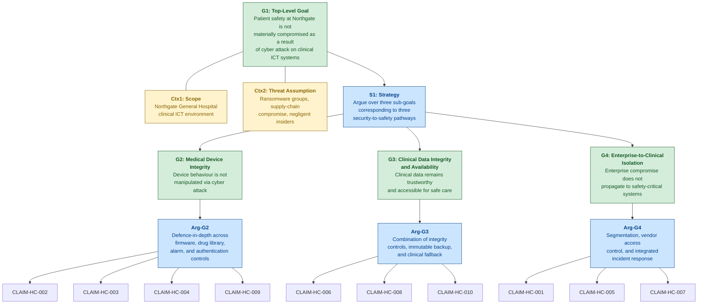

### Decomposition Rationale

The three sub-goals correspond to the three pathways through which a cyber attack can lead to patient harm, as identified in the scenario hazard analysis:

1. **G2 — Medical Device Integrity**: A cyber attacker manipulates device behaviour directly — corrupting drug libraries, altering alarm thresholds, deploying backdoored firmware, or sending unauthorised commands. This is the pathway described in Scenario 02 (Steps 5–8, 10–12).
2. **G3 — Clinical Data Integrity and Availability**: A cyber attack corrupts or removes access to clinical information systems — EHR, PACS, prescribing data — leading to clinical decisions based on unreliable or absent information. This is the pathway described in both Scenario 01 (Steps 9–12) and Scenario 02 (Step 7).
3. **G4 — Enterprise-to-Clinical Isolation**: An attacker who compromises the enterprise IT zone is able to reach the clinical device zone. This is the enabling pathway for both Scenarios 01 and 02, described in Scenario 01 (Steps 8–10) and Scenario 02 (Step 1).

These three pathways are not fully independent — G4 (isolation) is a prerequisite defence for both G2 and G3. If enterprise-to-clinical isolation holds, the attack surface for device manipulation and data corruption is substantially reduced. The decomposition therefore exhibits a layered structure where G4 acts as a perimeter argument, while G2 and G3 provide depth arguments for the case where the perimeter is breached.

---

## 4. Sub-Goal G2: Medical Device Integrity — Full CAE Decomposition

### A. Sub-Goal Statement and Context

**Sub-Goal G2**: Medical device integrity is maintained under all network conditions — the behaviour of infusion pumps, patient monitors, and ventilators is not manipulated through cyber attack.

This sub-goal addresses Scenario 02 (device integrity compromise) directly and Scenario 01 (ransomware) indirectly (where loss of management console availability degrades device safety functions). The sub-goal is argued under the assumption that the clinical device zone may be reached by an attacker who has bypassed the enterprise-to-clinical boundary (either through incomplete segmentation, dual-homed workstations, or compromised vendor access).

---

### B. CLAIM-HC-002: Firmware Integrity Prevents Device Manipulation

#### Claim Rationale

CLAIM-HC-002 is necessary because firmware manipulation is the most persistent and dangerous form of medical device compromise. In Scenario 02 (Step 8), the attacker pushes backdoored firmware to a subset of infusion pumps via the fleet management console. The modified firmware includes a remote command execution backdoor that persists across device reboots. If CLAIM-HC-002 were false — if firmware integrity verification were absent — an attacker with access to the clinical network could permanently compromise any medical device, turning it into a remotely controllable instrument capable of delivering incorrect doses, suppressing alarms, or reporting falsified physiological data. The safety hazard is REQ-HC-SAF-011: firmware integrity verification is a foundational requirement for all networked medical devices.

#### Argument

**Argument pattern: Defence-in-depth**

The argument for CLAIM-HC-002 proceeds in two layers. The primary layer is a direct evidence argument: the infusion pump manufacturer implements cryptographic code signing for all firmware images. Each firmware update is signed with the manufacturer's private key during the build process, and the device verifies the signature against a stored public key before accepting the update. Evidence E5 (manufacturer attestation) and E6 (rejection test results) demonstrate that this control is implemented and effective — unsigned or modified firmware images are rejected by the device.

The secondary layer provides depth against scenarios where the primary control is insufficient. Even if an attacker bypassed code signing (through a zero-day vulnerability in the verification implementation, or through compromise of the manufacturer's signing key), two additional controls limit the impact. First, the fleet management console maintains an authorised firmware version register (Evidence E19), enabling automated detection of version discrepancies across the pump fleet. A device reporting an unexpected firmware version would trigger an alert to clinical engineering. Second, network segmentation (argued under G4) limits the attacker's ability to reach devices in the first place — the firmware attack requires prior access to the clinical zone, which is independently defended. This defence-in-depth structure ensures that the claim holds under single-point failure of the code signing mechanism.

The argument does not claim absolute protection against all firmware attacks. A sophisticated supply-chain attack that compromises the manufacturer's signing infrastructure would bypass both the device-level verification and the version register (since the compromised firmware would carry a valid signature). This scenario is identified as Defeater D1.

#### Evidence Nodes

**E5: Manufacturer Code Signing Attestation**
- **Type**: Design
- **Description**: Written attestation from the infusion pump manufacturer confirming that all firmware images are cryptographically signed using RSA-2048 during the secure build process, with the signing key stored in a hardware security module (HSM).
- **Collection method**: Obtained from manufacturer during procurement; renewed annually or upon request.
- **Recurrence**: Annual attestation renewal; updated following any change to the signing process.
- **Confidence**: Medium — manufacturer self-attestation; not independently audited by the Trust.
- **Traceability**: REQ-HC-SEC-017, REQ-HC-SAF-011

**E6: Unsigned Firmware Rejection Test Results**
- **Type**: Test
- **Description**: Results of controlled testing in which unsigned, tampered, and expired-signature firmware images were pushed to representative infusion pump units via the fleet management console. All three categories were rejected by the device with appropriate error logging.
- **Collection method**: Conducted by clinical engineering team using manufacturer-provided test images in a non-production environment.
- **Recurrence**: Annually, and following any firmware update or device hardware revision.
- **Confidence**: High — independently conducted by Trust staff; covers multiple failure scenarios; documented and repeatable.
- **Traceability**: REQ-HC-SEC-017, REQ-HC-SAF-011

**E19: Firmware Version Register and Discrepancy Alerting**
- **Type**: Operational
- **Description**: The fleet management console maintains an asset register of expected firmware versions for each pump. A daily automated comparison identifies devices reporting versions that differ from the expected baseline and generates alerts to clinical engineering.
- **Collection method**: Automated report generated by fleet management console.
- **Recurrence**: Daily automated check; weekly summary review by clinical engineering.
- **Confidence**: Medium — depends on fleet management console availability (which may be compromised in Scenario 01). Paper-based fallback firmware audit exists but is quarterly.
- **Traceability**: REQ-HC-SEC-017, REQ-HC-SEC-020, REQ-HC-SAF-011

#### Defeaters

**D1: Supply-chain compromise of manufacturer signing key**. If an attacker compromises the manufacturer's firmware signing infrastructure (the HSM or the build pipeline), they could produce firmware that carries a valid cryptographic signature but contains malicious code. This would bypass both the device-level verification (E5/E6) and the version register (E19, since the update would be presented as a legitimate version). **Status**: Partially mitigated. Supply chain security assessment (REQ-HC-SEC-027) and manufacturer cooperation requirements (REQ-HC-SEC-026) reduce but do not eliminate this risk. Accepted as contributing to residual risk R1.

**D2: Zero-day vulnerability in firmware verification implementation**. A flaw in the device's signature verification code could allow a crafted firmware image to pass verification despite not carrying a valid signature. **Status**: Partially mitigated. Network segmentation (CLAIM-HC-001) limits the attacker's ability to reach the device; firmware version register (E19) provides a secondary detection mechanism. Accepted as contributing to residual risk R1.

#### Mermaid Diagram

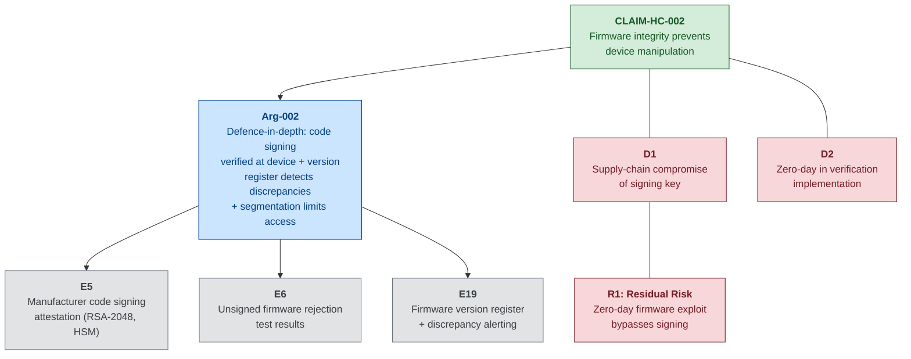

---

### B. CLAIM-HC-003: Drug Library Change Control Preserves Dose Safety

#### Claim Rationale

CLAIM-HC-003 addresses the most safety-critical data element on a networked infusion pump: the drug library. The drug library defines maximum and minimum dose rates, concentrations, and hard dosing limits for each medication. It is the automated equivalent of a pharmacist standing at the bedside verifying every dose. In Scenario 02 (Step 5), the attacker modifies drug library entries — increasing the morphine maximum rate from 4 mg/hr to 40 mg/hr, altering heparin concentration, and removing a chemotherapy hard limit. In Step 10, this modification directly causes a ten-fold morphine overdose. If CLAIM-HC-003 were false, any attacker with access to the fleet management console could silently remove the guardrails that protect patients from dosing errors.

#### Argument

**Argument pattern: Direct evidence + Operational continuity**

The argument for CLAIM-HC-003 relies on two complementary mechanisms. First, a direct evidence argument: every drug library change is recorded in an automated audit trail on the fleet management console (Evidence E1), which logs the timestamp, user identity, parameter changed, old value, and new value. Each library modification requires countersignature from a registered pharmacist before deployment to the pump fleet (Evidence E1). An automated comparison tool verifies the deployed drug library version against the pharmacist-approved authorised version (Evidence E2), detecting any discrepancy.

Second, an operational continuity argument addresses the scenario where the fleet management console itself is compromised. If the console is encrypted (Scenario 01) or its audit logs are tampered with (Scenario 02, Step 9), the primary audit mechanism is unavailable. The compensating control is the pharmacy governance process: the hospital pharmacy independently maintains the authorised drug library as a standalone record. Any pump reporting a drug library version that has not been approved through pharmacy governance is flagged during manual ward rounds. Additionally, infusion pumps retain the ability to enforce hard dose limits from their locally stored last-known-good drug library even if the fleet management console is offline — provided the local library has not been directly corrupted.

The argument acknowledges a critical gap: in Scenario 02, the attacker modifies the drug library database directly via harvested service account credentials, then clears the audit trail. The change appears to be a legitimate "drug library update" from the management console's perspective. Detection therefore depends on the automated version comparison tool (E2) running before the corrupted library is deployed to pumps, or on manual pharmacy verification during ward rounds.

#### Evidence Nodes

**E1: Drug Library Change Audit Trail + Pharmacy Sign-Off**
- **Type**: Operational
- **Description**: Automated log of all drug library modifications on the infusion pump fleet management console, including timestamp, user identity, parameter changed, old value, and new value. Each change requires countersignature from a registered pharmacist before deployment to the pump fleet.
- **Collection method**: Automated extraction from fleet management console audit database; pharmacist sign-off recorded in hospital pharmacy system.
- **Recurrence**: Continuous (every change logged); monthly summary reports reviewed by Clinical Engineering and Pharmacy.
- **Confidence**: Medium — automated and tamper-evident under normal operation, but Scenario 02 (Step 9) demonstrates that the audit log can be modified by an attacker with workstation-level access. Dual-authority (pharmacy sign-off) provides an independent check.
- **Traceability**: REQ-HC-SEC-020, REQ-HC-SAF-001, REQ-HC-SAF-002

**E2: Automated Version Comparison — Deployed vs. Authorised**
- **Type**: Operational
- **Description**: An automated tool that compares the drug library version hash currently deployed on each pump against the pharmacist-approved master version. Discrepancies generate an immediate alert to pharmacy governance and clinical engineering.
- **Collection method**: Automated comparison triggered on each library deployment event and as a scheduled background check every four hours.
- **Recurrence**: Event-triggered plus four-hourly scheduled comparison.
- **Confidence**: High — automated, hash-based comparison; independent of the fleet management console audit trail. Would detect the Scenario 02 manipulation if running before the corrupted library propagates.
- **Traceability**: REQ-HC-SEC-020, REQ-HC-SAF-001, REQ-HC-SAF-002

#### Defeaters

**D3: Attacker modifies drug library database directly, bypassing audit trail (Scenario 02, Steps 5 and 9)**. The attacker uses harvested service account credentials to modify the database and clears the audit log. **Status**: Partially mitigated. The automated version comparison tool (E2) provides an independent detection mechanism, and pharmacy governance maintains an offline canonical version. However, there is a time window between the modification and the next scheduled comparison during which the corrupted library could be deployed. Residual risk accepted.

**D4: Fleet management console unavailable (Scenario 01)**. If the console is encrypted by ransomware, both the audit trail (E1) and the automated comparison (E2) are unavailable. Pumps continue operating on their locally stored library, which is safe if it has not been previously corrupted — but new prescriptions requiring dose adjustments must be programmed manually, reintroducing transcription error risk. **Status**: Mitigated by clinical fallback procedures (CLAIM-HC-010) and dual authorisation for manual dose entry (REQ-HC-SAF-014).

#### Mermaid Diagram

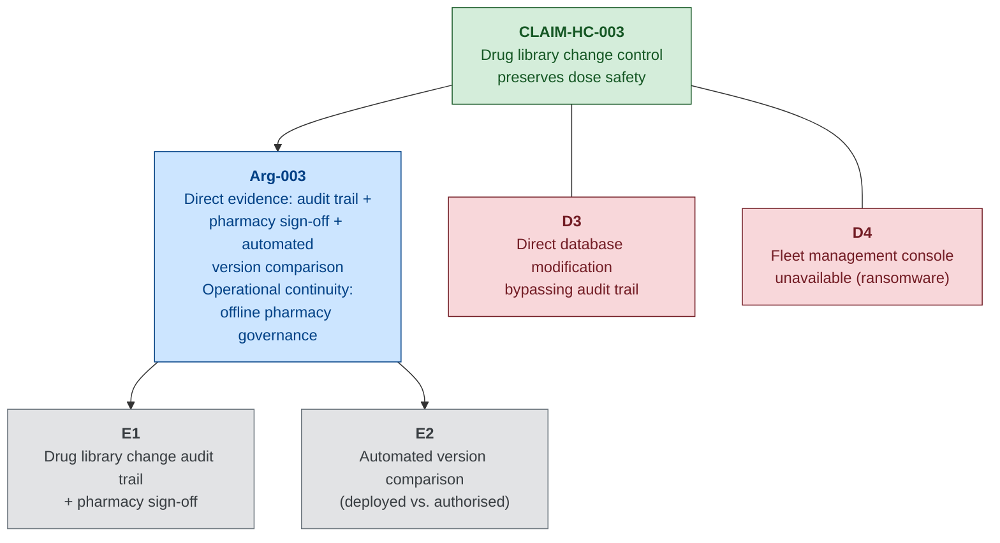

---

### B. CLAIM-HC-004: Alarm Configuration Auditing Maintains Monitoring Effectiveness

#### Claim Rationale

CLAIM-HC-004 addresses the hazard of silent alarm manipulation. In Scenario 02 (Step 6), the attacker modifies patient monitor alarm thresholds — raising the heart rate upper alarm to 200bpm and lowering the SpO2 low alarm to 75%. In Step 12, a patient develops hypoxia (SpO2 drops to 82%) but no alarm sounds because the threshold has been set at 75%. The twelve-minute delay in detection could cause a cardiac arrest. Alarm threshold manipulation is particularly dangerous because the *absence* of an alarm is not itself alarming — clinicians interact with alarms reactively, not proactively. If CLAIM-HC-004 were false, any attacker with central station access could silently disable the early warning system for patient deterioration.

#### Argument

**Argument pattern: Direct evidence + Compensating control**

The primary argument is direct evidence: alarm thresholds on all patient monitors are audited against clinical governance-approved defaults at least daily (Evidence E3). The audit compares current device-level alarm settings against the ward-level default profile approved by the Clinical Governance Committee. Any deviation generates an automated alert to the ward manager and clinical engineering team (Evidence E4).

The compensating control argument addresses the scenario where the central station — which aggregates alarm data — is itself compromised (Scenario 01, when it is encrypted). In this case, bedside monitors maintain independent local alarming (REQ-HC-SAF-003). Alarms sound at the individual bedside regardless of central station status. The safety degradation is in aggregation and visibility to the nursing station, not in alarm function itself. Ward staffing protocols require periodic bedside rounds that provide direct observation as a clinical safety net independent of electronic monitoring.

#### Evidence Nodes

**E3: Daily Alarm Configuration Audit Reports**
- **Type**: Operational
- **Description**: Automated script executed daily that queries alarm threshold settings from each connected patient monitor and compares them against the clinical governance-approved default profile for the relevant ward type (medical, surgical, critical care).
- **Collection method**: Automated query via the patient monitoring central station; results logged and reviewed by clinical engineering.
- **Recurrence**: Daily automated audit; results reviewed by ward manager and clinical engineering each morning.
- **Confidence**: High — automated, comprehensive (covers all connected monitors), and independently verifiable against clinical governance records.
- **Traceability**: REQ-HC-SEC-021, REQ-HC-SAF-003, REQ-HC-SAF-004

**E4: Automated Deviation Alert Records**
- **Type**: Operational
- **Description**: Records of alerts generated when any patient monitor's alarm threshold deviates from the approved default profile by more than the defined tolerance (±10% for heart rate, ±5% for SpO2). Each alert includes the monitor identifier, parameter, expected value, actual value, and timestamp.
- **Collection method**: Automated alerting from the central station audit module; alerts forwarded to ward manager and clinical engineering simultaneously.
- **Recurrence**: Continuous (triggered on detection of any deviation); monthly trend report reviewed by Clinical Governance Committee.
- **Confidence**: Medium — effective when central station is operational, but the alerting mechanism itself depends on the central station being online. Scenario 01 demonstrates this dependency.
- **Traceability**: REQ-HC-SEC-021, REQ-HC-SAF-003, REQ-HC-SAF-004

#### Defeaters

**D5: Central station compromised — audit and alerting unavailable**. If the central station is encrypted (Scenario 01) or the attacker modifies the audit baseline (Scenario 02, more sophisticated variant), the daily audit and deviation alerting are ineffective. **Status**: Partially mitigated. Bedside monitors maintain independent local alarming (REQ-HC-SAF-003). Clinical fallback procedures (CLAIM-HC-010) provide manual observation as a safety net. Risk is that the *threshold manipulation* persists undetected until the central station is restored and the audit re-runs.

**D6: Attacker modifies the clinical governance baseline profile**. If the attacker alters both the device thresholds and the reference profile used for comparison, the audit would report no deviations. **Status**: Partially mitigated. The Clinical Governance Committee maintains an independent paper record of approved alarm profiles. Cross-referencing the electronic baseline against the paper record during quarterly governance review would detect this tampering, but with a significant delay.

#### Mermaid Diagram

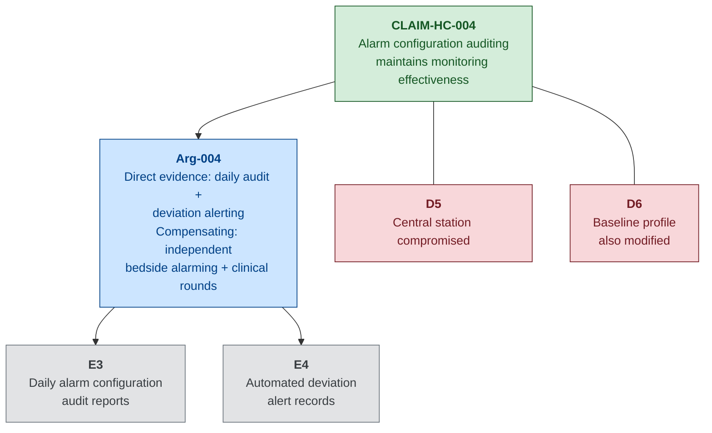

---

### B. CLAIM-HC-009: Device Authentication Prevents Unauthorised Command Execution

#### Claim Rationale

CLAIM-HC-009 addresses the fundamental access control question for clinical devices: can an attacker send commands to an infusion pump, ventilator, or patient monitor from a compromised workstation on the clinical VLAN? In Scenario 02 (Steps 3–5), the attacker exploits a vulnerable clinical workstation and harvests the fleet management service account credentials, then uses those credentials to push drug library modifications to pumps. If CLAIM-HC-009 were false — if devices accepted commands from any source without authentication — the attacker would not even need to harvest credentials; any network-level access to the clinical VLAN would be sufficient to command any device.

#### Argument

**Argument pattern: Direct evidence + Compensating control**

The direct evidence argument is that medical devices are configured to authenticate the source of configuration commands before accepting modifications. Evidence E20 demonstrates that commands from unauthorised sources (workstations not registered in the device management application's allow list) are rejected by the devices. Clinical workstation access is controlled through role-based access (Evidence E21), and the device management application restricts command execution to authenticated sessions only.

The compensating control argument acknowledges a critical limitation: the current infusion pump fleet uses a shared service account for the fleet management application rather than per-user authentication. This means that an attacker who harvests the service account credentials (Scenario 02, Step 4) can execute commands that appear legitimate to the devices. The compensating control is that all commands executed through the management application are logged (Evidence E1 — drug library audit trail), and the device management session must originate from a registered workstation. The combination of session-origin verification and command logging provides a detection mechanism even when the service account is compromised.

#### Evidence Nodes

**E20: Device Authentication Testing**
- **Type**: Test
- **Description**: Results of controlled testing in which configuration commands (dose parameter changes, alarm threshold modifications, firmware update requests) were sent to representative infusion pumps and patient monitors from unauthorised sources — workstations not registered in the fleet management allow list, and raw network commands crafted using protocol analysis tools.
- **Collection method**: Conducted by clinical engineering in a test environment, with manufacturer technical support participation.
- **Recurrence**: Annually, and following any device firmware update or management console upgrade.
- **Confidence**: Medium — tests cover the documented authentication mechanisms, but cannot guarantee detection of undocumented command interfaces or vendor debugging modes.
- **Traceability**: REQ-HC-SEC-016, REQ-HC-SAF-001, REQ-HC-SAF-004

**E21: Clinical Workstation Access Control Verification**
- **Type**: Operational
- **Description**: Quarterly verification that clinical workstations registered for device management access are correctly configured with role-based access controls, and that no unauthorised workstations have been added to the management application's allow list.
- **Collection method**: Manual audit by clinical engineering comparing the management console's registered workstation list against the approved asset register.
- **Recurrence**: Quarterly.
- **Confidence**: Medium — point-in-time verification; does not provide continuous assurance between audits.
- **Traceability**: REQ-HC-SEC-016, REQ-HC-SEC-004

#### Defeaters

**D7: Shared service account credential compromise (Scenario 02, Step 4)**. The fleet management application uses a shared service account rather than per-user authentication. An attacker who harvests this credential can issue commands that the devices regard as legitimate. **Status**: Partially mitigated. Command logging (E1) and session-origin verification provide detection, but there is a window between command execution and detection during which unsafe commands may be executed. This is the attack vector exploited in Scenario 02.

**D8: Undocumented device command interfaces**. Medical devices may have debugging interfaces, maintenance modes, or vendor-specific command channels that bypass the documented authentication mechanisms. **Status**: Partially mitigated. Supply chain security assessment (REQ-HC-SEC-027) includes pre-deployment assessment of device command interfaces, but cannot guarantee completeness for proprietary firmware.

#### Mermaid Diagram

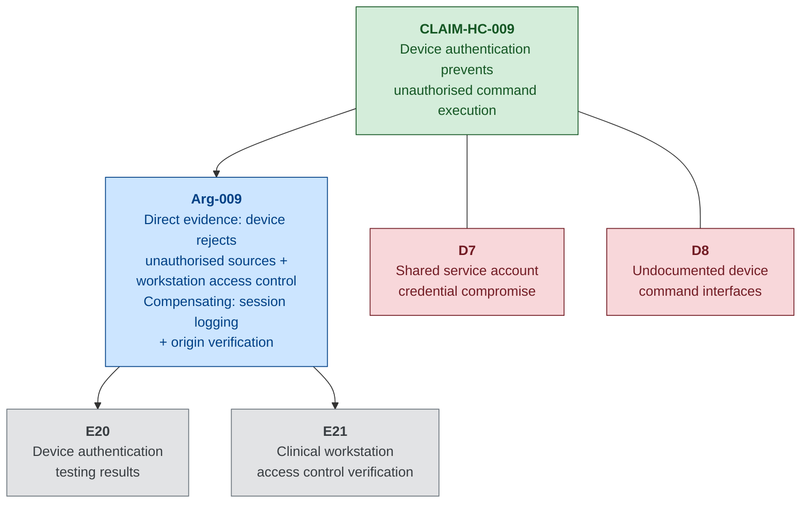

---

## 5. Sub-Goal G3: Clinical Data Integrity and Availability — Full CAE Decomposition

### A. Sub-Goal Statement and Context

**Sub-Goal G3**: Clinical data integrity and availability meets clinical safety requirements — clinicians have access to trustworthy clinical information, or can deliver safe care through fallback procedures when electronic systems are unavailable.

This sub-goal addresses both Scenario 01 (where ransomware encryption removes access to EHR, PACS, and prescribing systems) and Scenario 02 (where PACS imaging data is manipulated to create diagnostic errors). The sub-goal is argued under the assumption that clinical information systems may become unavailable (Scenario 01) or may present unreliable data (Scenario 02), and that the safety case must address both availability loss and integrity violation.

---

### B. CLAIM-HC-006: Immutable Backups Enable Safety-Preserving Recovery

#### Claim Rationale

CLAIM-HC-006 addresses the recoverability dimension of clinical data availability. In Scenario 01 (Step 7), the attacker encrypts the on-site backup NAS and wipes the tape library controller, destroying all on-site backup copies. The Trust's ability to restore safety-critical clinical systems (EHR, PACS, device management configurations) within clinically acceptable timeframes depends entirely on the existence of off-site or immutable backups that cannot be reached from the production network. If CLAIM-HC-006 were false — if all backups were network-accessible and mutable — a ransomware attack would result in permanent data loss, potentially extending the period of degraded clinical operations from days to weeks.

#### Argument

**Argument pattern: Direct evidence + Operational continuity**

The direct evidence argument is that critical system backups are stored on immutable or air-gapped media implementing the 3-2-1 backup rule (three copies, two media types, one off-site). Evidence E9 documents the backup architecture showing that in addition to the on-site NAS and tape infrastructure, a third backup copy is maintained on off-site immutable cloud storage with write-once-read-many (WORM) retention policies and a separate authentication domain. This off-site copy is not accessible from the production network through normal credentials.

The operational continuity argument demonstrates that restoration from these immutable backups is practically feasible within defined recovery time objectives. Evidence E10 documents quarterly restoration exercises in which safety-critical systems (EHR, PACS, device management) are restored from the off-site immutable copy and verified for data integrity and operational correctness. The restoration priority order follows REQ-HC-SAF-012, placing patient monitoring and device management systems ahead of administrative systems.

#### Evidence Nodes

**E9: Backup Architecture Documentation (Immutability)**
- **Type**: Design
- **Description**: Technical documentation of the Trust's backup architecture, showing three-tier backup strategy: (1) on-site NAS with daily snapshots, (2) on-site tape library with weekly full backups, (3) off-site immutable cloud storage with WORM retention policies, separate IAM credentials not accessible from the enterprise Active Directory domain, and 90-day minimum retention period.
- **Collection method**: Maintained by the infrastructure team; reviewed and updated quarterly.
- **Recurrence**: Quarterly review; updated following any change to backup infrastructure.
- **Confidence**: High — architecture is documented, independently verifiable, and the immutability mechanism (WORM) is enforced by the cloud storage provider.
- **Traceability**: REQ-HC-SEC-012, REQ-HC-SAF-010, REQ-HC-SAF-012

**E10: Quarterly Restoration Test Results**
- **Type**: Test
- **Description**: Results of quarterly restoration exercises in which the EHR, PACS, and device management console are restored from the off-site immutable backup to a test environment. Each exercise measures: restoration time against the defined RTO, data integrity verification (hash comparison of restored databases against backup checksums), and functional verification (clinicians confirm that restored systems behave correctly).
- **Collection method**: Structured exercise conducted by infrastructure team with participation from clinical engineering and clinical representatives.
- **Recurrence**: Quarterly.
- **Confidence**: High — independently conducted, covers the full restoration workflow, and includes functional verification by clinical users.
- **Traceability**: REQ-HC-SEC-013, REQ-HC-SAF-010, REQ-HC-SAF-012

#### Defeaters

**D9: Undetected data corruption prior to backup**. If the EHR database or PACS archive is subtly corrupted before the last clean backup is taken (Scenario 02 — PACS metadata manipulation), restoring from backup will restore the corrupted data. **Status**: Partially mitigated. The backup retention policy (90-day WORM) allows restoration to a point before the corruption occurred, provided the corruption is detected within the retention window. Clinical data reconciliation processes (comparing restored data against paper records and pharmacy dispensing logs) provide a secondary verification mechanism. Accepted as residual risk R2.

**D10: Off-site backup authentication compromise**. If an attacker compromises the credentials for the off-site immutable storage (which are on a separate IAM domain), they could potentially delete or corrupt the off-site copies. **Status**: Mitigated. The off-site storage uses MFA, is on a separate identity domain, and WORM policies prevent deletion within the retention period even by the storage administrator.

#### Mermaid Diagram

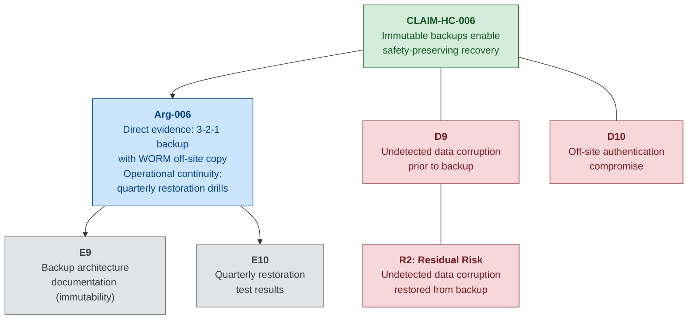

---

### B. CLAIM-HC-008: PACS Integrity Controls Prevent Diagnostic Error

#### Claim Rationale

CLAIM-HC-008 addresses the integrity of diagnostic imaging — one of the most safety-critical clinical data categories. In Scenario 02 (Step 7), the attacker manipulates PACS metadata to swap patient identifiers on CT images and subtly modifies a chest X-ray to obscure a pulmonary nodule. In Step 11, these manipulations lead to a missed diagnosis (the obscured nodule is discovered three months later) and a near-miss wrong-patient event caught by a surgeon during a procedure. If CLAIM-HC-008 were false, clinicians would have no mechanism to detect imaging data integrity violations, and treatment decisions would be made on falsified diagnostic information.

#### Argument

**Argument pattern: Defence-in-depth**

The argument for CLAIM-HC-008 operates at two levels. The primary defence is technical: PACS image-patient identity bindings are cryptographically protected using DICOM digital signatures (Evidence E7). Any modification to the patient identifier fields in a DICOM header after the image is committed to the archive generates an audit alert requiring clinical confirmation before the modified image can be presented in a clinical context (Evidence E8).

The secondary defence is procedural: the radiology workflow includes a mandatory identity cross-check where the reporting radiologist verifies the patient identifier on the image against the radiology information system worklist before finalising the report. The surgical safety checklist (WHO standard, locally adapted) provides a final identity verification step before any procedure, catching wrong-patient errors at the point of care.

The argument acknowledges that content-level image manipulation (altering pixel data rather than metadata) is substantially harder to detect. DICOM digital signatures cover header integrity but may not detect subtle pixel-level modifications unless the signature also covers the pixel data stream. The argument relies on the combination of technical integrity controls and clinical verification procedures to reduce this risk to a tolerable level.

#### Evidence Nodes

**E7: PACS Integrity Verification Testing Results**
- **Type**: Test
- **Description**: Results of structured testing of the PACS integrity verification mechanism. Tests included: (a) modification of patient identifier fields in stored DICOM headers — detection confirmed; (b) modification of study-level metadata (date, modality, body part) — detection confirmed; (c) substitution of image pixel data from a different study — detection confirmed for whole-image substitution, partial detection for localised pixel modification.
- **Collection method**: Conducted by clinical engineering with radiology department participation, using test images in a non-production PACS environment.
- **Recurrence**: Annually, and following any PACS software upgrade.
- **Confidence**: Medium — header-level integrity protection is well-tested; pixel-level integrity protection has known limitations for subtle modifications.
- **Traceability**: REQ-HC-SAF-007

**E8: Metadata Modification Audit Alert Testing**
- **Type**: Test
- **Description**: Results of testing the alert mechanism triggered when DICOM metadata is modified post-commit. Verified that alerts are generated, delivered to the radiology department lead and PACS administrator within defined SLA (15 minutes), and that the modified image is flagged in the clinical viewer with a visual integrity warning.
- **Collection method**: Simulated metadata modification in non-production environment; alert delivery and clinical viewer behaviour observed and documented.
- **Recurrence**: Annually.
- **Confidence**: High — alert delivery is automated and independently verifiable; clinical viewer flagging provides a visible indicator to clinicians.
- **Traceability**: REQ-HC-SAF-007

#### Defeaters

**D11: Subtle pixel-level image manipulation without metadata change**. An attacker who modifies image pixel data (e.g., obscuring a lesion) without altering metadata fields may evade DICOM header integrity checks. **Status**: Partially mitigated. Full-image substitution is detected (E7c); localised pixel modification has limited detection. Clinical peer review (double-reading for cancer screening) and clinical-radiological correlation provide secondary detection but may not catch every case. Accepted as a limitation of current PACS integrity technology.

**D12: PACS system compromise enabling integrity control bypass**. If the attacker gains administrative access to the PACS server, they may be able to disable the integrity verification mechanism or modify images while the mechanism is suspended. **Status**: Partially mitigated by network segmentation (CLAIM-HC-001) and clinical zone monitoring (REQ-HC-SEC-019). The PACS administrator account uses separate credentials from the domain, reducing the attack surface.

#### Mermaid Diagram

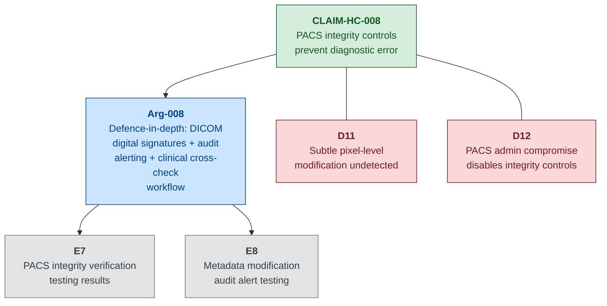

---

### B. CLAIM-HC-010: Clinical Fallback Procedures Maintain Safe Care During Outage

#### Claim Rationale

CLAIM-HC-010 is the safety net claim — it addresses what happens when the other claims partially or wholly fail, and clinicians must deliver care without electronic systems. In Scenario 01 (Steps 10–12), the loss of the EHR, fleet management console, and patient monitoring central station forces clinicians to improvise paper-based workarounds. The result is a transcription error causing a ten-fold dosing discrepancy (Step 12). If CLAIM-HC-010 were false — if no pre-defined fallback procedures existed — every cyber incident affecting clinical systems would require real-time improvisation, dramatically increasing the probability of clinical error.

#### Argument

**Argument pattern: Operational continuity**

This claim rests entirely on operational continuity — demonstrating that the Trust can maintain safe clinical care during the very conditions that a cyber attack creates. The argument has three components.

First, documented clinical fallback procedures exist for all major clinical functions and are physically accessible in each clinical area without dependence on electronic systems (Evidence E11 — procedure documentation). These procedures cover paper-based prescribing, manual pump programming, bedside-only patient monitoring, paper observation charts, and manual allergy verification.

Second, clinical staff are trained and tested on these procedures through biannual fallback procedure drills (Evidence E11 — drill results). The drills simulate a complete loss of electronic clinical systems and assess staff competence in paper-based processes, including the transition from electronic to manual workflows and the reverse transition when systems are restored.

Third, the procedures include a defined process for recognising and correcting errors introduced during the manual phase (REQ-HC-SAF-010), including post-incident data reconciliation to identify discrepancies between paper records created during the outage and the electronic records restored from backup.

#### Evidence Nodes

**E11: Fallback Procedure Documentation + Drill Results**
- **Type**: Process
- **Description**: Comprehensive clinical fallback procedure documentation maintained in each ward area (printed, laminated, stored in clearly marked fallback folders). Covers: paper-based prescribing templates, manual infusion pump programming checklists, bedside observation charts, emergency drug dosing reference cards, manual allergy verification procedure. Biannual drill results document staff participation rates, error rates during manual processes, time-to-transition metrics, and a clinical safety assessment.
- **Collection method**: Procedures authored and maintained by clinical governance team; drills planned and facilitated by clinical education team; results assessed by a multidisciplinary panel.
- **Recurrence**: Procedures reviewed annually; drills conducted biannually (every six months).
- **Confidence**: Medium — procedure documentation is comprehensive, but drill results consistently show that staff unfamiliar with paper processes make more errors during the transition period. The most recent drill achieved 78% staff participation, with 3 simulated dosing discrepancies identified during the paper-based prescribing exercise (all caught by the double-check process).
- **Traceability**: REQ-HC-SEC-023, REQ-HC-SAF-008, REQ-HC-SAF-010

#### Defeaters

**D13: Staff not trained or unfamiliar with fallback procedures**. Agency staff, new staff, or staff who did not participate in recent drills may be unable to execute fallback procedures safely under pressure. **Status**: Partially mitigated. Mandatory induction includes fallback procedure training; biannual drills provide refresher training. 78% drill participation leaves a 22% gap. Accepted as a limitation — full participation is an operational target, not yet achieved.

**D14: Fallback procedures themselves introduce safety errors**. Paper-based prescribing reintroduces transcription errors, removes electronic allergy checking, and creates handwriting legibility issues. The fallback is safer than no procedure at all, but materially less safe than electronic prescribing. **Status**: Partially mitigated by double-check requirements (REQ-HC-SAF-014) and additional pharmacy staffing during incidents. Accepted as an inherent limitation of manual clinical processes.

#### Mermaid Diagram

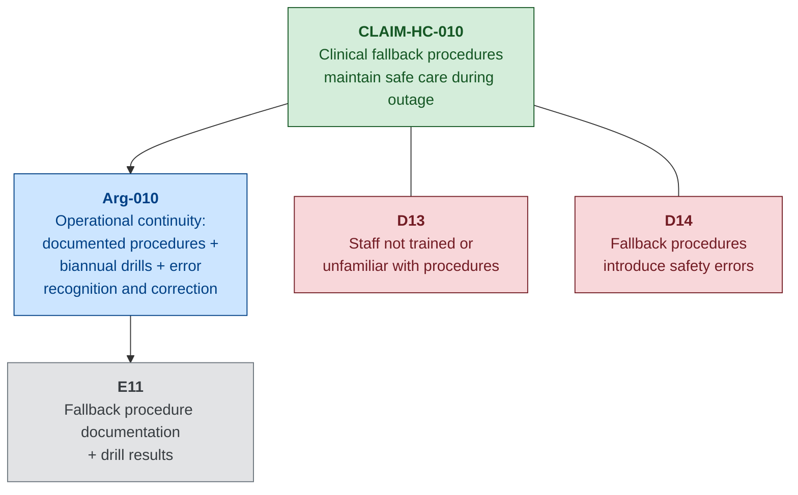

---

## 6. Sub-Goal G4: Enterprise-to-Clinical Isolation — Full CAE Decomposition

### A. Sub-Goal Statement and Context

**Sub-Goal G4**: Enterprise IT compromise does not propagate to safety-critical clinical systems — the architectural boundary between the enterprise zone and the clinical/medical device zone prevents an attacker who has compromised enterprise systems from reaching devices that directly affect patient safety.

This sub-goal addresses the enabling pathway for both Scenario 01 (Steps 8–10: ransomware crosses via dual-homed workstations to clinical zone) and Scenario 02 (Step 1: attacker enters clinical zone via compromised vendor VPN). G4 is the most critical sub-goal because it underpins G2 and G3 — if enterprise-to-clinical isolation holds, the attack surface for device manipulation and data corruption is substantially reduced.

---

### B. CLAIM-HC-001: Network Segmentation Protects Device Integrity

#### Claim Rationale

CLAIM-HC-001 is the foundational architectural claim. The network boundary between the enterprise IT zone and the clinical/medical device zone is the primary control that prevents the security-to-safety pathway. In Scenario 01 (Step 8), the attacker crosses this boundary via dual-homed clinical workstations with legacy firewall exception rules. In both scenarios, the incomplete segmentation (three wards remaining on a flat Layer-2 segment) provides direct, unfiltered access from enterprise workstations to medical devices. If CLAIM-HC-001 were false — if no segmentation existed — any enterprise compromise would automatically compromise the clinical device zone.

#### Argument

**Argument pattern: Direct evidence + Defence-in-depth**

The primary argument is direct evidence that the segmentation is in place and effective. Evidence E12 documents a firewall rule audit confirming that no cross-zone exception rules remain in effect — all legacy bidirectional access rules for dual-homed workstations have been removed, and cross-zone traffic is restricted to explicitly defined, minimal data flows (EHR prescription data, DICOM image transfer). Evidence E13 documents the results of an independent penetration test demonstrating that an attacker positioned in the enterprise zone cannot reach clinical devices through the firewall.

The defence-in-depth layer addresses the scenario where a novel application-layer exploit bypasses the firewall through a permitted data flow (e.g., a vulnerability in the EHR-to-device-management interface). Clinical zone monitoring (REQ-HC-SEC-019) provides a detection mechanism for anomalous traffic patterns within the clinical zone, even if the traffic arrived through a permissible conduit. Additionally, the elimination of dual-homed workstations (REQ-HC-SEC-008) removes the primary cross-zone attack vector that enabled the Northgate incident.

#### Evidence Nodes

**E12: Firewall Rule Audit (No Cross-Zone Exceptions)**
- **Type**: Design
- **Description**: Results of a comprehensive firewall rule audit confirming that all legacy exception rules permitting bidirectional access between specific clinical workstations and the enterprise zone have been removed. The audit verifies that the firewall rule set implements an explicit allow-list policy with only the minimum required cross-zone data flows: EHR-to-device-management prescription data (outbound, application-layer filtered), DICOM image transfer from clinical modalities to PACS (outbound only), and SIEM log forwarding from clinical zone to enterprise SIEM (outbound only).
- **Collection method**: Conducted by a qualified firewall administrator with independent verification by a second administrator. Rule set exported and compared against the approved baseline.
- **Recurrence**: Quarterly audit with continuous change monitoring (firewall generates alerts for any rule modification).
- **Confidence**: High — dual-verified, comprehensive, with continuous change monitoring preventing configuration drift between audits.
- **Traceability**: REQ-HC-SEC-007, REQ-HC-SEC-008, REQ-HC-SAF-001, REQ-HC-SAF-009

**E13: Penetration Test — Enterprise to Clinical Zone Blocked**
- **Type**: Test
- **Description**: Results of an independent penetration test conducted by a CREST-accredited third party. The test scope included all enterprise-to-clinical zone attack vectors: direct network probing through the firewall, exploitation of permitted cross-zone data flows, scanning for residual dual-homed workstations, and attempted pivoting through clinical zone via application-layer attacks. The test confirmed that no enterprise-to-clinical traversal was achievable through the firewall. Two informational findings were noted regarding the permitted EHR-to-device data flow, but neither was exploitable.
- **Collection method**: Commissioned by the Trust's Information Security Manager; conducted by an external CREST-accredited penetration testing firm.
- **Recurrence**: Annually; additionally triggered following any significant network architecture change.
- **Confidence**: High — independently conducted by a qualified third party; comprehensive scope covering both network-layer and application-layer vectors.
- **Traceability**: REQ-HC-SEC-007, REQ-HC-SEC-008, REQ-HC-SEC-014, REQ-HC-SAF-001

#### Defeaters

**D15: Novel cross-zone exploit via permitted data flow**. The firewall permits certain application-layer data flows (EHR-to-device, DICOM). An attacker who discovers a vulnerability in the receiving application could use a permitted data flow as a covert channel to inject commands into the clinical zone. **Status**: Partially mitigated. Clinical zone monitoring (REQ-HC-SEC-019) and application whitelisting on clinical workstations (REQ-HC-SEC-011) provide secondary detection and prevention. Accepted as residual risk R3.

**D16: Configuration drift re-introduces exception rules**. Over time, operational pressures may lead to the re-introduction of firewall exception rules (as happened in the original Northgate scenario, where legacy rules were maintained for workflow continuity). **Status**: Mitigated. Continuous firewall change monitoring (E12) generates alerts for any rule modification. Quarterly audit with dual verification ensures any drift is detected and remediated within the audit cycle. Joint IT/Clinical Engineering governance committee (REQ-HC-SEC-024) provides organisational oversight of cross-zone access requests.

#### Mermaid Diagram

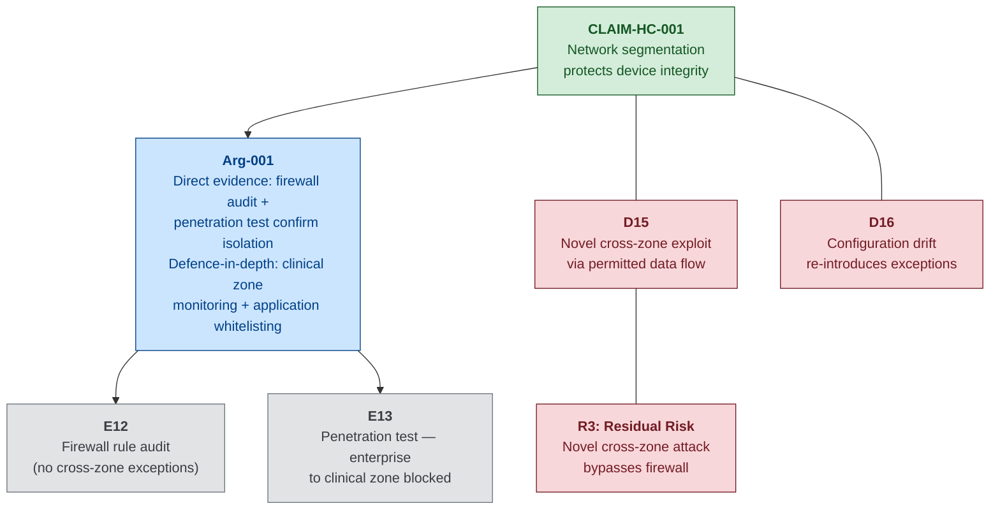

---

### B. CLAIM-HC-005: Vendor Access Controls Prevent Supply-Chain Attack Path

#### Claim Rationale

CLAIM-HC-005 addresses the alternative entry point that bypasses enterprise-to-clinical segmentation entirely: the infusion pump manufacturer's persistent VPN connection. In Scenario 02 (Step 1), the attacker compromises the vendor's remote-access credentials through a supply-chain phishing attack against a field service engineer. The vendor VPN terminates directly in the clinical zone, providing unrestricted network access to all clinical devices. If CLAIM-HC-005 were false — if vendor access were uncontrolled — the segmentation defended by CLAIM-HC-001 would be irrelevant; the attacker would simply enter the clinical zone through the vendor's front door.

#### Argument

**Argument pattern: Defence-in-depth**

The argument for CLAIM-HC-005 applies three layers of control. First, vendor remote-access connections require multi-factor authentication (Evidence E15), ensuring that credential compromise alone is insufficient for access. Second, vendor VPN sessions are activated only during scheduled maintenance windows and are deactivated outside those windows (Evidence E14), limiting the time window during which the access path is available. Third, active vendor sessions are monitored in real time with automated alerting for session anomalies — connections from unexpected IP addresses, activity outside the scheduled window, or access to devices not covered by the maintenance work order (Evidence E14).

#### Evidence Nodes

**E14: Vendor Access Logs (Scheduled Windows Only)**
- **Type**: Operational
- **Description**: Audit logs from the vendor remote-access gateway demonstrating that all vendor VPN sessions were activated within scheduled maintenance windows only, and that no sessions were recorded outside these windows. Logs include session start/end times, source IP address, devices accessed, and actions performed.
- **Collection method**: Automated extraction from vendor VPN gateway; monthly summary reviewed by clinical engineering.
- **Recurrence**: Continuous logging; monthly review.
- **Confidence**: High — automated, comprehensive, and independently verifiable against the scheduled maintenance calendar.
- **Traceability**: REQ-HC-SEC-018, REQ-HC-SAF-001, REQ-HC-SAF-009

**E15: MFA Enforcement Records for Vendor Sessions**
- **Type**: Operational
- **Description**: Records from the vendor VPN gateway's authentication system confirming that all vendor sessions were authenticated with MFA (password + hardware token or authenticator application). Records include the authentication method used for each session.
- **Collection method**: Automated extraction from VPN gateway authentication logs.
- **Recurrence**: Continuous; monthly compliance summary.
- **Confidence**: High — MFA enforcement is a system-level configuration that cannot be bypassed by the vendor without gateway administrator cooperation.
- **Traceability**: REQ-HC-SEC-018, REQ-HC-SAF-001

#### Defeaters

**D17: Vendor credential and MFA compromise (combined)**. A sophisticated supply-chain attack that compromises both the vendor's password *and* their MFA device (e.g., SIM-swapping, push-fatigue, or malware on the engineer's workstation that proxies the MFA challenge) could bypass the MFA requirement. **Status**: Partially mitigated. Scheduled-window activation limits the time window for exploitation; real-time session monitoring detects anomalous activity. Residual risk accepted — MFA significantly raises the bar but is not impenetrable.

**D18: Vendor uses maintenance window for unsanctioned access**. The vendor, acting within a legitimate session, could access devices or perform actions beyond the scope of the maintenance work order. **Status**: Partially mitigated. Session monitoring compares accessed devices against the work order scope. Vendor contract terms (REQ-HC-SEC-026) impose obligations and audit rights. However, fine-grained action-level monitoring is limited by the granularity of device-level logging.

#### Mermaid Diagram

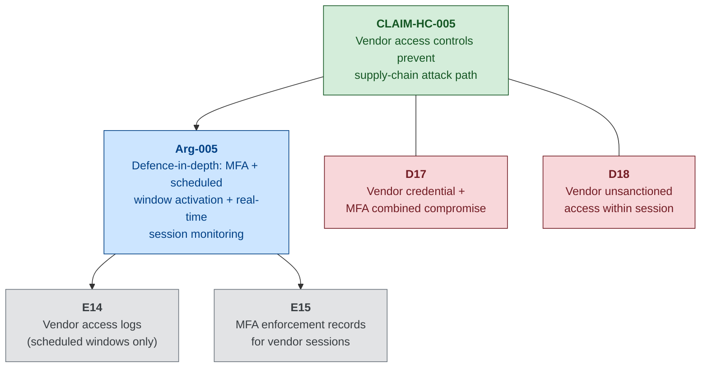

---

### B. CLAIM-HC-007: Integrated Incident Response Prevents Containment-Induced Safety Hazards

#### Claim Rationale

CLAIM-HC-007 addresses a second-order hazard: the risk that incident *response* actions themselves create patient safety hazards. In Scenario 01 (Day 2 afternoon), the Trust's emergency response team debates whether to sever the enterprise-to-clinical network link. Severing the connection protects clinical devices from further compromise — but also disconnects clinicians from the EHR and prevents the infusion pump fleet management system from receiving commands, forcing all programming to manual operation. The decision to sever at 14:30 was taken without a pre-planned framework for evaluating clinical safety consequences of IT containment actions. If CLAIM-HC-007 were false, every containment decision would be an ad hoc improvisation under crisis pressure, increasing the probability that a well-intentioned IT security action inadvertently harms patients.

#### Argument

**Argument pattern: Process evidence + Operational continuity**

The argument for CLAIM-HC-007 relies entirely on process evidence — demonstrating that the Trust has developed, documented, and rehearsed an incident response plan that explicitly integrates IT security containment decisions with clinical safety impact assessments. Evidence E17 documents the plan itself, which includes: a clinical impact assessment checklist that must be completed before any network isolation action; pre-defined decision trees for common containment scenarios (isolate clinical zone, isolate specific wards, disable vendor access); and escalation procedures to the joint IT/Clinical Engineering governance committee.

Evidence E16 documents the results of joint IT/Clinical Engineering tabletop exercises in which the response team rehearses containment scenarios, evaluates clinical safety consequences, and makes coordinated decisions. The exercises are designed to surface tensions between IT containment priorities and clinical safety priorities, and to ensure that decision-makers from both domains understand each other's constraints.

#### Evidence Nodes

**E16: Joint IT/Clinical Engineering Tabletop Exercise Reports**
- **Type**: Process
- **Description**: Reports from biannual tabletop exercises in which IT security, clinical engineering, and clinical leadership rehearse responding to a cyber incident affecting clinical systems. Each exercise presents a scenario (based on Scenarios 01 and 02) and requires participants to make containment decisions while evaluating clinical safety impact. Reports document decisions made, clinical impact assessments performed, time-to-decision metrics, and identified improvement actions.
- **Collection method**: Facilitated by the Trust's risk management team; observed by an independent assessor.
- **Recurrence**: Biannually (every six months).
- **Confidence**: Medium — exercises demonstrate capability and identify gaps, but tabletop exercises are inherently less realistic than live exercises. Staff turnover means that not all decision-makers have participated in recent exercises.
- **Traceability**: REQ-HC-SEC-022, REQ-HC-SAF-009, REQ-HC-SAF-010

**E17: Incident Response Plan with Clinical Impact Assessment**
- **Type**: Process
- **Description**: The Trust's integrated incident response plan, maintained as a controlled document. The plan includes: (a) clinical impact assessment checklist for each containment action category; (b) decision trees for common scenarios; (c) pre-defined communication templates for clinical staff notification; (d) escalation matrix to relevant governance committee; (e) post-incident clinical review procedure.
- **Collection method**: Authored by IT Security with clinical engineering and clinical governance input; reviewed and approved by the joint governance committee.
- **Recurrence**: Plan reviewed annually; updated following any incident, exercise, or significant system change.
- **Confidence**: Medium — plan exists and is maintained, but its real-world effectiveness has not been tested in a live incident (the Northgate scenario is the first such test). Tabletop exercises (E16) provide the closest approximation.
- **Traceability**: REQ-HC-SEC-022, REQ-HC-SAF-009, REQ-HC-SAF-010

#### Defeaters

**D19: Response plan not followed under crisis pressure**. In a genuine major incident, time pressure, incomplete information, and the stress of active patient safety events may cause decision-makers to bypass the planned clinical impact assessment process and make ad hoc containment decisions. **Status**: Partially mitigated. Tabletop exercises (E16) build familiarity with the process. Printed decision trees are available in the incident response pack (independent of electronic systems). However, the scenario described in the Northgate incident — where the CIO had to make a time-critical decision while patient safety events were already occurring — illustrates the realistic pressure.

**D20: Novel containment scenario not covered by decision trees**. The pre-defined decision trees cover common scenarios but cannot anticipate every possible containment combination. A novel attack vector or unexpected system dependency could create a containment decision with clinical consequences not addressed in the plan. **Status**: Partially mitigated. The escalation matrix provides a fallback to the clinical governance committee for scenarios outside the decision trees. Post-incident review (E17e) captures novel scenarios for incorporation into future plan revisions.

#### Mermaid Diagram

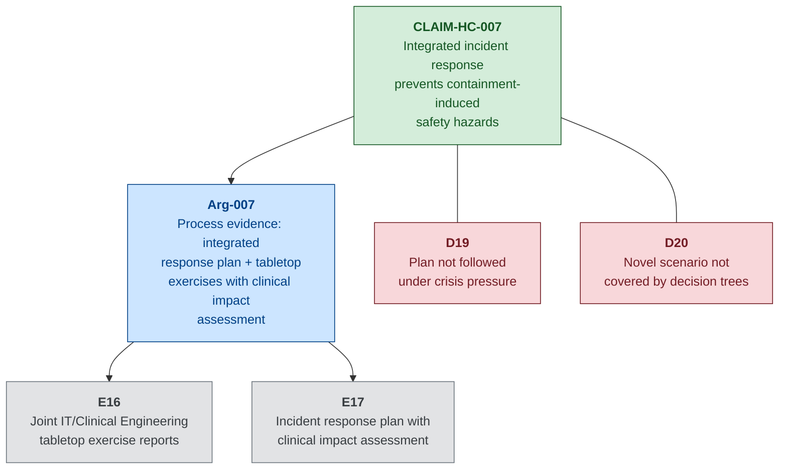

---

## 7. Cross-Cutting Argument: The Patching Constraint

### The Fundamental Tension

A defining challenge in healthcare cybersecurity is the conflict between patching urgency and safety assurance. Cybersecurity best practice demands that known vulnerabilities be patched promptly — every day a vulnerability remains unpatched extends the window of exploitation. Safety assurance for medical devices, governed by IEC 62304, demands that changes to safety-certified software be validated before deployment — a process that can require weeks or months of testing and re-certification. A security patch to an infusion pump's firmware might fix a critical vulnerability, but it might also affect the pump's dosing accuracy, alarm behaviour, or communication reliability. Deploying the patch without safety re-validation risks introducing a safety defect; refusing to deploy it risks leaving the device exploitable.

This creates two mutually exclusive strategies for any given vulnerability disclosure:

### Strategy A: Patch Immediately

**Argument**: The cybersecurity risk of delay outweighs the interim safety risk. Deploy the security patch to the infusion pump fleet immediately. Manage the interim safety risk (the period between patch deployment and completion of safety re-validation) through compensating clinical controls.

**Compensating safety controls during the interim**:
- Clinical monitoring: increase bedside observation frequency for patients on patched pumps until re-validation is complete.
- Manual dose verification: require a second clinician to independently verify every dose delivered by a patched pump against the paper prescription.
- Reduced device trust level: clinical protocols treat patched pumps as partially untrusted devices, triggering additional clinical checks.

**Evidence Nodes**:
- **E22: Clinical monitoring protocol for interim-patched devices** (Process) — documented protocol specifying increased bedside observation frequency and manual verification requirements for devices running unvalidated patches.
- **E23: Manufacturer interim safety guidance** (Design) — manufacturer-provided guidance on the scope of the patch and its potential clinical impact, including any known interactions with safety-critical functions.

**Residual risk**: The patch introduces a subtle safety defect (e.g., altered dosing accuracy at specific flow rates) that is not detected by the compensating clinical controls during the interim period. This is identified as Residual Risk R4.

### Strategy B: Defer Patch

**Argument**: The safety risk of deploying an unvalidated patch outweighs the cybersecurity risk of delay. Defer the patch until full IEC 62304-compliant safety re-validation is complete. Manage the interim cybersecurity risk (the window of known vulnerability) through compensating network and monitoring controls.

**Compensating cybersecurity controls during the interim**:
- Enhanced network isolation: tighten firewall rules for the clinical zone, restricting permitted cross-zone data flows to the minimum required.
- Enhanced monitoring: deploy additional monitoring on the clinical VLAN specifically targeting known exploitation indicators for the disclosed vulnerability.
- Vendor access restriction: disable vendor remote access entirely until the patched firmware is validated and deployed.

**Evidence Nodes**:
- **E24: Enhanced isolation configuration during deferral** (Design) — firewall rule modification records showing additional restrictions applied during the vulnerability window.
- **E25: Vulnerability-specific monitoring rules** (Operational) — IDS/IPS signatures or SIEM correlation rules deployed specifically to detect exploitation attempts for the disclosed vulnerability.

**Residual risk**: The known vulnerability is exploited by an attacker during the deferral window despite the compensating network controls. This is identified as Residual Risk R5.

### Mermaid Diagram

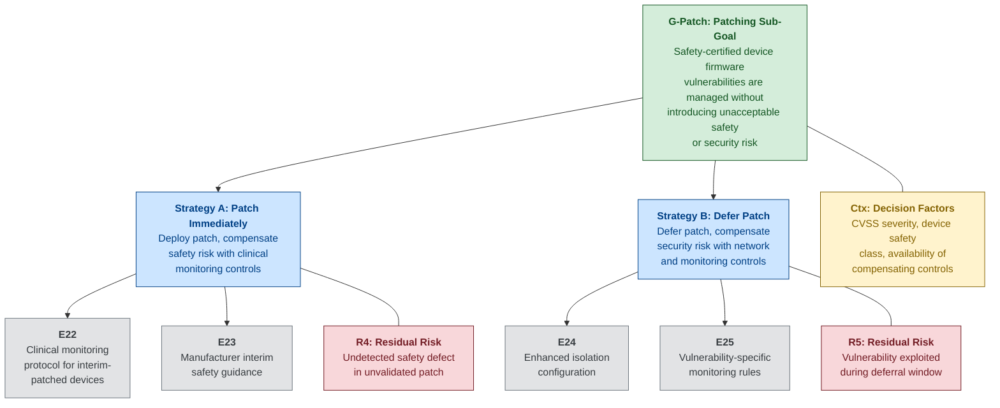

### Strategy Selection Guidance

The choice between Strategy A and Strategy B depends on four factors:

1. **Vulnerability severity (CVSS score and exploitability)**: A critical vulnerability with known active exploitation (CVSS ≥ 9.0, public exploit code available) favours Strategy A — the cybersecurity risk of delay is very high. A moderate vulnerability with no known exploit (CVSS 4.0–6.9, theoretical impact) may favour Strategy B — there is more time for proper validation.

2. **Device safety class (IEC 62304)**: For Class C devices (failure could cause death or serious injury, such as infusion pump dosing control), the re-validation burden under IEC 62304 is highest, but so is the consequence of a safety defect introduced by the patch. Strategy B is generally preferred unless the vulnerability is actively exploited. For Class A devices (no injury possible), Strategy A can be adopted with minimal compensating controls.

3. **Availability of compensating controls**: Strategy A requires robust clinical compensating controls (additional monitoring, manual verification). If the clinical area lacks the staffing to implement these controls (e.g., during a nightshift on an understaffed ward), Strategy A becomes less tenable. Strategy B requires robust network compensating controls (enhanced isolation, vulnerability-specific monitoring). If the clinical zone's monitoring infrastructure is immature, Strategy B becomes less tenable.

4. **Manufacturer cooperation**: If the manufacturer provides interim safety guidance (E23) confirming that the patch does not affect safety-critical functions, Strategy A's residual risk is substantially reduced. If the manufacturer cannot or will not provide this guidance, Strategy A proceeds with higher uncertainty.

**Recommendation for Northgate**: For the infusion pump fleet (IEC 62304 Class C software), the default strategy should be **Strategy B (defer patch)**, unless the vulnerability is assessed as critical severity with active exploitation. In that exceptional case, Strategy A should be adopted with enhanced clinical monitoring and with the consent of the joint IT/Clinical Engineering governance committee, documented as a formal risk acceptance with a defined time limit for completing safety re-validation.

---

## 8. Defeaters and Counter-Arguments

### Summary Table

| Defeater ID | Claim(s) Affected | Defeater Condition | Mitigation | Status |
|-------------|-------------------|--------------------|------------|--------|
| D1 | CLAIM-HC-002 | Supply-chain compromise of manufacturer firmware signing key | Supply chain security assessment (REQ-HC-SEC-027); manufacturer cooperation (REQ-HC-SEC-026) | Accepted (R1) |
| D2 | CLAIM-HC-002 | Zero-day vulnerability in firmware verification implementation | Network segmentation limits access; firmware version register detects discrepancy | Accepted (R1) |
| D3 | CLAIM-HC-003 | Direct database modification bypassing audit trail (Scenario 02) | Automated version comparison (E2); offline pharmacy governance record | Partially mitigated |
| D4 | CLAIM-HC-003 | Fleet management console unavailable (Scenario 01) | Clinical fallback procedures (CLAIM-HC-010); dual authorisation (REQ-HC-SAF-014) | Mitigated |
| D5 | CLAIM-HC-004 | Central station compromised — audit and alerting unavailable | Independent bedside alarming (REQ-HC-SAF-003); clinical fallback procedures | Partially mitigated |
| D6 | CLAIM-HC-004 | Attacker modifies clinical governance baseline profile alongside device thresholds | Independent paper record of approved profiles; quarterly governance review | Partially mitigated |
| D7 | CLAIM-HC-009 | Shared service account credential compromise | Command logging (E1); session-origin verification | Partially mitigated |
| D8 | CLAIM-HC-009 | Undocumented device command interfaces (debugging modes, vendor ports) | Pre-deployment security assessment (REQ-HC-SEC-027) | Partially mitigated |
| D9 | CLAIM-HC-006 | Undetected data corruption prior to backup | 90-day WORM retention; clinical data reconciliation | Accepted (R2) |
| D10 | CLAIM-HC-006 | Off-site backup authentication compromise | Separate IAM domain; MFA; WORM retention prevents deletion | Mitigated |
| D11 | CLAIM-HC-008 | Subtle pixel-level image manipulation without metadata change | Clinical peer review; DICOM pixel data signatures (partial) | Partially mitigated |
| D12 | CLAIM-HC-008 | PACS admin compromise disables integrity controls | Network segmentation; separate PACS admin credentials | Partially mitigated |
| D13 | CLAIM-HC-010 | Staff not trained or unfamiliar with fallback procedures | Mandatory induction; biannual drills (78% participation) | Partially mitigated |
| D14 | CLAIM-HC-010 | Fallback procedures introduce safety errors (transcription, legibility) | Double-check requirements (REQ-HC-SAF-014); additional pharmacy staffing | Accepted (inherent limitation) |
| D15 | CLAIM-HC-001 | Novel cross-zone exploit via permitted application-layer data flow | Clinical zone monitoring (REQ-HC-SEC-019); application whitelisting (REQ-HC-SEC-011) | Accepted (R3) |
| D16 | CLAIM-HC-001 | Configuration drift re-introduces firewall exception rules | Continuous change monitoring; quarterly dual-verified audit | Mitigated |
| D17 | CLAIM-HC-005 | Vendor credential + MFA combined compromise | Scheduled-window activation; real-time session monitoring | Partially mitigated |
| D18 | CLAIM-HC-005 | Vendor unsanctioned access within legitimate session | Session monitoring against work order scope; contractual audit rights | Partially mitigated |
| D19 | CLAIM-HC-007 | Response plan not followed under crisis pressure | Tabletop exercises; printed decision trees independent of electronic systems | Partially mitigated |
| D20 | CLAIM-HC-007 | Novel containment scenario not covered by decision trees | Escalation to governance committee; post-incident plan revision | Partially mitigated |

### Defeater Landscape Analysis

The most concerning defeaters are those that affect the detection layer rather than the prevention layer. **D3** (direct database modification bypassing the drug library audit trail) is the most safety-critical defeater because it targets the detection mechanism that protects the most dangerous safety function (infusion pump dose limits). The four-hour window between automated version comparisons represents a time-bounded opportunity for the attacker to push a corrupted drug library to pumps before the discrepancy is detected. Reducing this window — through continuous real-time hash comparison or through event-triggered verification on every drug library deployment — would substantially strengthen the argument for CLAIM-HC-003.

**D5** and **D6** (central station compromise and baseline manipulation) expose a structural weakness: the alarm auditing system (CLAIM-HC-004) depends on the very infrastructure that may be compromised during an attack. When the central station is encrypted, the safety argument for alarm integrity pivots entirely to independent bedside alarming and manual clinical observation — a significant reduction in monitoring capability that is only partially compensated by fallback procedures.

The organisational and operational defeaters (**D13**, **D14**, **D19**) are collectively the most underestimated category. Technical controls can be tested, audited, and verified. Human compliance — whether staff follow fallback procedures, whether double-checks are genuinely independent, whether the response plan is followed under pressure — is inherently less certain. The 78% drill participation rate (D13) and the documented failure modes of paper-based prescribing (D14) represent irreducible uncertainties in the human element of the safety argument.

The supply-chain defeaters (**D1**, **D17**, **D18**) deserve attention because they represent attack vectors that bypass the Trust's own controls entirely. A compromise of the manufacturer's firmware signing key (D1) or a combined credential-and-MFA compromise of the vendor's remote access (D17) would enter the clinical zone through trusted channels, rendering many of the Trust's perimeter controls irrelevant. These defeaters underscore the importance of the in-band detection and monitoring controls (firmware version register, device log aggregation, anomaly detection within the clinical zone) that operate regardless of how the attacker gained access.

---

## 9. Confidence Assessment

### Per-Element Assessment

| Element | Confidence | Key Factors |
|---------|-----------|-------------|
| G2: Medical Device Integrity | **Medium-High** | Strong design evidence (firmware code signing, drug library controls); weaker operational evidence (daily audits depend on staffing levels and console availability). Shared service account (D7) is a known weakness in device authentication. |
| G3: Clinical Data Integrity and Availability | **Medium** | Backup immutability is well-evidenced (E9, E10) and High confidence for recoverability. PACS integrity controls are newer and less tested — pixel-level manipulation remains a gap (D11). Fallback procedures are comprehensively documented but drill results show imperfect staff compliance (78% participation, simulated errors during paper prescribing). |
| G4: Enterprise-to-Clinical Isolation | **Medium-High** | Penetration testing (E13) provides strong, independently-verified point-in-time evidence. Firewall audit with continuous change monitoring (E12) provides ongoing assurance. Vendor access controls (E14, E15) are robust. Weakest link is the application-layer cross-zone data flows that the firewall must permit (D15). |
| G1: Top-Level Goal | **Medium** | The defence-in-depth structure across all three sub-goals provides collective resilience. No single sub-goal has Low confidence. The weakest points are: (1) the time-bounded detection gap for drug library manipulation (D3); (2) the dependency of alarm auditing on the central station being online (D5); and (3) the inherent limitations of paper-based clinical fallback (D14). |

### Confidence Improvement Pathway

To raise overall confidence from Medium to Medium-High, the following improvements would be needed:

1. **Continuous drug library hash verification**: Replace the four-hourly scheduled comparison (E2) with continuous, event-triggered verification on every drug library deployment. This would close the time-bounded window identified in D3.

2. **Independent alarm audit mechanism**: Deploy a secondary alarm threshold verification mechanism that operates independently of the patient monitoring central station — for example, a standalone audit agent that queries bedside monitors directly.

3. **Per-user device command authentication**: Replace the shared fleet management service account with per-user authentication for device command execution, closing the vulnerability identified in D7.

4. **Increased fallback drill participation**: Achieve ≥90% staff participation in fallback procedure drills. Consider mandatory participation as a condition of clinical employment.

5. **Independent third-party assurance case review**: Commission a qualified independent assessor to challenge the assurance case structure, test the evidence claims, and identify gaps not visible to the case authors.

---

## 10. Traceability Matrix

| Claim | Cybersecurity Requirement(s) | Safety Requirement(s) | Evidence | Attack Scenario Reference |
|-------|-----------------------------|-----------------------|----------|--------------------------|
| CLAIM-HC-001 | REQ-HC-SEC-007, REQ-HC-SEC-008, REQ-HC-SEC-014 | REQ-HC-SAF-001, REQ-HC-SAF-003, REQ-HC-SAF-005, REQ-HC-SAF-009 | E12, E13 | Scenario 01, Steps 8–10 |
| CLAIM-HC-002 | REQ-HC-SEC-017 | REQ-HC-SAF-011 | E5, E6, E19 | Scenario 02, Step 8 |
| CLAIM-HC-003 | REQ-HC-SEC-020 | REQ-HC-SAF-001, REQ-HC-SAF-002 | E1, E2 | Scenario 02, Steps 5, 10 |
| CLAIM-HC-004 | REQ-HC-SEC-021 | REQ-HC-SAF-003, REQ-HC-SAF-004 | E3, E4 | Scenario 02, Steps 6, 12 |
| CLAIM-HC-005 | REQ-HC-SEC-018 | REQ-HC-SAF-001, REQ-HC-SAF-009 | E14, E15 | Scenario 02, Step 1 |
| CLAIM-HC-006 | REQ-HC-SEC-012, REQ-HC-SEC-013 | REQ-HC-SAF-010, REQ-HC-SAF-012 | E9, E10 | Scenario 01, Step 7 |
| CLAIM-HC-007 | REQ-HC-SEC-022 | REQ-HC-SAF-009, REQ-HC-SAF-010 | E16, E17 | Scenario 01, Step 13 |
| CLAIM-HC-008 | REQ-HC-SEC-019 | REQ-HC-SAF-007 | E7, E8 | Scenario 02, Steps 7, 11 |
| CLAIM-HC-009 | REQ-HC-SEC-016 | REQ-HC-SAF-001, REQ-HC-SAF-004 | E20, E21 | Scenario 02, Steps 3–5 |
| CLAIM-HC-010 | REQ-HC-SEC-023 | REQ-HC-SAF-008, REQ-HC-SAF-010 | E11 | Scenario 01, Steps 11–13 |

### Requirement Coverage Analysis

**Cybersecurity requirements covered**: REQ-HC-SEC-007, 008, 012, 013, 014, 016, 017, 018, 019, 020, 021, 022, 023 (13 of 30).

**Cybersecurity requirements not directly covered by claims**: REQ-HC-SEC-001 through 006 (enterprise identity and access management, perimeter and email security), REQ-HC-SEC-009 through 011 (internal monitoring, EDR, application whitelisting), REQ-HC-SEC-015 (device communication encryption), REQ-HC-SEC-024 through 030 (governance, supply chain, training, vulnerability scanning). These requirements support the assurance case indirectly — they reduce the probability of an attacker reaching the clinical zone — but are not argued as direct safety claims because they operate in the enterprise zone rather than at the security-safety interface.

**Safety requirements covered**: REQ-HC-SAF-001, 002, 003, 004, 005, 007, 008, 009, 010, 011, 012 (11 of 14).

**Safety requirements not directly covered**: REQ-HC-SAF-006 (clinical data integrity for prescribing — addressed indirectly through CLAIM-HC-006 and CLAIM-HC-010), REQ-HC-SAF-013 (post-incident device integrity verification — addressed as a recovery-phase activity rather than a preventive claim), REQ-HC-SAF-014 (dual authorisation for safety-critical overrides — referenced as a compensating control in multiple claims but not argued as its own claim).

---

## 11. Assurance Case Limitations and Open Questions

### 1. Scope Limitations

This assurance case addresses cyber-originated safety hazards as defined by two specific attack scenarios. It does not address:

- **Insider threat from clinical staff** with legitimate system access who deliberately manipulate device configurations or clinical data. The threat model considers negligent insiders (Craig Ellison) and external attackers, but a malicious clinician with legitimate access to the infusion pump management console could bypass many of the controls argued in this case.
- **Physical security breaches** that provide direct physical access to medical devices. An attacker with physical access to an infusion pump could modify its configuration directly, bypassing all network-level controls.
- **Cyber attacks not covered by the threat model** — particularly attacks from determined nation-state actors with zero-day capabilities and patient-harm intent. The assurance case argues against financially motivated and opportunistic attackers; it does not claim resilience against a targeted, patient-specific attack.
- **Safety hazards from equipment failure** unrelated to cyber compromise (mechanical failure, power supply issues, electromagnetic interference).
- **Broader clinical process failures** that may be exacerbated by but not caused by cyber incidents (staffing shortages, communication breakdowns, handover errors).

### 2. Evidence Gaps

Several evidence nodes describe artefacts that are aspirational or represent best-practice targets rather than verified current state in this fictional scenario:

- **E13 (Penetration test)**: The described annual CREST-accredited penetration test is a target state. At the time of the Northgate incident, no penetration test of the enterprise-to-clinical boundary had been conducted.
- **E7 (PACS integrity verification)**: DICOM digital signatures are depicted as implemented, but many real-world PACS deployments do not support image-level cryptographic integrity verification. This evidence node represents an ideal rather than current common practice.
- **E19 (Firmware version register)**: Automated firmware version discrepancy detection is depicted, but many hospital clinical engineering departments rely on manual, spreadsheet-based asset registers that are updated infrequently.
- **E22-E25 (Patching constraint evidence)**: The clinical monitoring protocol for interim-patched devices and enhanced isolation during patch deferral are policy-level controls that may not yet exist as documented procedures.

These gaps are pedagogically intentional — learners should recognise the distinction between the evidence that *should* exist to support the assurance case and the evidence that *typically* exists in real healthcare environments.

### 3. Dynamic Assurance

A safety case is not a static document. The following events should trigger reassessment and potential revision of this assurance case:

- **New vulnerability disclosure** affecting any medical device in the clinical fleet (triggers re-evaluation of CLAIM-HC-002 and the patching constraint argument).
- **System change** — any modification to the network architecture, firewall rules, device fleet composition, or clinical information systems (triggers re-evaluation of the relevant claims and evidence).
- **Incident** — any cyber security incident affecting the Trust, whether or not it reaches the clinical zone (triggers review of the Defeater landscape and evidence currency).
- **Regulatory change** — updates to MHRA guidance, IEC 62304, IEC 62443, NIS Regulations, or NHS DSPT requirements (triggers review of regulatory compliance underpinning evidence confidence).
- **Organisational change** — changes to governance structures, staffing levels, or vendor contracts (triggers review of process evidence, particularly E16, E17, and E11).

The recommended reassessment cadence in the absence of triggering events is annual, aligned with the DSPT submission cycle.

### 4. Inter-Case Connections

This healthcare safety case connects to the other two case studies in the CyBOK Phase 7 SIS project:

- **Case 2 (Energy — Albion Energy Storage)**: A medical device manufacturer may also supply ICS components to the energy sector. The IEC 62443 standards that underpin the network segmentation argument (CLAIM-HC-001) and vendor access controls (CLAIM-HC-005) are the same standards used in the energy case for SCADA/ICS security. Learners should recognise that the security-informed safety methodology is cross-sector, even though the specific hazards differ (patient harm vs. thermal runaway).
- **Case 3 (Cyber Insurance — Meridian)**: An insurer might require this assurance case — or evidence of its existence — as a policy condition for cyber insurance coverage. The evidence catalogue (File 2) provides the kind of structured evidence summary that an insurer would use to assess risk and set premiums. Learners should consider what happens to the insurance claim process if the assurance case is found to be materially incomplete or if evidence nodes are outdated at the time of an incident.

### 5. Open Questions for Learners

1. **What happens to CLAIM-HC-001 if a dual-homed clinical workstation is discovered during a routine audit?** The firewall rule audit (E12) confirms no exception rules exist, but a workstation with two physical network interfaces could bypass the firewall entirely. How would the Trust detect this, and what is the appropriate response?

2. **CLAIM-HC-003 relies on pharmacy governance as an independent verification mechanism. What if the pharmacy governance process is itself compromised?** For example, if the attacker social-engineers a pharmacist into approving a malicious drug library update, the automated comparison (E2) would report no discrepancy because the "approved" and "deployed" versions match.

3. **The patching constraint (Section 7) assumes that the manufacturer provides timely security patches for medical device firmware. In practice, many device manufacturers do not — especially for legacy devices approaching end-of-life. How should the assurance case be modified if the manufacturer has ceased providing patches?** Which of the two strategies (A or B) is viable in this scenario?

4. **The alarm threshold auditing (CLAIM-HC-004) runs daily. Could an attacker execute a time-bounded attack — modifying thresholds after the morning audit, exploiting the window, and restoring the original thresholds before the next day's audit?** What additional controls would detect this?

5. **The clinical fallback procedures (CLAIM-HC-010) achieve 78% staff drill participation. Is this acceptable?** What participation rate would be required to claim "all clinical staff are competent in fallback procedures"? What are the practical barriers to 100% participation in a 24/7 hospital environment?

6. **The assurance case treats the three sub-goals as semi-independent, but the Northgate incident demonstrates compounding effects — simultaneous failure of monitoring, prescribing, and clinical records is worse than any individual failure. Does the CAE structure adequately represent this compound risk?** How would it need to be modified to explicitly address multi-system failure scenarios?

## File: ./regulatory_frameworks/overview.md

# Regulatory Framework Overview — Healthcare

Applicable regulations, safety standards, and security standards for Northgate General Hospital.

---

## 1. UK Regulatory Obligations

### NHS Data Security and Protection Toolkit (DSPT)

The DSPT is the NHS's self-assessment framework for data security, replacing the former Information Governance Toolkit. All organisations that access NHS patient data — including Northgate NHS Trust — must complete an annual DSPT submission demonstrating compliance with ten National Data Guardian standards. The standards span leadership (Standard 1), staff training (Standard 3), access controls (Standard 4), network security (Standard 8), incident response (Standard 9), and business continuity (Standard 10).

For the Northgate scenario, the most relevant DSPT assertions concern multi-factor authentication (assertion 4.3), network architecture and monitoring (assertion 8.1–8.3), incident response planning (assertion 9.5), and business continuity including backup and recovery (assertion 10.3). Significantly, the DSPT does not explicitly address the cybersecurity of networked medical devices as a distinct category — a gap that the Northgate incident exposes. The framework's focus is on data protection rather than the security-to-safety pathway.

NHS trusts that fail to meet the DSPT "Standards Met" threshold face consequences including restrictions on data sharing, reputational impact, and potential regulatory scrutiny from the Care Quality Commission (CQC), which inspects NHS trusts against its fundamental standards of care.

### MHRA Medical Device Cybersecurity Guidance

The Medicines and Healthcare products Regulatory Agency (MHRA) regulates medical devices in the UK. In 2023, the MHRA published updated guidance on cybersecurity for medical devices, applicable to both manufacturers and healthcare providers. For manufacturers, the guidance requires that cybersecurity is considered throughout the product lifecycle — from design through post-market surveillance — including the provision of timely security patches and coordinated vulnerability disclosure. For healthcare providers such as Northgate, the guidance emphasises the obligation to maintain the cybersecurity of deployed medical devices, including network isolation, access control, and monitoring.

The MHRA's classification framework determines the regulatory burden. Software that can influence clinical decisions (e.g., the infusion pump drug library, or clinical decision support within the EHR) may itself be classified as a medical device, subjecting it to design controls under the UK Medical Devices Regulations 2002 (as amended). The patching constraint problem — where a security patch to a safety-certified device may require re-validation — is explicitly acknowledged in MHRA guidance, which recommends that manufacturers include cybersecurity update processes in their quality management systems.

### NIS Regulations 2018 (UK)

The Network and Information Systems Regulations 2018 (the UK's implementation of the EU NIS Directive, maintained post-Brexit) apply to operators of essential services, including healthcare providers. NHS trusts are designated as operators of essential services by the Department of Health and Social Care. Under the NIS Regulations, Northgate NHS Trust is required to:

- Take appropriate and proportionate technical and organisational measures to manage risks to the security of network and information systems (Regulation 10)
- Take appropriate measures to prevent and minimise the impact of incidents on essential services (Regulation 10)
- Report incidents that have a significant impact on the continuity of essential services to the competent authority (NHS England for the health sector) without undue delay (Regulation 11)

The Northgate ransomware incident, which resulted in the diversion of emergency admissions and patient safety events, would clearly meet the NIS incident reporting threshold. Penalties for non-compliance with the NIS Regulations can reach up to £17 million, though enforcement to date has focused on improvement notices rather than financial penalties.

---

## 2. Safety Standards

### ISO 14971 — Medical Device Risk Management

ISO 14971 defines the process by which medical device manufacturers identify hazards, estimate and evaluate associated risks, control those risks, and monitor the effectiveness of controls throughout the device lifecycle. The standard establishes a risk management framework that integrates with the design and development process.

For the Northgate scenario, ISO 14971 is relevant in two ways. First, the infusion pump and patient monitor manufacturers should have conducted risk management processes that consider cybersecurity threats as potential causes of hazardous situations — e.g., "drug library corruption leads to acceptance of dangerous dose" or "alarm threshold modification leads to delayed detection of patient deterioration." The question of whether these risks were adequately addressed in the device manufacturers' risk management files is central to the post-incident investigation.

Second, ISO 14971's concept of residual risk is directly applicable to the security-informed safety argument. After all controls are applied, some residual risk remains. The assurance case must demonstrate that residual risks are acceptable — and that the combination of security controls and safety barriers reduces the probability and severity of harm to tolerable levels.

### IEC 62304 — Medical Device Software Lifecycle

IEC 62304 specifies lifecycle requirements for the development and maintenance of medical device software. It classifies software into three safety classes (A, B, C) based on the severity of harm that could result from software failure, with Class C requiring the most rigorous development and maintenance processes.

The patching constraint problem is rooted in IEC 62304. When a cybersecurity vulnerability is discovered in device software, applying a patch constitutes a software change. Under IEC 62304, any change to safety-classified software triggers change control and regression verification activities proportionate to the software's safety class. For Class C software (such as infusion pump dosing control), this may require extensive testing and re-validation before the patch can be deployed. The result is a window of vulnerability during which the device is known to be exploitable but cannot be patched without compromising its safety assurance.

### IEC 60601 — Medical Electrical Equipment

IEC 60601 is the foundational safety standard for medical electrical equipment, specifying basic safety and essential performance requirements. IEC 60601-1 covers general requirements; IEC 60601-1-8 specifically addresses alarm systems in medical electrical equipment, defining requirements for alarm signal generation, prioritisation, and communication.

In the Northgate scenario, IEC 60601-1-8 is directly relevant to the patient monitoring system. The standard requires that high-priority alarms be perceptible under the intended conditions of use. The loss of the central monitoring station reduced alarm perceptibility on wards where nurses relied on the central display rather than individual bedside alarms — potentially challenging the manufacturer's compliance with IEC 60601-1-8 in the deployed configuration. The standard also requires that alarm systems maintain essential performance under single fault conditions, raising the question of whether a cyberattack on the central station should be considered within the scope of the fault analysis.

---

## 3. Security Standards

### IEC 62443 — Industrial Automation and Control Systems Security

IEC 62443 is a family of standards addressing cybersecurity for industrial automation and control systems (IACS). Although originally developed for industrial process control, IEC 62443 is increasingly applied to medical device networks, where networked clinical devices function as operational technology (OT) with safety-critical functions.

The most relevant parts for the Northgate scenario are:
- **IEC 62443-3-3** (System security requirements and security levels): Defines security requirements organised by foundational requirement (identification and authentication, use control, system integrity, data confidentiality, restricted data flow, timely response to events, resource availability). These map directly to many of the requirements in the Northgate cybersecurity requirements catalogue.
- **IEC 62443-2-4** (Security program requirements for IACS service providers): Applicable to medical device vendors providing remote support and maintenance.

IEC 62443's concept of zones and conduits provides a formal framework for the network segmentation architecture at Northgate — the enterprise zone, clinical zone, and legacy flat segment map to IEC 62443 security zones, and the internal firewall and cross-zone data flows represent conduits.

### NIST SP 800-82 — Guide to ICS Security

NIST Special Publication 800-82 provides guidance on securing industrial control systems, including SCADA, distributed control systems, and other control system configurations. While its primary audience is industrial environments, its principles are applicable to medical device networks that function as cyber-physical systems.

NIST SP 800-82's six-step risk management process (identify assets, identify vulnerabilities, identify threats, determine impacts, set probability, implement controls) provides a structured approach to assessing the cyber-safety risk at Northgate. The standard also emphasises the importance of separating IT and OT networks, validating patch applicability before deployment to control systems, and maintaining manual overrides as a safety fallback — all principles that are directly applicable to the healthcare scenario.

## File: ./regulatory_frameworks/standards_mapping.md

# Standards Mapping — Healthcare

Mapping between regulatory requirements, applicable standards, and their security and safety implications for the Northgate General Hospital scenario.

---

| Regulatory Requirement | Standard / Clause | Security Implication | Safety Implication |
|------------------------|-------------------|---------------------|-------------------|
| NHS trusts must implement appropriate access controls to prevent unauthorised access to patient data and clinical systems | NHS DSPT assertion 4.3; IEC 62443-3-3 SR 1.1 (Identification and authentication control) | Drives requirements for MFA on VPN access, privileged access management, and role-based access control across enterprise and clinical zones | Prevents unauthorised access to medical device management systems, protecting the integrity of infusion pump drug libraries and patient monitor configurations |
| Operators of essential services must take proportionate measures to manage network and information security risks | NIS Regulations 2018, Regulation 10; IEC 62443-3-3 SR 5.1 (Network segmentation) | Drives the requirement for enterprise-to-clinical network segmentation, elimination of dual-homed workstations, and allow-list firewall rules | Segmentation is the primary architectural control preventing enterprise compromise from cascading to safety-critical clinical devices |
| Operators of essential services must report incidents with significant impact on service continuity | NIS Regulations 2018, Regulation 11 | Requires incident detection, logging, and notification capabilities; drives SIEM deployment and alert triage SLAs | Timely incident detection enables earlier containment, reducing the window during which safety-critical systems are compromised |
| Medical device manufacturers must consider cybersecurity throughout the product lifecycle | MHRA Cybersecurity Guidance; IEC 62304 Section 6 (Software maintenance) | Requires manufacturers to provide timely security patches and coordinated vulnerability disclosure; drives supply chain security requirements | Ensures safety-critical device software remains maintained against evolving cyber threats; reduces the vulnerability window for safety-certified devices |
| Medical device risk management must identify hazardous situations including those arising from IT network integration | ISO 14971 Clause 4.4; IEC 62443-3-3 (general) | Requires that cyber threats are included as potential causes of hazardous situations in the device manufacturer's risk management file | Ensures that risks such as "drug library corruption leading to overdose" or "alarm manipulation leading to missed deterioration" are formally identified and controlled |
| Medical device software changes, including security patches, must follow change control processes proportionate to the software safety class | IEC 62304 Section 8 (Problem resolution); IEC 62304 Section 9 (Software configuration management) | Creates the "patching paradox" — security patches cannot be deployed immediately because they require safety re-validation | Maintains the integrity of the safety case for device software, but creates a window of vulnerability during which security risk is elevated |
| Alarm systems in medical equipment must meet requirements for signal generation, prioritisation, and perceptibility | IEC 60601-1-8 (Alarm systems) | Alarm system cybersecurity must ensure that alarm configurations cannot be remotely modified without authorisation | Alarm systems must maintain essential performance under fault conditions; raises the question of whether a cyber attack constitutes a "fault" within scope |
| IACS networks must be divided into security zones with controlled conduits between them | IEC 62443-3-3 SR 5.1, SR 5.2 (Zone and conduit model) | Provides the formal framework for the enterprise / clinical / external zone architecture and the firewall conduits between them | Zone separation is the primary mechanism preventing enterprise cyber threats from reaching safety-critical OT (medical device) systems |
| Healthcare providers must implement staff cybersecurity awareness training | NHS DSPT assertion 3.4; NCSC Phishing Guidance | Drives requirements for phishing awareness training and simulated exercises to reduce susceptibility to social engineering | Reduces the probability of the initial access vector (spear-phishing) that initiates the security-to-safety attack chain |
| Backup and business continuity arrangements must ensure recovery of essential services | NHS DSPT assertion 10.3; NIS Regulations 2018 | Drives requirements for immutable/air-gapped backups, backup testing, and recovery time objectives | Enables timely recovery of safety-critical systems (EHR, device management, monitoring) following a destructive cyber event, minimising the period of degraded clinical safety |
| Vendor remote access to IACS must be controlled, authenticated, and monitored | IEC 62443-2-4; IEC 62443-3-3 SR 1.13 | Requires MFA, scheduled-window activation, and session monitoring for manufacturer remote support connections to clinical device networks | Prevents a compromised vendor credential from being used to access medical device management systems and push malicious firmware or configuration changes |
| Operators must maintain incident response plans that address continuity of essential services | NIS Regulations 2018; NHS DSPT assertion 9.5 | Drives the requirement for an integrated incident response plan coordinating IT containment with clinical operations | Ensures that IT containment decisions (e.g., severing network links) are informed by clinical impact analysis, preventing containment actions from creating new safety hazards |
| Medical device networks must implement integrity controls to detect and prevent unauthorised modifications | IEC 62443-3-3 SR 3.4 (Software and information integrity); MHRA Guidance | Drives requirements for application whitelisting, configuration change detection, and firmware signature verification on the clinical device network | Protects the integrity of safety-critical device parameters (dose limits, alarm thresholds, firmware) against manipulation by an attacker within the clinical zone |
| Risk assessment for IACS must consider the consequences of security events on the physical process | NIST SP 800-82 Section 3; ISO 14971 | Requires that cybersecurity risk assessment explicitly evaluates the impact of cyber events on patient care processes and safety outcomes | Bridges the gap between purely technical security risk assessment and clinical safety risk assessment, enabling the security-informed safety approach |
| Healthcare organisations must comply with UK data protection law regarding patient data security | UK GDPR / Data Protection Act 2018; ICO guidance | Drives encryption, access control, and breach notification requirements for patient personal data | While primarily a data protection obligation, the integrity controls required for GDPR compliance also support the accuracy of clinical data used in safety-critical decisions |

## File: ./requirements/claims.md

# Security-Informed Safety Claims — Northgate General Hospital

These claims form the bridge between the cybersecurity requirements and the functional safety requirements. Each claim takes the form: "If security control X is maintained, then safety property Y holds."

---

## Claims

**CLAIM-HC-001: Network Segmentation Protects Device Integrity**
Claim: Provided that the medical device network is fully segmented from the enterprise IT network with no dual-homed workstations or legacy exception rules (REQ-HC-SEC-007, REQ-HC-SEC-008, REQ-HC-SEC-014), the risk of an enterprise-zone compromise propagating to infusion pump controllers, patient monitors, or ventilators remains within tolerable bounds (REQ-HC-SAF-001, REQ-HC-SAF-003, REQ-HC-SAF-005).
Evidence required: Firewall rule audit confirming no cross-zone exceptions; network architecture diagram verified against physical configuration; penetration test demonstrating inability to reach clinical devices from enterprise zone.

**CLAIM-HC-002: Firmware Integrity Prevents Device Manipulation**
Claim: Provided that medical device firmware updates are cryptographically signed and verified before installation (REQ-HC-SEC-017), the risk of an attacker deploying backdoored or manipulated firmware to infusion pumps or other clinical devices is effectively mitigated (REQ-HC-SAF-011).
Evidence required: Manufacturer attestation of code signing process; device-side verification testing; fleet management console rejection testing with unsigned firmware images.

**CLAIM-HC-003: Drug Library Change Control Preserves Dose Safety**
Claim: Provided that infusion pump drug library changes are monitored, require pharmacy governance approval, and are verified before deployment (REQ-HC-SEC-020), the drug library dose range checking function remains trustworthy and effective (REQ-HC-SAF-001, REQ-HC-SAF-002).
Evidence required: Drug library change audit trail; pharmacy governance sign-off records; automated comparison of deployed drug library version against authorised version.

**CLAIM-HC-004: Alarm Configuration Auditing Maintains Monitoring Effectiveness**
Claim: Provided that patient monitor alarm thresholds are audited against clinical governance-approved defaults and deviations are alerted upon automatically (REQ-HC-SEC-021), the risk of silently manipulated alarm thresholds causing delayed clinical response is reduced to a tolerable level (REQ-HC-SAF-003, REQ-HC-SAF-004).
Evidence required: Daily alarm configuration audit reports; automated alert records for threshold deviations; clinical governance committee approval of default alarm profiles.

**CLAIM-HC-005: Vendor Access Controls Prevent Supply-Chain Attack Path**
Claim: Provided that vendor remote-access connections to the clinical device network require multi-factor authentication, operate only during scheduled windows, and are continuously monitored (REQ-HC-SEC-018), the risk of a compromised vendor credential being used to access the clinical zone is managed to a tolerable level (REQ-HC-SAF-001, REQ-HC-SAF-009).
Evidence required: Vendor access logs showing session activation only during approved windows; MFA enforcement records; real-time monitoring alerts for vendor session anomalies.

**CLAIM-HC-006: Immutable Backups Enable Safety-Preserving Recovery**
Claim: Provided that critical system backups are stored on immutable or air-gapped media, are regularly tested, and include the EHR, PACS, and device management configurations (REQ-HC-SEC-012, REQ-HC-SEC-013), clinically safe system recovery can be achieved within defined time limits following a ransomware or destructive attack (REQ-HC-SAF-010, REQ-HC-SAF-012).
Evidence required: Backup architecture documentation showing immutability/air-gap; quarterly restoration test results; recovery time objective (RTO) test against safety-critical system recovery priority order.

**CLAIM-HC-007: Integrated Incident Response Prevents Containment-Induced Safety Hazards**
Claim: Provided that the Trust's incident response plan integrates IT security containment decisions with clinical safety impact assessments (REQ-HC-SEC-022), network isolation and other containment actions will not inadvertently create patient safety hazards (REQ-HC-SAF-009, REQ-HC-SAF-010).
Evidence required: Incident response plan documented and rehearsed with joint IT/Clinical Engineering tabletop exercises; exercise reports demonstrating that containment decisions are informed by clinical impact analysis; post-incident review confirming no containment-induced safety events.

**CLAIM-HC-008: PACS Integrity Controls Prevent Diagnostic Error**
Claim: Provided that PACS image-patient identity bindings are cryptographically protected and that image modifications generate audit alerts requiring clinical confirmation (REQ-HC-SAF-007), the risk of wrong-patient diagnostic error or missed diagnoses due to image tampering is managed to a tolerable level.
Evidence required: PACS integrity verification mechanism testing; audit alert generation testing for metadata modification; radiologist workflow verification confirming identity cross-checking is enforced.

**CLAIM-HC-009: Device Authentication Prevents Unauthorised Command Execution**
Claim: Provided that medical devices authenticate the source of configuration commands and reject commands from unauthenticated sources (REQ-HC-SEC-016), the risk of an attacker sending unauthorised commands to infusion pumps, patient monitors, or ventilators from a compromised workstation is reduced to a tolerable level (REQ-HC-SAF-001, REQ-HC-SAF-004).
Evidence required: Device authentication testing (commands from unauthorised sources rejected); clinical workstation access control verification; device management application access audit.

**CLAIM-HC-010: Clinical Fallback Procedures Maintain Safe Care During Outage**
Claim: Provided that documented clinical fallback procedures are maintained, regularly tested, and accessible at the point of care (REQ-HC-SEC-023, REQ-HC-SAF-008), clinicians can deliver safe care during any cyber-induced system outage, with defined process for recognising and correcting errors introduced during the manual phase (REQ-HC-SAF-010).
Evidence required: Fallback procedure documentation in all clinical areas; biannual fallback procedure drill results; post-drill assessment confirming staff competence in paper-based clinical processes.

## File: ./requirements/cybersecurity_requirements.md

# Cybersecurity Requirements — Northgate General Hospital

---

## Enterprise IT Zone

### Identity and Access Management

**REQ-HC-SEC-001: Multi-Factor Authentication for Remote Access**
Description: All remote access connections (VPN, remote desktop) shall require multi-factor authentication combining at least two independent factors (e.g., password plus hardware token or authenticator application).
Rationale: The Northgate incident's initial VPN compromise was enabled by single-factor authentication on contractor accounts. MFA would have prevented the attacker from using harvested credentials alone.
Standard reference: NCSC guidance on multi-factor authentication; NHS DSPT assertion 4.3.

**REQ-HC-SEC-002: Privileged Access Management**
Description: Domain administrator and other privileged accounts shall be managed through a privileged access management (PAM) solution with session recording, just-in-time access provisioning, and automatic credential rotation.
Rationale: The attacker harvested cached domain admin credentials from a workstation where an administrator had recently logged in for routine troubleshooting. PAM controls would limit credential exposure.
Standard reference: NCSC guidance on privileged access workstations; IEC 62443-3-3 SR 1.1.

**REQ-HC-SEC-003: Contractor Account Governance**
Description: Contractor and third-party accounts shall have defined expiry dates, shall be subject to the same MFA requirements as staff accounts, and shall be disabled within 24 hours of contract termination.
Rationale: The contractor whose credentials were compromised had reused passwords across multiple employers. Account governance would limit the exposure window and enforce stronger credential standards.
Standard reference: NHS DSPT assertion 4.2; ISO 27001 A.9.2.

**REQ-HC-SEC-004: Role-Based Access Control**
Description: Access to systems and data shall be controlled through role-based access control (RBAC), granting users the minimum privileges necessary for their role.
Rationale: Broad access permissions enable lateral movement after initial compromise. RBAC limits the scope of any single compromised account.
Standard reference: IEC 62443-3-3 SR 1.3; ISO 27001 A.9.1.

### Network Security

**REQ-HC-SEC-005: Perimeter Firewall and Web Filtering**
Description: All internet-facing traffic shall pass through a next-generation firewall with URL filtering, SSL inspection, and intrusion prevention capabilities.
Rationale: The initial phishing payload was delivered via a redirect through a legitimate cloud service that evaded basic URL reputation checking. Advanced web filtering could detect this pattern.
Standard reference: NCSC guidance on network security; NIS Regulations 2018.

**REQ-HC-SEC-006: Email Security Controls**
Description: Inbound email shall be filtered through a gateway with SPF/DKIM/DMARC validation, attachment sandboxing, and URL rewriting with time-of-click analysis.
Rationale: The spear-phishing email that initiated the attack would be subject to multiple detection opportunities with layered email security controls.
Standard reference: NCSC Phishing guidance; NHS DSPT assertion 8.1.

**REQ-HC-SEC-007: Enterprise-to-Clinical Network Segmentation**
Description: The enterprise IT network and the clinical/medical device network shall be separated by a properly configured firewall with explicit allow-list rules. No legacy exception rules permitting broad bidirectional access shall remain in place.
Rationale: Incomplete segmentation and legacy firewall exceptions allowed the ransomware to propagate from the enterprise zone to clinical device management systems. This is the critical control that prevents the security-to-safety pathway.
Standard reference: IEC 62443-3-3 SR 5.1; NCSC CAF B.4 — Network Security.

**REQ-HC-SEC-008: Elimination of Dual-Homed Workstations**
Description: Clinical workstations shall not be configured with network interfaces on both the enterprise and clinical VLANs. Access to cross-zone applications shall be provided through application-layer gateways, jump servers, or virtualised environments.
Rationale: Dual-homed workstations were the primary mechanism through which the attack crossed from the enterprise zone to the clinical device network.
Standard reference: IEC 62443-3-3 SR 5.2; NIST SP 800-82 Section 5.

**REQ-HC-SEC-009: Internal Network Monitoring**
Description: The internal network shall be monitored for anomalous traffic patterns including port scanning, unusual SMB activity, lateral movement indicators, and cross-zone traffic anomalies.
Rationale: SIEM alerts indicating unusual SMB traffic were generated but dismissed as migration-related noise. Effective internal network monitoring with appropriate baselines would improve detection fidelity.
Standard reference: IEC 62443-3-3 SR 6.1; NCSC CAF C.1 — Security Monitoring.

### Endpoint Security

**REQ-HC-SEC-010: Endpoint Detection and Response (EDR)**
Description: All enterprise and clinical workstations shall run an EDR agent capable of detecting fileless attacks, credential dumping, and ransomware encryption behaviour, with alerts triaged within defined SLAs.
Rationale: The EDR agent on the initially compromised workstation flagged the PowerShell execution but the alert was classified low-severity and not triaged promptly.
Standard reference: NCSC guidance on endpoint security; NHS DSPT assertion 8.3.

**REQ-HC-SEC-011: Application Whitelisting on Clinical Workstations**
Description: Clinical workstations in the medical device zone shall enforce application whitelisting, permitting only authorised clinical and management applications to execute.
Rationale: Application whitelisting on clinical workstations would prevent the execution of attacker tools and ransomware payloads even if the workstation is compromised at the network level.
Standard reference: IEC 62443-3-3 SR 3.4; NIST SP 800-82 Section 6.

### Data Protection and Recovery

**REQ-HC-SEC-012: Immutable Backup Architecture**
Description: Critical system backups shall be stored on immutable or air-gapped media that cannot be encrypted or deleted from the production network. The 3-2-1 backup rule (three copies, two media types, one off-site) shall be implemented.
Rationale: The attacker encrypted the on-site NAS and wiped the tape library controller, destroying all on-site backups. Immutable off-site backups would have enabled rapid recovery.
Standard reference: NCSC Ransomware guidance; NHS DSPT assertion 10.3.

**REQ-HC-SEC-013: Backup Testing and Validation**
Description: Backup integrity and restorability shall be tested quarterly through actual restoration exercises, with results documented and deficiencies remediated.
Rationale: The compromised backup infrastructure was not routinely tested. Regular validation would have identified the vulnerability to network-based encryption.
Standard reference: ISO 27001 A.12.3; NHS DSPT assertion 10.3.

---

## Clinical / Medical Device Zone

### Device Network Security

**REQ-HC-SEC-014: Clinical VLAN Isolation**
Description: All networked medical devices shall be connected to a dedicated clinical VLAN that is logically and physically separated from the enterprise network. Cross-zone traffic shall be restricted to explicitly defined and minimal data flows.
Rationale: The incomplete VLAN migration left three wards on a flat segment shared with enterprise systems, providing direct access to medical devices from compromised enterprise workstations.
Standard reference: IEC 62443-3-3 SR 5.1; MHRA medical device cybersecurity guidance.

**REQ-HC-SEC-015: Medical Device Communication Encryption**
Description: Communication between medical devices and management systems shall use encrypted protocols with mutual authentication where device capability permits.
Rationale: Legacy protocols (HL7 v2 over TCP, unencrypted DICOM) transmit clinical data and device commands in cleartext, enabling eavesdropping and command injection by an attacker on the clinical VLAN.
Standard reference: IEC 62443-3-3 SR 4.1; NIST SP 800-82 Section 6.

**REQ-HC-SEC-016: Medical Device Authentication**
Description: Medical devices shall authenticate command sources before accepting configuration changes, firmware updates, or operational parameter modifications.
Rationale: Infusion pumps at Northgate accepted commands from any workstation on the clinical VLAN without verifying the source's identity, enabling an attacker to push malicious drug library updates.
Standard reference: IEC 62443-3-3 SR 1.2; MHRA medical device cybersecurity guidance.

**REQ-HC-SEC-017: Firmware Integrity Verification**
Description: Medical device firmware updates shall be cryptographically signed by the manufacturer and verified by the device before installation. The fleet management console shall reject unsigned or modified firmware images.
Rationale: The infusion pump fleet accepted firmware updates without signature verification, enabling an attacker to push backdoored firmware via the compromised management console.
Standard reference: IEC 62443-3-3 SR 3.3; IEC 62304 Section 6.

**REQ-HC-SEC-018: Vendor Remote Access Controls**
Description: Vendor remote-access connections to the clinical device network shall require multi-factor authentication, shall be activated only during scheduled maintenance windows, and shall be logged and monitored in real time.
Rationale: The infusion pump manufacturer's persistent VPN connection with shared credentials provided an alternative attack vector directly into the clinical zone, bypassing enterprise perimeter defences.
Standard reference: IEC 62443-3-3 SR 1.13; NCSC Supply Chain guidance.

### Device Monitoring and Logging

**REQ-HC-SEC-019: Medical Device Log Aggregation**
Description: Logs from networked medical devices and their management systems shall be forwarded to the central SIEM for correlation with enterprise security events.
Rationale: Medical device logs at Northgate were not aggregated into the SIEM, creating a monitoring blind spot that prevented detection of the cross-zone compromise.
Standard reference: IEC 62443-3-3 SR 6.2; NCSC CAF C.1.

**REQ-HC-SEC-020: Drug Library Change Monitoring**
Description: All changes to infusion pump drug library configurations shall generate alerts to pharmacy governance and information security teams, with changes verified against the authorised drug library version before deployment.
Rationale: The integrity attack scenario (Scenario 02) exploited the absence of automated change monitoring on the drug library, allowing malicious dose limit modifications to go undetected.
Standard reference: MHRA medical device cybersecurity guidance; IEC 62443-3-3 SR 3.4.

**REQ-HC-SEC-021: Alarm Configuration Audit**
Description: Patient monitor alarm threshold configurations shall be audited against clinical governance-approved defaults at least daily, with deviations triggering automated alerts to the ward manager and clinical engineering team.
Rationale: Alarm threshold manipulation in Scenario 02 was undetectable without proactive configuration auditing.
Standard reference: IEC 62443-3-3 SR 3.4; IEC 60601-1-8 (alarm systems).

---

## Cross-Zone and Operational

### Incident Response

**REQ-HC-SEC-022: Integrated IT/Clinical Engineering Incident Response Plan**
Description: The Trust shall maintain an incident response plan that coordinates IT security containment actions with clinical engineering patient safety assessments, ensuring that network isolation decisions are informed by clinical impact analysis.
Rationale: The decision to sever the enterprise-clinical network link was made under crisis conditions without a pre-planned framework for evaluating the clinical safety consequences of IT containment actions.
Standard reference: NIS Regulations 2018; NCSC incident management guidance; NHS DSPT assertion 9.5.

**REQ-HC-SEC-023: Clinical Fallback Procedures**
Description: Documented clinical fallback procedures (paper-based prescribing, manual device programming, bedside-only monitoring) shall be maintained, regularly tested, and accessible to all clinical staff without dependence on electronic systems.
Rationale: When the EHR, fleet management console, and monitoring central stations became unavailable, clinicians had to improvise paper-based workarounds. Pre-defined fallback procedures reduce the risk of error during the transition.
Standard reference: NHS DSPT assertion 9.6; CQC fundamental standards.

### Governance

**REQ-HC-SEC-024: Joint IT Security / Clinical Engineering Governance**
Description: The Trust shall establish a formal governance committee with joint membership from IT Security, Clinical Engineering, and clinical leadership, responsible for managing cybersecurity risks to networked medical devices.
Rationale: At the time of the incident, no formal governance structure linked IT Security and Clinical Engineering. Security risks to medical devices fell between the two teams' remits.
Standard reference: NIS Regulations 2018; NHS DSPT assertion 1.1.

**REQ-HC-SEC-025: Medical Device Cyber Risk Register**
Description: The Trust shall maintain a dedicated risk register for cybersecurity risks to networked medical devices, updated at least quarterly and reviewed by the joint governance committee.
Rationale: Cybersecurity risks to medical devices were not systematically tracked, leading to incomplete awareness of the exposure created by the unfinished segmentation project.
Standard reference: ISO 14971 (risk management); NHS DSPT assertion 1.4.

### Supply Chain

**REQ-HC-SEC-026: Manufacturer Patch Cooperation**
Description: Procurement contracts for networked medical devices shall include requirements for the manufacturer to provide timely security patches, validated against the device's safety certification, with defined SLAs for critical vulnerability response.
Rationale: Patching constraints on safety-certified devices are a structural vulnerability. Contractual obligations ensure manufacturers share responsibility for maintaining security throughout the device lifecycle.
Standard reference: MHRA medical device cybersecurity guidance; IEC 62443-2-4.

**REQ-HC-SEC-027: Supply Chain Security Assessment**
Description: Before deployment, networked medical devices and their associated management software shall undergo a cybersecurity assessment covering default credentials, communication protocols, update mechanisms, and logging capabilities.
Rationale: Several of the vulnerabilities exploited in both scenarios (unencrypted protocols, unsigned firmware, shared vendor credentials) could have been identified and mitigated during pre-deployment assessment.
Standard reference: IEC 62443-3-3 SR 1.1; NCSC Supply Chain guidance.

### Security Awareness

**REQ-HC-SEC-028: Phishing Awareness Training**
Description: All staff with access to Trust email shall complete annual phishing awareness training, supplemented by regular simulated phishing exercises with targeted follow-up training for those who interact with simulated phishing messages.
Rationale: The initial access vector was a spear-phishing email. While technical controls should be the primary defence, staff awareness reduces the probability of successful social engineering.
Standard reference: NHS DSPT assertion 3.4; NCSC Phishing guidance.

**REQ-HC-SEC-029: Clinical Staff Cyber-Safety Awareness**
Description: Clinical staff operating networked medical devices shall receive targeted training on the relationship between cybersecurity and patient safety, including recognition of device anomalies that may indicate compromise and the clinical fallback procedures to follow.
Rationale: The patient safety events in the Northgate scenario were exacerbated by clinicians not immediately recognising the cyberattack's impact on medical device functionality.
Standard reference: NHS DSPT assertion 3.5; MHRA medical device guidance.

### Vulnerability Management

**REQ-HC-SEC-030: Clinical Zone Vulnerability Scanning**
Description: The clinical device network shall be included in the Trust's vulnerability scanning programme, with scans conducted at least quarterly using techniques validated not to disrupt medical device operation.
Rationale: The clinical workstation exploited in Scenario 02 ran an unpatched operating system with known vulnerabilities. Regular vulnerability scanning of the clinical zone would have identified this exposure.
Standard reference: IEC 62443-3-3 SR 3.3; NCSC Vulnerability Management guidance.

## File: ./requirements/safety_requirements.md

# Functional Safety Requirements — Northgate General Hospital

Derived from the scenario hazard analysis. These requirements define the safety behaviours that clinical systems must maintain regardless of the state of the cyber environment.

---

## Medical Device Safety

**REQ-HC-SAF-001: Infusion Pump Dose Integrity**
Description: Infusion pump dosing controls shall maintain prescribed parameters within clinically safe ranges under all network conditions, including network isolation, management console unavailability, and drug library update failure.
Rationale: When the fleet management console was encrypted (Scenario 01) or the drug library was corrupted (Scenario 02), the safety barrier of dose range checking was either lost or subverted. The pump must enforce safe dose limits independently of network-dependent systems.

**REQ-HC-SAF-002: Infusion Pump Fail-Safe on Drug Library Corruption**
Description: If the infusion pump detects that its drug library has been modified outside the authorised update process or fails an integrity check, it shall revert to the last known-good drug library version and alert the operator.
Rationale: The integrity attack in Scenario 02 succeeded because the pump accepted a corrupted drug library without verification. A fail-safe mechanism prevents silently degraded dose checking.

**REQ-HC-SAF-003: Patient Monitor Alarm Functionality Under Network Loss**
Description: Bedside patient monitors shall maintain independent local alarming at the bedside, including audible and visual alarms, when the ward central station is unavailable or when network connectivity to the central station is lost.
Rationale: When the central station was encrypted, alarming depended entirely on bedside audibility. This requirement ensures that the bedside alarm is always the primary safety mechanism, with central station aggregation as an additional layer.

**REQ-HC-SAF-004: Alarm Threshold Integrity**
Description: Patient monitor alarm thresholds shall be protected against unauthorised modification. Changes to alarm thresholds shall require authenticated clinician authorisation and shall be logged with the identity of the authorising clinician.
Rationale: In Scenario 02, alarm thresholds were silently modified via the central station without authentication. Clinician-authorised change control prevents remote manipulation of alarm parameters.

**REQ-HC-SAF-005: Ventilator Autonomous Operation**
Description: Ventilators shall maintain their core life-sustaining respiratory function independently of network connectivity. Loss of network connection shall not alter ventilator operating parameters, trigger a restart, or cause the device to enter a non-operational state.
Rationale: Ventilators are life-sustaining devices. Network-dependent failure modes are unacceptable — the device must operate autonomously in all network conditions.

---

## Clinical Information Safety

**REQ-HC-SAF-006: Clinical Data Integrity for Prescribing**
Description: Medication prescribing systems shall verify the integrity of patient allergy records, drug interaction databases, and dose range data before presenting clinical decision support recommendations to prescribers.
Rationale: If the EHR database is corrupted or restored from a potentially compromised backup, prescribing decisions based on unreliable data could cause harm. Integrity verification ensures that safety-critical clinical data is trustworthy.

**REQ-HC-SAF-007: PACS Image-Patient Identity Binding**
Description: The PACS shall maintain a verifiable binding between diagnostic images and patient identifiers that cannot be modified without generating an audit alert and requiring authorised clinical confirmation.
Rationale: In Scenario 02, PACS metadata was manipulated to swap patient identifiers on diagnostic images, creating a wrong-patient error pathway. Integrity-protected identity binding prevents this attack.

**REQ-HC-SAF-008: Clinical Fallback Availability**
Description: Paper-based clinical fallback resources (medication charts, observation recording sheets, prescribing reference guides, emergency drug dosing tables) shall be maintained in each clinical area and shall be accessible without dependence on any electronic system.
Rationale: When the EHR and device management systems were unavailable, clinicians improvised paper-based workarounds. Pre-positioned, up-to-date fallback resources reduce error in the transition to manual processes.

---

## System-Level Safety

**REQ-HC-SAF-009: Network Isolation Without Harm**
Description: It shall be possible to fully isolate the clinical device network from the enterprise IT network without causing any medical device to enter an unsafe state, lose its current operating parameters, or fail to alarm on monitored patient parameters.
Rationale: The decision to sever the enterprise-clinical network link was complicated by uncertainty about the impact on medical devices. This requirement ensures that the isolation action itself does not create a patient safety hazard.

**REQ-HC-SAF-010: Graceful Degradation of Clinical Systems**
Description: When enterprise systems (EHR, PACS, email) become unavailable, clinical workflows shall degrade gracefully to documented manual procedures within defined time limits, with handover checklists and staff notification protocols.
Rationale: The transition from electronic to paper-based clinical processes during the Northgate incident was uncoordinated, leading to information gaps and increased error risk.

**REQ-HC-SAF-011: Medical Device Firmware Integrity**
Description: Medical devices shall verify the cryptographic integrity of firmware images before installation. Devices shall reject any firmware that does not carry a valid signature from the authorised manufacturer.
Rationale: In Scenario 02, backdoored firmware was pushed to infusion pumps because the update mechanism did not verify signatures. Firmware integrity verification is a foundational safety requirement for networked devices.

**REQ-HC-SAF-012: Safety-Critical System Recovery Priority**
Description: The Trust's disaster recovery plan shall define a recovery prioritisation order that places safety-critical clinical systems (patient monitoring, infusion pump management, ventilator connectivity) ahead of administrative systems.
Rationale: During the Northgate recovery, effort was initially focused on restoring the EHR and email — high-visibility systems — rather than the less visible but more safety-critical monitoring and device management infrastructure.

**REQ-HC-SAF-013: Post-Incident Device Integrity Verification**
Description: Following any cyber incident that may have affected the clinical device network, all networked medical devices shall undergo firmware and configuration verification against manufacturer baselines before being returned to clinical use.
Rationale: After the Northgate ransomware event, uncertainty persisted about whether infusion pump firmware had been tampered with. Systematic post-incident verification provides assurance that devices are safe to use.

**REQ-HC-SAF-014: Dual Authorisation for Safety-Critical Overrides**
Description: Any action that overrides a safety control on a medical device (e.g., bypassing a dose limit, disabling an alarm, modifying a safety interlock) shall require dual authorisation from two independently authenticated clinicians.
Rationale: Safety overrides are sometimes clinically necessary, but they reduce the margin of safety. Dual authorisation ensures that safety barriers are not reduced by a single compromised account or a single clinician error.

## File: ./storylines/attack_scenarios/scenario_01_ransomware_to_device_impact.md

# Scenario 01: Ransomware Propagation Leading to Clinical Device Availability Loss

Healthcare Attack Scenario — Northgate General Hospital

---

## 1. Scenario Summary

A financially motivated ransomware group gains initial access to Northgate General Hospital's enterprise IT network through a spear-phishing email and a compromised VPN credential. Over forty-eight hours the attackers conduct reconnaissance, harvest domain administrator credentials, compromise backup infrastructure, and deploy ransomware across the enterprise zone. Due to incomplete network segmentation, the encryption payload propagates to dual-homed clinical workstations that bridge the enterprise and clinical device networks. The resulting loss of the infusion pump fleet management console, patient monitoring central stations, and PACS availability directly impairs clinical care processes and creates emergent patient safety hazards — including missed cardiac alarms and a medication dosing error.

---

## 2. System Prerequisites

The following configuration and environmental conditions make this attack possible:

- **Incomplete network segmentation**: The clinical device VLAN migration is only 70% complete. Three inpatient wards remain on a flat Layer-2 segment shared with enterprise workstations.
- **Dual-homed clinical workstations**: Several workstations have interfaces on both the enterprise and clinical VLANs, permitted by legacy firewall exception rules to maintain clinician workflow.
- **No MFA on VPN**: The SSL VPN gateway accepts username/password authentication without a second factor for contractor accounts.
- **Shared/reused contractor credentials**: A network contractor's VPN credentials are identical to those used at a previous employer, and have appeared in a dark web credential dump.
- **Flat backup architecture**: On-site backups (NAS and tape library) are network-accessible from the enterprise zone without air-gapping or immutability controls.
- **EDR alert fatigue**: The endpoint detection and response system generates high volumes of low-severity alerts, many attributable to the ongoing migration project, resulting in slow triage.
- **No integrated IT/Clinical Engineering governance**: No formal process exists for coordinating cyber security incident response with clinical device safety management.

---

## 3. Step-by-Step Attack Chain

| Step | Action Taken | System/Asset Affected | Detection Opportunity |
|------|-------------|----------------------|----------------------|
| **1. Spear-phishing delivery** | Attacker sends a targeted email impersonating a medical supplies vendor, containing a link to a malicious document-signing portal. | Finance workstation (Sarah Kelworth's PC) | Email gateway: URL reputation check could flag the redirect chain. SPF/DKIM/DMARC validation of sender domain. |
| **2. Macro execution and initial payload** | Victim opens Word document and enables macros. A PowerShell downloader retrieves a fileless first-stage loader from a DarkVault C2 server, injected into a legitimate process. Persistence established via a disguised scheduled task. | Finance workstation — process memory, Task Scheduler | EDR: PowerShell execution with encoded commands flagged as suspicious (alert generated but classified low-severity). AMSI logging of script content. |
| **3. VPN credential abuse** | Attacker authenticates to the Trust's SSL VPN using contractor credentials (Craig Ellison) harvested from a dark web credential dump. Session originates from a Romanian residential IP. | SSL VPN gateway | VPN logs: login from unusual geographic location. Impossible travel detection (if credential monitoring is in place). Absence of MFA is the enabling gap. |
| **4. Internal reconnaissance** | From the VPN session, attacker deploys a network scanning tool. Maps Active Directory structure, identifies domain controllers, file servers, EHR application server, PACS, and dual-homed clinical workstations. | Enterprise network — Active Directory, network infrastructure | SIEM: port scanning activity, LDAP enumeration queries. IDS: signatures for common scanning tools (e.g., Nmap SYN scan patterns). |
| **5. Credential harvesting** | On the compromised finance workstation, attacker executes an in-memory credential dumping tool. Extracts cached domain admin credentials from a recent troubleshooting session. | Finance workstation — LSASS process memory | EDR: access to LSASS process. Windows Event Log 4624/4672: privileged logon events. Credential Guard (if enabled) would prevent extraction. |
| **6. Lateral movement and domain persistence** | Using domain admin credentials, attacker deploys a backdoor via a malicious Group Policy Object (GPO) pushed to all domain-joined workstations on next policy refresh. Establishes persistence on two domain controllers. | Domain controllers, all domain-joined workstations | SIEM: new GPO creation event. Windows Event Log: GPO modification (Event ID 5136). Change control: unscheduled GPO deployment. |
| **7. Backup infrastructure compromise** | Attacker identifies the NAS appliance and tape library controller on the backup network. Encrypts backup catalogues on the NAS; wipes the tape library controller's index. | Backup NAS, tape library controller | Failed authentication alerts on backup systems (generated but misattributed). Network monitoring: unusual write volumes to backup storage. |
| **8. Reconnaissance of clinical zone** | Attacker discovers dual-homed clinical workstations (interfaces on both enterprise and clinical VLANs). Accesses one workstation remotely using the compromised domain admin account. The attacker is now inside the clinical device network. | Dual-homed clinical workstations, clinical VLAN | Firewall logs: cross-zone traffic from enterprise to clinical VLAN via exception rules. Network flow analysis: new RDP/SMB sessions to clinical workstation IPs. |
| **9. Enterprise ransomware deployment** | At 22:15 (outside working hours), attacker triggers ransomware across the enterprise zone via GPO propagation and direct SMB connections. 312 workstations, 4 file servers, and the email server encrypted within 40 minutes. EHR application server database encrypted. | Enterprise workstations, file servers, email server, EHR server | EDR: mass file encryption events, known ransomware file extensions. SIEM: volume of SMB write operations. SOC (if 24/7): cascade of endpoint alerts. On-call monitoring: automated service-down alerts at 22:38. |
| **10. Clinical workstation encryption** | Ransomware propagates to dual-homed clinical workstations via the same GPO/SMB mechanism. The infusion pump fleet management console and the Ward 7 patient monitoring central station are encrypted. | Infusion pump management console, patient monitoring central station, PACS workstations | Clinical staff: management console becomes unresponsive. Central station displays ransom note instead of patient data. Medical device alerts: loss of connectivity to management server. |
| **11. Loss of clinical monitoring capability** | Patient monitoring central station on Ward 7 goes offline. Bedside monitors continue functioning independently, but aggregated alarming at the nursing station is lost. During the night shift, two critical alarms are missed over a 90-minute window. | Ward 7 patient monitoring system (central station) | **No technical detection** — this is a safety consequence, not a technical event. Detection relies on clinical staff recognising the absence of central alarming. Clinical escalation protocols (if exercised). |
| **12. Medication dosing error** | With the infusion pump fleet management console unavailable, a dose adjustment for a post-operative patient must be manually transcribed from a paper prescription. A ten-fold transcription error occurs. The error is partially administered before being caught by a second nurse during bedside verification. | Infusion pump (Ward 5), prescribing workflow | Bedside double-check protocol (partial detection — caught the error late). Barcode medication administration (unavailable — depends on EHR which is down). |
| **13. Network isolation decision** | Trust emergency response team decides to sever the remaining enterprise-to-clinical network links at 14:30 Wednesday. All electronic clinical record access in affected wards is lost. Paper-based fallback procedures initiated. | Enterprise/clinical network boundary, all cross-zone data flows | N/A — this is a response action, not an attack step. |

---

## 4. Safety Consequence

The functional safety failures in this scenario are emergent — they arise not from direct attacker intent to harm patients, but from the indiscriminate propagation of ransomware into a clinical environment with incomplete segmentation.

### Loss of Centralised Patient Monitoring

The patient monitoring central station aggregates alarm data from all bedside monitors on a ward and presents it at the nursing station. When the central station is encrypted, individual bedside monitors continue to function and alarm locally, but the nursing station loses its consolidated view. In a ward with twenty beds and two nightshift nurses, the probability of a critical alarm being heard and responded to in a timely manner drops significantly. In this scenario, a post-cardiac-surgery patient's sustained arrhythmia alarm went undetected for seventeen minutes — exceeding the clinical response window for safe intervention.

### Loss of Electronic Prescribing and Dose Management

The infusion pump fleet management console provides a critical safety function: it enables pharmacists and nurses to programme infusion pumps electronically, with built-in dose range checking, drug interaction alerts, and dose limit guardrails. When this console is lost, dose adjustments must be entered manually at the bedside from paper prescriptions. This reintroduces transcription error as a hazard — a risk that the electronic prescribing system was specifically designed to mitigate. The ten-fold dosing error in this scenario is a well-documented failure mode in paper-based prescribing.

### PACS Unavailability

The loss of PACS access prevents radiologists from viewing diagnostic images electronically. During the overnight period, a trauma patient's CT scan results are delayed by four hours because the images must be read from the scanner console rather than the radiologist's remote workstation. While no direct harm results, the diagnostic delay represents a degradation of the standard of care.

### Compounding Effect

Critically, the safety consequences are compounded by the loss of the EHR system. Clinicians cannot electronically verify patient allergies, current medications, or clinical history. The combination of monitoring loss, prescribing system loss, and clinical record loss creates a multi-layered degradation of safety defences — a scenario in which individual compensating controls (paper charts, bedside checks) may be individually adequate but are collectively fragile under the stress of a Major Incident.

---

## 5. Indicators of Compromise

### Network-Level IoCs

1. **Unusual VPN session**: Authentication from a Romanian residential IP address to the Trust's SSL VPN gateway, using contractor credentials, outside normal working hours.
2. **Internal port scanning**: Sequential SYN packets across large IP ranges from a single internal host (the compromised finance workstation), consistent with automated network discovery.
3. **High-volume SMB writes**: Anomalous volume of SMB write operations originating from domain controllers and propagating across the enterprise zone during the encryption phase (22:15–23:00).
4. **Cross-zone traffic anomaly**: New RDP and SMB sessions traversing the enterprise-to-clinical firewall exception rules from previously unseen source IPs.

### Host-Level IoCs

5. **PowerShell encoded command execution**: Execution of `powershell.exe` with `-EncodedCommand` parameter on the finance workstation, spawned from `WINWORD.EXE`.
6. **LSASS memory access**: Process access events targeting `lsass.exe` from a non-system process, consistent with credential harvesting.
7. **Rogue scheduled task**: A new scheduled task named to mimic a legitimate software updater, executing a payload from `%APPDATA%\Local\Temp\`.
8. **Malicious GPO creation**: A new Group Policy Object created outside change control windows, distributing an executable to all domain-joined workstations.

### Behavioural IoCs

9. **Backup system anomaly**: Bulk write operations to the backup NAS during non-backup windows, followed by the tape library controller becoming unresponsive.
10. **Mass file extension change**: Hundreds of files across multiple systems simultaneously renamed with an unusual extension (e.g., `.dvault`), accompanied by the creation of ransom note files (`README_RESTORE.txt`) in every directory.

---

## 6. MITRE ATT&CK Mapping

### Enterprise ATT&CK

| Attack Step | Tactic | Technique | ID |
|-------------|--------|-----------|-----|
| Spear-phishing email with malicious link | Initial Access | Phishing: Spearphishing Link | T1566.002 |
| VPN credential abuse | Initial Access | Valid Accounts: Domain Accounts | T1078.002 |
| Macro executes PowerShell downloader | Execution | Command and Scripting Interpreter: PowerShell | T1059.001 |
| Fileless loader injected into legitimate process | Defence Evasion | Process Injection | T1055 |
| Scheduled task persistence | Persistence | Scheduled Task/Job: Scheduled Task | T1053.005 |
| In-memory credential dumping (LSASS) | Credential Access | OS Credential Dumping: LSASS Memory | T1003.001 |
| Malicious GPO for lateral deployment | Lateral Movement | Group Policy Modification | T1484.001 |
| Network scanning and AD enumeration | Discovery | Network Service Discovery / Remote System Discovery | T1046 / T1018 |
| Backup encryption and destruction | Impact | Data Encrypted for Impact / Inhibit System Recovery | T1486 / T1490 |
| Enterprise-wide ransomware deployment | Impact | Data Encrypted for Impact | T1486 |

### ATT&CK for ICS (Clinical Device Zone)

| Attack Step | Tactic | Technique | ID |
|-------------|--------|-----------|-----|
| Pivot to dual-homed clinical workstation via enterprise credentials | Lateral Movement | Remote Services | T0886 |
| Encryption of infusion pump fleet management console | Inhibit Response Function | Denial of Service | T0814 |
| Encryption of patient monitoring central station | Impair Process Control | Denial of View | T0815 |
| Loss of PACS availability | Inhibit Response Function | Data Destruction | T0809 |

## File: ./storylines/attack_scenarios/scenario_02_device_integrity_compromise.md

# Scenario 02: Device Integrity Compromise — Manipulation of Networked Clinical Devices

Healthcare Attack Scenario — Northgate General Hospital

---

## 1. Scenario Summary

A sophisticated attacker who has already established a persistent foothold inside Northgate General Hospital's clinical device network moves beyond simple disruption to manipulate the behaviour of networked medical devices. Rather than encrypting systems for ransom, this attacker targets the integrity of clinical data and device parameters — altering infusion pump dosing configurations, modifying patient monitoring alarm thresholds, and injecting falsified data into the PACS imaging archive. The attack is designed to be subtle and difficult to detect: devices continue to appear operational, but the data they provide to clinicians is unreliable. The resulting safety consequence is insidious — clinical decisions are made on the basis of falsified or manipulated information, and the failure is only discovered after patient harm has occurred.

---

## 2. System Prerequisites

The following configuration and environmental conditions make this attack possible:

- **Established network foothold**: The attacker has already compromised a clinical workstation connected to the medical device VLAN (via the enterprise-to-clinical pivot described in Scenario 01, or via a separate initial access vector such as a compromised biomedical vendor remote-access session).
- **Unencrypted clinical protocols**: Communication between clinical workstations and medical devices uses legacy protocols (e.g., HL7 v2 over TCP, DICOM without TLS) that transmit commands and data in cleartext without message authentication.
- **Lack of device-level authentication**: Infusion pumps accept programming commands from any workstation on the clinical VLAN without per-device mutual authentication or command signing.
- **No integrity verification on stored images**: The PACS stores DICOM images and metadata without cryptographic integrity checks. Image files can be modified at rest or in transit without detection.
- **Limited medical device logging**: Networked medical devices generate minimal audit logs, and those logs are not aggregated into the SIEM. Changes to device configuration are recorded locally on the device but not monitored centrally.
- **Vendor remote-access portal**: The infusion pump manufacturer maintains a VPN-based remote support connection to the clinical network for firmware updates and troubleshooting. This connection uses a shared credential and is active 24/7.
- **Firmware update mechanism lacks code signing**: The infusion pump fleet accepts firmware updates pushed from the management console without cryptographic signature verification.

---

## 3. Step-by-Step Attack Chain

| Step | Action Taken | System/Asset Affected | Detection Opportunity |
|------|-------------|----------------------|----------------------|
| **1. Initial access via vendor remote support** | Attacker compromises the infusion pump manufacturer's remote-access VPN credentials through a supply-chain phishing attack against a field service engineer. Authenticates to the vendor support portal, which provides direct network access to the clinical VLAN. | Vendor VPN gateway → Clinical VLAN | Vendor session logs: login from unusual IP. Clinical network: new VPN session to vendor support portal outside scheduled maintenance windows. |
| **2. Clinical network reconnaissance** | From the vendor VPN session, attacker scans the clinical VLAN to map connected devices. Identifies 480 infusion pumps, 320 patient monitors, 60 ventilators, PACS servers, and clinical workstations. Enumerates device firmware versions and identifies unpatched devices. | Clinical VLAN — all connected devices | IDS (if deployed on clinical VLAN): network scan signatures. Device management console: unexpected device enumeration queries. |
| **3. Clinical workstation compromise** | Attacker exploits a known vulnerability in an unpatched clinical workstation (running an outdated operating system required for compatibility with the infusion pump management software). Gains local administrator access. | Clinical workstation (infusion pump management console) | Vulnerability scanner (if run against clinical zone): known CVE present. Host-based IDS: exploitation artefacts. Event logs: new local administrator session. |
| **4. Credential harvesting on clinical zone** | Attacker extracts cached credentials from the clinical workstation, including the service account used by the infusion pump fleet management application to communicate with individual pumps. | Clinical workstation — credential store | EDR (if deployed): credential access events. Application logs: service account used from unexpected context. |
| **5. Infusion pump configuration manipulation** | Using the harvested service account credentials, attacker connects to infusion pump management interfaces and modifies drug library entries for three commonly used medications. Specifically: the maximum dose rate for morphine is increased from 4 mg/hr to 40 mg/hr, the concentration entry for heparin is altered, and the hard dose limit for a chemotherapy agent is removed. Changes are pushed as a "drug library update." | Infusion pump fleet — drug library configuration | Pharmacy verification: drug library change outside scheduled update cycle. Pump management console audit log: configuration changes not initiated by authorised staff. **Critical gap**: These logs exist but are not actively monitored. |
| **6. Patient monitor alarm threshold modification** | Attacker accesses the patient monitoring central station and modifies default alarm thresholds for several monitored parameters. Heart rate alarm upper limit is raised from 130 bpm to 200 bpm; SpO2 low alarm is lowered from 90% to 75%. Changes are applied to the ward-level default profile, affecting all newly connected patients. | Patient monitoring central station — alarm configuration | Central station audit trail: threshold changes outside clinical governance process. Nursing staff: awareness that alarm defaults have changed (requires proactive checking). |
| **7. PACS image manipulation** | Attacker accesses the PACS archive server (which stores DICOM images over unencrypted connections). Modifies metadata on several stored CT images — altering patient identifiers on two scans so that Patient A's imaging is associated with Patient B's clinical record, and vice versa. Additionally, subtly modifies a chest X-ray image to obscure a small pulmonary nodule. | PACS archive server — DICOM image store | DICOM audit trail: image modification events (if logging is enabled). Radiology workflow: patient identity mismatch detected during reporting (requires manual cross-checking). Image hash verification: absent at Northgate. |
| **8. Persistence via firmware backdoor** | Attacker pushes a modified firmware image to a subset of ten infusion pumps via the fleet management console. The modified firmware includes a backdoor that allows remote command execution and persists across device reboots. The firmware update mechanism does not verify code signatures. | Ten infusion pumps — firmware | Firmware version audit: version mismatch between updated and non-updated pumps. Device behaviour: no immediately observable change (backdoor is dormant). Manufacturer checksum comparison: would detect modification but is not routinely performed. |
| **9. Cover tracks** | Attacker clears relevant log entries on the clinical workstation and modifies the fleet management console's audit log to remove evidence of the unauthorised drug library update. Leaves the vendor VPN session idle to maintain access for future operations. | Clinical workstation logs, fleet management audit log, vendor VPN session | Log integrity monitoring (absent): would detect log truncation. SIEM correlation: gap in expected log sequence from clinical workstation. |
| **10. Safety consequences manifest — medication error** | A nurse programmes an infusion pump with morphine for a post-surgical patient. The drug library, normally displaying a maximum rate of 4 mg/hr with a hard limit, now permits 40 mg/hr. Under time pressure, the nurse enters "40" instead of "4.0" (a common keystroke error). The pump's guardrail, which would normally reject this dose, accepts it. The patient receives a ten-fold morphine overdose before the error is detected through clinical observation of respiratory depression. | Infusion pump (Ward 3) — drug delivery | Smart pump guardrail: **bypassed** by the attacker's drug library modification. Clinical observation: respiratory depression detected, naloxone administered. |
| **11. Safety consequences manifest — missed diagnosis** | A radiologist reports a chest X-ray as showing no abnormality. The image had been subtly modified to obscure a pulmonary nodule. The finding is only discovered three months later on a follow-up scan, by which time the lesion has grown. Separately, a patient undergoes a procedure based on imaging belonging to a different patient due to the PACS metadata swap. The error is caught when the surgeon notes anatomical inconsistencies during the procedure. | Radiology workflow — diagnostic accuracy; Surgical workflow — patient identification | Radiology peer review: may identify the missed finding retrospectively. Surgical safety checklist: anatomical inconsistency detected (near-miss). |
| **12. Safety consequences manifest — delayed alarm response** | A patient on Ward 7 develops hypoxia (SpO2 drops to 82%). The alarm threshold has been lowered to 75%, so no alarm sounds until the patient's condition deteriorates further. A nurse performing routine observations identifies the patient's distress and initiates emergency intervention, but the response is delayed by approximately twelve minutes compared to normal alarm-triggered response. | Patient monitoring system (Ward 7) — alarm function | Clinical observation: staff detect patient distress visually. Post-incident alarm audit: threshold comparison against clinical governance standard. |

---

## 4. Safety Consequence

This scenario demonstrates the **integrity-to-safety pathway** — the most insidious form of cyber-physical attack in healthcare. Unlike the ransomware scenario (Scenario 01), where system unavailability is immediately visible and triggers crisis protocols, integrity attacks are designed to be invisible. Devices continue operating; screens display data; alarms appear to function. The failure is in the trustworthiness of the information, not its availability.

### Drug Library Manipulation

Infusion pumps with configurable drug libraries implement a critical safety function: dose range checking. The drug library acts as an automated pharmacist, rejecting doses outside clinically safe ranges. When this library is corrupted, the safety barrier is silently removed. The pump accepts dangerous doses without alerting the clinician. This recreates a well-documented failure mode from pre-smart-pump era — keystroke and transcription errors in manual pump programming — but does so in a context where clinicians believe they are protected by the smart pump's guardrails.

### Alarm Threshold Manipulation

Patient monitoring alarms are the primary early-warning system for clinical deterioration. Alert threshold manipulation is particularly dangerous because it creates a "silent failure" — the absence of an alarm is not itself alarming. Clinicians may not realise that alarm settings have been changed because they interact with alarms reactively (when an alarm sounds) rather than proactively (checking that alarm settings are correct). The twelve-minute delay in hypoxia detection in this scenario could be the difference between a successful intervention and a cardiac arrest.

### Imaging Data Integrity

PACS manipulation threatens two distinct dimensions of patient safety. First, modifying image content (obscuring findings) can lead to missed diagnoses — a harm that may not manifest for weeks or months. Second, swapping patient identifiers creates a wrong-patient error pathway, where clinical decisions are made based on another patient's imaging. Both attack modes exploit the inherent trust that clinicians place in digital medical records — a trust that is rarely verified at the point of use.

### Systemic Trust Erosion

The most significant safety consequence of an integrity attack may be the erosion of clinical trust in digital systems following detection. If clinicians learn that device configurations and clinical data may have been tampered with, they may lose confidence in the integrity of all digital clinical data — leading to defensive medicine, unnecessary repeat investigations, delayed treatment decisions, and a potentially prolonged period of degraded clinical effectiveness.

---

## 5. Indicators of Compromise

### Network-Level IoCs

1. **Vendor VPN session anomaly**: Remote support VPN connection from an IP address not associated with the registered manufacturer's support infrastructure, active outside scheduled maintenance windows.
2. **Clinical VLAN scanning activity**: Sequential connection attempts across the clinical device IP range from a single source, consistent with automated device enumeration.
3. **Unscheduled firmware distribution**: Large binary transfers from the fleet management console to multiple infusion pump IP addresses outside the quarterly firmware update window.

### Host-Level IoCs

4. **Clinical workstation exploitation artefacts**: Evidence of known CVE exploitation on the clinical workstation — crash dumps, unexpected child processes spawned by the vulnerable application.
5. **Service account misuse**: The infusion pump fleet management service account authenticating from an interactive session rather than the management application process.
6. **Log file truncation**: Audit log files on the clinical workstation and fleet management console showing discontinuities or unexpected size reduction.

### Clinical / Behavioural IoCs

7. **Drug library configuration change**: Infusion pump drug library entries modified outside the pharmacy governance approval cycle. Mismatch between the pharmacist-approved drug library version and the version deployed to pumps.
8. **Alarm threshold deviation**: Patient monitor alarm thresholds deviating from the clinical governance-approved unit-level defaults. Detected through routine alarm audit or following a clinical incident.
9. **PACS metadata inconsistency**: Patient identifier fields in DICOM headers not matching the originating modality's worklist entry. Detected through radiology workflow cross-checking or surgical safety checklist discrepancy.
10. **Firmware version discrepancy**: A subset of infusion pumps reporting a firmware version that does not match the manufacturer's current release or the clinical engineering asset register.

---

## 6. MITRE ATT&CK Mapping

### Enterprise ATT&CK

| Attack Step | Tactic | Technique | ID |
|-------------|--------|-----------|-----|
| Compromise vendor VPN credentials (supply chain) | Initial Access | Trusted Relationship | T1199 |
| Exploit vulnerable clinical workstation | Initial Access | Exploitation of Public-Facing Application | T1190 |
| Credential harvesting from clinical workstation | Credential Access | OS Credential Dumping | T1003 |
| Clear log entries on workstation | Defence Evasion | Indicator Removal: Clear Windows Event Logs | T1070.001 |

### ATT&CK for ICS (Clinical Device Zone)

| Attack Step | Tactic | Technique | ID |
|-------------|--------|-----------|-----|
| Clinical network device enumeration | Discovery | Remote System Information Discovery | T0888 |
| Modify infusion pump drug library | Impair Process Control | Modify Parameter | T0836 |
| Modify patient monitor alarm thresholds | Impair Process Control | Modify Parameter | T0836 |
| Push backdoored firmware to infusion pumps | Persistence | Module Firmware | T0839 |
| Manipulate PACS DICOM images and metadata | Impair Process Control | Manipulate I/O Image | T0835 |
| Abuse vendor remote access for persistent entry | Lateral Movement | Remote Services | T0886 |
| Modify fleet management audit logs | Evasion | Modify Alarm Settings | T0838 |

## File: ./storylines/northgate_incident.md

# The Northgate Incident

A Security-Informed Safety Storyline — Northgate General Hospital

---

## 1. Scenario Overview

In late autumn 2025, Northgate General Hospital — a mid-sized NHS Trust serving a population of approximately 350,000 — suffered a compound cyber attack that began as a financially motivated ransomware intrusion and escalated into a direct threat to patient safety. An organised crime ransomware group gained initial access through a spear-phishing email targeting the hospital's finance department. Over three days the attackers moved laterally through the enterprise IT network, encrypted core administrative systems, and — critically — crossed an incompletely segmented network boundary into the clinical device zone. The result was not merely operational disruption: infusion pump management consoles became unreachable, patient monitoring dashboards displayed stale data without alerting clinicians, and the Picture Archiving and Communication System (PACS) serving the radiology department went offline during a night shift. Two patients suffered medication dosing errors before clinical staff recognised the extent of the compromise. The incident forced a Major Incident declaration, partial diversion of emergency admissions to neighbouring trusts, and a two-week recovery programme.

---

## 2. Setting

### Northgate General Hospital

Northgate General Hospital sits on the outskirts of the fictional city of Northgate in the English Midlands. The main site comprises a twelve-storey tower block built in the 1970s housing inpatient wards and theatres, a 1990s diagnostic wing with CT, MRI, and X-ray suites, and a recently completed ambulatory care building with its own Wi-Fi infrastructure. The Trust employs approximately 6,500 staff across clinical, administrative, and estates functions.

### ICT Environment

The hospital operates a modern but heterogeneous ICT estate. Core enterprise systems — email, Active Directory, finance, HR, and the Electronic Health Record (EHR) platform — run on a virtualised server farm in an on-site data centre, with disaster recovery replication to a co-located NHS shared-services site. Clinical imaging flows through a PACS integrated with the radiology information system. Approximately 1,200 networked medical devices are in active use across wards and theatres, including smart infusion pumps (fleet of 480), bedside patient monitors (320), and ventilators (60).

### Network Segmentation

A network modernisation programme began eighteen months before the incident. The programme introduced a dedicated clinical VLAN intended to isolate medical devices from the enterprise network. However, at the time of the attack the project was only seventy percent complete: the diagnostic wing and two of five inpatient floors had been migrated to the new VLAN, but the remaining wards still shared flat Layer-2 segments with enterprise workstations. A next-generation firewall separated the clinical VLAN from the enterprise zone, but legacy "exception" rules permitted certain clinical workstations bidirectional access to both zones — a pragmatic decision taken to maintain workflow continuity for clinicians who needed simultaneous access to the EHR and device management interfaces.

### Organisational Context

The IT department is led by Chief Information Officer **Helen Carver**, who reports to the Trust Board. Clinical Engineering, responsible for medical device procurement, commissioning, and maintenance, sits under the Estates Directorate and is managed by **David Osei**. The two teams share no formal governance structure for cyber security of medical devices — a gap identified in an internal audit six months prior but not yet addressed. The Trust's Information Security Manager, **Ravi Anand**, holds a small team of two analysts and reports into the CIO's office. A Caldicott Guardian, **Dr Fiona Hartley** (a consultant anaesthetist), oversees information governance with a focus on patient confidentiality.

---

## 3. Threat Actors

### Primary: "DarkVault" — Organised Crime Ransomware Group

DarkVault is a financially motivated ransomware-as-a-service (RaaS) operation. The group operates a double-extortion model: encrypting victim data while simultaneously exfiltrating sensitive records to a leak site for additional leverage. DarkVault affiliates have historically targeted healthcare organisations because of the sector's low tolerance for downtime and perceived willingness to pay. The group is believed to operate from Eastern Europe with loose affiliate networks worldwide. Their tooling includes custom loaders, commodity remote access trojans (RATs), and a proprietary ransomware encryptor that targets both Windows and Linux file systems. DarkVault does not intentionally target clinical devices or patient safety systems, but their lateral movement techniques are indiscriminate — any reachable host is a target for encryption.

### Secondary: "PharmaLeaks" — Hacktivist Collective

PharmaLeaks is a loosely organised hacktivist group that campaigns against pharmaceutical pricing and NHS privatisation. They have previously defaced Trust websites and leaked procurement documents. In the months prior to the incident, PharmaLeaks conducted open-source intelligence gathering on Northgate's IT estate and published a blog post alleging that the Trust's network segmentation project was behind schedule. While PharmaLeaks did not directly participate in the ransomware attack, their public disclosures may have informed DarkVault's targeting decision. PharmaLeaks represents a lower-capability but persistent threat, operating primarily through social engineering and exploitation of publicly exposed services.

### Tertiary: Insider — Disgruntled IT Contractor

**Craig Ellison** is a contract network engineer brought in to support the segmentation project. Frustrated by repeated scope changes and a contract dispute, Ellison has been careless with credentials — using the same administrative password across multiple systems and sharing VPN credentials with a colleague at a previous employer. Ellison is not a malicious insider in the traditional sense, but his poor security hygiene directly contributed to the attack surface that DarkVault exploited. His shared VPN credentials were harvested from a credential dump on a dark web forum, providing the attackers with an authenticated entry point.

---

## 4. Incident Timeline

### Day 0 (Monday) — Initial Access

At 08:47 on a Monday morning, a finance officer in Northgate's Accounts Payable team, **Sarah Kelworth**, receives an email that appears to originate from a known medical supplies vendor. The email contains a PDF invoice with an embedded link to a document-signing portal. Kelworth clicks the link, which redirects through a legitimate cloud service to a page hosting a malicious Office document. She downloads and opens the document, enabling macros when prompted — the file displays a convincing but fabricated purchase order.

The macro executes a PowerShell downloader that retrieves a first-stage payload from a DarkVault command-and-control (C2) server. The payload — a fileless loader injected into a legitimate Windows process — establishes persistence via a scheduled task disguised as a software update check. The initial compromise goes undetected; the endpoint detection and response (EDR) agent on Kelworth's workstation flags the PowerShell execution as "suspicious" but the alert is classified as low-severity and queued for review.

Simultaneously, on the same morning, DarkVault affiliates authenticate to the Trust's SSL VPN gateway using credentials belonging to contractor Craig Ellison, harvested three weeks earlier from a credential dump. The VPN session originates from a residential IP address in Romania. The VPN logs record the connection, but no anomaly detection rule triggers — the VPN does not enforce multi-factor authentication for contractor accounts, and geographic restrictions were removed six months earlier to accommodate remote working.

### Day 0 (Monday afternoon) — Reconnaissance and Credential Harvesting

By early afternoon the attackers have two footholds: Kelworth's workstation on the enterprise network and an authenticated VPN session with network-level access. Using the VPN session, they deploy a network scanning tool and identify Active Directory domain controllers, file servers, the EHR application server, and — crucially — several clinical workstations that bridge the enterprise and clinical VLANs through the legacy firewall exception rules.

On Kelworth's workstation, the attacker executes an in-memory credential harvesting tool, extracting cached domain credentials including those of a domain administrator who had recently logged in to troubleshoot a printer issue. With domain admin credentials in hand, the attacker begins querying Active Directory for service accounts, group memberships, and network share mappings.

### Day 1 (Tuesday) — Lateral Movement and Staging

Overnight, DarkVault deploys additional tooling across the enterprise network. They establish persistence on two domain controllers using a malicious Group Policy Object (GPO) that pushes a backdoor to all domain-joined workstations during the next policy refresh cycle. They identify the on-site backup infrastructure — a network-attached storage appliance and a tape library controller — and begin encrypting backup catalogues.

During Tuesday morning, the attackers discover the dual-homed clinical workstations — machines with network interfaces on both the enterprise VLAN and the clinical device VLAN. These workstations run the infusion pump fleet management application and the patient monitor central station software. The attackers use a compromised domain admin account to access one of these workstations remotely. They are now inside the clinical zone.

The Security Information and Event Management (SIEM) system generates several alerts related to unusual SMB traffic volumes and failed authentication attempts against the backup infrastructure. Ravi Anand's team reviews the alerts mid-morning but attributes the SMB anomalies to the ongoing network migration project. The failed backup authentications are logged as a support ticket for the infrastructure team.

### Day 1 (Tuesday evening) — Ransomware Deployment on Enterprise Systems

At 22:15, outside normal working hours, DarkVault triggers its ransomware payload across the enterprise zone. The attack propagates via the malicious GPO and direct SMB connections. Within forty minutes, three hundred and twelve enterprise workstations, four file servers, and the email server are encrypted. The EHR application server's database files are encrypted, rendering the clinical record system inaccessible. The on-site backup NAS is encrypted; the tape library controller is wiped.

The ransom note demands £1.2 million in cryptocurrency within seventy-two hours, with a threat to publish exfiltrated patient records on DarkVault's leak site. The Trust's on-call IT manager receives automated monitoring alerts at 22:38 and escalates to the CIO.

### Day 2 (Wednesday) — Clinical Impact Emerges

By 06:00, the full scale of the enterprise compromise is apparent. Helen Carver declares a Major Incident and convenes the Trust's emergency response team. The immediate focus is on restoring the EHR system, which clinicians rely on for medication prescribing, allergy checking, and clinical notes.

However, the clinical device zone has also been affected. The dual-homed workstations used for infusion pump fleet management are encrypted, meaning that clinicians cannot access the central dosing management console. The pumps themselves continue operating on their last programmed settings, but any new prescriptions or dose adjustments must be entered manually at the bedside — a labour-intensive process that introduces the risk of transcription error. More critically, the patient monitoring central station on Ward 7 (one of the floors still on the legacy flat network) has been encrypted. Bedside monitors continue to function independently, but the central station — which aggregates alarms and provides the nursing station with a consolidated view of all patients — is offline. Alarms are only audible at the individual bedside, and with reduced staffing levels on the night shift, two critical alarms are missed over a ninety-minute window.

**Patient Safety Event 1**: A 72-year-old patient recovering from cardiac surgery experiences a sustained arrhythmia. The bedside monitor alarms, but the alarm is not heard at the nursing station because the central station is down. The arrhythmia is detected seventeen minutes later when a nurse conducts a routine bedside check. The patient requires emergency intervention.

**Patient Safety Event 2**: An infusion pump delivering post-operative analgesia to a patient on Ward 5 reaches the end of its programmed volume. Under normal conditions, a dose adjustment would be entered via the fleet management console following the electronic prescription. With the console unavailable, the ward pharmacist hand-writes a new prescription, but a transcription error results in a ten-fold dosing discrepancy. The error is caught by a second nurse during bedside verification, but only after the incorrect dose has been partially administered. The patient experiences respiratory depression requiring naloxone administration.

### Day 2 (Wednesday afternoon) — Crisis Response and Difficult Decisions

The Trust's emergency response team faces a critical decision: **should the remaining network links between the enterprise and clinical zones be severed immediately?**

Severing the connection would protect clinical devices from further compromise — but it would also disconnect the EHR from those clinical workstations that bridged both networks, eliminating clinicians' last remaining electronic access to patient records and prescriptions in the affected wards. It would also prevent the infusion pump fleet management system from receiving any commands, forcing all pump programming to manual bedside operation for potentially several days.

David Osei, the Clinical Engineering Manager, argues for immediate disconnection, citing the patient safety events. Ravi Anand supports this position. Dr Fiona Hartley, the Caldicott Guardian, raises concerns about the loss of clinical information access — without the EHR, there is no reliable way to verify patient allergies or current medications, creating a different category of safety risk. Helen Carver must balance both positions under intense time pressure.

The decision is made to sever the connection at 14:30 on Wednesday, with a compensating control: paper-based medication charts are retrieved from archive storage and distributed to all wards, and additional pharmacy staff are redeployed to provide manual medication verification.

### Days 3–7 — Recovery

NCSC (National Cyber Security Centre) incident responders arrive on Wednesday evening. A parallel forensic investigation and recovery operation begins. Clean builds of domain controllers are deployed from offline media. The EHR vendor provides a recovery image from their hosted backup (the on-site backups being compromised). The clinical device network is rebuilt as a fully isolated zone — the segmentation project, previously seventy percent complete, is accelerated to one hundred percent as a condition of reconnection. Infusion pump firmware is verified against manufacturer checksums before devices are returned to service.

Full enterprise IT services are restored by Day 7. The clinical device network is reconnected through the new, properly segmented architecture on Day 10. The Trust does not pay the ransom.

### Days 8–14 — Post-Incident Review

An external review identifies the following root causes:
1. Lack of multi-factor authentication on the VPN gateway
2. Incomplete network segmentation leaving dual-homed workstations as crossing points
3. Inadequate monitoring — SIEM alerts were dismissed as migration-related noise
4. Compromised backup infrastructure — no immutable or air-gapped backup copy existed
5. No formal governance structure linking IT security and clinical engineering

---

## 5. Learner Decision Points

The following moments in the Northgate Incident present meaningful choices for learners acting as incident responders or safety engineers:

1. **Alert Triage (Day 1, Tuesday morning)**: The SIEM flags unusual SMB traffic. Do you escalate immediately and begin containment, or attribute it to the known migration project and continue monitoring? *Trade-off*: aggressive containment may disrupt the migration and create clinical downtime; delayed response allows the attacker more time.

2. **Network Isolation Decision (Day 2, Wednesday afternoon)**: Do you sever the enterprise-to-clinical network link immediately? *Trade-off*: isolation protects medical devices from further compromise but removes clinicians' electronic access to patient records, introducing a different safety risk (medication errors from loss of allergy/drug interaction checking).

3. **Backup Integrity Assessment (Day 2)**: On-site backups are encrypted. Do you attempt to restore from the potentially compromised tape library, or wait for the EHR vendor's hosted recovery image (estimated 18-hour delay)? *Trade-off*: faster restoration may reintroduce malware; waiting extends the period of manual clinical operations.

4. **Infusion Pump Verification (Day 3)**: Clinical Engineering must decide whether to continue using infusion pumps that were on the compromised network segment, or take them out of service for firmware verification. *Trade-off*: removing pumps from service creates immediate clinical risk (fewer pumps available); leaving them in service carries integrity risk (firmware may have been tampered with, however unlikely).

5. **Ransom Payment Deliberation (Day 2-3)**: The Trust Board must decide whether to pay the £1.2M ransom. *Trade-off*: payment might accelerate data recovery but funds criminal activity, provides no guarantee of decryption, and may violate NHS policy and UK counter-terrorism guidance.

6. **Disclosure Timing (Day 2 onwards)**: When and how should the Trust disclose the incident to patients, the ICO, NHS England, and the media? *Trade-off*: early disclosure supports transparency and regulatory compliance but may cause panic; delayed disclosure allows time for clearer messaging but risks regulatory sanction and loss of public trust.

## File: ./system_architecture/network_architecture.md

# Network Architecture — Northgate General Hospital

---

## Network Diagram

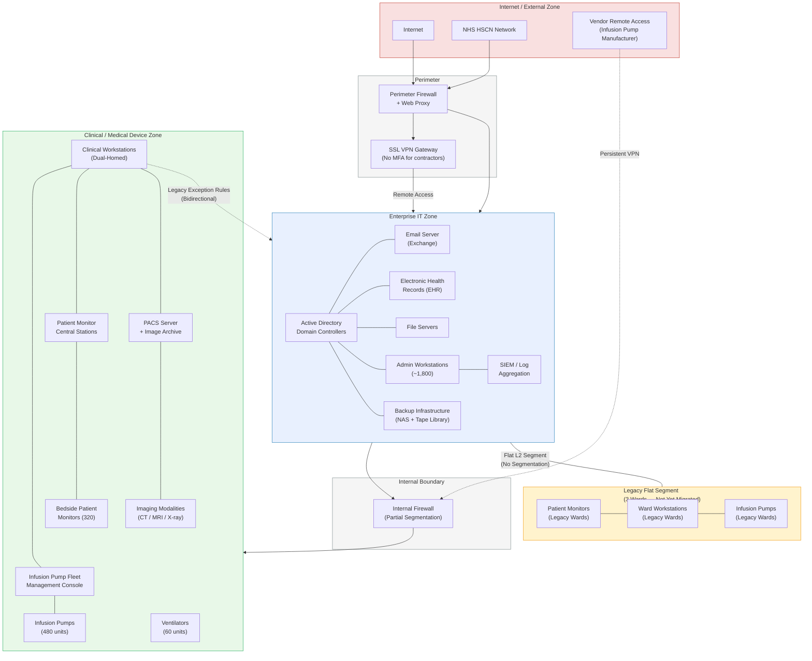

---

## Architecture Explanation

### Zone Design

Northgate's network follows a three-zone architecture common in NHS trusts that have undergone partial modernisation. The **Enterprise IT Zone** (blue) hosts all administrative and business systems, including Active Directory, email, the EHR platform, file services, and backup infrastructure. This zone is protected from the internet by a perimeter firewall with web proxy and content filtering. Remote access is provided through an SSL VPN gateway — the same gateway that, at the time of the incident, did not enforce multi-factor authentication for contractor accounts.

The **Clinical / Medical Device Zone** (green) houses the hospital's networked medical devices and the systems that manage them. This zone was designed as a segregated environment with its own VLAN infrastructure, separated from the enterprise zone by an internal next-generation firewall. The firewall enforces allow-list rules for cross-zone traffic — in principle, only specific data flows (EHR prescription data to the fleet management console, DICOM images from modalities to PACS) should traverse the boundary.

### The Segmentation Gap

The critical weakness lies in the incomplete migration. The **Legacy Flat Segment** (amber) represents the three inpatient wards that had not yet been migrated to the new clinical VLAN at the time of the incident. Devices on these wards — patient monitors, infusion pumps, and ward workstations — share a flat Layer-2 broadcast domain with enterprise workstations. There is no firewall or access control between them. This means that any compromise of an enterprise workstation on these floor segments provides direct, unfiltered network access to medical devices.

Additionally, a set of **dual-homed clinical workstations** (shown with dashed bidirectional links) maintain interfaces on both zones. These were provisioned as a pragmatic workaround: clinicians needed to access both the EHR (enterprise zone) and the infusion pump management console (clinical zone) from the same terminal. Legacy firewall exception rules permit this bidirectional traffic. These dual-homed machines are the primary cross-zone attack vector — a compromise of any one of them provides an attacker with a bridgehead into the clinical device network.

### Security-Safety Implications

The architecture has three properties that are directly relevant to the security-informed safety argument:

1. **Medical device dependence on enterprise services**: Infusion pumps and patient monitors ultimately depend on data originating in the enterprise zone (prescriptions, patient demographics). A loss of the enterprise zone therefore cascades to clinical device functionality.

2. **The IT/OT boundary is porous**: The internal firewall is the intended trust boundary between IT and clinical OT systems, but the dual-homed workstations and legacy flat segments undermine it. An attacker who reaches the clinical zone inherits the weak authentication and unencrypted protocol environment of legacy medical devices.

3. **Vendor remote access bypasses segmentation**: The infusion pump manufacturer's persistent VPN connection terminates directly in the clinical zone, providing an alternative entry point that bypasses the enterprise perimeter entirely. If the vendor's own credentials are compromised, the clinical zone is directly exposed.

## File: ./system_architecture/subsystem_descriptions.md

# Subsystem Descriptions — Northgate General Hospital

---

## Electronic Health Records (EHR)

Northgate's EHR platform is the central clinical information repository, holding patient demographics, medical histories, medication records, allergy information, clinical notes, and test results. The system supports electronic prescribing (ePrescribing), enabling clinicians to order medications that are verified by pharmacy and transmitted electronically to the infusion pump fleet management console for bedside administration.

**Patient safety relevance**: The EHR is the authoritative source of truth for clinical decision-making. Drug interaction checking, allergy alerts, and dose range validation all depend on the integrity and availability of EHR data. When the EHR is unavailable, clinicians revert to paper-based processes that lack these automated safety checks — reintroducing error modes (transcription mistakes, missed allergies, drug interactions) that electronic prescribing was specifically designed to eliminate.

**Key security vulnerabilities in the Northgate scenario**: The EHR application server resides in the enterprise IT zone and is therefore within the blast radius of any enterprise-wide ransomware event. Its database files were encrypted during the DarkVault attack, rendering the system completely inaccessible for approximately five days. The disaster recovery copy was hosted off-site by the EHR vendor but required an 18-hour restoration process. During this window, the hospital operated without electronic clinical records.

---

## PACS (Picture Archiving and Communication System)

The PACS manages the storage, retrieval, and distribution of diagnostic medical images. Imaging modalities (CT scanners, MRI machines, X-ray units, ultrasound devices) produce images in DICOM format, which are transmitted to the PACS server for archival and made available to radiologists and clinicians via PACS viewing workstations. The system also integrates with the radiology information system (RIS) for ordering and reporting workflows.

**Patient safety relevance**: Timely access to diagnostic imaging is essential for clinical decision-making in emergency care, surgical planning, and cancer diagnosis. PACS unavailability forces radiologists to read images directly from the scanner console — a slower process that delays diagnosis. More insidiously, if PACS image integrity is compromised (images altered, patient identifiers swapped), clinicians may make treatment decisions based on incorrect diagnostic information.

**Key security vulnerabilities in the Northgate scenario**: PACS uses the DICOM protocol, which was designed without native encryption or message authentication. Images are stored and transmitted in cleartext, and DICOM metadata (including patient identifiers) can be modified without cryptographic detection. The PACS server sits in the clinical zone but is accessed by radiologist workstations in the enterprise zone, making it a cross-zone data flow that depends on the internal firewall's exception rules. The PACS archive has no integrity verification mechanism — files can be modified at rest without generating an alert.

---

## Medical Device Network

### Infusion Pumps (Fleet of 480)

Smart infusion pumps deliver intravenous medications, fluids, and nutrition to patients at precisely controlled rates. The fleet is managed centrally through a fleet management console that distributes drug libraries (containing dose limits and concentration parameters), receives device status and error data, and enables remote firmware updates. Individual pumps connect wirelessly to the clinical VLAN.

**Patient safety relevance**: Infusion pumps are the final link in the medication administration chain. The drug library's dose range checking function is a critical safety barrier — it prevents clinicians from inadvertently programming a dose outside clinically safe limits. If the drug library is corrupted or the fleet management console is unavailable, this safety function is degraded or lost entirely.

**Key security vulnerabilities**: Pumps accept programming commands from any authenticated source on the clinical VLAN without per-device mutual authentication. The firmware update mechanism does not verify cryptographic signatures, meaning a compromised fleet management console could push malicious firmware to the entire fleet. The drug library update process is an administrative function with no pharmacist-in-the-loop verification at the point of distribution.

### Patient Monitors (320 Bedside Units)

Bedside patient monitors continuously measure vital signs — heart rate, blood pressure, SpO2, respiratory rate, and ECG — and alarm when parameters exceed configured thresholds. Monitors are aggregated through ward-level central stations that provide a consolidated view at the nursing station, enabling staff to oversee multiple patients simultaneously.

**Patient safety relevance**: Continuous monitoring and timely alarming are fundamental to the early detection of patient deterioration. The central station is particularly safety-critical on wards with high patient-to-nurse ratios, where individual bedside alarms may not be heard reliably. Loss of the central station degrades ward-level situational awareness.

**Key security vulnerabilities**: Alarm threshold configuration is centrally managed and can be modified from the central station or clinical workstations. There is no cryptographic protection or change-control enforcement on alarm parameter modifications. If an attacker gains access to the central station, they can silently alter alarm thresholds across an entire ward.

### Ventilators (60 Units)

Ventilators provide mechanical respiratory support to critically ill patients, primarily in intensive care and high-dependency units. At Northgate, the ventilator fleet includes a mix of newer networked models and older standalone units.

**Patient safety relevance**: Ventilators are life-sustaining devices. Any loss of function, misconfiguration, or interruption to a ventilator's operation can cause immediate, life-threatening harm. Networked ventilators exchange data with patient monitoring systems and clinical information systems, but their core respiratory function operates independently of network connectivity — a deliberate safety design.

**Key security vulnerabilities**: The networked ventilators transmit patient data and receive configuration updates over the clinical VLAN. While their core life-sustaining function is designed to be network-independent (they fail-safe to the last programmed settings if network connectivity is lost), the data integration interfaces could be exploited to provide misleading information to clinicians about ventilator status or patient respiratory parameters.

---

## Clinical Workstations

Clinical workstations are the primary interface through which nursing, pharmacy, and clinical engineering staff interact with both the EHR and medical device management systems. At Northgate, a subset of these workstations are dual-homed — configured with network interfaces on both the enterprise IT and clinical device VLANs — to provide seamless access to both environments.

**Patient safety relevance**: Clinical workstations are the operational bridge between the information world (EHR, prescriptions) and the physical world (medical devices, drug delivery). Clinicians depend on these machines for prescribing, dose verification, device programming, and monitoring. Their availability and integrity directly affect the reliability of clinical workflows.

**Key security vulnerabilities**: The dual-homed configuration is the most significant vulnerability in the Northgate architecture. These workstations create a direct Layer-3 path between the enterprise and clinical zones, bypassing the internal firewall for any traffic that originates from or is destined to the workstation itself. They are domain-joined enterprise machines, meaning that a domain-wide compromise (such as a malicious GPO) will affect them — and through them, provide access to the clinical device network. They run older operating systems in some cases, to maintain compatibility with medical device management software.

---

## Enterprise IT (Administrative Systems)

The enterprise IT environment comprises Active Directory domain services (authentication, group policy, identity management), email (Microsoft Exchange), finance and HR applications, management reporting, file and print services, and the Trust's backup infrastructure (a network-attached storage appliance and tape library). The SIEM platform, which aggregates logs from enterprise and (partially) clinical systems, also resides here.

**Patient safety relevance**: Enterprise IT systems do not directly deliver patient care, but they are foundational dependencies. Active Directory provides authentication for users across both enterprise and clinical workstations. Email is the primary communication channel for clinicians during normal operations and carries clinical communications (referrals, discharge summaries). The backup infrastructure is the safety net for data recovery following any incident.

**Key security vulnerabilities**: Active Directory is the highest-value target in the enterprise zone — domain admin compromise provides access to every domain-joined system, including the dual-homed clinical workstations. The backup infrastructure at Northgate was network-accessible from the enterprise zone without air-gapping or immutability controls, meaning that a ransomware attack that compromised the enterprise zone could also destroy the backup estate. The SIEM's coverage of the clinical zone was partial — medical device logs were not ingested, creating a monitoring blind spot.

## File: ./system_architecture/system_overview.md

# System Overview — Northgate General Hospital

---

## ICT and Clinical System Environment

Northgate General Hospital operates a heterogeneous ICT estate that has evolved over two decades of incremental investment, punctuated by periodic modernisation projects. The hospital's digital infrastructure serves three broad functions: enterprise administration (finance, HR, email, management reporting), clinical information management (electronic health records, diagnostic imaging, clinical decision support), and direct patient care delivery (networked medical devices that administer treatments and monitor patient physiology). These functions are interconnected — a medication prescription originates in the EHR, flows to a pharmacy verification system, and ultimately programmes an infusion pump at the bedside — creating data dependencies that cross organisational and network boundaries.

## Three Network Zones

The hospital's network is organised into three logical zones, though the physical implementation of this segmentation is incomplete at the time of the incident.

### Enterprise IT Zone

The enterprise zone hosts the Trust's administrative and communication systems: Active Directory domain services, email (Microsoft Exchange), finance and HR applications, management reporting databases, and staff workstations. This zone connects to the internet through a perimeter firewall and web proxy. It also hosts the Trust's remote access infrastructure — an SSL VPN gateway used by staff and contractors. The EHR application server resides in this zone, as do file servers and the print management infrastructure. Approximately 1,800 domain-joined workstations are deployed across the hospital site.

### Clinical / Medical Device Zone

The clinical zone houses networked medical devices and the systems that manage them. This includes the infusion pump fleet (480 units) and its centralised fleet management console, patient monitoring systems (320 bedside monitors aggregated through ward-level central stations), ventilators (60 units), and clinical workstations used by nursing and pharmacy staff to interact with these devices. The PACS (Picture Archiving and Communication System) and its associated radiology information system also reside in this zone, handling DICOM image data from CT, MRI, X-ray, and ultrasound modalities. Communication within this zone uses a mix of HL7 v2 messaging, DICOM, and proprietary vendor protocols — many of which predate modern encryption and authentication standards.

### External Zone

The external zone encompasses all connections beyond the Trust's network perimeter. This includes internet access (filtered through the perimeter firewall and web proxy), the NHS Health and Social Care Network (HSCN) for inter-Trust communication and national services, and vendor remote-access connections for medical device support and maintenance. A biomedical device vendor maintains a persistent VPN connection to the clinical zone for firmware updates and remote troubleshooting of the infusion pump fleet.

## IT/OT Integration Points

The critical security-safety intersection points are the interfaces between the enterprise IT environment and the clinical device zone. These include:

- **Dual-homed clinical workstations**: Machines with network interfaces on both zones, maintained to allow clinicians simultaneous access to the EHR (enterprise zone) and device management applications (clinical zone). These workstations are the primary cross-zone attack surface.
- **EHR-to-device data flows**: Prescription data flows from the EHR to the infusion pump management console, crossing the zone boundary. This is a functional dependency — if the EHR is compromised, downstream device programming is affected.
- **PACS integration**: Diagnostic imaging modalities in the clinical zone write images to PACS storage, which is accessed by radiologists via workstations in the enterprise zone. DICOM traffic crosses the zone boundary.

## Known Weaknesses

At the time of the incident, several security gaps were known but unresolved:

1. The network segmentation project was 70% complete — three inpatient wards remained on a flat Layer-2 segment shared with enterprise systems.
2. Legacy firewall exception rules permitted bidirectional access between specific clinical workstations and the enterprise zone.
3. The SSL VPN did not enforce multi-factor authentication for contractor accounts.
4. On-site backup infrastructure was network-accessible from the enterprise zone without air-gapping.
5. Medical device communication protocols lacked encryption and mutual authentication.
6. No formal governance structure linked the IT Security team with Clinical Engineering for managing cyber risks to medical devices.

## File: ./theoretical_background/background.md

# Theoretical Background: Cybersecurity and Patient Safety in Healthcare

A Primer for Security-Informed Safety

---

## 1. Why Cybersecurity Matters in Healthcare

Cybersecurity in healthcare is not primarily about protecting data — it is about protecting patients. This distinction is fundamental to the security-informed safety approach, and it requires a reframing of the familiar CIA Triad (Confidentiality, Integrity, Availability) for the clinical context.

In most enterprise environments, **confidentiality** dominates the security conversation: protecting personal data from disclosure, securing intellectual property, maintaining commercial privacy. In healthcare, confidentiality remains important — patient records are sensitive and protected by law — but it is rarely the most safety-critical concern. A data breach that exposes patient records is harmful, but a cyber attack that corrupts clinical data or disables medical devices can kill.

**Integrity** is the paramount concern. A clinician prescribing medication needs to trust that the patient's allergy record is accurate, that the drug interaction database has not been tampered with, and that the diagnostic image on screen genuinely belongs to this patient. If any of these data integrity properties are violated, clinical decisions may be made on false information — with direct consequences for patient safety. Unlike confidentiality breaches, which are detected after the fact through audit, integrity failures may not be detectable at the point of use. A falsified laboratory result looks exactly like a genuine one.

**Availability** is the second critical property. A doctor needs accurate data immediately — not eventually. When an EHR system goes offline during a ransomware attack, clinicians lose access to medication histories, allergy records, and active prescriptions. Manual workarounds (paper charts, phone calls to the pharmacy) are slow, error-prone, and do not scale. Medical devices that depend on network connectivity for central management lose their safety-critical monitoring and dose-checking functions when the network is compromised. In emergency medicine and critical care, even minutes of unavailability can change patient outcomes.

This reordering — Integrity and Availability first, Confidentiality second — is the starting point for understanding why cybersecurity is a patient safety concern, not merely a data protection obligation.

---

## 2. The Security-to-Safety Pathway

The core concept of security-informed safety is the recognition that a cyber attack can create a chain of consequences that terminates in a physical safety hazard. This chain can be expressed as:

**Cyber attack → Clinical system compromise → Functional safety failure → Patient harm**

Each link in this chain represents a distinct domain of analysis:

### Cyber Attack
A threat actor exploits a vulnerability in the hospital's ICT environment. This might be a ransomware group encrypting servers, a sophisticated attacker manipulating medical device configurations, or an insider inadvertently introducing malware. The attack techniques are drawn from the standard cybersecurity threat landscape — phishing, credential abuse, lateral movement, privilege escalation — and are well-characterised by frameworks such as MITRE ATT&CK.

### Clinical System Compromise
The cyber attack affects one or more clinical systems: the EHR becomes unavailable, medical device management consoles are encrypted, patient monitoring central stations go offline, or diagnostic imaging data is corrupted. The compromise may affect system *availability* (the system cannot be used), *integrity* (the system produces unreliable data), or both.

### Functional Safety Failure
Clinical systems implement safety functions — dose range checking on infusion pumps, alarm threshold monitoring on patient monitors, allergy verification in the EHR. When these systems are compromised, their safety functions are degraded or lost. A dose range check that cannot execute because the drug library is corrupted has the same effect as no dose range check at all. An alarm that does not fire because its threshold has been manipulated is a silent failure with no visible warning.

### Patient Harm
The degradation of safety functions creates a hazard — a condition with the potential to cause physical harm. In the Northgate scenario, the hazards include: medication dosing errors due to loss of electronic prescribing guardrails, delayed detection of patient deterioration due to loss of centralised alarming, and misdiagnosis due to corrupted imaging data. The hazard becomes a harm event when it coincides with a clinical situation that requires the safety function — a patient who needs a dose adjustment when the pump's drug library is corrupted, or a patient who deteriorates when the alarm system has been silently disabled.

### Key Concepts

**Functional safety** is the property of a system that ensures it performs its intended safety function correctly, or achieves a safe state when it cannot. In healthcare, functional safety encompasses device-level functions (pump dose limits, ventilator pressure controls) and system-level functions (alarm aggregation, clinical decision support).

**A safety case** is a structured argument, supported by evidence, that a system is acceptably safe for its intended use. In the security-informed safety approach, the safety case must explicitly address cyber threats — demonstrating that the safety functions remain effective even when the system is under attack or has been compromised.

**A hazard** is a condition that, in combination with other conditions, could lead to harm. A hazard is not the same as an incident — it is a precondition for harm. The distinction matters because security-informed safety analysis identifies hazards that arise from cyber compromise, allowing controls to be designed before a harm event occurs.

---

## 3. Threat Landscape

Healthcare organisations face a diverse threat landscape, with three categories of threat actor accounting for the majority of incidents:

### Ransomware Groups (Most Common)
Financially motivated ransomware-as-a-service operations are the most frequent attackers of healthcare organisations. Healthcare is an attractive target because of its low tolerance for downtime — hospitals cannot simply "go offline" while systems are recovered. The WannaCry attack of 2017 disrupted approximately one-third of NHS trusts in England, and the subsequent years have seen a steady increase in targeted ransomware campaigns against healthcare providers worldwide. Double-extortion models (encrypting data while exfiltrating and threatening to leak it) add regulatory and reputational pressure to the operational disruption. Ransomware attacks primarily affect availability, but they can cross into safety-critical territory when clinical devices and monitoring systems are within the blast radius.

### State-Sponsored Actors (Highest Sophistication)
Nation-state cyber operations targeting healthcare are less frequent but represent the highest-capability threat. State-sponsored actors have conducted operations against healthcare research institutions (notably during the COVID-19 pandemic), medical device manufacturers, and hospital networks. Their objectives range from intellectual property theft to pre-positioning for potential disruption during geopolitical crises. The tools and techniques available to state-sponsored actors — zero-day exploits, supply-chain compromises, advanced persistent access — make them significantly harder to detect and contain than ransomware groups.

### Insiders (Most Underestimated)
Insider threats encompass both malicious actors (disgruntled employees, financially motivated data thieves) and negligent individuals who inadvertently create security exposures. In healthcare, the insider threat is amplified by the large and diverse workforce, the use of temporary and agency staff, and the operational imperative to maintain broad system access for clinical care. Credential sharing, weak password practices, and the use of personal devices on clinical networks are endemic in many healthcare environments. The Northgate scenario illustrates the negligent insider pathway: a contractor's poor credential hygiene directly enabled the initial VPN compromise.

---

## 4. Key Vulnerabilities in Healthcare Environments

Healthcare environments present a distinctive set of cybersecurity challenges that make them disproportionately vulnerable to attacks with safety consequences:

### Legacy Medical Devices
Many networked medical devices run embedded operating systems that are years or decades behind current security standards. These devices were designed and certified for safety in an era before network connectivity was ubiquitous, and their software may not support modern encryption, authentication, or patching. Updating the software on a safety-certified medical device may trigger a recertification requirement under IEC 62304, creating a conflict between security best practice (patch promptly) and safety assurance (do not modify certified software without re-validation). This "patching paradox" is a defining challenge of healthcare cybersecurity.

### Poor Network Segmentation
Effective network segmentation — isolating medical devices from enterprise IT systems — is the most important architectural defence against the security-to-safety pathway. In practice, many hospitals have incomplete or poorly maintained segmentation. Legacy flat networks, pragmatic firewall exceptions (to maintain clinical workflows), and dual-homed workstations all create pathways through which an enterprise compromise can reach clinical devices. The Northgate scenario is typical: the segmentation project was underway but incomplete at the time of the attack.

### Staff Social Engineering Susceptibility
Healthcare workers operate under time pressure, are trained to be responsive and helpful, and frequently receive legitimate communications from unfamiliar external parties (referrals, vendor communications, patient enquiries). These characteristics make them susceptible to social engineering — particularly spear-phishing, which remains the most common initial access vector in healthcare cyber incidents. Security awareness training helps but cannot eliminate the risk entirely; layered technical controls (email filtering, URL sandboxing, endpoint detection) are essential complements.

### Patching Constraints on Safety-Certified Devices
Beyond legacy devices, even modern medical equipment may have patching constraints. Device manufacturers must validate that security patches do not affect the device's safety-critical functions, a process that can take weeks or months. During this window, the device remains vulnerable. Some manufacturers do not provide timely patches at all, leaving hospitals dependent on compensating network-level controls (segmentation, monitoring) as their only defence.

---

## 5. Concept Alignment Glossary

Security and safety engineering use overlapping but distinct terminology. The following table aligns key concepts across the two disciplines:

| Security Concept | Safety Concept | Relationship |
|-----------------|---------------|--------------|
| **Threat** — An actor or event with the potential to exploit a vulnerability | **Hazard** — A condition with the potential to cause harm | A cyber threat can give rise to a safety hazard when it affects a safety-critical system |
| **Vulnerability** — A weakness that can be exploited by a threat | **Failure mode** — A way in which a system can fail to perform its intended function | A cybersecurity vulnerability in a medical device can create a failure mode that compromises patient safety |
| **Incident response** — The process of detecting, containing, and recovering from a security event | **Emergency procedure** — A pre-defined response to a safety-critical event | In a cyber-safety event, incident response and emergency procedures must be coordinated — IT containment actions can trigger clinical safety consequences |
| **Risk** (security) — Likelihood of a threat exploiting a vulnerability × impact | **Risk** (safety) — Likelihood of a hazard leading to harm × severity | Security risk assessment and safety risk assessment must be integrated when the threat pathway leads to a safety hazard |
| **Control** — A measure that reduces security risk (firewall, EDR, MFA) | **Safeguard / Safety barrier** — A measure that prevents or mitigates a hazardous event (alarm, interlock, dose limit) | In security-informed safety, some security controls also function as safety barriers (e.g., network segmentation prevents threats reaching safety-critical devices) |
| **Attack surface** — The set of points where an attacker can interact with a system | **Exposure** — The extent to which people or systems are subject to a hazard | The cyber attack surface of a medical device network determines the exposure of patients to cyber-enabled safety hazards |
