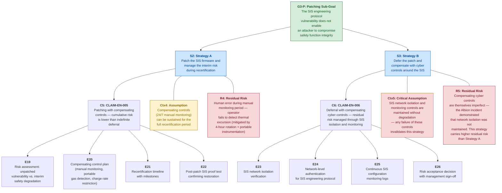
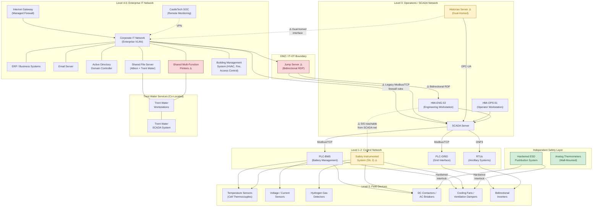

# SIS02 Energy: Information Pack

This information pack contains comprehensive background information about the Albion Energy scenario, including system architecture, regulatory frameworks, requirements, and incident details.

---

## File: ./assurance_cases/assurance_case_overview.md

# Security-Informed Safety Assurance Case — Albion Energy Storage Facility

---

## Assurance Case Structure (Goal Structuring Notation)

The following diagram presents the top-level structure of the security-informed safety assurance case for Albion Energy Storage Ltd, using Goal Structuring Notation (GSN) concepts rendered in Mermaid. Node prefixes indicate GSN element types: **G** = Goal, **S** = Strategy, **C** = Claim (security-informed safety claim), **E** = Evidence, **Ctx** = Context, **R** = Residual Risk, **P** = Patching Constraint Argument.

```mermaid
graph TD
    G1["<b>G1: Top-Level Goal</b><br/>The Albion Energy Storage facility<br/>does not create a physical hazard<br/>to personnel, equipment, or the grid<br/>as a result of a cyber attack on<br/>its control systems"]

    Ctx1["<b>Ctx1: Scope</b><br/>Albion Storage Facility<br/>SCADA/ICS environment as<br/>described in system architecture"]
    Ctx2["<b>Ctx2: Threat Model</b><br/>Threat actors include initial<br/>access brokers, state-sponsored<br/>APT groups, and compromised<br/>contractors"]

    G1 --- Ctx1
    G1 --- Ctx2

    S1["<b>S1: Strategy</b><br/>Argue over three sub-goals<br/>corresponding to the three<br/>layers of defence against<br/>cyber-to-physical hazard"]

    G1 --> S1

    S1 --> G2["<b>G2: Sub-Goal 1</b><br/>The IT/OT boundary prevents<br/>enterprise IT compromise from<br/>reaching safety-critical<br/>control systems"]
    S1 --> G3["<b>G3: Sub-Goal 2</b><br/>Safety Instrumented System<br/>integrity is maintained under<br/>all network conditions including<br/>loss of network connectivity"]
    S1 --> G4["<b>G4: Sub-Goal 3</b><br/>Control system commands<br/>cannot be issued from<br/>unauthorised sources"]

    %% Sub-Goal 1: IT/OT Boundary
    G2 --> C1["<b>C1: CLAIM-EN-001</b><br/>IT/OT boundary protects<br/>control system integrity"]
    G2 --> C11["<b>C11: CLAIM-EN-011</b><br/>Cross-sector dependency<br/>management prevents<br/>cascading failure"]
    G2 --> C12["<b>C12: CLAIM-EN-012</b><br/>Supply chain integrity<br/>prevents compromised<br/>safety components"]

    C1 --> E1["<b>E1</b><br/>IT/OT penetration test<br/>(enterprise to SCADA blocked)"]
    C1 --> E2["<b>E2</b><br/>Firewall rule audit<br/>(no legacy ICS protocol rules)"]
    C1 --> E3["<b>E3</b><br/>Jump server config audit<br/>(unidirectional enforcement)"]
    C11 --> E4["<b>E4</b><br/>Cross-sector dependency<br/>risk assessment"]
    C11 --> E5["<b>E5</b><br/>Shared infrastructure<br/>segmentation audit"]
    C12 --> E6["<b>E6</b><br/>Firmware hash verification<br/>records at delivery"]

    G2 --- Ctx3["<b>Ctx3: Assumption</b><br/>IT/OT boundary configuration<br/>is audited quarterly and<br/>revalidated after any change"]

    G2 --- R1["<b>R1: Residual Risk</b><br/>Novel application-layer exploit<br/>traverses boundary via permitted<br/>OPC-UA or Modbus traffic<br/>(accepted — mitigated by ICS<br/>anomaly detection on SCADA net)"]

    %% Sub-Goal 2: SIS Integrity
    G3 --> C2["<b>C2: CLAIM-EN-002</b><br/>SIS network isolation<br/>preserves safety function<br/>independence"]
    G3 --> C7["<b>C7: CLAIM-EN-007</b><br/>Independent sensor validation<br/>detects data falsification"]
    G3 --> C8["<b>C8: CLAIM-EN-008</b><br/>Hardwired ESD provides<br/>cyber-independent ultimate<br/>safety boundary"]

    C2 --> E7["<b>E7</b><br/>SIS physical network isolation<br/>diagram and verification"]
    C2 --> E8["<b>E8</b><br/>Penetration test — SIS<br/>unreachable from SCADA net"]
    C2 --> E9["<b>E9</b><br/>SIS proof test with<br/>SCADA disconnected"]
    C7 --> E10["<b>E10</b><br/>Cross-validation system<br/>test results"]
    C8 --> E11["<b>E11</b><br/>Hardwired ESD circuit<br/>independence verification"]
    C8 --> E12["<b>E12</b><br/>ESD proof test with all<br/>digital systems powered off"]

    G3 --- R2["<b>R2: Residual Risk</b><br/>SIS sensor hardware failure<br/>coincident with cyber attack<br/>(accepted — SIL 2 reliability<br/>accounts for random hardware<br/>failure probability)"]

    %% Sub-Goal 3: Command Authorisation
    G4 --> C3["<b>C3: CLAIM-EN-003</b><br/>PLC programme integrity<br/>prevents control logic<br/>manipulation"]
    G4 --> C4["<b>C4: CLAIM-EN-004</b><br/>Modbus/TCP command<br/>authentication prevents<br/>sensor data falsification"]
    G4 --> C9["<b>C9: CLAIM-EN-009</b><br/>Vendor/contractor access<br/>controls prevent insider<br/>OT attack"]

    C3 --> E13["<b>E13</b><br/>PLC programme hash<br/>comparison logs"]
    C3 --> E14["<b>E14</b><br/>Dual-authorisation records<br/>for PLC changes"]
    C4 --> E15["<b>E15</b><br/>Modbus authentication<br/>mechanism test results"]
    C4 --> E16["<b>E16</b><br/>SCADA source whitelist<br/>configuration audit"]
    C9 --> E17["<b>E17</b><br/>Contractor access management<br/>system audit"]
    C9 --> E18["<b>E18</b><br/>Session recording archive<br/>for contractor OT access"]

    G4 --- R3["<b>R3: Residual Risk</b><br/>Compromised authorised user<br/>with valid dual-authorisation<br/>partner (accepted — mitigated<br/>by session recording and<br/>anomaly detection)"]

    style G1 fill:#d4edda,stroke:#155724,color:#155724
    style G2 fill:#d4edda,stroke:#155724,color:#155724
    style G3 fill:#d4edda,stroke:#155724,color:#155724
    style G4 fill:#d4edda,stroke:#155724,color:#155724
    style S1 fill:#cce5ff,stroke:#004085,color:#004085
    style Ctx1 fill:#fff3cd,stroke:#856404,color:#856404
    style Ctx2 fill:#fff3cd,stroke:#856404,color:#856404
    style Ctx3 fill:#fff3cd,stroke:#856404,color:#856404
    style R1 fill:#f8d7da,stroke:#721c24,color:#721c24
    style R2 fill:#f8d7da,stroke:#721c24,color:#721c24
    style R3 fill:#f8d7da,stroke:#721c24,color:#721c24
```

---

## Patching Constraint Sub-Argument

The following diagram presents the dedicated sub-argument addressing the SIS patching constraint — the defining security-informed safety tension for ICS environments. This sub-argument sits under G3 (SIS Integrity) and presents two alternative strategies, only one of which can be active at any time.

---

## Narrative Explanation

### Structure of the Argument

The assurance case is structured around a single top-level safety goal (**G1**): the Albion Energy Storage facility does not create a physical hazard to personnel, equipment, or the national grid as a result of a cyber attack on its control systems. This goal is deliberately scoped to cyber-originated physical hazards — it does not address all operational risks (equipment failure, natural events, human error unrelated to cyber), only those arising from the intersection of cybersecurity and industrial safety.

The argument decomposes through a single strategy (**S1**) into three sub-goals, each corresponding to a distinct defensive layer in the cyber-to-physical hazard pathway:

**Sub-Goal G2 (IT/OT Boundary)** addresses the architectural question — whether a compromise of the enterprise IT network can reach the safety-critical SCADA and control systems. This is the outermost defensive layer. The supporting claims argue that proper IT/OT segmentation (CLAIM-EN-001), cross-sector dependency management (CLAIM-EN-011), and supply chain integrity (CLAIM-EN-012) collectively prevent an enterprise-zone attacker from accessing the control environment. The evidence required includes penetration testing, firewall audits, and supply chain verification.

This sub-goal directly addresses the three architectural failures that made the Albion incident possible: the dual-homed historian, the bidirectional jump server, and the legacy Modbus/TCP firewall rules. If G2 had been fully satisfied at the time of the incident — that is, if the IT/OT boundary had been properly implemented — the attacker would not have been able to reach the SCADA server from the enterprise network foothold.

**Sub-Goal G3 (SIS Integrity)** addresses the most critical safety layer — whether the Safety Instrumented System will function correctly even if the control system is compromised. The supporting claims argue that SIS network isolation (CLAIM-EN-002) ensures the SIS is unreachable from the SCADA network, independent sensor validation (CLAIM-EN-007) detects data falsification, and the hardwired ESD system (CLAIM-EN-008) provides an ultimate safety boundary that cannot be compromised via any network-based attack.

G3 includes the **patching constraint sub-argument** — a dedicated section that addresses the SIS firmware vulnerability and presents two alternative strategies for managing it. This is the most original and pedagogically important part of the assurance case.

**Sub-Goal G4 (Command Authorisation)** addresses whether control system commands can be issued from unauthorised sources — the "even if the attacker reaches the SCADA network, can they actually control anything?" question. The supporting claims argue that PLC programme integrity verification (CLAIM-EN-003), Modbus/TCP command authentication (CLAIM-EN-004), and vendor/contractor access controls (CLAIM-EN-009) prevent unauthorised command execution.

### The Patching Constraint Argument

The patching constraint sub-argument is the centrepiece of the assurance case from a Security-Informed Safety teaching perspective. It presents two strategies for managing a known vulnerability in a safety-certified component, and neither strategy is risk-free:

**Strategy A (Patch and Recertify)** — represented by CLAIM-EN-005 — argues that applying the patch is the correct long-term decision, accepting a temporary increase in safety risk during the recertification period. The argument requires evidence that compensating controls (continuous manual monitoring, portable gas detection, charge rate restrictions) can adequately substitute for the automated SIS protection during recertification. The residual risk is human error during the manual monitoring period.

**Strategy B (Defer and Compensate)** — represented by CLAIM-EN-006 — argues that deferring the patch preserves the certified safety function, with compensating cyber controls (SIS network isolation, network-level access control for the engineering protocol, configuration monitoring) managing the vulnerability risk. The residual risk is that the compensating controls are themselves imperfect — and the Albion incident vividly demonstrated this: the SIS was accessible from the SCADA network despite the design intent for isolation, and the engineering protocol was exploited without detection.

The assurance case does not prescribe which strategy is correct — this is a genuine risk management decision that depends on the specific facility, its operational context, and its organisational risk appetite. What the case does demonstrate is that the decision must be made explicitly, with documented risk assessments and defined compensating controls, rather than by default through indefinite deferral (which is what happened at Albion).

### What the Assurance Case Demonstrates

The assurance case demonstrates several key principles about the relationship between IT security controls and OT safety:

1. **Security controls are safety evidence.** Every claim in the assurance case depends on a cybersecurity control. Network segmentation, access control, firmware integrity, and monitoring are not merely IT security measures — they are evidence nodes in a safety argument. When a security control fails, the safety argument that depends on it is weakened or invalidated.

2. **Defence in depth maps to layers of protection.** The three sub-goals correspond to three independent layers of defence. G2 (boundary) should prevent the attacker from reaching OT at all. G3 (SIS) should ensure safety even if OT is compromised. G4 (authorisation) should prevent unauthorised commands even if the attacker is on the OT network. In the Albion incident, G2 failed, G4 was not implemented, and G3 was compromised through the engineering protocol vulnerability. Only the hardwired ESD (the innermost evidence node of G3) remained intact.

3. **The argument breaks down where security and safety requirements conflict.** The patching constraint is the point where the security argument ("patch this vulnerability") and the safety argument ("do not modify this certified component") cannot both be satisfied simultaneously. The assurance case makes this conflict explicit and requires a documented decision with compensating controls — rather than allowing the conflict to be resolved by default through inaction.

### Where the Argument Breaks Down — Residual Risks

Three explicit residual risks are identified in the main argument:

**R1** — A novel application-layer exploit could traverse the IT/OT boundary via permitted protocol traffic (OPC-UA or Modbus). This risk is accepted because it requires a significantly more sophisticated attack than the boundary misconfigurations exploited in the Albion incident, and it is partially mitigated by ICS anomaly detection on the SCADA network (which would detect unusual command patterns even if the source appeared legitimate).

**R2** — A random SIS sensor hardware failure coinciding with a cyber attack could prevent the SIS from detecting a dangerous condition even if the SIS logic is uncompromised. This risk is quantified within the SIL 2 reliability framework — the probability of failure on demand is between $10^{-3}$ and $10^{-2}$, and this probability bound accounts for random hardware failure.

**R3** — A compromised authorised user with a valid dual-authorisation partner could issue malicious PLC commands that pass all authentication and integrity checks. This insider threat residual risk is mitigated by session recording and behavioural anomaly detection, but cannot be eliminated entirely by technical controls.

Two further residual risks (**R4** and **R5**) are specific to the patching constraint strategies and are discussed in the sub-argument above.

### The Defining Tension

The Albion assurance case ultimately illustrates that security-informed safety is not about achieving perfect security or perfect safety in isolation. It is about understanding where cybers security controls are load-bearing elements in a safety argument, making the dependencies explicit, and managing the inevitable tensions — particularly the patching constraint — through deliberate, documented, risk-informed decisions rather than through neglect or default.

## File: ./regulatory_frameworks/overview.md

# Regulatory Framework Overview — Energy Sector

Applicable regulations and standards for the Albion Energy Storage Facility, covering UK-specific cybersecurity regulation, functional safety standards, and industrial control system security standards.

---

## 1. UK Regulations

### NIS Regulations 2018

The Network and Information Systems Regulations 2018 are the UK's transposition of the EU NIS Directive. They impose cybersecurity obligations on **operators of essential services (OES)** across critical sectors including energy. Albion Energy Storage Ltd, as an operator of electricity storage and distribution infrastructure connected to the national grid, falls within the scope of the NIS Regulations as an OES in the energy sector.

The regulations impose two primary obligations. First, a **security duty**: OES must take appropriate and proportionate technical and organisational measures to manage the risks to the security of the network and information systems on which their essential service depends. Second, an **incident reporting duty**: OES must notify the designated competent authority (for energy, this is OFGEM in England and Wales) of any incident that has a significant impact on the continuity of the essential service, within 72 hours of becoming aware of it. The Albion incident — involving compromise of ICS systems controlling grid-connected energy storage and a brief deviation in grid frequency — clearly meets the threshold for notification.

The NIS Regulations do not prescribe specific technical controls but instead reference the **NCSC Cyber Assessment Framework (CAF)** as the assessment methodology. Competent authorities (OFGEM for energy) use the CAF to assess OES compliance with the security duty. Non-compliance can result in enforcement action including information notices, enforcement notices, and financial penalties of up to £17 million.

### NCSC Cyber Assessment Framework (CAF)

The CAF is the UK National Cyber Security Centre's framework for assessing the cybersecurity of organisations operating essential services. It is structured around four objectives:

**Objective A — Managing Security Risk**: The organisation has appropriate governance and risk management processes in place, including for OT and ICS environments. For Albion, this encompasses the IT/OT boundary risk assessment, cross-sector dependency risk assessment (Trent Water), and the security-safety risk trade-off decisions (e.g., the SIS patching decision).

**Objective B — Protecting Against Cyber Attack**: The organisation implements proportionate security measures. Key contributing outcomes include B.2 (Identity and Access Management — addressing the dormant contractor accounts and default PLC credentials at Albion), B.4 (System Security — addressing application whitelisting, firmware integrity, and OS hardening), and B.5 (Resilient Networks and Systems — addressing the IT/OT boundary weaknesses).

**Objective C — Detecting Cyber Security Events**: The organisation has monitoring and detection capabilities proportionate to the risk. CAF C.1 (Security Monitoring) directly addresses the gap in the Albion scenario — the absence of any real-time monitoring for the SCADA/OT environment.

**Objective D — Minimising the Impact of Cyber Security Incidents**: The organisation can respond to and recover from incidents. CAF D.1 (Response and Recovery Planning) covers the OT incident response plan, and D.2 (Response and Recovery Capability) covers the practical ability to contain, eradicate, and recover — including the SIS recertification process.

### OFGEM Security Requirements

OFGEM, as the sector-specific regulator and designated competent authority for energy under the NIS Regulations, assesses electricity operators against the CAF and has published sector-specific guidance on cybersecurity expectations. Key areas of focus include: protection of operational technology and SCADA systems from cyber threats, management of third-party and supply chain cyber risks (particularly relevant given Albion's reliance on CastleTech Solutions), and incident reporting and response capabilities. OFGEM conducts periodic inspections and CAF assessments of OES and can take enforcement action for non-compliance with the NIS Regulations security duty.

---

## 2. Safety Standards

### IEC 61511 — Safety Instrumented Systems for the Process Industries

IEC 61511 is the primary standard governing the design, installation, operation, and maintenance of Safety Instrumented Systems in the process industries, including energy storage and distribution. It specifies the lifecycle for safety instrumented functions: from hazard and risk assessment, through SIL determination, SIS design and implementation, to operation, maintenance, and modification.

For the Albion scenario, IEC 61511 is critical because it defines the framework under which the SIS was certified — and the rules that govern what happens when a change is proposed to a certified safety system. Clause 5.2.6.1 (added in the 2016 edition) specifically addresses cybersecurity threats to SIS, requiring organisations to perform a security risk assessment and implement security measures appropriate to the SIL of the safety function. Clause 11.2.4 requires the SIS to be independent of the basic process control system — a requirement violated at Albion where the SIS engineering port was accessible from the SCADA network.

The most consequential provision for the Albion scenario is the **modification management** requirement: any change to a certified SIS — including applying a software or firmware patch — triggers the modification management process, which may require partial or full revalidation of the safety function. This is not merely a bureaucratic hurdle; it reflects the engineering reality that any software change can introduce unintended behaviour in a safety-critical system. The time, cost, and interim safety risk of revalidation is the source of the "patching constraint" that defines the security-safety tension in this case study.

### IEC 61508 — Functional Safety of E/E/PE Systems

IEC 61508 is the parent standard for functional safety of electrical, electronic, and programmable electronic safety-related systems. It provides the foundational framework for Safety Integrity Levels (SIL 1 through SIL 4), defines the concept of safety lifecycle management, and establishes the requirements for hardware and software reliability of safety functions. IEC 61511 is the sector-specific application of IEC 61508 for the process industries.

IEC 61508 defines SIL in terms of probability of failure on demand (PFD) for low-demand systems and probability of dangerous failure per hour (PFH) for continuous/high-demand systems. The Albion SIS thermal protection function, rated SIL 2, must achieve a PFD between $10^{-3}$ and $10^{-2}$ — a one-in-a-hundred to one-in-a-thousand probability of failing when a dangerous condition occurs. The standard establishes that this reliability target applies to the complete safety function chain: from sensor input, through the logic solver, to the final element actuation.

---

## 3. Security Standards

### IEC 62443 — Industrial Automation and Control Systems Security

IEC 62443 is a family of standards addressing the security of industrial automation and control systems (IACS). It provides a comprehensive framework covering organisational processes, system-level requirements, and component-level requirements. For the Albion scenario, the most relevant parts are:

**IEC 62443-3-3 (System Security Requirements)**: Defines security requirements organised by foundational requirements (identification and authentication, use control, system integrity, data confidentiality, restricted data flow, timely response to events, resource availability). The zone and conduit model in IEC 62443 maps directly to the Purdue Reference Model — each zone has a target security level (SL-T), and conduits between zones must enforce the boundary security properties. The failures at Albion (dual-homed historian, bidirectional jump server, legacy firewall rules) all represent violations of conduit security requirements.

**IEC 62443-2-4 (Service Provider Requirements)**: Defines security requirements for IACS service providers — directly relevant to CastleTech Solutions' role as managed IT service provider with cross-organisational access.

**IEC 62443-4-2 (Component Security Requirements)**: Defines security requirements for individual IACS components, including PLCs, RTUs, and SIS devices. The requirement for human user identification and authentication (CR 1.1) — which the Albion PLCs and SIS did not meet — is specified here.

### NERC CIP (North American Context)

The North American Electric Reliability Corporation's Critical Infrastructure Protection (NERC CIP) standards provide a useful comparison point, representing one of the most mature mandatory cybersecurity compliance frameworks for the energy sector globally. Key standards include CIP-005 (Electronic Security Perimeter — defining network boundary controls for critical cyber assets), CIP-007 (Systems Security Management — covering patch management, access control, and security event monitoring), and CIP-013 (Supply Chain Risk Management). While NERC CIP does not apply to UK operators, it illustrates what a prescriptive, audit-driven approach to ICS security compliance looks like — and provides useful benchmarks for evaluating the adequacy of controls at facilities like Albion.

## File: ./regulatory_frameworks/standards_mapping.md

# Standards Mapping — Energy Sector Security-Safety Dependencies

This table maps regulatory requirements applicable to Albion Energy Storage Ltd as an operator of essential services in the energy sector, showing how security obligations create specific dependencies with functional safety requirements. The final column identifies the security-safety intersection — the point where compliance with one domain creates a tension or dependency with the other.

---

| # | Regulatory Requirement | Source Standard | Applicable Albion System | Corresponding Safety Requirement | Security-Safety Intersection |
|---|---|---|---|---|---|
| 1 | Operators of essential services must take appropriate measures to manage risks to network and information systems | NIS Regulations 2018 Reg. 10 | All IT and OT systems | REQ-EN-SAF-010 (SIS independence) | The NIS security duty extends to OT systems, but "appropriate measures" for safety-certified OT components are constrained by IEC 61511 modification management rules |
| 2 | Significant incidents must be reported to the competent authority within 72 hours | NIS Regulations 2018 Reg. 11 | SCADA, SIS, grid interface | REQ-EN-SAF-016 (evacuation and emergency response) | Incident reporting timelines may conflict with the operational focus on safe shutdown and recovery — the 72-hour clock runs concurrently with the safety response |
| 3 | Appropriate identity and access management for systems supporting essential services | NCSC CAF B.2 | PLCs, RTUs, SIS, jump server | REQ-EN-SAF-011 (SIS configuration integrity) | Implementing strong authentication on legacy PLCs and the SIS may require firmware updates that trigger IEC 61511 revalidation — the patching constraint |
| 4 | Systems supporting essential services must be appropriately secured (patching, hardening) | NCSC CAF B.4 | SIS safety PLC | REQ-EN-SAF-002 (thermal protection), REQ-EN-SAF-013 (SIS proof testing) | **Key tension**: Applying a security patch to the SIS safety PLC (CAF B.4 compliance) requires taking the thermal protection function offline for recertification (IEC 61511). During recertification, REQ-EN-SAF-002 cannot be met by the automated system |
| 5 | Networks and systems must be resilient, with appropriate segmentation | NCSC CAF B.5 | IT/OT boundary, SCADA network, SIS network | REQ-EN-SAF-010 (SIS independence from control system) | IEC 61511 clause 11.2.4 independently requires SIS-to-BPCS separation — CAF B.5 and IEC 61511 are mutually reinforcing here, but remediation requires coordinated work on both security architecture and safety certification |
| 6 | Security monitoring proportionate to risk | NCSC CAF C.1 | SCADA network, ICS protocols | REQ-EN-SAF-014 (operator awareness of process state) | Extending SOC monitoring to the OT environment (CAF C.1) requires granting the SOC access to the SCADA network — which itself creates a new access pathway that could be exploited. Security monitoring introduces attack surface |
| 7 | Response and recovery plans must be established and tested | NCSC CAF D.1 | All systems | REQ-EN-SAF-017 (safe state definition), REQ-EN-SAF-018 (return-to-service assessment) | Cyber incident containment (network isolation) can remove automated control, potentially creating new safety hazards. Response plans must address both domains simultaneously |
| 8 | Zone and conduit model — ICS security levels assigned per zone | IEC 62443-3-3 SR 5.1, 5.2 | IT/OT boundary, SCADA zone, SIS zone | REQ-EN-SAF-010 (SIS independence) | The IEC 62443 zone model maps to Purdue layers. Assigning a higher security level to the SIS zone than the SCADA zone requires controls that enforce SIS isolation — aligning security architecture with safety architecture |
| 9 | Component identification and authentication | IEC 62443-4-2 CR 1.1 | PLCs (BMS, GRID), SIS | REQ-EN-SAF-001 (charge cutoff), REQ-EN-SAF-002 (thermal protection) | Implementing authenticated access on PLCs may require firmware upgrades that change the control system software — potentially affecting the validated safety function if PLC logic and authentication firmware share resources |
| 10 | Software and information integrity verification | IEC 62443-4-2 CR 3.4 | PLC programme logic, SIS configuration | REQ-EN-SAF-011 (SIS configuration integrity) | Both the security standard (verify programme integrity) and the safety standard (maintain certified configuration) require the same thing — a known-good baseline. The standards are mutually reinforcing when both are implemented |
| 11 | SIS shall be independent of the BPCS | IEC 61511 clause 11.2.4 | SIS, SCADA/PLC-BMS | REQ-EN-SAF-010 (SIS independence) | This safety requirement has a direct cybersecurity benefit: an independent SIS is more resilient to cyber attack on the control system. However, the cost and complexity of achieving true independence (separate sensors, separate networks, separate power) is significant |
| 12 | Cybersecurity risk assessment for SIS | IEC 61511 clause 5.2.6.1 (2016) | SIS | REQ-EN-SAF-011, CLAIM-EN-005, CLAIM-EN-006 | The 2016 edition of IEC 61511 explicitly requires cybersecurity risk assessment for SIS — acknowledging that safety integrity depends on security. This clause is the regulatory anchor for all security-informed safety claims in the energy domain |
| 13 | Modification management for safety-certified systems | IEC 61511 clause 17 | SIS, safety-certified PLC functions | REQ-EN-SAF-002, REQ-EN-SAF-013 | Any change to a safety-certified component — including security patches — triggers the modification management process. This creates the fundamental tension: security demands change (patching), safety demands stability (certified configuration) |
| 14 | SIL verification and proof testing | IEC 61508 / IEC 61511 | SIS safety functions | REQ-EN-SAF-013 (SIS proof testing) | Proof testing verifies safety function integrity. If cybersecurity monitoring detects a potential SIS compromise, an unscheduled proof test would be required — but proof testing requires partial shutdown of the safety function |
| 15 | Electronic security perimeter for critical cyber assets | NERC CIP-005-7 (comparative) | IT/OT boundary | REQ-EN-SAF-010 (SIS independence) | NERC CIP mandates a defined electronic security perimeter (ESP) with explicit access points. The UK CAF is less prescriptive but the Albion incident demonstrates the need for CIP-005-level boundary definition — the ESP concept aligns with both security and safety zone isolation requirements |
| 16 | Supply chain risk management | NERC CIP-013-2 (comparative); IEC 62443-2-4 | All ICS components | REQ-EN-SAF-001 (charge cutoff), REQ-EN-SAF-010 (SIS independence) | A supply chain compromise that introduces a backdoor into a safety-certified PLC or SIS component creates a dual failure: the security boundary is breached AND the safety function may be compromised from within. Supply chain integrity is a prerequisite for both security and safety claims |

## File: ./requirements/claims.md

# Security-Informed Safety Claims — Albion Energy Storage Facility

These claims form the bridge between the cybersecurity requirements and the functional safety requirements. Each claim takes the form: "If security control X is maintained, then safety property Y holds." They are the core Security-Informed Safety artefacts for the energy case study.

---

## Claims

**CLAIM-EN-001: IT/OT Boundary Protects Control System Integrity**
Claim: Provided that the SCADA server is not reachable from the enterprise IT network without traversing an authenticated, monitored, and unidirectional data pathway (REQ-EN-SEC-008, REQ-EN-SEC-009, REQ-EN-SEC-010, REQ-EN-SEC-011), the risk of an attacker issuing unauthorised Modbus/TCP commands to PLC-BMS or PLC-GRID from an enterprise-zone foothold remains within tolerable bounds per the facility Safety Case.
Evidence required: Network architecture penetration test confirming inability to reach SCADA from enterprise zone; firewall rule audit confirming no legacy ICS protocol rules; jump server configuration audit confirming unidirectional enforcement; historian network configuration confirming single-homed OT interface.
NOTE: This claim depends on the IT/OT boundary configuration being maintained — any change to network segmentation, jump server configuration, or historian dual-homing requires re-evaluation of this claim.

**CLAIM-EN-002: SIS Network Isolation Preserves Safety Function Independence**
Claim: Provided that the Safety Instrumented System is on a physically separate network segment from the SCADA/control network, with no direct network connectivity between the SIS and any other system (REQ-EN-SEC-022), the SIS thermal runaway protection function will operate correctly even if the SCADA server, PLC-BMS, and all HMI workstations are fully compromised (REQ-EN-SAF-002, REQ-EN-SAF-010).
Evidence required: Physical network diagram confirming SIS on isolated segment; penetration test confirming SIS engineering port unreachable from SCADA network; SIS proof test demonstrating correct operation with SCADA network disconnected.
NOTE: This claim directly addresses the architectural failure in the Albion incident — the SIS was compromised because its engineering port was reachable from the SCADA network. Implementing SIS network isolation is the highest-priority remediation action.

**CLAIM-EN-003: PLC Programme Integrity Prevents Control Logic Manipulation**
Claim: Provided that PLC programme logic is cryptographically verified against a known-good baseline at regular intervals and that all PLC programme downloads require dual authorisation from two independent qualified engineers (REQ-EN-SEC-018, REQ-EN-SEC-019), the risk of an attacker modifying PLC-BMS control logic to override safety limits (charge cutoff, temperature limits, current limits) is reduced to a tolerable level (REQ-EN-SAF-001, REQ-EN-SAF-004, REQ-EN-SAF-005).
Evidence required: PLC programme hash comparison logs showing regular verification; dual-authorisation records for all PLC changes; PLC programming environment configuration confirming technical enforcement of dual control.

**CLAIM-EN-004: Modbus/TCP Command Authentication Prevents Sensor Data Falsification**
Claim: Provided that Modbus/TCP communications between the SCADA server and PLCs are authenticated (via protocol extension or network-layer IPSec) and that the SCADA server rejects commands from unauthenticated/unauthorised sources (REQ-EN-SEC-012, REQ-EN-SEC-020), the risk of an attacker injecting falsified sensor readings into PLC-BMS registers is reduced to a tolerable level (REQ-EN-SAF-014).
Evidence required: Modbus/TCP authentication mechanism testing; SCADA server source whitelisting configuration audit; network capture demonstrating rejection of commands from non-whitelisted sources.

**CLAIM-EN-005: SIS Firmware Patching with Compensating Controls (Patching Constraint — Active Management)**
Claim: Provided that (a) the SIS firmware patch addressing the engineering protocol vulnerability is applied within a defined risk-proportionate timeframe, and (b) during the recertification period, compensating controls are implemented including continuous manual monitoring of battery halls by qualified personnel on a 4-hour rotation, portable gas detection equipment, and temporary prohibition of high-rate charging (REQ-EN-SEC-024, REQ-EN-SAF-013), the cumulative risk across both the patching period (reduced automated safety protection) and the subsequent operational period (closed cyber vulnerability) is lower than the risk of indefinite deferral of the patch.
Evidence required: Risk assessment comparing unpatched vulnerability risk vs. interim safety degradation risk; compensating control plan with staffing and equipment details; recertification timeline with defined milestones; proof test results confirming SIS function restoration post-patching.
NOTE: This claim explicitly addresses the defining security-informed safety tension — the patch vs. recertification dilemma. It argues that actively managing the transition (patch, compensate, recertify) is preferable to indefinite deferral (leaving the vulnerability permanently open). The Albion incident demonstrates the consequence of indefinite deferral.

**CLAIM-EN-006: Unpatched SIS with Compensating Cyber Controls (Patching Constraint — Deferral)**
Claim: Alternatively, provided that the SIS firmware patch is deferred to preserve the certified safety function, and compensating cyber controls — including SIS network isolation (CLAIM-EN-002), SIS engineering protocol access control via network-level authentication, and continuous monitoring of SIS configuration integrity (REQ-EN-SEC-022, REQ-EN-SEC-023) — are implemented and maintained, the residual risk from the unpatched vulnerability may remain within tolerable bounds.
Evidence required: SIS network isolation verification; network-level authentication mechanism for SIS engineering protocol; continuous SIS configuration monitoring logs; risk assessment documenting the residual risk acceptance decision with management sign-off.
NOTE: This claim represents the alternative patching constraint argument. It is a weaker claim than CLAIM-EN-005 because it depends on compensating controls that may themselves be imperfect — the Albion incident demonstrated that network isolation was not maintained. If any of the compensating controls are degraded, this claim is invalidated.

**CLAIM-EN-007: Independent Sensor Validation Detects Data Falsification**
Claim: Provided that safety-critical process parameters (cell temperature, state-of-charge) are cross-referenced between PLC register values and at least one independent measurement source, with automated alerting on discrepancies exceeding a defined tolerance (REQ-EN-SEC-025), sensor data falsification attacks will be detected before the falsified data can mask a safety hazard progressing to a dangerous state (REQ-EN-SAF-002, REQ-EN-SAF-014).
Evidence required: Cross-validation system design and configuration; alarm testing with simulated sensor discrepancy; response time measurement confirming detection before onset of dangerous conditions.

**CLAIM-EN-008: Hardwired ESD Provides Cyber-Independent Ultimate Safety Boundary**
Claim: Provided that the hardwired ESD pushbutton system and its electrical interlocks remain completely independent of all programmable and networked systems (REQ-EN-SEC-026, REQ-EN-SAF-012), the facility can be brought to a defined safe state by manual operator action even if all digital control and safety systems (SCADA, PLC-BMS, PLC-GRID, and the SIS safety PLC) are simultaneously compromised or unavailable.
Evidence required: Hardwired ESD circuit diagram confirming no digital dependencies; proof test demonstrating safe shutdown with all digital systems powered off; training records confirming all operators can locate and operate the ESD in all battery halls under emergency conditions.

**CLAIM-EN-009: Vendor and Contractor Access Controls Prevent Insider OT Attack**
Claim: Provided that third-party access to OT engineering systems is time-limited, requires MFA, is session-recorded, and is automatically revoked at engagement completion (REQ-EN-SEC-031), and that PLC programme changes require dual authorisation (REQ-EN-SEC-019), the risk of a compromised or malicious contractor installing backdoors or modifying PLC logic is reduced to a tolerable level (REQ-EN-SAF-001, REQ-EN-SAF-010).
Evidence required: Contractor access management system configuration; MFA enforcement records; session recording archive; dual-authorisation records for PLC changes; time-limited credential expiry verification.

**CLAIM-EN-010: OT Incident Response Prevents Containment-Induced Safety Hazards**
Claim: Provided that the OT incident response plan explicitly addresses the trade-off between network isolation (stopping the attacker but losing automated control) and continued connectivity (maintaining control but risking further compromise) with pre-defined decision criteria and compensating controls for each option (REQ-EN-SEC-028), containment actions during a cyber incident will not inadvertently create additional safety hazards (e.g., loss of automated cooling control for battery racks not under attack) (REQ-EN-SAF-015, REQ-EN-SAF-017).
Evidence required: OT incident response plan with explicit isolation decision tree; tabletop exercise reports demonstrating decision process; compensating controls for each isolation scenario (e.g., manual monitoring of unaffected racks during network isolation).

**CLAIM-EN-011: Cross-Sector Dependency Management Prevents Cascading Safety Failure**
Claim: Provided that all shared infrastructure and cross-organisational connections between Albion and Trent Water Services are formally risk-assessed, with appropriate segmentation and monitoring controls (REQ-EN-SEC-029), a cyber compromise at one organisation will not cascade to affect the safety-critical control systems of the other.
Evidence required: Cross-sector dependency risk assessment; network segmentation audit for shared infrastructure; monitoring controls for cross-organisational traffic; joint incident response procedure with Trent Water.

**CLAIM-EN-012: Supply Chain Integrity Prevents Compromised Safety Components**
Claim: Provided that all safety-critical ICS components are sourced from vetted vendors, with firmware integrity verified at delivery against cryptographic hashes and a software bill of materials maintained (REQ-EN-SEC-032), the risk of a supply chain attack introducing compromised hardware or firmware into the control or safety systems is reduced to a tolerable level (REQ-EN-SAF-010, REQ-EN-SAF-011).
Evidence required: Vendor security assessment records; firmware hash verification records at delivery; software bill of materials documentation; supply chain risk assessment covering critical component pipeline.

## File: ./requirements/cybersecurity_requirements.md

# Cybersecurity Requirements — Albion Energy Storage Facility

Structured requirements catalogue organised by ICS zone (Purdue Model level). Each requirement is traceable to a relevant standard and grounded in the Albion scenario context.

---

## Enterprise IT Zone (Level 4–5)

**REQ-EN-SEC-001: Peripheral Device Firmware Integrity**
Description: All network-connected peripheral devices (printers, IP cameras, UPS management interfaces) shall have their firmware verified against vendor-published cryptographic hashes before installation and at regular intervals thereafter.
Rationale: The Albion incident began with a manipulated printer firmware update delivered via social engineering. Peripheral devices are frequently excluded from enterprise vulnerability management, creating an overlooked initial access vector.
Standard reference: IEC 62443-2-1 (asset management); NCSC CAF B.2 (Identity & Access Management — asset inventory)

**REQ-EN-SEC-002: Physical Media Controls**
Description: Unsolicited physical media (USB drives, optical discs) shall not be connected to any networked device without prior authorisation from the IT security function, verified provenance from the vendor, and malware scanning.
Rationale: The social engineering attack vector relied on a USB drive delivered by courier and connected by a maintenance technician without verification.
Standard reference: IEC 62443-2-1 (removable media policy); NCSC CAF B.4 (System Security)

**REQ-EN-SEC-003: Managed Service Provider Access Control**
Description: Service accounts used by managed service providers (e.g., CastleTech Solutions) shall be scoped to the minimum privileges required, shall use unique credentials per client site, and shall be subject to privileged access monitoring.
Rationale: A shared CastleTech service account with administrative privileges across both Albion and Trent Water provided the attacker with cross-organisational lateral movement capability.
Standard reference: IEC 62443-2-4 (service provider requirements); NCSC CAF B.2 (Identity & Access Management)

**REQ-EN-SEC-004: Dormant Account Remediation**
Description: User and service accounts that have not been used for 90 days shall be automatically disabled. Accounts belonging to departed staff or expired contractor engagements shall be disabled within 24 hours of departure.
Rationale: A dormant contractor account on the jump server, with an unchanged default password, provided the attacker with authenticated access to the OT environment.
Standard reference: IEC 62443-2-1 (account management); NCSC CAF B.2; NERC CIP-004-6 (personnel risk assessment)

**REQ-EN-SEC-005: Email and Social Engineering Defences**
Description: The enterprise email system shall implement SPF, DKIM, and DMARC validation. Staff shall receive annual security awareness training covering social engineering techniques relevant to supply chain and vendor impersonation.
Rationale: The initial social engineering approach (telephone call impersonating a printer vendor representative) could have been disrupted by staff trained to verify vendor communications through independent channels.
Standard reference: NCSC CAF B.4 (System Security); IEC 62443-2-1 (security awareness training)

**REQ-EN-SEC-006: Outbound Traffic Monitoring**
Description: Outbound network traffic from all enterprise devices shall be monitored for anomalous patterns, including periodic beaconing to external IP addresses, DNS-over-HTTPS to unrecognised domains, and outbound connections from devices not expected to initiate internet traffic (e.g., printers).
Rationale: The compromised printers beaconed to an external C2 server over HTTPS every four hours. The domain controller implant communicated via DNS-over-HTTPS. Both would be detectable with outbound traffic analytics.
Standard reference: NCSC CAF C.1 (Security Monitoring); IEC 62443-3-3 (system security requirements)

**REQ-EN-SEC-007: Cross-Organisational File Sharing Controls**
Description: Shared file servers accessible by multiple organisations (e.g., Albion and Trent Water) shall enforce application-level controls including malware scanning on upload, macro-disabled document policies, and activity logging.
Rationale: The shared file server was identified as a lateral movement pathway between Albion and Trent Water, with infected documents providing a potential cross-sector compromise vector.
Standard reference: IEC 62443-2-1 (zone boundary protection); NCSC CAF B.4

---

## IT/OT Boundary (DMZ / Level 3.5)

**REQ-EN-SEC-008: Unidirectional Data Flow Enforcement**
Description: Data transfer between the enterprise IT network and the SCADA/operations network shall be enforced through a unidirectional security gateway (data diode) or equivalent mechanism that physically prevents network traffic from flowing from IT into OT. Where bidirectional data exchange is operationally required, it shall be mediated through an application-level proxy with strict protocol filtering.
Rationale: The jump server configured for bidirectional RDP was the primary pathway used to access the engineering workstation from the enterprise network. A unidirectional gateway would eliminate this vector entirely.
Standard reference: IEC 62443-3-3 SR 5.2 (zone boundary protection); NCSC CAF B.5 (Resilient Networks)

**REQ-EN-SEC-009: Jump Server Hardening and Multi-Factor Authentication**
Description: The jump server shall enforce multi-factor authentication for all sessions, permit only pre-authorised connections to specific SCADA zone hosts, log all session activity with immutable audit trails, and alert the OT security function in real time for any session outside pre-approved maintenance windows.
Rationale: The jump server was accessed using a dormant contractor account with a default password, outside business hours, with no MFA and no real-time alerting. The access was not detected until manual log review four days later.
Standard reference: IEC 62443-3-3 SR 1.1, SR 1.2 (identification and authentication); NCSC CAF B.2; NERC CIP-005-7 (electronic security perimeter)

**REQ-EN-SEC-010: Historian Network Isolation**
Description: The historian server shall not be dual-homed across the IT and OT networks. If enterprise systems require access to historian data, the data shall be replicated through a unidirectional gateway or a read-only API on a dedicated DMZ segment, with no direct network path between the enterprise IT zone and the SCADA zone.
Rationale: The dual-homed historian was used for passive OT reconnaissance (observing Modbus/TCP traffic) and as an active Modbus/TCP relay (proxying attack commands from the enterprise network to the PLCs).
Standard reference: IEC 62443-3-3 SR 5.2 (zone boundary protection); NCSC CAF B.5

**REQ-EN-SEC-011: Legacy Firewall Rule Remediation**
Description: All firewall rules permitting direct ICS protocol traffic (Modbus/TCP, DNP3, OPC-UA) between the enterprise IT network and the SCADA/operations network shall be identified, risk-assessed, and removed or replaced with properly mediated connections. A firewall rule review shall be conducted quarterly.
Rationale: Legacy Modbus/TCP rules from the commissioning period remained active for eighteen months after they were intended to be temporary, providing an uncontrolled direct protocol pathway from the enterprise network to the SCADA server.
Standard reference: IEC 62443-3-3 SR 5.1 (network segmentation); NCSC CAF B.5; NERC CIP-005-7

---

## SCADA/Operations Zone (Level 3)

**REQ-EN-SEC-012: SCADA Server Access Control**
Description: The SCADA server shall accept operational commands only from authenticated and authorised sources. Network-level access control shall restrict Modbus/TCP and OPC-UA connections to a whitelist of permitted source IP addresses corresponding to known HMI workstations and the historian server.
Rationale: The SCADA server accepted Modbus/TCP commands from any source on the SCADA network, including the attacker-installed proxy on the historian server. Source IP whitelisting would have blocked commands from unauthorised origins.
Standard reference: IEC 62443-3-3 SR 1.1, SR 2.1 (authorisation enforcement); NCSC CAF B.2

**REQ-EN-SEC-013: Engineering Workstation Hardening**
Description: Engineering workstations shall implement application whitelisting (permitting only approved vendor software, PLC programming tools, and operating system components), session recording for all interactive sessions, and automatic session timeout after 15 minutes of inactivity. Workstations shall be powered off when not in scheduled use.
Rationale: HMI-ENG-02 was accessible via RDP, left powered on during unmanned shifts, and had no application whitelisting — allowing installation of a backdoor disguised as a vendor diagnostic tool and remote interactive use by the attacker.
Standard reference: IEC 62443-3-3 SR 7.6 (application whitelisting); NCSC CAF B.4; NERC CIP-007-6 (systems security management)

**REQ-EN-SEC-014: ICS Network Traffic Anomaly Detection**
Description: The SCADA network shall be monitored by a passive ICS anomaly detection system capable of baselining normal Modbus/TCP, DNP3, and OPC-UA traffic patterns and alerting on deviations, including: commands from unexpected source addresses, register writes outside normal operational profiles, PLC programme downloads, and SIS configuration changes.
Rationale: No real-time monitoring existed for the SCADA network. Anomalous Modbus/TCP write commands, the PLC programme download, and the SIS setpoint modifications would all have been detectable by a passive ICS anomaly detection system.
Standard reference: IEC 62443-3-3 SR 6.2 (continuous monitoring); NCSC CAF C.1 (Security Monitoring); NERC CIP-007-6

**REQ-EN-SEC-015: OT Security Log Aggregation**
Description: All OT security-relevant logs — including jump server access logs, SCADA server command logs, PLC access logs, SIS configuration change logs, and engineering workstation session logs — shall be aggregated to a centralised, tamper-evident log store accessible to the OT security function. Log review shall occur at minimum daily.
Rationale: Jump server access logs were reviewed weekly by manual process. SCADA server and SIS logs were not aggregated or reviewed. The intrusion was active for over four weeks before detection.
Standard reference: IEC 62443-3-3 SR 6.1 (audit log); NCSC CAF C.1; NERC CIP-007-6

**REQ-EN-SEC-016: SCADA Server Operating System Hardening**
Description: The SCADA server operating system shall be hardened to remove unnecessary services, disable unused network ports, and run with minimum required privileges. Security patches for the SCADA server OS shall be assessed and deployed within 30 days of release, following testing in a representative staging environment.
Rationale: The SCADA server ran a standard Windows Server installation with limited hardening. OS-level vulnerabilities could provide an alternative pathway for the attacker.
Standard reference: IEC 62443-3-3 SR 7.1 (least functionality); NCSC CAF B.4

---

## Control Level (Level 1–2)

**REQ-EN-SEC-017: PLC Credential Hardening**
Description: All PLCs, RTUs, and field controllers shall have factory-default credentials replaced with unique, complex passwords at commissioning. Credentials shall be stored in a password vault accessible only to authorised engineering personnel.
Rationale: PLC management interfaces at Albion retained factory-default credentials unchanged since commissioning, enabling the attacker to access PLC programming functions using widely known default username/password combinations.
Standard reference: IEC 62443-4-2 CR 1.1 (human user identification and authentication); NCSC CAF B.2; NERC CIP-007-6

**REQ-EN-SEC-018: PLC Programme Integrity Verification**
Description: PLC programme logic shall be cryptographically hashed at commissioning and after each authorised change. The running programme hash shall be compared against the authorised baseline at regular intervals (at minimum weekly). Any mismatch shall trigger an immediate alert to the OT security function and the SCADA engineer.
Rationale: The insider scenario involved downloading modified PLC logic with a hidden overcharge routine. Without programme integrity checking, the modification was undetectable until forensic analysis post-incident.
Standard reference: IEC 62443-4-2 CR 3.4 (software and information integrity); NCSC CAF B.4

**REQ-EN-SEC-019: Dual Authorisation for PLC Changes**
Description: Any modification to PLC programme logic, setpoints, or configuration shall require authorisation from two independent qualified individuals (dual control). The PLC programming environment shall enforce this requirement technically, not solely through procedure.
Rationale: A single compromised account (or a single compromised contractor) can currently modify PLC logic without any secondary approval. Dual authorisation adds a human-in-the-loop control that an attacker must bypass.
Standard reference: IEC 62443-3-3 SR 2.1 (authorisation enforcement); NCSC CAF B.2

**REQ-EN-SEC-020: Modbus/TCP Command Authentication**
Description: Where technically feasible, Modbus/TCP communications between the SCADA server and PLCs shall be supplemented with an additional authentication mechanism (e.g., Modbus/TCP security extension per Modbus Organisation specification, or network-layer authentication via IPSec). Where native protocol authentication is not available, compensating controls (source IP whitelisting, network micro-segmentation, command rate limiting) shall be applied.
Rationale: Modbus/TCP provides no inherent authentication. Any device on the SCADA network can issue arbitrary read/write commands to PLC registers. Protocol-level or network-level authentication would prevent unauthorised command injection.
Standard reference: IEC 62443-3-3 SR 3.1 (communication integrity); NCSC CAF B.5

**REQ-EN-SEC-021: RTU Firmware Management**
Description: RTU firmware shall be maintained within vendor-supported versions. Legacy RTUs that cannot be updated to support modern security features shall be isolated on a dedicated network segment with monitoring and access controls that compensate for their inherent vulnerabilities.
Rationale: Several RTUs at Albion are legacy devices with outdated firmware and web-based management interfaces with default credentials. These devices cannot be patched but can be isolated and monitored.
Standard reference: IEC 62443-2-3 (patch management); NCSC CAF B.4

---

## Safety Instrumented System

**REQ-EN-SEC-022: SIS Network Isolation**
Description: The Safety Instrumented System shall be on a physically separate network segment from the SCADA/control network, with no direct network connectivity between the SIS and any other system. Where SIS status data is required on the SCADA HMI, it shall be transmitted through a hardware-enforced unidirectional gateway (data from SIS to SCADA only, no commands from SCADA to SIS).
Rationale: The SIS engineering port was accessible from the SCADA network segment, allowing the attacker to modify safety thresholds from the same network they used to attack the control system. Physical network separation would eliminate this pathway.
Standard reference: IEC 62443-3-3 SR 5.2; IEC 61511-1 clause 11.2.4 (independence of SIS from control system); NCSC CAF B.5

**REQ-EN-SEC-023: SIS Engineering Protocol Authentication**
Description: The SIS engineering protocol shall require strong authentication (at minimum username/password with MFA, preferably hardware token-based) for any configuration or parameter change. All configuration modifications shall be logged with immutable audit trails including timestamp, user identity, and before/after values.
Rationale: The SIS engineering protocol at Albion required no authentication and generated no logs. The attacker modified thermal protection thresholds without detection. This is the specific vulnerability that the deferred firmware update was intended to address.
Standard reference: IEC 62443-4-2 CR 1.1, CR 1.2; IEC 61511-1 clause 5.2.6.1 (cybersecurity management of SIS)

**REQ-EN-SEC-024: SIS Firmware Patching and Recertification Process**
Description: A documented process shall exist for assessing, testing, and applying security patches to SIS components within a timeframe proportionate to the severity of the vulnerability. The process shall include a risk assessment comparing the cyber risk of the unpatched vulnerability against the safety risk of the interim recertification period, with explicit compensating controls defined for the recertification window.
Rationale: The SIS firmware patch was deferred for eighteen months because no process existed to manage the safety-security trade-off. A formal process would have forced explicit risk comparison and compensating control decisions rather than indefinite deferral.
Standard reference: IEC 62443-2-3 (patch management); IEC 61511-1 clause 5.2.6.1; NCSC CAF B.4

---

## Field Devices (Level 0)

**REQ-EN-SEC-025: Independent Safety Sensor Validation**
Description: For safety-critical process parameters (cell temperature, state-of-charge), the control system shall cross-reference PLC register values against at least one independent measurement source (e.g., SIS sensor inputs, analog instrumentation) and alert on discrepancies exceeding a defined tolerance.
Rationale: The attacker falsified PLC-BMS register values, and the control system trusted these values implicitly. An analog thermometer — not connected to the digital system — provided the only independent reading that revealed the discrepancy. Automated cross-validation would enable faster detection.
Standard reference: IEC 61511-1 clause 11.4 (diagnostics); IEC 62443-3-3 SR 3.5 (input validation)

**REQ-EN-SEC-026: Hardwired Emergency Shutdown Independence**
Description: The hardwired ESD pushbutton system and its associated electrical interlocks shall remain completely independent of all programmable and networked systems. No modification to the hardwired ESD system shall be made without formal safety assessment. The ESD system shall be proof-tested at defined intervals.
Rationale: The hardwired ESD pushbutton was the only safety mechanism that functioned correctly during the incident. Its independence from any digital system made it immune to the cyber attack. This independence must be preserved absolutely.
Standard reference: IEC 61511-1 clause 11.2.4 (independence); NCSC CAF D.1 (Response and Recovery Planning)

**REQ-EN-SEC-027: Physical Access Controls for Battery Halls**
Description: Physical access to the battery halls shall be controlled by RFID-based access management, with access limited to authorised operations and engineering personnel. Access logs shall be reviewed daily and correlated with SCADA activity logs.
Rationale: Physical access to the battery halls provides access to local control panels, hardwired ESD switches, and visual observation of physical process conditions (temperature, noise, odour). Physical access control prevents an attacker with on-site presence from interfering with manual safety mechanisms.
Standard reference: IEC 62443-2-1 (physical security); NCSC CAF B.3 (Data Security); NERC CIP-006-6 (physical security)

---

## Cross-Cutting Requirements

**REQ-EN-SEC-028: OT Incident Response Plan**
Description: A documented OT-specific incident response plan shall exist, covering detection, containment, eradication, and recovery for cyber incidents affecting SCADA, PLCs, SIS, and field devices. The plan shall address the specific trade-off between network isolation (stopping the attacker but losing automated control) and continued connectivity (maintaining control but risking further compromise).
Rationale: During the Albion incident, the decision to isolate the network was made in real time without pre-planned guidance, under extreme time pressure. Pre-defined decision criteria would enable faster and more consistent response.
Standard reference: NCSC CAF D.1, D.2 (Response and Recovery); IEC 62443-2-1 (incident management); NERC CIP-008-6 (incident reporting and response planning)

**REQ-EN-SEC-029: Cross-Sector Dependency Risk Assessment**
Description: All shared infrastructure, shared services, and cross-organisational network connections (e.g., the Albion/Trent Water shared file server, managed IT service provider) shall be subject to formal risk assessment considering the potential for lateral movement between organisations and between sectors.
Rationale: The shared infrastructure between Albion (energy) and Trent Water (water) created an unassessed cross-sector dependency. Compromise of Albion's enterprise network led to potential compromise of Trent Water's systems.
Standard reference: NCSC CAF A.1 (Governance); IEC 62443-2-1 (risk assessment); NIS Regulations 2018 (inter-sector dependencies)

**REQ-EN-SEC-030: Security Awareness Training for OT Personnel**
Description: All personnel with access to OT systems (SCADA operators, engineers, maintenance technicians, contractors) shall receive role-specific security awareness training covering: social engineering techniques, physical media risks, credential management, recognition of anomalous process behaviour, and procedures for reporting suspected cyber incidents.
Rationale: The facilities management coordinator accepted an unsolicited USB drive from an unverified caller. Additionally, Priya Chandra's ability to recognise the discrepancy between digital and analog readings was the critical detection mechanism — training in recognising anomalous process behaviour can strengthen this human safety barrier.
Standard reference: IEC 62443-2-1 (security awareness); NCSC CAF A.3 (Asset Management — training); NERC CIP-004-6

**REQ-EN-SEC-031: Vendor and Contractor Access Management**
Description: Third-party vendor and contractor access to OT systems shall be time-limited (automatically expiring at end of contracted engagement), require MFA, be restricted to specific assets via least-privilege access policies, and be logged with session recording. Contractor credentials shall be revoked within 24 hours of engagement completion.
Rationale: A dormant contractor account with default credentials provided the attacker with direct access to the OT environment. In the insider scenario, a contractor with legitimate but insufficiently managed access installed the backdoor.
Standard reference: IEC 62443-2-4 (service provider requirements); NCSC CAF B.2; NERC CIP-004-6

**REQ-EN-SEC-032: Supply Chain Security Assessment**
Description: Critical ICS components (PLCs, SIS, RTUs, network infrastructure) shall be sourced from vendors with demonstrated supply chain security practices. Firmware integrity shall be verified at delivery against vendor-published cryptographic hashes. A hardware and software bill of materials shall be maintained for all safety-critical components.
Rationale: The attack began with a supply chain compromise (backdoored printer firmware). Extending supply chain verification to all ICS components reduces the risk of similar attacks on more safety-critical devices.
Standard reference: IEC 62443-2-4 (supply chain); NCSC CAF B.4; NERC CIP-013-2 (supply chain risk management)

**REQ-EN-SEC-033: Regular Penetration Testing of IT/OT Boundary**
Description: The IT/OT boundary shall be subject to penetration testing at least annually, conducted by assessors with ICS security expertise. The scope shall include attempts to traverse from the enterprise IT network to the SCADA/operations network through all known and potential pathways (jump server, historian, firewall rules, shared infrastructure).
Rationale: The three IT/OT boundary weaknesses exploited in the Albion incident (dual-homed historian, bidirectional jump server, legacy firewall rules) would have been identified by a competent penetration test.
Standard reference: NCSC CAF B.5 (Resilient Networks and Systems); IEC 62443-2-1 (security verification and validation)

**REQ-EN-SEC-034: Backup and Recovery for OT Systems**
Description: Verified, regularly tested backups shall be maintained for SCADA server configurations, PLC programme logic, SIS configurations, historian databases, and HMI display configurations. Backups shall be stored on immutable or air-gapped media inaccessible from the SCADA or enterprise networks.
Rationale: Post-incident recovery required restoring PLC logic, SIS configuration, and SCADA server configurations from known-good baselines. Without verified backups, the recovery and recertification process would have been significantly longer.
Standard reference: NCSC CAF D.2 (Recovery); IEC 62443-2-1 (backup and recovery); NERC CIP-009-6 (recovery plans)

**REQ-EN-SEC-035: NIS Regulations Incident Notification Readiness**
Description: A documented incident notification procedure shall exist, covering the 72-hour notification obligation under the NIS Regulations 2018 to the designated competent authority, parallel notification to National Grid ESO and OFGEM, and information-sharing with NCSC and cross-sector partners (including Trent Water).
Rationale: The NIS Regulations 2018 impose specific incident reporting obligations on operators of essential services. Pre-documented notification procedures ensure compliance under the time pressure of an active incident.
Standard reference: NIS Regulations 2018 Regulation 11; NCSC CAF D.1

## File: ./requirements/safety_requirements.md

# Functional Safety Requirements — Albion Energy Storage Facility

These requirements express safety properties that must hold regardless of the state of the cyber environment. They are derived from the hazard analysis of the Albion battery storage scenario and are expressed as properties of the physical process and its safety systems, not as IT security controls.

---

## Battery Thermal Safety

**REQ-EN-SAF-001: Thermal Runaway Prevention — Charge Cutoff**
The Battery Management System shall terminate charging of any battery rack when the measured state-of-charge exceeds 90% of rated capacity, independent of any external charge command received from the SCADA server or grid operator dispatch system. This cutoff shall be implemented in hardwired logic or in safety-certified PLC code (SIL 2 minimum) that cannot be modified by a remote command.

**REQ-EN-SAF-002: Thermal Runaway Prevention — Temperature Limit**
The Safety Instrumented System shall initiate an automatic emergency shutdown of any battery rack when the measured cell temperature exceeds 55°C. The temperature measurement shall be taken from hardwired thermocouple inputs to the SIS safety PLC, not from PLC-BMS register values. The shutdown sequence shall disconnect the affected rack from the DC bus, activate forced-air cooling, and open battery hall ventilation dampers.

**REQ-EN-SAF-003: Thermal Runaway Prevention — Rate of Temperature Rise**
The Safety Instrumented System shall initiate an automatic emergency shutdown of any battery rack when the rate of cell temperature rise exceeds 5°C per minute sustained over a 3-minute period. This rate-of-change detection provides an additional protective layer independent of absolute temperature thresholds, enabling earlier detection of incipient thermal runaway.

**REQ-EN-SAF-004: Overcharge Current Limiting**
The Battery Management System shall enforce a maximum charge current limit of 80% of rated capacity under normal operating conditions. Charge rates above 80% shall require explicit operator authorisation from the control room HMI, with a time-limited override that automatically expires after 30 minutes.

**REQ-EN-SAF-005: Cell Voltage Monitoring and Protection**
The Battery Management System shall monitor individual cell voltages and shall disconnect any battery rack from the charge bus when any individual cell voltage exceeds the manufacturer's specified maximum charge voltage (typically 4.2V per cell for lithium-ion). This protection shall be independent of state-of-charge calculations.

---

## Gas Safety

**REQ-EN-SAF-006: Hydrogen Gas Detection and Response**
The Safety Instrumented System shall activate ventilation and alarm systems when hydrogen gas concentration in any battery hall exceeds 1.0% by volume (25% of the lower explosive limit). If concentration exceeds 2.0% by volume (50% LEL), the SIS shall initiate full battery hall evacuation alarm and emergency shutdown of all battery racks in the affected hall.

**REQ-EN-SAF-007: Toxic Gas Detection**
The facility shall maintain independent gas detection for hydrogen fluoride (HF) in the battery halls, with alarm and evacuation triggers at concentrations exceeding 3 ppm (the UK workplace exposure limit). HF gas detection shall be independent of the SIS and shall trigger audible and visual alarms at all battery hall entry points.

---

## Electrical Safety

**REQ-EN-SAF-008: DC Bus Fault Isolation**
The electrical protection system shall automatically disconnect any battery rack from the DC bus within 100 milliseconds of detecting a ground fault, overcurrent condition, or arc fault. Protection relay operation shall be independent of the SCADA system and PLC control logic.

**REQ-EN-SAF-009: Grid Interface Protection**
The point-of-connection protection relays shall automatically disconnect the facility from the distribution network if power flow, frequency, or voltage parameters exceed the limits defined in the connection agreement with the distribution network operator. These relays shall operate independently of PLC-GRID and the SCADA system.

---

## Safety System Independence

**REQ-EN-SAF-010: SIS Independence from Control System**
The Safety Instrumented System shall operate independently of the basic process control system (SCADA/PLC-BMS/PLC-GRID) in accordance with IEC 61511 clause 11.2.4. The SIS shall use separate sensors, separate logic solvers (safety PLCs), and separate final elements (contactors, valves) where practicable. Where common final elements are unavoidable, the SIS output shall take precedence over the control system output.

**REQ-EN-SAF-011: SIS Configuration Integrity**
SIS safety function parameters — including alarm thresholds, trip setpoints, timing parameters, and voting logic — shall be protected against unauthorised modification. Any modification shall require authenticated access, generate an immutable audit log entry, and trigger a formal Management of Change review under IEC 61511 before the modified configuration is accepted as the operational baseline.

**REQ-EN-SAF-012: Hardwired Emergency Shutdown Independence**
The hardwired ESD pushbutton system and its associated electrical interlocks shall be physically and electrically independent of all programmable systems (SCADA, PLCs, SIS safety PLC). The hardwired ESD shall be capable of bringing the entire facility to a safe state — all battery racks disconnected, cooling and ventilation activated — with no dependency on any software-controlled component.

**REQ-EN-SAF-013: SIS Proof Testing**
The SIS safety functions shall be proof-tested at intervals defined by the SIL assessment (typically annually for SIL 2 functions). Proof testing shall verify the complete chain from sensor input through logic solver to final element actuation. Proof test results shall be documented and retained for the life of the safety function.

---

## Operator and Personnel Safety

**REQ-EN-SAF-014: Operator Awareness of Process State**
The control room HMI shall present a clear, unambiguous indication of the actual state of all safety-critical process parameters. Where the displayed value is derived from a PLC register, the display shall include a data quality indicator showing whether the value has been validated against an independent source. Any loss of communication with a safety-critical sensor shall be displayed as a fault condition, not as a normal reading.

**REQ-EN-SAF-015: Manual Override Capability**
The control room operator shall have the capability to manually initiate emergency shutdown of any individual battery rack, all battery racks in a hall, the entire DC bus, or the grid connection, from the control room HMI and from local control panels in the battery halls. Manual shutdown capability shall be independent of SCADA server availability.

**REQ-EN-SAF-016: Evacuation and Emergency Response**
Documented emergency response procedures shall exist for battery thermal runaway, hydrogen gas release, hydrogen fluoride release, and electrical fault conditions. These procedures shall include defined evacuation zones, assembly points, and notification procedures for the local fire and rescue service. Procedures shall be exercised at least annually.

---

## Post-Incident Safety

**REQ-EN-SAF-017: Safe State Definition**
A formal safe state shall be defined for the Albion facility: all battery racks disconnected from the DC bus, all inverters de-energised, forced-air cooling active, battery hall ventilation dampers open, and the facility disconnected from the distribution network. Any automated or manual shutdown sequence shall achieve this safe state.

**REQ-EN-SAF-018: Return-to-Service Safety Assessment**
Following any SIS activation, any modification to safety-certified components, or any suspected cyber compromise of control or safety systems, the facility shall not return to service until a formal safety assessment has confirmed that all safety functions have been restored to their certified configuration, all control system software has been verified against known-good baselines, and the IT/OT environment has been declared free of compromise.

## File: ./storylines/albion_incident.md

# The Albion Incident

A Security-Informed Safety Storyline — Albion Energy Storage Ltd

---

## 1. Scenario Overview

In early spring 2026, Albion Energy Storage Ltd — operator of a grid-scale battery energy storage system (BESS) in the English Midlands — suffered a sophisticated cyber attack that began with a supply-chain compromise of a network-connected maintenance printer and escalated into direct manipulation of industrial control systems governing battery storage and grid distribution. A financially motivated initial access broker established a persistent foothold and sold access to a state-sponsored advanced persistent threat group, which pivoted from the enterprise IT network into the SCADA/ICS environment through an imperfectly segmented IT/OT boundary. The attackers falsified battery state-of-charge and cell temperature readings on the Battery Management System PLCs, bypassed thermal runaway protection thresholds on the Safety Instrumented System, and began issuing unauthorised charge commands to a bank of lithium-ion cells already operating above safe temperature limits. The resulting overcharge condition created an imminent thermal runaway risk — a cascading exothermic failure mode that, if unchecked, could cause cell venting, fire, and toxic gas release in a facility adjacent to occupied buildings. The anomaly was detected by a SCADA engineer who noticed discrepancies between HMI readings and a local analog temperature gauge during a routine walkdown. Emergency shutdown was initiated manually before catastrophic failure occurred, but the facility sustained cell damage, required a controlled evacuation, and remained offline for six weeks during forensic investigation and safety recertification.

---

## 2. Setting

### Albion Energy Storage Ltd

Albion Energy Storage Ltd operates the Albion Storage Facility, a 100 MW / 200 MWh grid-scale battery energy storage system situated on a former industrial estate near Tamworth in the English Midlands. The facility provides frequency response, peak shaving, and grid balancing services to National Grid ESO under a long-term ancillary services contract. The site comprises three main buildings: a control centre housing the SCADA control room, engineering offices, and server infrastructure; two battery halls containing lithium-ion cell racks, inverters, and thermal management systems; and a shared utility block housing the electrical switchyard, transformer compound, and auxiliary services.

### The SCADA/ICS Environment

The facility's industrial control systems are organised broadly in line with the Purdue Reference Model. At the enterprise level (Levels 4–5), the corporate IT network hosts business systems including an ERP platform, corporate email, and a historians data analytics application used for capacity forecasting. A SCADA server at Level 3 coordinates all operational technology functions, communicating with two primary PLC clusters: PLC-BMS (Battery Management System), which governs cell charging, discharging, state-of-charge monitoring, and thermal management; and PLC-GRID (Grid Interface Controller), which manages the bidirectional inverters and the point-of-connection interface with the distribution network. Remote Terminal Units (RTUs) provide telemetry from ancillary systems including the site's weather station, perimeter CCTV, and the electrical switchyard. A pair of HMI/engineering workstations in the control room provide the primary operator interface, and a historian server records time-series process data for regulatory reporting and post-event analysis.

### IT/OT Integration — The Vulnerability

Eighteen months before the incident, Albion undertook a "smart grid upgrade" to improve operational efficiency and enable remote monitoring. As part of this project, a data link was established between the Level 3 SCADA network and the Level 4 enterprise network via a jump server intended to serve as a DMZ. However, budget constraints and schedule pressure led to a series of configuration compromises: the jump server permitted RDP access in both directions rather than enforcing one-way data transfer only; the historian server was given a dual-homed network interface to serve both the SCADA network and the corporate analytics platform; and several legacy firewall rules permitted direct Modbus/TCP traffic between the corporate network's maintenance VLAN and the SCADA server — a "temporary" arrangement introduced during commissioning that was never remediated.

### Shared Infrastructure with Trent Water Services

The Albion Storage Facility shares its physical site with a subsidiary operation, Trent Water Services, which manages a water pumping and treatment station serving the surrounding industrial estate. Trent Water operates its own small SCADA system for pump control and flow monitoring, but shares several infrastructure elements with Albion: a common site network for building management (HVAC, fire suppression, access control), shared multi-function printers in the office areas, and a joint file server used for site-wide administration documents including safety data sheets, contractor induction materials, and shift rotas. The two organisations have separate SCADA systems but a shared IT service desk provided by an external managed service provider, CastleTech Solutions.

### Key Personnel

**Marcus Webb** — OT Security Manager, Albion Energy Storage Ltd. Webb is responsible for the security of the SCADA/ICS environment, including configuration management, access control policy, and vulnerability assessment. He reports to the Head of Operations. Webb has flagged the IT/OT boundary weaknesses in two consecutive quarterly risk reports but has been unable to secure budget for remediation, as the smart grid upgrade consumed available capital.

**Priya Chandra** — SCADA Engineer, Albion Energy Storage Ltd. Chandra is the senior control systems engineer, responsible for PLC programming, HMI configuration, and SIS maintenance. She holds the engineering workstation credentials and is one of only two people authorised to make changes to PLC logic. Chandra is deeply familiar with the battery management safety parameters and the SIS configuration.

**Tom Hadley** — SOC Analyst, CastleTech Solutions (managed service provider). Hadley monitors the IT environment for both Albion and Trent Water from CastleTech's remote security operations centre. He has visibility into the enterprise IT network but no access to or visibility into the SCADA/OT environment — the SOC monitoring contract explicitly excludes OT systems, a boundary that was never revisited after the smart grid integration connected the two networks.

### Safety Instrumented Systems

The facility's Safety Instrumented System (SIS) operates independently of the main SCADA control system on a separate, hardwired safety PLC (SIL 2 rated per IEC 61511). It monitors critical process parameters including individual cell temperatures, rack-level state-of-charge, hydrogen gas concentration in the battery halls, hall ambient temperature, and electrical fault currents. The SIS is designed to initiate an automatic emergency shutdown (ESD) sequence — disconnecting battery racks from the inverters, activating forced-air cooling, and opening the hall ventilation dampers — if any monitored parameter exceeds its defined safe operating threshold. The SIS also controls the fixed fire suppression system in the battery halls. The SIS was certified at commissioning and has not been modified since — a firmware update released by the SIS vendor eighteen months ago, which addresses a known vulnerability in the SIS engineering protocol, has not been applied because doing so would require the safety function to be taken offline and the SIS to be recertified under IEC 61511 — a process estimated to take eight weeks and cost £180,000.

---

## 3. Threat Actors

### Group 1: "Ferryman Collective" — Initial Access Broker / Cybercrime Group

The Ferryman Collective is a financially motivated cybercrime group operating primarily as an initial access broker (IAB). Based in south-eastern Europe and loosely affiliated with several ransomware-as-a-service operations, the Collective specialises in establishing persistent footholds in mid-tier industrial and infrastructure organisations and auctioning that access on dark web forums. Their operational model avoids direct ransomware deployment — they profit by selling verified, persistent access packages to more capable buyers.

The Collective's technical capabilities centre on supply-chain manipulation and social engineering. They maintain a catalogue of exploits for network-connected peripheral devices — printers, IP cameras, UPS management interfaces — that are frequently overlooked in enterprise vulnerability management programmes. Their preferred initial access technique involves identifying a target organisation's peripheral device inventory through Shodan reconnaissance and open-source intelligence, then crafting a social engineering approach to introduce manipulated firmware or malicious USB devices. The Collective targets energy and utilities organisations because these sectors tend to have complex, multi-vendor device estates with long procurement cycles and inconsistent patching — ideal conditions for peripheral device exploitation. Their operations are patient; a typical engagement runs six to eight weeks from initial reconnaissance to verified access sale, with careful operational security to avoid triggering automated detection.

### Group 2: "GREYMANTLE" — State-Sponsored APT Group

GREYMANTLE is a state-sponsored advanced persistent threat group attributed to a nation-state intelligence service with strategic interest in Western European critical infrastructure. The group's primary missions include intelligence gathering on energy sector operational capabilities, pre-positioning for potential disruptive operations during geopolitical escalation, and developing offensive capabilities against ICS/SCADA environments.

GREYMANTLE maintains a dedicated ICS research capability, including a laboratory environment with representative industrial control hardware for developing and testing attack tooling. They are known to procure initial access from IABs rather than conducting their own initial penetration, allowing them to maintain operational separation between the noisy initial access phase and the stealthy post-exploitation phase. Once inside a target network, GREYMANTLE deploys custom implants with modular capabilities — network reconnaissance, credential harvesting, protocol-specific tools for Modbus and DNP3 interception, and PLC programming utilities that can read, modify, and upload control logic. Their operational tradecraft emphasises stealth and persistence over speed: they may remain dormant in a network for months, mapping the OT environment and developing bespoke attack payloads, before executing their objective. GREYMANTLE's operations against energy infrastructure have previously focused on intelligence collection, but their tooling demonstrates the capability for disruptive and destructive effects — including the ability to manipulate safety parameters on industrial control systems.

---

## 4. Incident Timeline

### Phase 1 — Initial Access and Supply Chain Compromise (Weeks 1–4)

The Ferryman Collective identifies Albion Energy Storage Ltd during a broad reconnaissance sweep of UK energy infrastructure operators. Using Shodan and publicly available procurement records, they identify that the Albion site operates several Konica-pattern multi-function printers with a known firmware vulnerability (a remote code execution flaw in the embedded web management interface, disclosed but unpatched on Albion's devices). Cross-referencing with LinkedIn profiles, they identify CastleTech Solutions as the IT managed service provider and note that CastleTech uses a standardised endpoint management platform across its client base.

In week two, a Collective operative telephones Albion's facilities management desk posing as a representative from the printer vendor's UK service partner. The caller references a legitimate recent service contract renewal (details obtained from a Companies House filing) and explains that a "critical firmware security update" must be applied urgently to the office printers to address a widely reported vulnerability. The caller offers to send a USB drive containing the firmware package by courier, or alternatively to email a download link. The facilities coordinator, following what appears to be a reasonable request from a known vendor, accepts the USB delivery.

Three days later, a courier delivers a professionally packaged USB drive to the Albion reception desk. The USB contains what appears to be a legitimate firmware update utility, but the firmware image has been modified to include a persistent backdoor — a lightweight reverse shell that beacons to a Collective command-and-control server every four hours over HTTPS, blending with normal web traffic. A maintenance technician applies the firmware update to two printers in the shared office area during a routine visit. The printers now host a persistent backdoor accessible from the enterprise IT network.

Over the following two weeks, the Collective uses the printer backdoor to conduct careful reconnaissance of the enterprise network. They identify the Active Directory domain structure, map network subnets, and discover the shared file server used by both Albion and Trent Water. They also identify the historian server's dual-homed network interface and the jump server connecting the enterprise network to the SCADA zone. They deploy a keylogger module on the compromised printer, capturing credentials from print jobs and web traffic passing through the device. Among the credentials harvested is a domain service account used by the CastleTech endpoint management platform — an account with administrative privileges across both Albion and Trent Water endpoints.

Satisfied that they have established persistent, verified access with a clear pathway toward the OT environment, the Collective packages the access credentials, network maps, and pivot point details and lists them for sale on a curated dark web marketplace, pricing the package at twenty-five bitcoin — a premium reflecting the critical infrastructure target and the identified OT pathway.

### Phase 2 — Persistence and Reconnaissance (Weeks 5–8)

GREYMANTLE purchases the access package from the Ferryman Collective within seventy-two hours of its listing. Their operational protocol involves independently verifying the access before deploying their own tooling — they do not trust the IAB's backdoor to remain undetected or exclusive.

In week five, a GREYMANTLE operator activates the printer backdoor and uses the harvested CastleTech service account to establish a secondary foothold on the Albion domain controller. They deploy a custom implant — a service DLL masquerading as a Windows performance monitoring component — that provides encrypted command-and-control communications through DNS-over-HTTPS queries to a legitimate-appearing cloud analytics domain. This implant replaces the Collective's noisier beaconing backdoor as the primary access channel.

Over weeks six and seven, GREYMANTLE conducts methodical reconnaissance of the Albion network. They map the SCADA network topology by analysing traffic patterns on the historian server's dual-homed interface, which provides a passive view of Modbus/TCP and OPC-UA communications between the SCADA server and the PLCs. They identify PLC-BMS and PLC-GRID by their Modbus slave addresses and the register addresses corresponding to battery state-of-charge, cell temperature, charge/discharge current, and grid frequency readings. They catalogue the safety thresholds configured on the SIS by monitoring the historian's time-series data for alarm setpoints. They also discover that the jump server's RDP service is configured to permit bidirectional sessions and that several dormant accounts — including one belonging to a former contractor — remain enabled with default passwords.

In week eight, GREYMANTLE tests its access by issuing a single, innocuous read command to the SCADA server via the jump server, using the dormant contractor account. The command requests the current state-of-charge value for Battery Rack A1 — a read-only query that generates no alarm and is indistinguishable from a routine historian poll. The test confirms live, authenticated access to the SCADA environment.

### Phase 3 — IT to OT Pivot (Week 9)

With the SCADA environment mapped and access verified, GREYMANTLE prepares its operational tooling. They develop a custom Modbus/TCP injection module capable of issuing write commands to PLC registers, and a separate tool for modifying SIS alarm setpoints via the SIS engineering protocol — the same protocol for which the unpatched firmware vulnerability exists.

The pivot into the OT environment proceeds through two pathways simultaneously. First, the operator uses the dormant contractor account to establish an RDP session through the jump server to an engineering workstation in the control room (HMI-ENG-02), which is powered on but unoccupied during the night shift. From this workstation, they have direct network access to the SCADA server, the PLCs, and — because the SIS engineering port is reachable from the SCADA network segment — the Safety Instrumented System.

Second, the dual-homed historian server is used as a passive relay for Modbus/TCP traffic. GREYMANTLE installs a lightweight proxy on the historian that forwards crafted Modbus packets from the enterprise network to the SCADA network, providing a secondary communication channel that does not require the RDP session to remain active.

The jump server logs the RDP session, but Tom Hadley at CastleTech's SOC does not receive these logs — OT-zone jump server logs are outside the SOC monitoring scope. Marcus Webb's OT security monitoring is limited to a weekly manual review of jump server access logs, last performed four days earlier.

### Phase 4 — ICS Targeting and Safety Consequence (Week 9, continued)

The attack is executed during the early hours of a Saturday morning, when the facility operates with a single control room operator (a junior shift technician monitoring HMI-OPS-01) and no engineering staff on site.

**Step 1 — Sensor data falsification.** GREYMANTLE's Modbus injection tool begins writing falsified values to the PLC-BMS holding registers that report cell temperature and state-of-charge for Battery Racks A1 through A4. The falsified readings show cell temperatures at 28°C (actual: 36°C and rising due to a genuine minor thermal imbalance that GREYMANTLE has allowed to develop by subtly increasing the charge current over the preceding twelve hours) and state-of-charge at 72% (actual: 94%, approaching full charge). The HMI display in the control room now shows normal, healthy values.

**Step 2 — SIS threshold manipulation.** Using the known vulnerability in the SIS engineering protocol, the operator connects to the SIS safety PLC and modifies the thermal runaway protection threshold from 55°C to 85°C — effectively disabling the automatic emergency shutdown for all credible thermal excursion scenarios. The SIS alarm setpoint for hydrogen gas concentration is similarly raised from 1.0% to 3.8% (the lower explosive limit for hydrogen in air is 4.0%). These changes are made through the engineering protocol interface, which does not log modifications or require authentication — the precise weakness that the unpatched firmware update was intended to address.

**Step 3 — Charge command manipulation.** The operator issues a sustained charge command to Battery Racks A1 through A4 via the SCADA server, setting the charge rate to 95% of maximum rated capacity. Under normal conditions, the Battery Management System would refuse this command because the actual state-of-charge (94%) exceeds the configurable charge cutoff threshold (90%). However, because the PLC-BMS registers now report a falsified state-of-charge of 72%, the charge command is accepted. The batteries begin charging at high rate into an already near-full state — a condition that drives cell voltage above the safe upper limit and generates significant heat.

**Step 4 — Thermal excursion develops.** Over the next ninety minutes, cell temperatures in Racks A1 through A4 climb from 36°C through 45°C toward the onset of thermal runaway (typically 60–80°C depending on cell chemistry). The HMI continues to display the falsified 28°C reading. The SIS, with its threshold raised to 85°C, does not trigger. The junior shift technician monitoring HMI-OPS-01 sees nothing abnormal.

**Step 5 — Ancillary effects.** The increased power draw from the aggressive charging triggers an anomalous reading on the grid interface — PLC-GRID reports an unexpected load imbalance that briefly causes a frequency deviation on the local distribution feeder. This is logged by National Grid ESO's automatic frequency response monitoring but is within the tolerance band and does not trigger an immediate investigation. The shared site building management system registers a gradual rise in Battery Hall 1 ambient temperature, but the HVAC system responds automatically and no alarm is generated at the BMS level.

### Phase 5 — Detection and Response (Week 9, Saturday morning)

At 06:15, SCADA engineer Priya Chandra arrives at the facility for a scheduled maintenance window — a pre-planned firmware review on PLC-GRID unrelated to the attack. As part of her pre-work walkdown, Chandra enters Battery Hall 1 to conduct a visual inspection. She immediately notices that the ambient temperature in the hall feels elevated — inconsistent with the HMI's display of normal operating temperatures. She checks an analog thermometer mounted on the wall near Rack A2 — a legacy instrument not connected to the digital monitoring system — and reads 51°C.

Chandra returns to the control room and compares the HMI's reported cell temperature (28°C) with the historian's trend data for the same sensors. She notices that the historian trend shows a smooth, unchanging 28°C reading for the past three hours — an unnatural pattern for a system that typically fluctuates by 1–2°C with ambient conditions and load cycles. She suspects sensor failure or data corruption.

At 06:28, Chandra contacts Marcus Webb by telephone. Webb remotely reviews the jump server access logs from his home and discovers the RDP session from the dormant contractor account — active since 01:47. He instructs Chandra to initiate an immediate manual emergency shutdown of Battery Racks A1 through A4 using the hardwired ESD pushbutton on the local control panel in Battery Hall 1 — bypassing the SCADA system and the compromised SIS entirely.

At 06:34, Chandra presses the hardwired ESD button. The local control panel — which is electrically interlocked and independent of the programmable safety PLC — disconnects Racks A1 through A4 from the inverters, opens the DC contactors, and activates the forced-air cooling system and ventilation dampers. Actual cell temperatures at the point of shutdown are estimated at 58°C on the hottest cells — within the thermal pre-cursor zone but below the point of irreversible thermal runaway for the cell chemistry in use.

At 06:41, Webb instructs the junior shift technician to physically disconnect the jump server from the network by removing its Ethernet cables. He then contacts CastleTech SOC to report a suspected cyber intrusion and requests immediate isolation of all enterprise network connections to the Albion site. Tom Hadley, now alerted to the OT dimension of the incident for the first time, initiates the CastleTech major incident protocol.

At 07:00, Webb contacts the NCSC and the facility's designated competent authority under the NIS Regulations 2018 to file an initial incident notification. An evacuation of the battery halls is ordered as a precaution pending confirmation that thermal conditions are stabilising.

The facility remains offline for six weeks while forensic investigation, SIS recertification (including application of the deferred firmware update), and network architecture remediation are conducted. National Grid ESO temporarily reallocates Albion's grid balancing commitments to alternative providers. Trent Water Services discovers that the shared file server contained infected documents that had been opened on a Trent Water workstation, prompting a parallel investigation of potential compromise of the water pumping control system.

---

## 5. Learner Decision Points

The following decision moments present clear trade-offs between security, safety, and operational objectives. Each is designed to generate discussion about the tensions inherent in security-informed safety management.

**Decision 1 — The SIS Firmware Patch (Pre-Incident)**
A firmware update is available that closes the vulnerability in the SIS engineering protocol. Applying it requires taking the SIS offline for recertification under IEC 61511 — a process estimated at eight weeks and £180,000. During recertification, the thermal runaway automatic shutdown protection would be unavailable, requiring manual monitoring (continuous human presence in the battery halls). Do you apply the patch and accept the interim safety degradation, or defer the patch and accept the ongoing cyber vulnerability?

**Decision 2 — SOC Monitoring Scope**
The managed SOC contract with CastleTech excludes OT/SCADA systems. Extending monitoring to include OT would require CastleTech engineers to have network access to the SCADA zone and familiarity with ICS protocols — introducing new access pathways into the OT environment. Do you extend the SOC scope (improving detection but increasing attack surface) or maintain the boundary (preserving OT isolation but accepting a detection blind spot)?

**Decision 3 — The Anomalous HMI Reading**
You are the shift technician on duty when Priya Chandra reports a discrepancy between the HMI temperature reading and a local analog gauge. The HMI shows normal values; the analog gauge shows dangerously elevated temperatures. Do you trust the digital system (which has been reliable for years) or the analog gauge (which could be miscalibrated)? If you act on the analog reading, you must initiate an emergency shutdown that will take the facility offline for hours, with financial penalties under the grid services contract.

**Decision 4 — Network Isolation During the Incident**
You are Marcus Webb, and you have confirmed an active intrusion on the SCADA network. Isolating the entire site network will cut off the SCADA server from the PLCs, meaning that if any battery racks other than A1–A4 develop thermal issues, the control system will not be able to respond automatically. Do you isolate immediately (stopping the attacker but losing automated control) or maintain connectivity while attempting to contain the intrusion surgically?

**Decision 5 — Shared Infrastructure with Trent Water**
After the incident, forensic evidence confirms that the shared file server was used as a lateral movement pathway. Trent Water's water pumping SCADA system may be compromised. Do you notify Trent Water immediately (risking public disclosure and regulatory escalation before the investigation is complete) or complete your own investigation first (risking continued compromise of a water supply system)?

**Decision 6 — Post-Incident Disclosure to National Grid ESO**
The incident caused a brief frequency deviation on the local distribution feeder. National Grid ESO has not flagged this as an issue. Are you obligated to report the cyber-induced frequency event, and if so, does the NIS Regulations 72-hour notification to the competent authority also require parallel notification to the grid operator?

## File: ./storylines/attack_scenarios/scenario_01_it_to_ot_pivot.md

# Scenario 01: IT-to-OT Pivot Leading to SCADA Compromise and Battery Thermal Runaway Risk

Energy Attack Scenario — Albion Energy Storage Ltd

---

## 1. Scenario Summary

A state-sponsored APT group, operating from initial access purchased from a cybercrime initial access broker, pivots from the Albion Energy Storage enterprise IT network into the SCADA/ICS environment via an imperfectly segmented IT/OT boundary. The attackers traverse through a compromised network printer, a dual-homed historian server, and a misconfigured jump server to reach the SCADA control system. They then falsify battery sensor readings on the Battery Management System PLCs, manipulate Safety Instrumented System alarm thresholds through an unpatched engineering protocol vulnerability, and issue unauthorised charge commands that drive lithium-ion cells toward thermal runaway — creating an imminent risk of fire, toxic gas release, and facility damage.

---

## 2. System Prerequisites

The following configuration and environmental conditions make this attack possible:

- **Unpatched network printer firmware**: Multi-function printers in the shared office area run firmware with a known remote code execution vulnerability in their embedded web management interface. These devices are not included in the enterprise vulnerability management programme.
- **Dual-homed historian server**: The historian server has network interfaces on both the SCADA network (Level 3) and the enterprise IT network (Level 4), intended for the smart grid analytics integration. This creates a direct data path between the IT and OT zones.
- **Misconfigured jump server**: The DMZ jump server permits bidirectional RDP sessions rather than enforcing unidirectional data flow. Dormant accounts with default passwords remain enabled.
- **Legacy Modbus/TCP firewall rules**: Firewall rules permitting direct Modbus/TCP traffic between the enterprise maintenance VLAN and the SCADA server, introduced during commissioning, remain active.
- **SIS engineering protocol vulnerability**: The Safety Instrumented System's engineering protocol interface accepts unauthenticated connections and does not log modifications — a flaw addressed by an available but unapplied firmware update (deferred due to IEC 61511 recertification requirements).
- **No OT-specific SOC monitoring**: The managed SOC contract with CastleTech Solutions covers enterprise IT only. SCADA network traffic, jump server access logs, and ICS protocol anomalies are not monitored in real time.
- **Shared infrastructure with subsidiary**: A common file server and shared network printers connect Albion and Trent Water Services, creating lateral movement pathways between the two organisations.
- **Default credentials on legacy PLCs**: The PLC management interface retains factory-default credentials that have not been changed since commissioning.

---

## 3. Step-by-Step Attack Chain

| Step | Action | System/Asset Affected | Protocol/Technique | Detection Opportunity |
|------|--------|----------------------|--------------------|-----------------------|
| **1. Peripheral device reconnaissance** | Attacker scans for internet-exposed device management interfaces using Shodan. Identifies Albion's multi-function printers by model and firmware version. Cross-references with known CVEs. | Internet-facing printer management interface | HTTP/HTTPS (Shodan scan) | External threat intelligence: Shodan monitoring for organisational assets. Perimeter firewall: block inbound access to printer management ports. |
| **2. Social engineering — firmware USB delivery** | Attacker contacts Albion facilities management posing as the printer vendor's UK service partner. Arranges delivery of a USB drive containing a backdoored firmware update, presented as a critical security patch. | Facilities management staff (human target); printer hardware | Social engineering; USB media | Staff security awareness: verify vendor communications through independent channels. Physical media policy: prohibit unsolicited USB devices. |
| **3. Printer firmware compromise** | Maintenance technician applies the malicious firmware update to two shared office printers. The firmware includes a persistent reverse shell beaconing to a C2 server over HTTPS every four hours. | Multi-function printers (shared office area) | HTTPS (C2 beaconing); firmware-level persistence | Network monitoring: anomalous HTTPS traffic from printer IP addresses. Endpoint inventory: firmware hash verification against vendor-published values. **MITRE ATT&CK for ICS: T0862 — Supply Chain Compromise** |
| **4. Enterprise network reconnaissance** | From the compromised printer, attacker maps the enterprise Active Directory structure, identifies network subnets, the shared file server, the dual-homed historian, and the jump server. | Enterprise IT network — Active Directory, network infrastructure | LDAP enumeration, SMB, NetBIOS | SIEM: unusual LDAP queries originating from a printer IP. IDS: network scanning patterns from non-workstation devices. |
| **5. Credential harvesting via keylogger** | Attacker deploys a keylogger module on the compromised printer, capturing credentials from print jobs, web traffic, and network authentication requests. Harvests a CastleTech domain service account with cross-site administrative privileges. | Compromised printers; domain credentials | Credential interception at firmware level | Credential monitoring: service accounts used from unexpected source IPs. Privileged access management: service account usage alerts. |
| **6. Secondary foothold — domain controller** | Using the CastleTech service account, attacker deploys a custom implant (service DLL) on the Albion domain controller. The implant communicates via DNS-over-HTTPS queries to an attacker-controlled cloud domain. | Domain controller | DNS-over-HTTPS (C2); service DLL injection | SIEM: new service installation on domain controller. DNS monitoring: unusual DoH query volumes. Change control: unscheduled service deployment. **MITRE ATT&CK for ICS: T0817 — Drive-by Compromise (analogous — C2 establishment)** |
| **7. Passive OT reconnaissance via historian** | Attacker analyses traffic on the historian server's dual-homed interface. Maps Modbus/TCP communications to identify PLC-BMS and PLC-GRID by slave address. Catalogues battery parameter register addresses (state-of-charge, cell temperature, charge current). Identifies SIS alarm setpoints from historian time-series data. | Dual-homed historian server; SCADA network traffic (passive interception) | Modbus/TCP (passive monitoring); OPC-UA (data analysis) | Network monitoring: unexpected processes on historian server. ICS anomaly detection: new connections to historian from enterprise interfaces. |
| **8. Jump server access — dormant account exploitation** | Attacker authenticates to the jump server using a dormant contractor account with a default password. Establishes an RDP session to engineering workstation HMI-ENG-02 in the control room (unoccupied during night shift). | Jump server; engineering workstation HMI-ENG-02 | RDP; default credentials | Jump server access logs: login from dormant account outside business hours. Account management: disable dormant/contractor accounts. MFA enforcement on jump server. **MITRE ATT&CK for ICS: T0886 — Remote Services** |
| **9. SCADA network access confirmed** | From HMI-ENG-02, attacker confirms direct network access to the SCADA server, both PLC clusters (PLC-BMS, PLC-GRID), and the SIS engineering port. Issues a test read command for Battery Rack A1 state-of-charge — a routine query indistinguishable from normal historian polling. | SCADA server; PLC-BMS; SIS | Modbus/TCP (read command) | ICS anomaly detection: commands from engineering workstation outside maintenance windows. Behavioural baseline: engineering workstation active during unmanned periods. |
| **10. Historian proxy installation** | Attacker installs a lightweight Modbus/TCP proxy on the dual-homed historian server, providing a secondary command channel from the enterprise network to the SCADA network that does not require the RDP session. | Historian server (dual-homed) | Modbus/TCP proxy; port forwarding | Host monitoring: new listening ports on historian server. Network monitoring: Modbus traffic originating from historian to PLCs (historian normally receives, not sends). |
| **11. SIS threshold manipulation** | Using the unpatched SIS engineering protocol vulnerability, attacker connects to the safety PLC and modifies the thermal runaway protection threshold from 55°C to 85°C. Hydrogen gas alarm threshold raised from 1.0% to 3.8%. No authentication required; no modifications logged. | Safety Instrumented System (safety PLC) | SIS engineering protocol (proprietary, unauthenticated) | **Limited detection opportunity** — the protocol does not log changes. Physical inspection: SIS configuration audit (manual process). Independent safety monitoring: comparison of SIS setpoints against certified baseline. **MITRE ATT&CK for ICS: T0836 — Modify Parameter** |
| **12. Charge current pre-conditioning** | Over twelve hours, attacker subtly increases the charge current to Battery Racks A1–A4 by writing incremental adjustments to PLC-BMS charge rate registers via SCADA. Cell temperatures rise gradually from 28°C to 36°C. | PLC-BMS; Battery Racks A1–A4 | Modbus/TCP (write commands to PLC registers) | ICS anomaly detection: charge rate exceeding normal operational profile. Trend analysis: gradual departure from historical charge patterns. **MITRE ATT&CK for ICS: T0855 — Unauthorized Command Message** |
| **13. Sensor data falsification** | Attacker writes falsified values to PLC-BMS holding registers: cell temperatures reported as 28°C (actual: 36°C and rising); state-of-charge reported as 72% (actual: 94%). HMI displays normal values. | PLC-BMS holding registers; HMI display | Modbus/TCP (register write); HMI data path | ICS anomaly detection: register values inconsistent with physical process models (rate of change analysis). Cross-reference: discrepancy between independent temperature readings and PLC-reported values. **MITRE ATT&CK for ICS: T0836 — Modify Parameter** |
| **14. Overcharge command execution** | Attacker issues a sustained charge command at 95% of rated capacity to Racks A1–A4 via SCADA. The command is accepted because the BMS reads a falsified 72% state-of-charge (actual: 94%). Cells charge into an overcharge condition. | PLC-BMS; SCADA server; Battery Racks A1–A4 | Modbus/TCP (write command via SCADA) | ICS anomaly detection: charge command at near-maximum rate during period of already high SoC (if actual SoC were known). Grid interface: unexpected load increase registered by PLC-GRID. **MITRE ATT&CK for ICS: T0855 — Unauthorized Command Message** |
| **15. Thermal excursion develops** | Cell temperatures climb from 36°C through 45°C toward thermal runaway onset zone (60–80°C). SIS does not trigger (threshold raised to 85°C). HMI displays falsified 28°C. Junior shift technician observes no anomaly. | Battery Racks A1–A4 (physical cells); SIS (ineffective); HMI (displaying false data) | Physical thermal process (no protocol) | Physical observation: elevated ambient temperature in battery hall. Analog instrumentation: local thermometers not connected to digital system. Building management: HVAC anomaly from rising hall temperature. **MITRE ATT&CK for ICS: T0831 — Manipulation of Control** |
| **16. Detection by SCADA engineer** | Priya Chandra arrives for a scheduled maintenance window. During walkdown, she notices elevated hall temperature, checks a wall-mounted analog thermometer (51°C), and identifies the discrepancy with HMI readings. She alerts Marcus Webb. | Human detection (Priya Chandra); analog thermometer; phone to Marcus Webb | Human observation; out-of-band communication | This IS the detection event. The scenario demonstrates the critical role of physical observation and independent instrumentation as a last line of defence when digital monitoring is compromised. |
| **17. Manual emergency shutdown** | Chandra initiates emergency shutdown via the hardwired ESD pushbutton on the local control panel in Battery Hall 1. The hardwired interlock (independent of the programmable SIS) disconnects Racks A1–A4, opens DC contactors, activates cooling and ventilation. Actual cell temperatures at shutdown: approximately 58°C. | Hardwired ESD system; DC contactors; cooling/ventilation systems | Hardwired electrical interlock (no network protocol) | N/A — this is the response action. The hardwired ESD is the ultimate safety boundary that cannot be compromised via network-based attack. **MITRE ATT&CK for ICS: T0816 — Device Restart/Shutdown (defender action)** |
| **18. Network isolation and incident response** | Webb instructs physical disconnection of the jump server. CastleTech SOC isolates all enterprise network connections to the Albion site. NCSC and NIS competent authority notified. Facility evacuation ordered as precaution. | Jump server; enterprise network; all site IT/OT connections | Physical cable removal; firewall rule changes | N/A — response actions. Initiates 72-hour NIS Regulations incident reporting clock. |

---

## 4. Safety Consequence

### How Functional Safety Was Compromised

The attack compromised functional safety through a deliberate, multi-layered subversion of the facility's safety defences:

**Safety Instrumented System bypass.** The SIS — the primary automated safety barrier — was rendered ineffective by manipulation of its alarm thresholds through the unpatched engineering protocol. The thermal runaway protection threshold was raised from 55°C to 85°C, meaning the SIS would not trigger until cells were well into irreversible thermal decomposition. This attack was possible because (a) the SIS engineering port was accessible from the SCADA network without traversing any additional security boundary, (b) the engineering protocol required no authentication, and (c) the protocol did not log modifications. The vulnerability was known, a patch was available, and the patch had been deferred because applying it would require SIS recertification under IEC 61511.

**Sensor data falsification.** The PLC-BMS registers reporting cell temperature and state-of-charge were overwritten with false values, blinding the control room operator to the actual physical conditions. The control system's decision logic — which relies on these register values to enforce charge limits — was effectively bypassed because it trusted the data in its own registers implicitly. No independent sensor validation or physical-model cross-check existed.

**Overcharge condition.** With sensor data falsified and safety thresholds raised, the attacker was able to command the BMS to charge cells that were already near-full at near-maximum rate. This forced the cells into overcharge, driving cell voltages above safe limits and generating heat through internal resistance and electrochemical degradation.

### The Physical Hazard

Lithium-ion cell thermal runaway is a self-sustaining exothermic decomposition reaction. Once a cell enters thermal runaway, it releases flammable electrolyte vapour, generates intense heat (peak temperatures can exceed 600°C), and can propagate to adjacent cells — triggering a cascading failure across an entire rack. In a grid-scale BESS with thousands of cells, a thermal runaway event can cause sustained fire, toxic gas release (hydrogen fluoride from fluorinated electrolyte salts), and structural damage. At the Albion facility, the battery halls are within 50 metres of occupied offices and the Trent Water pumping station. An uncontrolled thermal runaway event would require fire and rescue service intervention, pose an inhalation hazard to site personnel and neighbouring facilities, and potentially cause grid instability if the fault propagated to the switchyard.

In this scenario, the detection and manual shutdown at 58°C prevented catastrophic failure, but cell damage occurred and the facility required complete safety recertification before returning to service.

---

## 5. Indicators of Compromise

### Network-Level IoCs

1. **Anomalous HTTPS traffic from printer IP addresses**: Periodic outbound HTTPS connections from multi-function printers to external IP addresses, consistent with C2 beaconing. Printers do not normally initiate outbound web connections outside of vendor cloud-print services.
2. **DNS-over-HTTPS queries from domain controller**: Unusual volume of DNS-over-HTTPS traffic from the domain controller to a previously unseen cloud analytics domain — the custom implant's C2 channel.
3. **Modbus/TCP traffic from historian to PLCs**: The historian server normally receives data from PLCs via the SCADA server. Direct Modbus/TCP traffic originating from the historian to PLC addresses indicates the installed proxy.
4. **RDP session to jump server from dormant account**: RDP authentication to the jump server using a contractor account that has not been active for over twelve months, originating during non-business hours.

### Host-Level IoCs

5. **New service DLL on domain controller**: An unscheduled Windows service installation on the domain controller, masquerading as a performance monitoring component.
6. **Modified firmware hashes on network printers**: Firmware image checksums on the affected printers do not match vendor-published values for the installed firmware version.
7. **Unexpected processes on historian server**: A Modbus/TCP proxy process running on the historian server — not part of the standard historian software installation.
8. **Engineering workstation active during unmanned hours**: Process activity and user session logs on HMI-ENG-02 indicating interactive use during overnight shifts when no engineering staff are scheduled.

### Behavioural IoCs

9. **SIS setpoint modification without change request**: The SIS thermal protection threshold was changed from 55°C to 85°C without any corresponding change request, risk assessment, or IEC 61511 modification management record. Under normal operations, any SIS setpoint change requires a formal Management of Change process.
10. **Charge rate outside normal operational profile**: Sustained charge commands at 95% of rated capacity to multiple battery racks simultaneously, outside the normal operational pattern established by historical data. Normal operations rarely exceed 80% charge rate.
11. **Flat sensor reading over extended period**: Cell temperature readings remaining at exactly 28.0°C with zero variance for over three hours — physically implausible for an active electrochemical system that typically fluctuates by 1–2°C.
12. **Grid interface load anomaly**: An unexpected step change in load reported by PLC-GRID, inconsistent with the grid balancing schedule and the reported (falsified) state-of-charge.

---

## 6. MITRE ATT&CK for ICS Mapping

| Attack Step | ATT&CK for ICS Technique | ID |
|-------------|--------------------------|-----|
| Printer firmware compromise (Step 3) | Supply Chain Compromise | T0862 |
| Enterprise reconnaissance from printer (Step 4) | Remote System Discovery | T0846 |
| Credential harvesting via keylogger (Step 5) | Screen Capture / Input Capture | T0852 |
| Domain controller implant (Step 6) | Commonly Used Port (C2 over DNS/HTTPS) | T0885 |
| Passive OT recon via historian (Step 7) | Remote System Information Discovery | T0888 |
| Jump server access (Step 8) | Remote Services | T0886 |
| SCADA access and test read (Step 9) | Point & Tag Identification | T0861 |
| SIS threshold manipulation (Step 11) | Modify Parameter | T0836 |
| Sensor data falsification (Step 13) | Modify Parameter | T0836 |
| Overcharge command (Step 14) | Unauthorized Command Message | T0855 |
| Thermal excursion / process manipulation (Step 15) | Manipulation of Control | T0831 |
| Program download to SIS (Step 11, alternate) | Program Download | T0843 |
| Denial of safe shutdown (SIS bypass) | Denial of Control | T0814 |

## File: ./storylines/attack_scenarios/scenario_02_insider_ics_manipulation.md

# Scenario 02: Insider/Compromised Contractor — Direct ICS Manipulation Leading to Battery Safety Failure

Energy Attack Scenario — Albion Energy Storage Ltd

---

## 1. Scenario Summary

A compromised contractor with legitimate physical and network access to the Albion Energy Storage facility installs a software backdoor on an engineering workstation during a routine maintenance visit. An external attacker subsequently exploits the backdoor to gain direct access to the SCADA environment, bypasses the Battery Management System's safety logic by injecting modified PLC code, and falsifies battery cell temperature and state-of-charge sensor readings. The manipulated readings mask an unsafe charging condition, creating a thermal runaway risk in the lithium-ion battery racks. This scenario assumes enterprise IT access is already established and focuses on the OT exploitation and safety consequence phases.

---

## 2. System Prerequisites

- **Contractor with privileged OT access**: A third-party control systems engineer is granted access to the engineering workstation (HMI-ENG-02) and PLC programming tools as part of a scheduled maintenance contract. Access is time-limited but not technically revoked between visits — the contractor's domain account and PLC programming credentials remain active.
- **Insufficient session monitoring on engineering workstations**: Engineering workstation usage is not continuously monitored. No session recording, no behavioural analytics, and no alerting on out-of-hours activity.
- **PLC programming capability from engineering workstation**: The engineering workstation can download new logic programmes to PLC-BMS using the vendor's programming environment. No code-signing or dual-authorisation is required for PLC programme changes.
- **SIS reachable from SCADA network**: The Safety Instrumented System's engineering port is accessible from the same network segment as the engineering workstation, with no additional access control.
- **No independent safety sensor validation**: The control system trusts PLC register values without cross-referencing against independent physical instrumentation.

---

## 3. Step-by-Step Attack Chain

This scenario begins at the equivalent of Phase 3 in the primary storyline — IT-level access and a foothold on the OT network are assumed to be already established through the compromised contractor.

| Step | Action | System/Asset Affected | Protocol/Technique | Detection Opportunity |
|------|--------|----------------------|--------------------|-----------------------|
| **1. Backdoor installation during maintenance visit** | During a legitimate scheduled maintenance visit, the compromised contractor installs a remote access tool on engineering workstation HMI-ENG-02, disguised as a PLC diagnostics utility in the vendor software directory. The tool provides reverse-shell access over an encrypted channel using a non-standard port. | Engineering workstation HMI-ENG-02 | Encrypted reverse shell (TCP, non-standard port) | Host monitoring: new executable in vendor software directory. Application whitelisting: unsigned binary execution. Change control: software installation outside approved change window. **MITRE ATT&CK for ICS: T0862 — Supply Chain Compromise (via trusted contractor)** |
| **2. External attacker activates backdoor** | Days after the contractor's visit, an external attacker activates the backdoor remotely via the reverse shell. The connection routes through the enterprise network and the jump server's permissive NAT configuration. The attacker now has an interactive session on HMI-ENG-02 with the contractor's cached credentials. | Engineering workstation HMI-ENG-02; jump server | Reverse shell; RDP (NAT traversal) | Jump server logs: unexpected outbound connection from OT zone. Network monitoring: encrypted traffic on non-standard port from engineering workstation. **MITRE ATT&CK for ICS: T0886 — Remote Services** |
| **3. PLC reconnaissance** | The attacker uses the PLC vendor's programming environment (already installed on the engineering workstation) to connect to PLC-BMS and read the current programme logic, register map, and configuration. They identify the charge control logic, safety threshold registers, and sensor input mappings. | PLC-BMS; PLC programming environment | Proprietary PLC programming protocol (vendor-specific) | ICS anomaly detection: PLC programme upload/read operation outside scheduled maintenance window. Audit logging: PLC programming tool access log. **MITRE ATT&CK for ICS: T0842 — Network Sniffing (OT recon)** |
| **4. Control logic modification** | The attacker modifies the PLC-BMS programme to include a hidden routine: when a specific coil register is set to a trigger value, the modified logic overrides the charge cutoff threshold (raising it from 90% SoC to 100%) and disables the over-temperature alarm relay output. The modified programme is downloaded to PLC-BMS. | PLC-BMS (programme logic) | PLC programme download (proprietary protocol) | ICS anomaly detection: PLC programme download event. Configuration management: PLC logic hash comparison against certified baseline. Dual-authorisation: PLC changes require approval from two engineers. **MITRE ATT&CK for ICS: T0843 — Program Download** |
| **5. Sensor reading falsification** | The attacker writes falsified values to the PLC-BMS holding registers that report cell temperature and state-of-charge to the SCADA server and HMI. Cell temperatures are reported as 26°C (actual values vary between 33°C and 38°C). State-of-charge reported as 68% (actual: 92%). | PLC-BMS holding registers; SCADA server; HMI displays | Modbus/TCP (register write) | ICS anomaly detection: register values inconsistent with process model. Cross-validation: comparison with independent instrumentation. Trend analysis: sudden flattening of normally variable readings. **MITRE ATT&CK for ICS: T0836 — Modify Parameter** |
| **6. Trigger hidden charge routine** | The attacker sets the trigger coil register, activating the hidden PLC routine. The charge cutoff threshold is raised to 100% SoC and the over-temperature alarm relay is disabled. The PLC now permits charging to continue regardless of actual cell state. | PLC-BMS (control logic — hidden routine activated) | Modbus/TCP (coil write) | ICS anomaly detection: unusual coil state change. PLC logic comparison: runtime logic differs from last known-good version. **MITRE ATT&CK for ICS: T0855 — Unauthorized Command Message** |
| **7. SIS setpoint manipulation** | The attacker connects to the SIS safety PLC via the unpatched engineering protocol (accessible from the SCADA network segment) and raises the thermal runaway protection threshold from 55°C to 80°C. This ensures the SIS will not intervene during the developing thermal excursion. | Safety Instrumented System (safety PLC) | SIS engineering protocol (unauthenticated) | SIS configuration audit: setpoint deviation from certified values. Independent safety review: periodic comparison of SIS configuration against IEC 61511 baseline. **MITRE ATT&CK for ICS: T0836 — Modify Parameter** |
| **8. Overcharge condition develops** | With the charge cutoff overridden and sensor data falsified, the BMS continues charging Battery Racks A1–A4 into overcharge. Cell voltages exceed safe limits. Internal cell heating accelerates. Actual cell temperatures rise through 40°C, 45°C, 50°C over approximately two hours. The HMI displays 26°C. The SIS threshold (now 80°C) is not yet reached. | Battery Racks A1–A4 (physical cells); BMS control loop | Physical electrochemical process | Building management: battery hall ambient temperature rising. Physical observation: elevated temperature felt by any person entering the hall. Grid interface: unexpected power draw reported by PLC-GRID. **MITRE ATT&CK for ICS: T0831 — Manipulation of Control** |
| **9. Safety consequence — approach to thermal runaway** | Cell temperatures in the hottest cells approach 60°C. At this temperature, degradation reactions in the cell electrolyte begin to accelerate. Without intervention, the cells will enter thermal runaway within approximately 30–60 minutes (onset typically 60–80°C). Hydrogen gas generation begins as electrolyte decomposes. The SIS does not trigger. The control room operator sees normal readings. | Battery cells (electrochemical failure onset); SIS (ineffective) | Physical process | Gas sensors (if independent of SIS): hydrogen detection. Physical observation: unusual sounds (cell swelling/venting). Smell: electrolyte vapour has a distinctive sweet chemical odour. **MITRE ATT&CK for ICS: T0814 — Denial of Control (SIS rendered ineffective)** |
| **10. Detection and emergency response** | Detection occurs through an independent pathway — either a physical walkdown by a SCADA engineer (as in the primary scenario), an independent gas detector alarm, or a building management system alert for battery hall ambient temperature. Manual emergency shutdown is initiated via the hardwired ESD pushbutton, bypassing the compromised SIS and PLC. | Hardwired ESD system; independent detection mechanism | Hardwired electrical interlock | N/A — this is the recovery action. The scenario demonstrates that when digital safety systems are compromised, only independent physical mechanisms (hardwired ESD, analog instrumentation, human observation) remain as safety barriers. |

---

## 4. Safety Consequence

The insider scenario produces the same ultimate safety hazard as the external APT scenario — lithium-ion cell thermal runaway leading to fire, toxic gas release, and facility damage risk — but through a more direct pathway. The key distinction is the attack on PLC control logic itself (Step 4), rather than solely on register values and SIS setpoints.

**PLC logic compromise** introduces a more persistent and harder-to-detect manipulation than register overwriting. The hidden routine survives PLC power cycles and will reactivate whenever the trigger coil is set — meaning the vulnerability persists until the PLC logic is forensically examined and reloaded from a verified clean baseline. A simple register reset would not remediate this threat.

**Combined SIS and BMS failure** — the simultaneous manipulation of both the control system (PLC-BMS) and the safety system (SIS) eliminates two independent protection layers. The scenario demonstrates why IEC 61511 requires the SIS to be independent of the control system — and what happens when network architecture violations make the SIS reachable from the same environment as the control system.

**Insider vector implications** — the use of a trusted contractor with legitimate physical and logical access highlights the limitation of network-based security controls alone. The attacker did not need to cross any IT/OT boundary because the contractor's access already spanned it. This makes the case for defence-in-depth measures including: application whitelisting on engineering workstations, PLC programme integrity monitoring, dual-authorisation for PLC logic changes, and session recording for privileged OT access.

---

## 5. Indicators of Compromise

### Network-Level IoCs

1. **Encrypted traffic on non-standard port from engineering workstation**: Outbound TCP connection from HMI-ENG-02 on an unusual port, establishing a reverse shell to an external IP via the jump server NAT.
2. **PLC programme download outside maintenance window**: PLC programming protocol traffic from HMI-ENG-02 to PLC-BMS at a time when no maintenance activity is scheduled.
3. **Unusual Modbus/TCP write patterns**: Register write commands to PLC-BMS from the engineering workstation that do not correspond to any operator action or scheduled automatic process.

### Host-Level IoCs

4. **New executable in vendor software directory**: An unsigned binary masquerading as a PLC diagnostics utility, installed during the contractor's maintenance visit.
5. **PLC logic hash mismatch**: The running PLC programme hash does not match the last certified and audited version stored in configuration management.
6. **SIS setpoint deviation**: Safety PLC thermal threshold values differ from the IEC 61511-certified baseline, with no corresponding Management of Change record.

### Behavioural IoCs

7. **Contractor account active outside visit windows**: The contractor's domain credentials are used to authenticate after the scheduled maintenance visit has ended.
8. **Flat sensor readings**: Cell temperature and state-of-charge values report constant values with zero variance over an extended period — physically implausible for an active battery system.
9. **Charge behaviour inconsistent with schedule**: Battery racks charging at high rate during a period when the grid balancing schedule does not call for energy absorption.

---

## 6. MITRE ATT&CK for ICS Mapping

| Attack Step | ATT&CK for ICS Technique | ID |
|-------------|--------------------------|-----|
| Backdoor installation via contractor (Step 1) | Supply Chain Compromise | T0862 |
| Remote access activation (Step 2) | Remote Services | T0886 |
| PLC programme read/recon (Step 3) | Point & Tag Identification | T0861 |
| PLC logic modification (Step 4) | Program Download | T0843 |
| Sensor data falsification (Step 5) | Modify Parameter | T0836 |
| Trigger hidden routine (Step 6) | Unauthorized Command Message | T0855 |
| SIS setpoint manipulation (Step 7) | Modify Parameter | T0836 |
| Process manipulation (Step 8) | Manipulation of Control | T0831 |
| SIS rendered ineffective (Step 9) | Denial of Control | T0814 |

## File: ./system_architecture/ics_protocols.md

# ICS Protocols — Albion Energy Storage Facility

A reference sheet covering the industrial communication protocols used at the Albion facility, their functions, security characteristics, and relevance to the attack scenarios.

---

## Modbus/TCP

### Function

Modbus is the primary communication protocol between the SCADA server and the two PLC clusters (PLC-BMS and PLC-GRID) at the Albion facility. Originally developed in 1979 as a serial protocol (Modbus RTU/ASCII), the TCP/IP variant (Modbus/TCP) runs over standard Ethernet and uses TCP port 502. The protocol operates on a client-server (master-slave) model: the SCADA server polls PLC registers at regular intervals to read process values (cell temperature, state-of-charge, charge rate, grid frequency) and writes to registers when issuing control commands (set charge rate, open contactor, adjust inverter setpoint).

Modbus data is organised into four register types: coils (single-bit read/write), discrete inputs (single-bit read-only), holding registers (16-bit read/write), and input registers (16-bit read-only). At Albion, the PLC-BMS holding registers contain the battery state-of-charge, cell temperature, and charge/discharge setpoint values that were falsified during the attack.

### Security Vulnerabilities

Modbus/TCP has no built-in security mechanisms. Specifically:

- **No authentication**: Any device that can establish a TCP connection to port 502 on a PLC can read and write registers. There is no concept of user identity, session token, or access control.
- **No encryption**: All data travels in plaintext, including register values and command payloads. Passive interception reveals the complete state of the controlled process.
- **No integrity verification**: Messages carry no cryptographic signature or checksum beyond basic TCP error checking. Commands can be spoofed, replayed, or modified in transit.
- **No authorisation model**: There is no distinction between read and write permissions, no concept of "operator" vs. "engineer" vs. "attacker" — all connections are equally privileged.

### Attack Technique: Register Value Injection

An attacker with network access to a PLC's Modbus/TCP port can issue Write Multiple Registers (function code 16) commands to overwrite sensor readings in PLC holding registers. In the Albion scenario, this technique was used to replace actual cell temperature values (36°C and rising) with falsified values (28°C constant), blinding the operator and control system to the developing thermal excursion. Because Modbus provides no source authentication, the PLC cannot distinguish between a legitimate command from the SCADA server and an identical command from an attacker-controlled host.

---

## DNP3 (Distributed Network Protocol 3)

### Function

DNP3 is used at Albion for communication between the SCADA server and the Remote Terminal Units (RTUs) that manage ancillary systems: the electrical switchyard, site weather station, and perimeter CCTV. DNP3 was designed specifically for SCADA/telemetry applications in the electric utility sector and provides features not available in Modbus, including event-driven reporting (reporting by exception rather than polling), time-stamped data points, and support for multiple data types.

At Albion, DNP3 carries switchyard disconnect switch status, weather telemetry for thermal management, and performs supervisory control of the switchyard protection relays. DNP3 typically runs over TCP/IP (port 20000) in the Albion configuration.

### Security Vulnerabilities

DNP3 was designed before cybersecurity was a primary concern for OT networks:

- **Limited authentication**: The DNP3 Secure Authentication extension (SA v5, defined in IEEE 1815-2012) adds challenge-response authentication to critical commands. However, many legacy DNP3 implementations — including some of the RTUs at Albion — do not support SA and accept commands without authentication.
- **No encryption in base protocol**: Standard DNP3 traffic is unencrypted. The Secure Authentication extension protects message integrity but does not encrypt the data payload.
- **Configuration complexity**: Implementing DNP3 Secure Authentication requires coordinated configuration across all communication partners, and misconfigurations can cause operational disruption — a barrier to adoption in facilities with mixed-age equipment.

### Attack Technique: Unsolicited Response Injection

An attacker can craft malicious DNP3 unsolicited response messages — messages that appear to originate from an RTU reporting a state change — to inject false telemetry data into the SCADA server. For example, injecting a false switchyard disconnect status could cause the operator to believe that the facility has been islanded from the grid when it has not, or vice versa, potentially leading to unsafe switching operations.

---

## IEC 61850

### Function

IEC 61850 is the international standard for communication networks and systems in electrical substations. At the Albion facility, IEC 61850 governs communication within the electrical switchyard and between the protection relays, circuit breakers, and the substation automation system that manages the grid connection point. The protocol uses GOOSE (Generic Object-Oriented Substation Event) messages for fast, time-critical protection signalling (e.g., fault detection triggering a circuit breaker trip within milliseconds) and MMS (Manufacturing Message Specification) for client-server data exchange with the SCADA system.

IEC 61850 GOOSE messages are multicast Ethernet frames sent directly at Layer 2 — they do not traverse IP routers, which confines them to the local substation network segment. This architectural property provides some inherent isolation from IP-based attacks.

### Security Vulnerabilities

- **GOOSE messages are unauthenticated by default**: GOOSE frames carry no digital signature in the base protocol. IEC 62351-6 defines GOOSE authentication extensions, but adoption is limited due to the computational overhead on resource-constrained protection relays and the real-time latency requirements (GOOSE must be processed within 4 ms).
- **Layer 2 broadcast domain**: GOOSE messages are broadcast to all devices on the substation LAN segment. An attacker with access to this segment can inject spoofed GOOSE frames that mimic protection commands.

### Attack Technique: GOOSE Frame Spoofing

An attacker who gains access to the switchyard Ethernet segment can broadcast spoofed GOOSE messages that override a circuit breaker's status or trip signal. By incrementing the state number in the spoofed GOOSE frame above the legitimate frame's state number, the attacker can force receiving devices to accept the spoofed message as the most current. This could be used to prevent a protection relay from tripping a circuit breaker during a genuine fault condition, or to cause a false trip that disconnects the facility from the grid.

---

## OPC-UA (Open Platform Communications Unified Architecture)

### Function

OPC-UA is used at Albion for data exchange between the SCADA server and the historian server. It replaces the older OPC Classic (COM/DCOM-based) protocol with a platform-independent, service-oriented architecture that supports structured data modelling, historical data access, and pub-sub communication patterns. The historian uses OPC-UA Historical Data Access (HDA) to retrieve time-series records from the SCADA server, and the enterprise analytics platform queries the historian via OPC-UA for capacity forecasting and trading decision support.

OPC-UA is the protocol that bridges the SCADA operations zone and the enterprise analytics environment — it is the data integration layer of the smart grid upgrade.

### Security Vulnerabilities

OPC-UA was designed with security as a core feature — unlike Modbus and DNP3, it supports transport-layer encryption (TLS), application-layer authentication (X.509 certificates), and role-based access control. However, security is optional and configuration-dependent:

- **Insecure configurations**: OPC-UA supports a "None" security mode for backward compatibility. If the historian-SCADA connection is configured with security mode "None" (as it commonly is during initial deployment, and as it was at Albion), all data flows in plaintext without authentication.
- **Certificate management**: Proper OPC-UA security requires a certificate infrastructure. In many OT environments, the operational overhead of certificate management leads to the use of self-signed certificates or no certificates at all.

### Attack Technique: Session Hijacking / Data Manipulation

If the OPC-UA connection between the historian and SCADA server uses security mode "None", an attacker who can interpose on the network (e.g., from the dual-homed historian) can intercept or modify data in transit. This could be used to corrupt historian records — removing evidence of an attack or injecting false historical data to disguise anomalous operating patterns. In the Albion scenario, the OPC-UA connection provided the passive reconnaissance pathway through which the attacker identified PLC register addresses and safety thresholds by observing the historian's data queries.

## File: ./system_architecture/network_architecture.md

# Network Architecture — Albion Energy Storage Facility

---

## Network Topology Diagram

The following diagram represents the Albion Energy Storage Facility's network architecture, organised by Purdue Reference Model levels. Solid lines indicate intended communication pathways; dashed lines indicate pathways that should not exist but do (misconfigurations or legacy rules that create the attack surface exploited in the Albion incident).

**Diagram key**: Red-shaded nodes (⚠️) represent compromised or exploited components. Yellow-shaded nodes represent components with known vulnerabilities. Green-shaded nodes represent independent safety barriers that cannot be compromised via network attack.

---

## Network Architecture Explanation

### The IT/OT Boundary — and Why It Is Imperfect

The intended IT/OT boundary runs between the enterprise IT network (Level 4–5) and the SCADA/operations network (Level 3), with the jump server positioned as a DMZ access point. In a well-implemented architecture, this boundary would enforce strict data flow rules — ideally using a hardware data diode or unidirectional security gateway to ensure that process data can flow from OT to IT for analytics and reporting, but that no commands, sessions, or arbitrary traffic can flow from IT into OT.

At Albion, this boundary is compromised in three ways. First, the jump server permits bidirectional RDP sessions — it was configured during the smart grid upgrade to allow engineering staff to remote-desktop into OT workstations from the corporate network, a convenience that also permits an attacker with enterprise network access to reach the SCADA environment directly. Second, the historian server is dual-homed, with network interfaces on both the SCADA and enterprise networks — providing a passive data path that can be repurposed as an active relay for ICS protocol traffic. Third, legacy firewall rules persist from the commissioning period that permit Modbus/TCP traffic between the enterprise maintenance VLAN and the SCADA server — rules that were intended to be temporary but were never removed after commissioning was complete.

### SCADA-to-PLC Communication

The SCADA server communicates with PLC-BMS and PLC-GRID using Modbus/TCP — an industrial protocol that carries register read and write commands over TCP/IP. Modbus/TCP provides no built-in authentication, encryption, or integrity verification: any device that can establish a TCP connection to a PLC's Modbus port can issue read or write commands to its registers. The SCADA server polls PLC registers at regular intervals (typically every 1–5 seconds) to update the HMI displays and historian records, and writes to PLC registers when operators issue control commands. The RTUs communicate with the SCADA server using DNP3 (Distributed Network Protocol 3), which provides basic message authentication through challenge-response mechanisms but is not encrypted.

### The Safety Instrumented System

The SIS operates on a dedicated safety PLC, certified to SIL 2 under IEC 61511, and is intended to function independently of the main SCADA control system. It has its own sensor inputs (hardwired temperature, gas, and fault current sensors) and its own actuator outputs (DC contactors, cooling fans, ventilation dampers, fire suppression). The design intent is that even if the SCADA system is completely compromised, the SIS will independently detect unsafe conditions and initiate emergency shutdown.

However, the SIS safety PLC's engineering port is accessible from the same network segment as the SCADA server and engineering workstations. This means that an attacker who gains access to the Level 3 SCADA network can also reach the SIS engineering interface — undermining the intended independence. The engineering protocol on the SIS does not require authentication and does not log modifications, a vulnerability addressed by an available but unapplied firmware update. The hardwired ESD pushbutton system provides the ultimate safety boundary: it is electrically interlocked and completely independent of any programmable or networked system.

### Shared Network Segment with Trent Water Services

Trent Water Services workstations share the enterprise IT network's office VLAN, with access to the common file server and shared printers. While Trent Water's water pumping SCADA system is logically separate from Albion's SCADA network, the shared IT infrastructure creates a lateral movement pathway. An attacker who compromises the shared file server or printers can potentially reach both Albion and Trent Water IT environments — and from there, both organisations' OT systems if additional boundary weaknesses exist. This cross-organisational, cross-sector dependency was not formally risk-assessed during the site-sharing arrangement.

## File: ./system_architecture/subsystem_descriptions.md

# Subsystem Descriptions — Albion Energy Storage Facility

---

## SCADA Server

The SCADA server is the central command and coordination system for the Albion facility's operational technology. It polls all PLCs and RTUs at regular intervals, aggregates process data for the HMI displays, executes automated control sequences (such as scheduled charge/discharge cycles in response to grid operator instructions), and logs all commands and state changes. The SCADA server communicates downstream to PLCs via Modbus/TCP and to RTUs via DNP3, and upstream to the historian via OPC-UA.

**Safety relevance**: The SCADA server is the primary operator interface for all control actions. If compromised, an attacker can issue arbitrary control commands to the PLCs — including charge rate adjustments, inverter switching, and breaker operations — that can create unsafe physical conditions. The SCADA server's outputs are trusted implicitly by the PLC control logic unless independent safety limits (SIS) are triggered.

**Key vulnerabilities in the Albion scenario**: The SCADA server is reachable from the enterprise IT network via legacy Modbus/TCP firewall rules and through the jump server's bidirectional RDP configuration. It uses standard Windows Server OS with limited application whitelisting and no dedicated ICS-aware endpoint protection.

---

## HMI / Engineering Workstations

Two workstations serve distinct functions: **HMI-OPS-01** is the primary operator interface, displaying real-time process data (battery state-of-charge, cell temperatures, power flows, grid connection status, alarm states) and accepting operator commands. **HMI-ENG-02** is the engineering workstation, used for PLC programming, SIS configuration, SCADA maintenance, and diagnostic tasks. HMI-ENG-02 has the vendor PLC programming environment installed and can upload/download PLC logic directly.

**Safety relevance**: The engineering workstation is the most privileged asset on the SCADA network — it can modify PLC control logic and SIS configurations, making it capable of reprogramming the physical behaviour of the entire facility. Compromise of HMI-ENG-02 is functionally equivalent to having a malicious control systems engineer on site.

**Key vulnerabilities in the Albion scenario**: HMI-ENG-02 is accessible via RDP through the jump server. Its vendor software directory is not protected by application whitelisting, allowing installation of unauthorised tools. No session recording or dual-authorisation is required for PLC programming operations. The workstation is sometimes left powered on and logged in during unmanned overnight shifts.

---

## Historian Server

The historian server records time-series process data from the SCADA server via OPC-UA: cell voltages, temperatures, charge/discharge rates, power flows, alarm events, and operator actions. This data supports regulatory reporting to OFGEM and National Grid ESO, post-incident forensic analysis, and the enterprise analytics platform used for capacity forecasting and trading decisions. Data retention is typically 12–24 months for high-resolution data, with longer retention for aggregated records.

**Safety relevance**: The historian provides the evidentiary basis for demonstrating that the facility has operated within its licensed safety parameters. Manipulation of historian data could conceal unsafe operating conditions or mask the evidence of an attack. The historian's trend data was the first digital indicator that sensor readings had been falsified — Priya Chandra identified the unnaturally flat temperature trend during the incident.

**Key vulnerabilities in the Albion scenario**: The historian is dual-homed, with network interfaces on both the SCADA and enterprise IT networks. This dual-homing was introduced for the smart grid analytics integration and is the most significant architectural weakness in the IT/OT boundary — it provides a passive data pathway that can be repurposed as an active Modbus/TCP relay.

---

## PLC-BMS (Battery Management System)

PLC-BMS governs the core battery storage operation: monitoring individual cell voltages and temperatures, managing state-of-charge calculations, controlling charge and discharge rates via inverter setpoints, operating the thermal management system (forced-air cooling), and enforcing operational limits (charge cutoff thresholds, discharge floor, temperature limits). It communicates with the SCADA server via Modbus/TCP.

**Safety relevance**: PLC-BMS is the primary control system preventing battery cells from entering unsafe operating regimes. Its charge cutoff logic prevents overcharge (which drives thermal runaway), its temperature monitoring triggers cooling responses, and its discharge floor prevents deep discharge damage. If PLC-BMS is compromised — through register manipulation or logic modification — the fundamental control barrier against battery safety failures is removed.

**Key vulnerabilities in the Albion scenario**: PLC-BMS retains factory-default credentials on its management interface. It accepts Modbus/TCP write commands from any source that can establish a TCP connection on the SCADA network — there is no command authentication or source validation. PLC programme downloads from the engineering workstation do not require code signing or dual authorisation.

---

## PLC-GRID (Grid Interface Controller)

PLC-GRID manages the facility's interface with the national electricity distribution network. It controls the bidirectional inverters (DC-to-AC and AC-to-DC conversion), manages the point-of-connection metering and protection relays, executes frequency response logic (automatically adjusting power output in response to grid frequency deviations), and coordinates with National Grid ESO dispatch instructions received via the ERP system.

**Safety relevance**: Manipulation of PLC-GRID could cause grid instability — injecting unexpected power, withdrawing load without coordination, or operating the inverters outside their rated parameters. The point-of-connection protection relays should trip if grid parameters exceed safe limits, but if the relays are also compromised or if the disturbance is within the relay tolerance band, the effect could propagate to the local distribution network.

**Key vulnerabilities in the Albion scenario**: PLC-GRID shares the same Modbus/TCP communication weaknesses as PLC-BMS. It receives dispatch instructions that ultimately originate from the enterprise ERP system, creating an indirect data dependency on the IT network.

---

## RTUs (Remote Terminal Units)

RTUs provide telemetry and basic supervisory control for ancillary systems that are either physically dispersed across the site or require simpler, more rugged control hardware. At Albion, RTUs serve the site weather station (temperature, wind speed, solar irradiance — used for thermal management forecasting), perimeter CCTV system, electrical switchyard disconnect switches, and site lighting control. RTUs communicate with the SCADA server via DNP3.

**Safety relevance**: The switchyard RTU controls high-voltage disconnect switches that can isolate the facility from the distribution network. Manipulation of these switches during a high-power transfer could cause electrical faults or equipment damage. The weather station RTU provides ambient temperature data used in battery thermal management calculations — falsification could cause the cooling system to under- or over-respond.

**Key vulnerabilities in the Albion scenario**: Several RTUs are legacy devices with limited computational resources, running outdated firmware with no capacity for modern security features. Some have web-based management interfaces with default credentials accessible from the SCADA network.

---

## Safety Instrumented System (SIS)

The SIS is a dedicated safety PLC, rated SIL 2 under IEC 61511, designed to operate independently of the main control system. It monitors critical process parameters — individual cell temperatures (via hardwired thermocouple inputs), hydrogen gas concentration (via dedicated gas detectors in the battery halls), ambient temperature, and electrical fault currents — and initiates an automatic emergency shutdown (ESD) sequence when any parameter exceeds its defined safe threshold. The ESD sequence disconnects battery racks from the inverters via DC contactors, opens AC circuit breakers, activates forced-air cooling, opens ventilation dampers, and can trigger the fixed fire suppression system.

**Safety relevance**: The SIS is the last automated safety barrier before physical hazard materialises. Its independence from the control system is a fundamental IEC 61511 design principle — the SIS must be able to shut the process down safely even if the control system is completely compromised or unavailable.

**Key vulnerabilities in the Albion scenario**: The SIS engineering port is accessible from the SCADA network segment without additional access controls. The engineering protocol does not require authentication and does not log modifications. A firmware update addressing this vulnerability is available but unapplied due to the IEC 61511 recertification requirement. If both the control system (PLC-BMS) and the SIS are compromised, only the hardwired ESD pushbutton system remains as a safety barrier — and that requires human action.

---

## Field Sensors and Actuators

Field devices are the physical interface between the digital control systems and the battery storage process. **Sensors** include: cell-level thermocouples (temperature), cell voltage monitors, DC bus current transducers, hydrogen gas detectors, ambient temperature and humidity sensors, and switchyard protection relay inputs. **Actuators** include: DC contactors (isolating individual battery racks or the entire DC bus), AC circuit breakers (grid-side isolation), bidirectional inverter control interfaces, cooling fan motor controllers, and ventilation damper actuators.

**Safety relevance**: Sensors provide the ground truth that all higher-level control and safety decisions depend on. If sensor readings are falsified at the PLC register level (as in the Albion incident), the control system and SIS both lose their connection to physical reality. Actuators execute the safety-critical actions — if a contactor fails to open on command, the ESD sequence fails to isolate the hazardous energy source.

**Key vulnerabilities in the Albion scenario**: Field sensors feed into PLC input registers that can be overwritten by an attacker with write access to the PLC. The control system has no independent mechanism to validate whether a register value reflects the actual sensor reading or a value injected by an attacker. Analog instruments (wall-mounted thermometers) that are independent of the digital system provided the critical detection mechanism in this incident.

## File: ./system_architecture/system_overview.md

# System Overview — Albion Energy Storage Facility

---

## Facility Overview

The Albion Energy Storage Facility is a 100 MW / 200 MWh grid-scale battery energy storage system (BESS) located on a former industrial estate near Tamworth in the English Midlands. Operated by Albion Energy Storage Ltd, the facility provides frequency response, peak shaving, and grid balancing services to National Grid ESO under a long-term ancillary services contract. The site shares physical premises with Trent Water Services, a subsidiary operating a water pumping and treatment station for the surrounding industrial estate.

## ICT/OT Environment — Purdue Model Mapping

The facility's information and operational technology systems are organised across the Purdue Reference Model for industrial control systems:

### Level 4–5: Enterprise IT

The corporate IT network hosts Albion's business systems: an ERP platform for commercial operations and contract management, corporate email, and a data analytics application used for capacity forecasting and market trading decisions. Internet access is provided through a managed firewall. IT services — including endpoint management, patching, and basic security monitoring — are outsourced to CastleTech Solutions, an external managed service provider that also serves Trent Water Services. Enterprise workstations in the office areas, shared multi-function printers, and the site-wide building management system (HVAC, fire suppression, access control) all reside on this network tier.

### Level 3: Operations / SCADA

The SCADA server is the central coordination point for all operational technology functions. It communicates downstream with the PLC clusters and RTUs via Modbus/TCP and upstream with the historian server via OPC-UA. Two HMI/engineering workstations (HMI-OPS-01 and HMI-ENG-02) provide the operator and engineering interfaces respectively. A historian server records time-series process data — cell voltages, temperatures, charge/discharge rates, grid frequency, and power flows — for regulatory reporting, post-event analysis, and the enterprise analytics platform. A jump server was installed as part of the smart grid upgrade to serve as a DMZ between the enterprise IT and SCADA networks; in practice, its configuration permits bidirectional RDP access and has become a de facto bridge between the two zones.

### Level 1–2: Control

Two primary PLC clusters govern the facility's core operational processes. **PLC-BMS** (Battery Management System) manages cell-level charging and discharging, monitors state-of-charge and cell temperatures, controls the thermal management system (forced-air cooling), and enforces charge/discharge rate limits. **PLC-GRID** (Grid Interface Controller) manages the bidirectional inverters that convert between the DC battery bus and the AC grid connection, controls the point-of-connection interface with the distribution network, and manages frequency response logic. **RTUs** (Remote Terminal Units) provide telemetry and basic control for ancillary systems including the site weather station, perimeter CCTV, and the electrical switchyard disconnect switches.

### Level 0: Field Devices

Temperature sensors (thermocouples on individual cell modules), voltage sensors, current transducers, pressure sensors (for sealed cell enclosures), hydrogen gas detectors, ambient environmental sensors, DC contactors, AC circuit breakers, inverter control interfaces, cooling fan actuators, and ventilation damper actuators.

## IT/OT Integration Points

The smart grid upgrade programme, completed eighteen months before the incident, created several integration pathways between the enterprise IT and SCADA environments:

1. **Historian dual-homing**: The historian server has interfaces on both the SCADA network and the enterprise IT network, allowing the analytics platform to query operational data directly.
2. **Jump server (DMZ)**: Intended as a controlled access point, but configured to permit bidirectional RDP rather than enforcing one-way data diode or unidirectional gateway principles.
3. **Legacy firewall rules**: Modbus/TCP traffic between the enterprise maintenance VLAN and the SCADA server, introduced during commissioning, persists as "temporary" rules that were never removed.

These integration points collectively create an imperfect IT/OT boundary — one that provides logical separation on paper but permits authenticated (and in some cases unauthenticated) traffic to traverse between zones.

## Safety Instrumented Systems

The SIS operates on a separate safety PLC, rated SIL 2 per IEC 61511. It is designed to function independently of the main control system, monitoring critical process parameters (cell temperature, state-of-charge, hydrogen gas concentration, ambient temperature, fault currents) and initiating automatic emergency shutdown if thresholds are exceeded. The SIS controls the fixed fire suppression system in the battery halls. A hardwired emergency shutdown (ESD) pushbutton system, electrically interlocked and independent of both the programmable SIS and the SCADA system, provides the ultimate manual safety boundary.

The SIS was certified at facility commissioning. A firmware update addressing a vulnerability in the SIS engineering protocol has been available for eighteen months but has not been applied — doing so would require the SIS to be taken offline and recertified under IEC 61511, at an estimated cost of £180,000 and eight weeks of downtime during which automatic thermal runaway protection would be unavailable.

## Shared Infrastructure with Trent Water Services

Albion and Trent Water share: a site building management system (HVAC, fire suppression, physical access control), multi-function printers in the shared office areas, a joint file server for site administration documents, and a common IT service desk through CastleTech Solutions. The two organisations operate separate SCADA systems for their respective process control, but the shared IT infrastructure creates lateral movement pathways between them — a cross-sector dependency that is architecturally present but not formally risk-assessed.

## Known Security Weaknesses

- **Incomplete IT/OT segmentation**: The jump server, historian dual-homing, and legacy firewall rules collectively undermine the intended boundary between enterprise IT and SCADA operations.
- **Legacy ICS components with default credentials**: The PLC management interface and several RTUs retain factory-default usernames and passwords unchanged since commissioning.
- **Unpatched SIS firmware**: The known vulnerability in the SIS engineering protocol remains unpatched due to the IEC 61511 recertification constraint.
- **No OT-specific monitoring**: The CastleTech SOC contract covers enterprise IT only; SCADA network traffic, ICS protocol anomalies, and jump server access are not monitored in real time.
- **Shared infrastructure with subsidiary**: The common file server and shared printers provide uncontrolled lateral movement pathways between Albion and Trent Water.
- **Dormant accounts**: Accounts belonging to former contractors remain enabled on the jump server and engineering workstations with unchanged default passwords.

## File: ./theoretical_background/background.md

# Theoretical Background — Energy Sector Security-Informed Safety

A primer for learners and game designers on the concepts underpinning the Albion Energy Storage case study.

---

## 1. IT and OT: A Necessary Distinction

The digital systems that operate a modern energy storage facility fall into two fundamentally different categories, and understanding the distinction is essential to understanding why a cyber attack can create a physical safety hazard.

**Information Technology (IT)** encompasses the systems that process, store, and transmit information for business purposes: email servers, ERP platforms, databases, corporate networks, and user workstations. IT systems are designed around the classic CIA triad, with **confidentiality** typically the highest priority — protecting sensitive data from unauthorised access. IT systems are regularly patched, frequently refreshed (3–5 year lifecycle), and generally designed to tolerate brief outages for maintenance.

**Operational Technology (OT)** encompasses the systems that monitor and control physical processes: SCADA servers, PLCs, RTUs, sensors, and actuators. OT systems directly govern physical equipment — in the energy context, they control battery charge rates, inverter operations, circuit breakers, and cooling systems. For OT, the priority hierarchy is inverted: **availability** is paramount (a control system that goes offline can leave a physical process uncontrolled), followed by **integrity** (a control command must be correct — a falsified sensor reading or an incorrect setpoint can create a physical hazard), with confidentiality typically the lowest priority.

OT systems also operate under constraints that do not apply to IT. They must respond in real time — a safety interlock must activate within milliseconds, not seconds. They have long lifecycles — industrial PLCs may remain in service for 15–25 years, far outlasting the IT equipment that shares their network. And critically, many OT components are **safety-certified**: they have been validated and approved to perform a specific safety function, and any modification — including a security patch — may require formal revalidation.

The **Purdue Reference Model** provides the architectural framework for understanding how IT and OT systems relate to each other. It defines six levels: Level 0 (physical process and field devices), Level 1 (basic control — sensors and actuators), Level 2 (area supervisory control — PLCs), Level 3 (site operations — SCADA, HMI, historian), Level 4 (business planning — ERP, email), and Level 5 (enterprise network — internet, cloud services). The IT/OT boundary traditionally sits between Level 3 and Level 4. The central architectural challenge — and the central security challenge — is managing data exchange across this boundary without allowing threats to traverse it.

---

## 2. The OT Security-to-Safety Pathway

The defining characteristic of OT security risk, and the reason this case study exists within the CyBOK Security-Informed Safety knowledge area, is that a cyber attack on an OT system can produce a **physical safety consequence**. The chain from cyber event to physical hazard follows a characteristic pathway:

**Cyber attack on IT** → **IT/OT boundary crossing** → **Control system manipulation** → **Safety instrumented system failure** → **Physical hazard**

At the Albion facility, this pathway manifested concretely:

1. **Cyber attack on IT**: The Ferryman Collective compromised network printers on the enterprise IT network through a supply chain attack (malicious firmware delivered via social engineering). GREYMANTLE purchased this access and established persistent footholds on the domain controller.

2. **IT/OT boundary crossing**: The attacker traversed the imperfect IT/OT boundary through three weaknesses: the dual-homed historian server (passive reconnaissance), the jump server configured for bidirectional RDP (active access), and legacy Modbus/TCP firewall rules (direct protocol access). None of these pathways should have existed in a properly segmented architecture.

3. **Control system manipulation**: Once on the SCADA network, the attacker issued Modbus/TCP commands to PLC-BMS, falsifying cell temperature and state-of-charge register values and issuing overcharge commands. The SCADA server and HMI accepted the falsified data as ground truth.

4. **Safety instrumented system failure**: The attacker exploited an unpatched vulnerability in the SIS engineering protocol to raise the thermal runaway protection threshold from 55°C to 85°C — effectively disabling the automated emergency shutdown for all credible thermal scenarios. The SIS firmware patch had been available for eighteen months but was deferred because applying it required IEC 61511 safety recertification.

5. **Physical hazard**: The batteries entered an overcharge condition with rising cell temperatures, approaching thermal runaway — a cascading exothermic reaction that can produce fire, toxic gas release (including hydrogen fluoride), and structural damage. Only a manual walkdown by a SCADA engineer, who noticed the discrepancy between the HMI's digital readings and a wall-mounted analog thermometer, prevented catastrophic failure.

This pathway illustrates why OT security cannot be treated as a subset of IT security. The consequence of failure is not data loss or service disruption — it is fire, explosion, toxic release, or grid instability. Security controls in the OT environment are not merely protecting information; they are underpinning physical safety.

---

## 3. Functional Safety and Safety Integrity Levels

### Safety Instrumented Systems

A **Safety Instrumented System (SIS)** is an engineered system designed to detect dangerous process conditions and bring the process to a safe state automatically, independent of the normal control system. In the energy storage context, the SIS monitors battery cell temperatures, hydrogen gas concentrations, and electrical fault conditions, and initiates emergency shutdown if any parameter exceeds a defined safe limit. The SIS is the last automated line of defence between a control system failure and a physical hazard.

The design, certification, and maintenance of SIS in the process industries is governed by **IEC 61511** (Safety instrumented systems for the process industries), with the parent standard **IEC 61508** (Functional safety of electrical/electronic/programmable electronic safety-related systems) providing the underlying framework.

### Safety Integrity Levels

**Safety Integrity Levels (SIL)** quantify the reliability required of a safety function. IEC 61511 defines four levels (SIL 1 through SIL 4), with SIL 4 being the most demanding. The SIL rating determines the maximum allowable probability of the safety function failing to operate when demanded — for a SIL 2 system (as at the Albion facility), the probability of failure on demand (PFD) must be between $10^{-3}$ and $10^{-2}$, meaning the safety function must operate correctly at least 99% to 99.9% of the time when a dangerous condition occurs.

SIL ratings are determined through a hazard and risk assessment process and are assigned to specific safety functions, not to devices. A SIL 2 rating for the thermal runaway protection function means that the entire chain — from the temperature sensor, through the SIS logic solver, to the DC contactor actuation — must collectively meet the SIL 2 reliability target.

### The Patching Constraint

Here lies the most distinctive security-informed safety tension in ICS environments. When a SIS component is certified to a particular SIL, the certification applies to a specific hardware and software configuration. **Any modification to that configuration — including applying a security patch — may invalidate the certification.** Revalidation under IEC 61511 requires a formal process: impact analysis, regression testing, proof testing of the safety function, and independent assessment. This process takes weeks to months and may require the safety function to be taken offline during testing.

This creates a deliberate conflict: security best practice demands prompt patching of known vulnerabilities, while safety assurance demands stability and validation of the certified configuration. At the Albion facility, this tension was resolved in favour of safety stability — the SIS firmware remained unpatched to preserve its certified state — which directly enabled the attacker to exploit the known engineering protocol vulnerability. The alternative — patching the SIS — would have required eight weeks of recertification during which the automated thermal runaway protection would be unavailable, requiring continuous manual monitoring of the battery halls.

Neither choice is risk-free. This is the defining dilemma of security-informed safety in ICS environments.

---

## 4. The ICS Threat Landscape

Energy sector industrial control systems face threats from multiple actor categories with varying motivations and capabilities:

**Opportunistic ransomware groups** target energy organisations for financial extortion. These groups typically attack enterprise IT systems (encrypting business data and demanding payment) and do not intentionally target OT environments. However, because IT and OT networks are increasingly interconnected, ransomware propagation can reach SCADA servers and control workstations inadvertently — causing operational disruption that may have safety consequences even without deliberate OT targeting. The 2021 Colonial Pipeline incident demonstrated how an IT-focused ransomware attack can force the shutdown of critical infrastructure operations as a precautionary measure.

**State-sponsored APT groups** represent the most sophisticated and dangerous threat to energy ICS. These groups — attributed to nation-state intelligence and military services — develop bespoke ICS attack tooling, conduct long-term reconnaissance of target environments, and maintain the patience and operational security to remain undetected for months or years. Their motivations include intelligence gathering on critical infrastructure capabilities, pre-positioning for potential disruptive operations during geopolitical crises, and demonstrating offensive cyber capability as strategic deterrence. Historical examples include the 2015 and 2016 attacks on the Ukrainian power grid, which demonstrated the capability to remotely operate circuit breakers and cause widespread power outages.

**Insider threats** arise from employees, contractors, or third-party service providers with legitimate access to OT systems. Insiders may act maliciously (motivated by grievance, financial inducement, or ideological conviction) or negligently (poor credential hygiene, bypassing security controls for convenience). In either case, their legitimate access bypasses network-based security controls — an insider with credentials for the engineering workstation can modify PLC logic directly, without needing to cross any IT/OT boundary.

**Hacktivists and terrorist groups** occasionally target energy infrastructure for ideological or political purposes, though their technical capabilities against ICS environments have historically been limited compared to state-sponsored actors.

---

## 5. Concept Alignment Glossary

The following table maps key terms across the ICS security and process safety disciplines, helping learners recognise that both communities are often describing the same phenomena using different language.

| ICS Security Term | Process Safety Term | Explanation |
|---|---|---|
| Intrusion / Unauthorised access | Spurious activation / Inadvertent operation | An external entity gains control over a system or process it should not be able to influence |
| Cyber attack on control system | Demand on safety function | An event that requires the safety system to activate in order to prevent harm |
| Security patch (software update) | Modification to safety-certified system | A change to a software component that may require revalidation of its safety certification |
| Containment / Isolation (incident response) | Emergency Shutdown (ESD) | An action that stops or limits the scope of an ongoing harmful condition |
| Attack surface | Hazardous event pathway | The set of routes through which a harmful condition can be initiated |
| Defence in depth | Layers of protection (LOPA) | Multiple independent barriers, each of which can prevent or mitigate a harmful outcome |
| Indicator of Compromise (IoC) | Process alarm / Safety trip signal | A detectable sign that an abnormal or dangerous condition exists |
| Vulnerability (unpatched software) | Degraded safety function | A weakness that reduces the system's ability to prevent or respond to a harmful condition |
| Lateral movement | Common cause failure pathway | A mechanism by which a single initiating event can compromise multiple independent barriers |
| Command and control (C2) channel | Unauthorised control input | A communication pathway through which an external entity issues instructions to the process |
