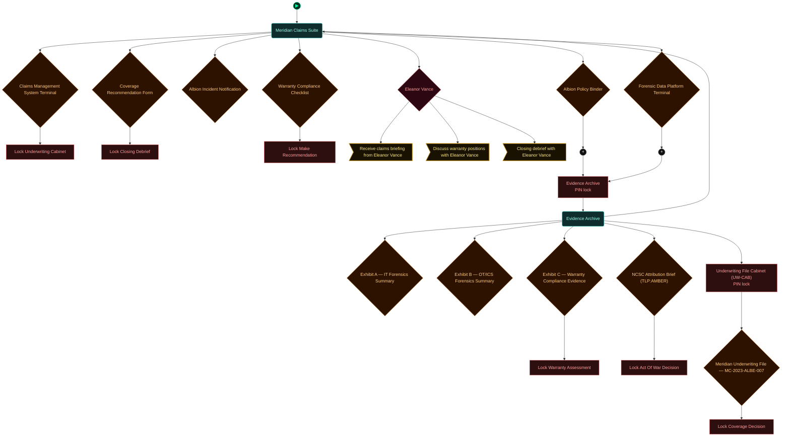
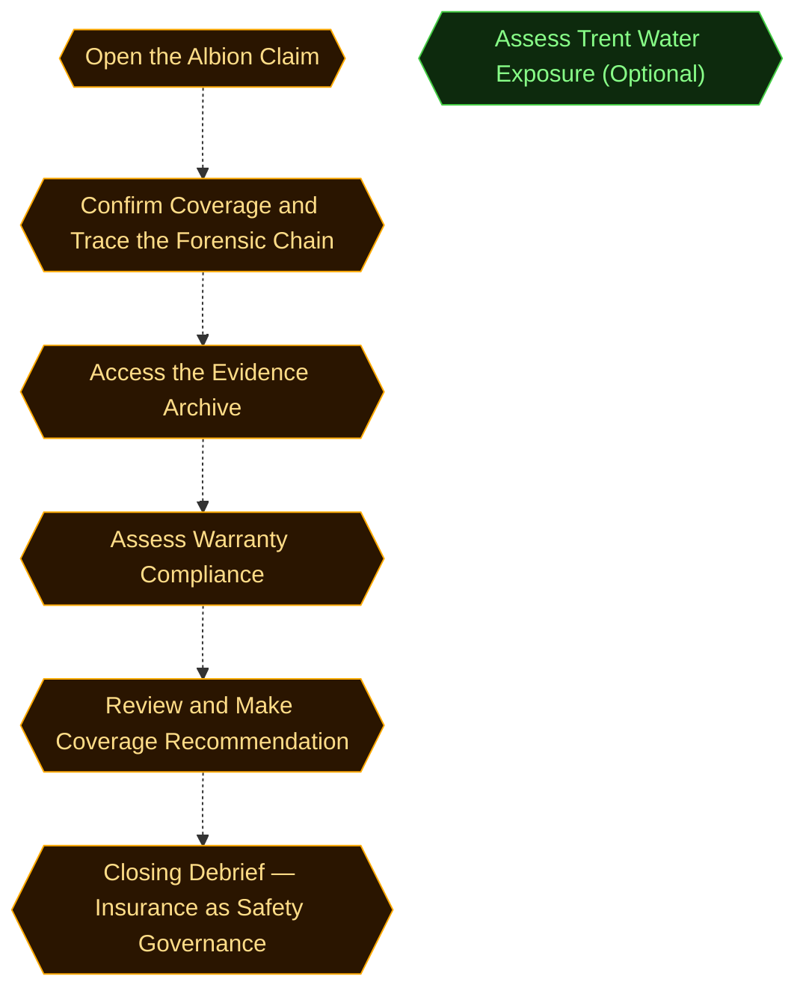
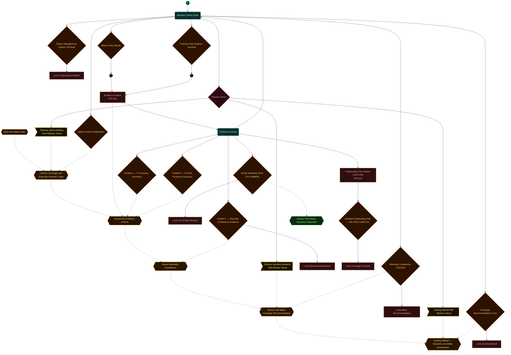
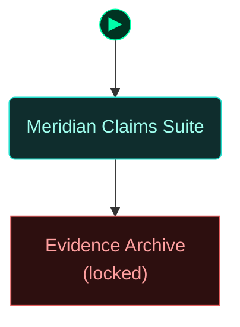

<!-- Auto-generated by scripts/generate_dungeon_graph.rb — do not edit by hand -->

# sis03_cyber_insurance — Scenario Graph Reference

T+48 hours. You are the Meridian Cyber Insurance claims team. Albion Energy Storage — the battery storage facility where a cyber attack nearly caused a thermal runaway yesterday — has filed an £8.2 million insurance claim. Eleanor Vance, your Claims Manager, has opened the file. The forensic team is already on site. Your task: verify the causal chain, assess which policy warranties were breached, and make a coverage recommendation. The decision you reach will shape not just this claim — but the market's role in critical infrastructure security.

## Scenario Statistics

| Metric | Value |
|---|---|
| Story aims | 7 |
| Total tasks | 15 (0 optional) |
| VM flag challenges | 0 |
| Physical locks | 8 |
| AND-gate convergences | 2 |
| Rooms | 2 |
| Puzzle graph nodes / edges | 27 / 28 |
| Story graph nodes / edges | 7 / 5 |

## Critical Path

5 hops through story aims — minimum mandatory sequence to reach mission completion:

**Open the Albion Claim → Confirm Coverage and Trace the Forensic Chain → Access the Evidence Archive → Assess Warranty Compliance → Review and Make Coverage Recommendation → Closing Debrief — Insurance as Safety Governance**

## How to Read These Diagrams

| Shape | Colour | Meaning |
|---|---|---|
| Rounded rectangle | Teal | Room / physical area |
| Rectangle | Red | Lock, barrier, or interactive terminal |
| Diamond | Orange | Inventory item or credential |
| Diamond | Red/Pink | NPC or physical key |
| Diamond | Purple | VM flag (challenge completion token) |
| Rectangle | Blue | VM challenge |
| Ribbon | Amber | NPC conversation / action gate |
| Hexagon | Green | Story aim (objective) |
| Hexagon | Amber | Critical path node |
| Circle | Grey | AND gate (all inputs required) |
| Subroutine rect `[[…]]` | Green | Container (holds items) |
| Rounded rectangle | Amber | NPC in room (Rooms & Contents only) |

Edges: `-->` solid = hard dependency; `-.->` dashed = soft / narrative dependency or optional path.

The `▶` node marks the player's starting room.

## Puzzle Graph

Physical lock–key dependency chain. Shows which items, codes, and NPC interactions are required to open each lock, and which locks gate access to each room or object. Use this to trace solvability, spot circular dependencies, and check that every key is reachable before the lock that needs it.

## Story Aims

Narrative objective flow. Shows story aims and their unlock conditions. Critical path aims are highlighted in amber. Use this to check aim sequencing, identify gaps between objectives, and verify that the player always has a clear next goal.

## Story + Puzzle (Integrated)

Puzzle graph and story aims combined, with bridge edges connecting physical puzzle progress to story aim completion. Use this to verify that physical actions drive narrative progress and that no aim is left floating without a puzzle prerequisite.

## Rooms

Physical room layout with all connections. Locked rooms are shown in red. Use this to check room reachability, identify dead-end rooms with no content, and understand the spatial structure of the scenario.

## Rooms & Contents

Physical room layout with all objects, containers, NPCs, and held items. Use this to check clue distribution across rooms, verify that hints are placed before the locks they solve, and spot rooms that are under- or over-loaded with content.

```mermaid
flowchart TD

  classDef room      fill:#0f2d2d,stroke:#22ddcc,color:#a0ffee
  classDef lock      fill:#2d0f0f,stroke:#e66060,color:#ffa0a0
  classDef key       fill:#2d0812,stroke:#e66060,color:#ffa0a0
  classDef item      fill:#2d1200,stroke:#e89030,color:#ffcc80
  classDef gate      fill:#111,stroke:#666,color:#eee
  classDef vm        fill:#0c1f40,stroke:#4a90d9,color:#a0c8ff
  classDef flag      fill:#1a0c2d,stroke:#9060d0,color:#cc99ff
  classDef action    fill:#1a1200,stroke:#cc9922,color:#ffee88
  classDef aim       fill:#0d2a0d,stroke:#44cc44,color:#88ff88
  classDef aim_gate  fill:#111111,stroke:#44cc44,color:#44cc44
  classDef container fill:#1a2d1a,stroke:#60b060,color:#a0e0a0
  classDef npc       fill:#2d1f0d,stroke:#d0a050,color:#ffe0a0
  classDef critical  fill:#2a1500,stroke:#ffaa00,color:#ffdd88
  classDef start     fill:#003322,stroke:#00ffaa,color:#00ffaa

  node_start(("▶"))
  node_start --> meridian_claims_suite

  meridian_claims_suite("Meridian Claims Suite")
  meridian_evidence_archive["Evidence Archive<br/>(locked)"]
  rc_claims_management_system_1{"Claims Management System Terminal"}
  rc_policy_binder_2{"Albion Policy Binder"}
  rc_claim_file_3{"Albion Incident Notification"}
  rc_osei_report_envelope_4{"Loss Adjustment Report (Fairbridge Associates)"}
  rc_coverage_decision_form_5{"Coverage Recommendation Form"}
  rc_warranty_checklist_6{"Warranty Compliance Checklist"}
  rc_fdp_terminal_7{"Forensic Data Platform Terminal"}
  rc_npc_eleanor_vance_8("Eleanor Vance")
  rc_npc_james_whitworth_9("James Whitworth")
  rc_npc_david_osei_10("David Osei")
  rc_npc_robert_ngata_11("Robert Ngata")
  rc_evidence_packet_a_12{"Exhibit A — IT Forensics Summary"}
  rc_evidence_packet_b_13{"Exhibit B — OT/ICS Forensics Summary"}
  rc_evidence_packet_c_14{"Exhibit C — Warranty Compliance Evidence"}
  rc_ncsc_brief_envelope_15{"NCSC Attribution Brief (TLP:AMBER)"}
  rc_underwriting_cabinet_16[["Underwriting File Cabinet (UW-CAB)"]]
  rc_underwriting_file_17{"Meridian Underwriting File — MC-2023-ALBE-007"}

  meridian_claims_suite --> meridian_evidence_archive
  meridian_claims_suite --> rc_claims_management_system_1
  meridian_claims_suite --> rc_policy_binder_2
  meridian_claims_suite --> rc_claim_file_3
  meridian_claims_suite --> rc_osei_report_envelope_4
  meridian_claims_suite --> rc_coverage_decision_form_5
  meridian_claims_suite --> rc_warranty_checklist_6
  meridian_claims_suite --> rc_fdp_terminal_7
  meridian_claims_suite --> rc_npc_eleanor_vance_8
  meridian_claims_suite --> rc_npc_james_whitworth_9
  meridian_claims_suite --> rc_npc_david_osei_10
  meridian_claims_suite --> rc_npc_robert_ngata_11
  meridian_evidence_archive --> rc_evidence_packet_a_12
  meridian_evidence_archive --> rc_evidence_packet_b_13
  meridian_evidence_archive --> rc_evidence_packet_c_14
  meridian_evidence_archive --> rc_ncsc_brief_envelope_15
  meridian_evidence_archive --> rc_underwriting_cabinet_16
  rc_underwriting_cabinet_16 --> rc_underwriting_file_17

  class meridian_claims_suite room
  class meridian_evidence_archive lock
  class rc_claims_management_system_1,rc_policy_binder_2,rc_claim_file_3,rc_osei_report_envelope_4,rc_coverage_decision_form_5,rc_warranty_checklist_6,rc_fdp_terminal_7,rc_evidence_packet_a_12,rc_evidence_packet_b_13,rc_evidence_packet_c_14,rc_ncsc_brief_envelope_15,rc_underwriting_file_17 item
  class rc_npc_eleanor_vance_8,rc_npc_james_whitworth_9,rc_npc_david_osei_10,rc_npc_robert_ngata_11 npc
  class rc_underwriting_cabinet_16 container
  class node_start start
```

