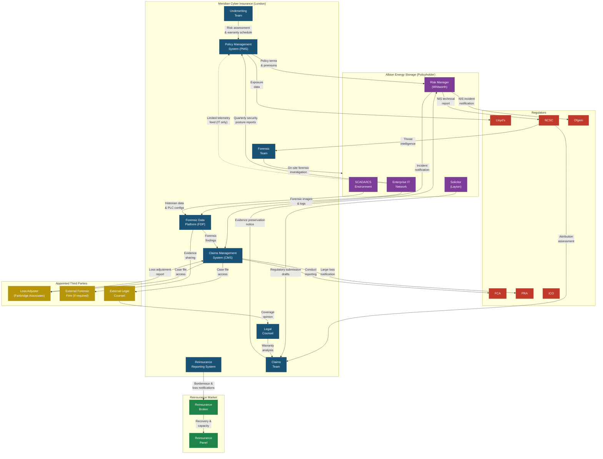

# SIS03 Cyber Insurance: Information Pack

This information pack contains comprehensive background information about the Meridian Cyber Insurance scenario, including system architecture, regulatory frameworks, requirements, and incident details.

---


## File: ./assurance_cases/assurance_case_overview.md

# Assurance Case Overview — Meridian Cyber Insurance Coverage Determination

## Structure

The Case 3 assurance case is fundamentally different from the safety engineering arguments in Cases 1 and 2. It is not a safety argument demonstrating that a system is acceptably safe. Instead, it is an **insurance liability argument** demonstrating that Meridian's coverage decision in respect of the Albion incident is validly supported by evidence. The structure uses Goal Structuring Notation (GSN) conventions — goals, strategies, evidence, and context nodes — but the top-level claim concerns coverage validity rather than safety adequacy.

---

## GSN Diagram

```mermaid
graph TB
    G0["<b>G0: Top-Level Goal</b><br/>Meridian's coverage decision in respect<br/>of the Albion incident is validly supported<br/>by evidence of (a) the event falling within<br/>covered losses, (b) policyholder compliance<br/>with security obligations, and (c) claimed<br/>losses being attributable to the insured event"]

    S0["<b>S0: Strategy</b><br/>Decompose coverage decision<br/>into three independent<br/>sub-arguments"]

    G0 --> S0

    %% Sub-goal 1: Covered event
    G1["<b>G1: Sub-Goal 1</b><br/>The Albion incident falls within<br/>the scope of covered events<br/>(not excluded)"]

    S0 --> G1

    S1["<b>S1: Strategy</b><br/>Assess incident against<br/>insuring clause, exclusion<br/>schedule, and policy definitions"]

    G1 --> S1

    G1_1["<b>G1.1</b><br/>The incident meets the<br/>definition of a 'cyber event'<br/>under the policy"]
    G1_2["<b>G1.2</b><br/>The act-of-war exclusion<br/>does not apply"]
    G1_3["<b>G1.3</b><br/>Physical damage from the<br/>cyber event is affirmatively<br/>covered (LMA21 compliant)"]

    S1 --> G1_1
    S1 --> G1_2
    S1 --> G1_3

    E1_1["<b>E1.1</b><br/>Forensic report confirming<br/>unauthorised access to and<br/>manipulation of Albion's<br/>computer systems"]
    E1_2["<b>E1.2</b><br/>NCSC attribution assessment<br/>(moderate-to-high confidence,<br/>state-sponsored APT)"]
    E1_3["<b>E1.3</b><br/>Legal opinion on LMA5567A<br/>threshold ('major detrimental<br/>impact' not met)"]
    E1_4["<b>E1.4</b><br/>Policy wording confirming<br/>affirmative cyber coverage<br/>for physical damage"]

    G1_1 --> E1_1
    G1_2 --> E1_2
    G1_2 --> E1_3
    G1_3 --> E1_4

    C1["<b>C1: Context</b><br/>Attribution confidence is<br/>moderate-to-high (intelligence<br/>standard), not beyond reasonable<br/>doubt (legal standard)"]

    G1_2 --> C1

    %% Sub-goal 2: Warranty compliance
    G2["<b>G2: Sub-Goal 2</b><br/>Albion met its security<br/>warranty obligations at the<br/>time of the incident"]

    S0 --> G2

    S2["<b>S2: Strategy</b><br/>Assess each warranty<br/>condition against forensic<br/>evidence of Albion's<br/>security posture"]

    G2 --> S2

    G2_1["<b>G2.1</b><br/>IT/OT segmentation warranty<br/>(W-07) was complied with"]
    G2_2["<b>G2.2</b><br/>Patch management warranty<br/>(W-03) was complied with<br/>(SIS patch deferral)"]
    G2_3["<b>G2.3</b><br/>Access control warranty<br/>(W-09 / W-12) was<br/>complied with"]

    S2 --> G2_1
    S2 --> G2_2
    S2 --> G2_3

    E2_1["<b>E2.1</b><br/>Forensic evidence: dual-homed<br/>historian, bidirectional jump<br/>server, legacy Modbus rules<br/>all present and exploited"]
    E2_2["<b>E2.2</b><br/>Albion risk register entry:<br/>SIS patch deferred pending<br/>IEC 61511 recertification"]
    E2_3["<b>E2.3</b><br/>Forensic evidence: no<br/>compensating controls for<br/>SIS patch deferral"]
    E2_4["<b>E2.4</b><br/>Forensic evidence: dormant<br/>contractor account active,<br/>CastleTech service account<br/>with cross-site privileges"]

    G2_1 --> E2_1
    G2_2 --> E2_2
    G2_2 --> E2_3
    G2_3 --> E2_4

    C2["<b>C2: Context</b><br/>Under Insurance Act 2015,<br/>warranty breach suspends<br/>cover only if causally<br/>connected to the loss"]

    G2 --> C2

    R2["<b>R2: Residual Risk</b><br/>G2.1 is NOT satisfied:<br/>W-07 was breached.<br/>G2.2 is ARGUABLE.<br/>G2.3 is NOT satisfied.<br/>Proportionate deduction<br/>applied (25%)"]

    G2 --> R2

    %% Sub-goal 3: Loss attribution
    G3["<b>G3: Sub-Goal 3</b><br/>Claimed losses are causally<br/>attributable to the<br/>insured cyber event"]

    S0 --> G3

    S3["<b>S3: Strategy</b><br/>Verify causal chain from<br/>cyber event to each<br/>loss category"]

    G3 --> S3

    G3_1["<b>G3.1</b><br/>Incident response costs<br/>are attributable to<br/>the cyber event"]
    G3_2["<b>G3.2</b><br/>Business interruption<br/>losses are attributable<br/>to the cyber event"]
    G3_3["<b>G3.3</b><br/>Physical equipment damage<br/>is attributable to<br/>the cyber event"]

    S3 --> G3_1
    S3 --> G3_2
    S3 --> G3_3

    E3_1["<b>E3.1</b><br/>Forensic report: complete<br/>attack chain from printer<br/>backdoor to battery<br/>thermal excursion"]
    E3_2["<b>E3.2</b><br/>Loss adjustment report:<br/>£4.8M business interruption<br/>during six-week outage"]
    E3_3["<b>E3.3</b><br/>Engineering assessment:<br/>battery cell degradation<br/>caused by overcharge<br/>condition"]
    E3_4["<b>E3.4</b><br/>National Grid ESO contract:<br/>penalty schedule for<br/>non-delivery of ancillary<br/>services"]

    G3_1 --> E3_1
    G3_2 --> E3_2
    G3_2 --> E3_4
    G3_3 --> E3_3

    C3["<b>C3: Context</b><br/>Disputed: whether SIS<br/>recertification downtime<br/>is incident-attributable or<br/>pre-existing maintenance<br/>obligation"]

    G3_2 --> C3

    %% Nation-state sub-argument
    G4["<b>G4: Special Sub-Argument</b><br/>The nation-state attribution<br/>problem is addressed within<br/>the coverage determination"]

    S0 --> G4

    S4["<b>S4: Strategy</b><br/>Assess attribution evidence<br/>against the legal threshold<br/>for 'act of war' under<br/>English law and LMA5567A"]

    G4 --> S4

    G4_1["<b>G4.1</b><br/>Attribution evidence is<br/>evaluated and documented"]
    G4_2["<b>G4.2</b><br/>Legal threshold for<br/>exclusion is defined<br/>and applied"]
    G4_3["<b>G4.3</b><br/>Residual attribution<br/>ambiguity is accepted<br/>as underwriting risk"]

    S4 --> G4_1
    S4 --> G4_2
    S4 --> G4_3

    E4_1["<b>E4.1</b><br/>NCSC technical assessment:<br/>GREYMANTLE indicators,<br/>moderate-to-high confidence"]
    E4_2["<b>E4.2</b><br/>CTI analysis: two-actor<br/>model (IAB + APT),<br/>commercially motivated<br/>initial access"]
    E4_3["<b>E4.3</b><br/>Legal opinion: 'major<br/>detrimental impact'<br/>threshold not met for<br/>single-site incident"]

    G4_1 --> E4_1
    G4_1 --> E4_2
    G4_2 --> E4_3

    R4["<b>R4: Residual Risk</b><br/>If NCSC strengthens<br/>attribution or government<br/>formally designates the<br/>attack, exclusion analysis<br/>may need to be revisited"]

    G4_3 --> R4

    %% Styling
    classDef goal fill:#2e86c1,stroke:#1a5276,color:#fff
    classDef strategy fill:#27ae60,stroke:#1e8449,color:#fff
    classDef evidence fill:#f39c12,stroke:#d68910,color:#000
    classDef context fill:#8e44ad,stroke:#6c3483,color:#fff
    classDef residual fill:#e74c3c,stroke:#c0392b,color:#fff

    class G0,G1,G1_1,G1_2,G1_3,G2,G2_1,G2_2,G2_3,G3,G3_1,G3_2,G3_3,G4,G4_1,G4_2,G4_3 goal
    class S0,S1,S2,S3,S4 strategy
    class E1_1,E1_2,E1_3,E1_4,E2_1,E2_2,E2_3,E2_4,E3_1,E3_2,E3_3,E3_4,E4_1,E4_2,E4_3 evidence
    class C1,C2,C3 context
    class R2,R4 residual
```



---

## Narrative Explanation

### How This Assurance Case Differs from Cases 1 and 2

In Cases 1 (Healthcare) and 2 (Energy), the assurance case is a safety engineering argument. The top-level goal is something like: "The system is acceptably safe with respect to the identified cyber-physical hazards." The evidence includes safety analyses, security control implementations, and test results demonstrating that safety requirements are met. The argument follows Goal Structuring Notation (GSN) conventions established in safety engineering practice, and its audience is a safety assurance assessor or regulator.

The Case 3 assurance case serves a different purpose. Its top-level goal is about the validity of an insurance coverage decision — whether Meridian's determination to pay, reduce, or decline the Albion claim is supported by evidence and reasoning. The audience is not a safety regulator but a claims committee, a Lloyd's syndicate board, and potentially an arbitration panel. The goal structure decomposes into: (a) was the event covered? (b) was the policyholder compliant? (c) are the losses attributable? These are legal and commercial questions, not safety engineering questions — but they depend on exactly the same technical evidence (forensic reports, security control assessments, safety system configurations) that would underpin a safety assurance case.

This structural parallel is the pedagogic payoff: learners see that the same body of technical evidence can support both a safety argument and an insurance argument, but the two arguments may reach different conclusions from the same facts. Albion's SIS firmware deferral, for example, is a reasonable safety decision in Case 2 (maintaining the certified safety function) but a problematic warranty compliance issue in Case 3 (failing to implement compensating controls as required by the policy).

### The Multi-Organisational Nature of Security-Informed Safety

The Case 3 assurance case demonstrates that security-informed safety is not the sole responsibility of the system operator. Meridian — an organisation that has never visited the Albion control room during an operational shift — holds risk information, sets security conditions, and makes coverage decisions that materially affect the safety of the Albion facility. The warranty schedule in Meridian's policy functions as an indirect safety requirements specification: it mandates IT/OT segmentation, SIS independence, patch management, and access control — all requirements that a safety engineer would recognise as security-informed safety measures. But the enforcement mechanism is contractual and financial (coverage implications) rather than regulatory and technical (safety certification).

The assurance case makes this multi-organisational structure explicit. Evidence nodes in the Case 3 GSN reference the same forensic reports and technical assessments that would appear in a Case 2 safety assurance case, but they are evaluated through a different lens. A safety assessor asks: "Were the safety controls adequate?" An insurance assessor asks: "Were the warranty conditions met?" The answers may differ — and the gap between them reveals the structural limitations of using insurance as an indirect safety governance mechanism.

### The Evidence Model and Information Asymmetry

The evidence base for the Case 3 assurance case is characterised by information asymmetry. Meridian relies on evidence that Albion controls: forensic data, security posture records, financial loss documentation. The assurance case's evidence nodes (forensic reports, risk register entries, telemetry data) represent information that was shared through the cooperation clause and the forensic investigation — but the scope of sharing was negotiated, not unconditional.

A stronger evidence model — one approaching the "shared monitoring" concept where both insurer and policyholder have access to the same undisputed data — would reduce the adversarial quality of the claims process. If Meridian had continuous, real-time visibility into Albion's OT security posture (not just quarterly reports), warranty compliance could be assessed proactively rather than retrospectively. The evidence nodes in the assurance case would be populated by contemporaneous monitoring data rather than post-incident forensic reconstruction. This would strengthen both the safety case (earlier detection of security deficiencies) and the insurance case (less disputed evidence at claims stage).

However, extending insurer monitoring to OT environments creates its own risks — the insurer's access to policyholder SCADA data introduces new attack vectors and trust boundary challenges, as discussed in the system architecture documentation. The assurance case acknowledges this as an unresolved design tension in the evidence model.

### The Fundamental Tension

The Case 3 assurance case exposes a fundamental tension in the insurer's role as an indirect safety stakeholder: **the insurer wants to encourage safety-critical security controls but cannot directly enforce them.**

Meridian set warranty conditions requiring IT/OT segmentation, SIS independence, and patch management. These conditions align with safety engineering best practice and functional safety standards. But Meridian's enforcement mechanism is retrospective and contractual — it can reduce coverage after a loss, but it cannot compel the policyholder to act before a loss occurs. When Albion's twelve-month remediation deadline passed without completion, Meridian had two options: refuse to renew the policy (removing the financial incentive for security investment and leaving Albion uninsured for a risk that had not yet materialised) or continue coverage with the warranty in place (maintaining the incentive structure but accepting the interim risk). Meridian chose the latter — and the incident occurred during the gap between the deadline expiry and the eventual remediation.

The assurance case represents this tension through Sub-Goal G2 (warranty compliance), which concludes with a residual risk node rather than a satisfied goal. The warranty was breached, but the breach was known to both parties, and the enforcement mechanism — a proportionate deduction rather than a full denial — reflects the commercial reality that overly aggressive warranty enforcement undermines the insurer-policyholder relationship and the incentive structure that the warranty was designed to create.

This is the core teaching point: insurance warranties function as indirect safety controls, but their effectiveness depends on the credibility of enforcement. If policyholders believe that warranties will never be enforced, the incentive disappears. If policyholders believe that warranties will be enforced disproportionately, they may underreport risks or avoid buying insurance altogether. The assurance case structure — with its evidence nodes, context assumptions, and residual risks — makes this balance visible and discussable.


## File: ./regulatory_frameworks/overview.md

# Regulatory Frameworks Overview — Cyber Insurance Context

This overview identifies the regulatory obligations that shape the insurance response to a cyber-physical incident. Regulatory requirements operate at two levels: obligations on the policyholder (Albion Energy Storage) that create insurable liabilities, and obligations on the insurer (Meridian Cyber Insurance) that govern how claims are handled and how capital is managed.

---

## 1. Policyholder Obligations That Create Insurable Liabilities

### NIS Regulations 2018 (UK)

The Network and Information Systems Regulations 2018 implement the EU NIS Directive into UK law. They impose security duties and incident reporting obligations on operators of essential services (OES) — a category that includes energy operators such as Albion Energy Storage.

**Security duty.** Albion, as a designated OES, must take "appropriate and proportionate" technical and organisational measures to manage the risks to the security of the network and information systems on which its essential service relies. The NCSC's Cyber Assessment Framework (CAF) provides the assessment methodology. Albion's compliance with the CAF is assessed by its competent authority (Ofgem for the energy sector). Non-compliance can result in enforcement action and fines of up to £17 million.

**Incident reporting.** Albion must report to its competent authority any incident that has a "significant impact" on the continuity of the essential service. The reporting threshold for the energy sector includes incidents causing disruption to electricity supply, loss of control over generation or storage assets, or compromise of safety systems. The NIS Regulations require initial notification "without undue delay" and no later than 72 hours after the OES becomes aware of an incident. Follow-up reports must be provided as further information becomes available.

**Insurance implications.** NIS Regulations fines and penalties are typically excluded from cyber insurance coverage under English law (regulatory fines for the insured's own non-compliance are generally considered uninsurable). However, legal defence costs arising from regulatory enforcement proceedings are typically covered. The NIS Regulations create two specific insurance tensions: (1) the content of the incident report — which may describe pre-existing security deficiencies relevant to the warranty assessment — is controlled by Albion, not Meridian; and (2) the 72-hour reporting clock runs independently of the insurance claims timeline, potentially requiring disclosure before the forensic investigation is complete.

### UK GDPR and Data Protection Act 2018

If the Albion incident involves compromise of personal data — employee records, contractor details, or customer information held on the enterprise network — the UK GDPR requires notification to the Information Commissioner's Office (ICO) within 72 hours of becoming aware of the breach, and notification to affected individuals where the breach is likely to result in a high risk to their rights and freedoms.

In the Albion scenario, the attack targeted ICS/SCADA systems rather than data repositories containing personal information. Albion's assessment concluded that no personal data was compromised, and ICO notification was not required. However, the shared file server used by both Albion and Trent Water Services contained employee shift rotas and contractor induction records — data categories that may include personal information. The forensic investigation confirmed that the shared server was accessed during the attack (for lateral movement purposes), raising the question of whether personal data on that server was viewed, exfiltrated, or otherwise processed by the attackers.

**Insurance implications.** If personal data was compromise is confirmed, Albion's cyber policy covers notification costs, credit monitoring for affected individuals, and regulatory defence costs (ICO enforcement). GDPR fines (up to £17.5 million or 4% of annual turnover) are subject to the same insurability constraints as NIS fines.

### Health and Safety at Work Act 1974

The Albion incident created an imminent risk of thermal runaway — a physical safety hazard that could have caused fire, toxic gas release, and injury to personnel. Although the hazard was averted by manual intervention, the incident is reportable under the Reporting of Injuries, Diseases and Dangerous Occurrences Regulations 2013 (RIDDOR) as a "dangerous occurrence" — specifically, the uncontrolled release (or near-release) of a substance that could cause injury. The Health and Safety Executive (HSE) may investigate whether Albion's risk management of the battery storage facility was adequate, including whether the cyber vulnerability of the SIS was a foreseeable hazard that should have been addressed.

**Insurance implications.** Meridian's cyber policy covers legal defence costs arising from HSE investigations related to a covered cyber event. HSE fines for health and safety breaches are not covered (they relate to the insured's own non-compliance with safety law). The HSE investigation may require access to the same forensic evidence that Meridian's forensic team is examining — creating a potential overlap between the insurance investigation and the regulatory investigation.

---

## 2. Insurer Regulatory Obligations

### Financial Conduct Authority (FCA)

Meridian, as an FCA-authorised insurance intermediary (managing general agent), is subject to the FCA's conduct rules. The most relevant obligations in the Albion claim are:

**Treating Customers Fairly (TCF).** The FCA requires insurance firms to demonstrate that they deliver fair outcomes for customers, including in claims handling. For Meridian, this means: responding to the Albion claim notification promptly, communicating coverage decisions clearly with reasons, not unreasonably delaying or declining a valid claim, and ensuring that warranty exclusion arguments are proportionate and supported by evidence. Invoking the warranty breach to reduce the Albion claim by 25% is a legitimate commercial decision, but Meridian must demonstrate that the deduction is proportionate to the causal contribution of the warranty breach.

**Claims handling standards.** The FCA's Insurance: Conduct of Business sourcebook (ICOBS) requires that claims are handled "promptly and fairly" and that settlements are not "unreasonably withheld." Meridian's decision to apply a proportionate deduction rather than declining the claim outright reflects an awareness of these obligations — a full denial of a £8.2 million claim on a critical infrastructure policyholder that narrowly avoided a major safety incident would attract significant regulatory scrutiny.

**Product governance.** The FCA requires that insurance products are designed to meet the needs of the target market. For Meridian's industrial cyber policies, this includes ensuring that warranty conditions are realistic and that policyholders understand the coverage implications of non-compliance. The question of whether a warranty requiring ICS patching is realistic when patching requires safety system recertification is relevant to product governance — a warranty that cannot be practically complied with may not meet the FCA's fair value standard.

### Prudential Regulation Authority (PRA)

The PRA regulates the prudential soundness of insurance firms — ensuring they hold sufficient capital to meet their liabilities. For Meridian, the PRA's requirements are relevant in two respects:

**Capital adequacy and reserving.** Meridian must reserve appropriately for the Albion claim. The estimated loss (£8.2 million gross, approximately £6.1 million net of the warranty deduction) approaches Meridian's reinsurance attachment point (£5 million). Meridian must notify the PRA of potential large losses that may affect its capital position.

**Systemic cyber risk.** The PRA has published expectations (via supervisory statements and consultation papers) that insurers adequately model and manage the risk of correlated cyber losses — a scenario where multiple policyholders suffer simultaneous incidents (for example, if GREYMANTLE attacked multiple energy infrastructure operators across Meridian's portfolio). Meridian must demonstrate that its capital model accounts for such aggregation scenarios, and that a single widespread campaign would not render it insolvent.

### Lloyd's Market Frameworks

As a managing general agent underwriting on behalf of Lloyd's syndicates, Meridian is subject to Lloyd's market regulations in addition to FCA and PRA requirements.

**LMA21/22 silent cyber mandates.** Following Lloyd's mandates issued in 2019, all syndicates were required to provide clarity on their cyber coverage position in property damage (LMA21) and liability (LMA22) policies. Meridian's policy is affirmatively cyber: it explicitly covers first-party physical damage and third-party liability arising from cyber events. This affirmative position is critical to the Albion claim — the battery cell damage is physical damage caused by a cyber event, and Meridian's policy explicitly covers this loss category.

**State-backed cyber attack exclusions.** In 2022, Lloyd's published requirements for syndicates to include state-backed cyber attack exclusions in their policies. The requirement was motivated by the increasing frequency and severity of state-sponsored cyber operations and the potential for such operations to cause systemic losses across the insurance market. Meridian's policy includes a state-backed cyber exclusion based on the Lloyd's Market Association model clause LMA5567A, which distinguishes between cyber operations occurring during wartime (excluded), major state-backed attacks with a "major detrimental impact" on the state (excluded), and other state-sponsored operations (not excluded unless accompanied by a major detrimental impact). The Albion incident — a single-site attack without broader national impact — falls below the "major detrimental impact" threshold.

---

## 3. Silent Cyber and Lloyd's Mandates

"Silent cyber" refers to the potential for cyber events to trigger coverage under traditional insurance policies — property, casualty, marine, aviation — that were not designed with cyber risks in mind. A property damage policy covering "all risks of physical loss or damage" may, by omission, cover physical damage caused by a cyber attack on a control system. This creates three problems:

**Unintended exposure for insurers.** Insurers that have not explicitly priced cyber risk into their property portfolios may face unexpected claims from cyber-physical events. The aggregate exposure across a large property portfolio could be significant.

**Double recovery for policyholders.** If both the cyber policy and the property policy cover the same physical damage, the policyholder could potentially claim under both policies. Non-contribution clauses and coordination-of-benefits provisions are designed to prevent this, but they add complexity and delay.

**Coverage gaps.** Conversely, if the property insurer explicitly excludes cyber and the cyber policy has a lower limit for physical damage, the policyholder may be underinsured for physical losses from cyber events.

**The Albion scenario.** Albion holds both a Meridian cyber policy (affirmatively covering cyber-physical losses) and a separate property damage policy with a different insurer. The property damage policy was updated to include a cyber exclusion following the Lloyd's LMA21 mandate. Physical damage to the battery cells therefore falls solely within Meridian's cyber policy coverage — the property insurer has explicitly excluded it. This is the intended outcome of the LMA21 mandate: clarity on which policy responds, avoiding both silent cyber exposure and double-coverage disputes. However, if Meridian declines or reduces coverage under its cyber policy (for example, by invoking the warranty breach), Albion faces an uncovered gap for the physical damage component — the property policy excluded it, and the cyber policy reduced it.

This scenario illustrates the systemic consequence of the silent cyber mandates: by requiring explicit coverage positions, Lloyd's has created clarity but also accountability. An insurer that affirmatively covers cyber-physical losses bears the full financial consequence of those losses, without the ambiguity that previously allowed costs to be shared (or avoided) across multiple policies.


## File: ./regulatory_frameworks/standards_mapping.md

# Standards Mapping — Regulatory Requirements, Insurance Obligations, and Security-Safety Implications

This mapping table shows how regulatory requirements on policyholders create security obligations that intersect with Meridian's insurance policy conditions. Each row traces a regulatory requirement through the insurance mechanism to its safety consequence.

---

| # | Regulatory Requirement | Applicable to | Meridian Policy Condition / Warranty | Consequence if Warranty Breached | Security-Safety Implication |
|---|---|---|---|---|---|
| 1 | **NIS Regulations 2018 — Security Duty of Care** (Regulation 10): OES must take appropriate and proportionate measures to manage security risks to network and information systems. Assessed via NCSC CAF. | Albion (OES — energy sector) | POL-OBL-015 (ISMS requirement): Policyholder must maintain an ISMS aligned with CAF or equivalent standard. | Absence of a documented ISMS may be treated as material misrepresentation at underwriting. NIS enforcement fines are excluded from coverage. Regulatory defence costs are covered. | The CAF assessment covers OT/ICS security. An OES that fails the CAF is likely to have security deficiencies that affect safety-critical systems. |
| 2 | **NIS Regulations 2018 — Incident Reporting** (Regulation 11): OES must report incidents with "significant impact" on essential service continuity to competent authority within 72 hours. | Albion (to Ofgem/NCSC) | POL-OBL-018 (Regulatory reporting readiness): Policyholder must have documented incident reporting procedures. Cooperation clause: Policyholder must share regulatory submissions with Meridian for consistency review. | Failure to report may result in regulatory penalties (excluded from coverage). Inconsistency between regulatory submissions and insurance claim may complicate the coverage assessment. | Timely incident reporting enables the competent authority to assess wider critical infrastructure risk. Delays in reporting — potentially caused by insurance-driven caution about disclosure — may leave other operators exposed to the same threat actor. |
| 3 | **IEC 61511 — Safety Instrumented Systems Certification** (Functional safety standard for the process industry): SIS must be designed, implemented, and maintained to achieve a specified Safety Integrity Level (SIL). Modifications to the SIS require recertification. | Albion (SIS at Albion facility certified to SIL 2) | POL-OBL-005 (OT/ICS patch management): Accepts deferred patching where safety certification requires recertification, provided compensating controls are implemented. POL-OBL-010 (SIS independence): SIS network segment must be independent of SCADA. | If SIS patch deferred without compensating controls and the unpatched vulnerability is exploited, Meridian may argue warranty breach. If compensating controls were in place, Meridian accepts the deferral. | This is the core security-safety tension: applying a cybersecurity patch to the SIS requires recertification under IEC 61511, during which the automated safety function is unavailable. The insurance warranty explicitly accommodates this tension — it does not demand immediate patching, but requires compensating controls. |
| 4 | **UK GDPR / Data Protection Act 2018 — Breach Notification** (Article 33/34): Personal data breaches must be reported to the ICO within 72 hours. Affected individuals must be notified where there is a high risk to their rights. | Albion (if personal data compromised); Meridian (for its own policyholder data) | Cooperation clause: Policyholder must share ICO notification details with Meridian. MER-SEC-017: Meridian must notify policyholders within 72 hours if Meridian's own systems are breached and policyholder data is compromised. | GDPR fines are subject to insurability constraints. Notification costs, credit monitoring, and regulatory defence costs are covered under the cyber policy. | The 72-hour GDPR reporting window runs in parallel with the insurance notification process. If Albion must notify the ICO before the forensic investigation is complete, the notification may be based on incomplete information — potentially overstating or understating the personal data impact. |
| 5 | **Health and Safety at Work Act 1974 / RIDDOR 2013** — Dangerous Occurrences: Near-miss events involving the uncontrolled release or near-release of hazardous substances are reportable to the HSE. | Albion (thermal runaway near-miss is a dangerous occurrence) | Policy covers legal defence costs arising from HSE investigations related to a covered cyber event. HSE fines are excluded (health and safety compliance is the insured's own duty). | HSE investigation may require access to the same forensic evidence Meridian is examining. HSE findings on safety system adequacy may overlap with Meridian's warranty compliance assessment. | The HSE investigation examines whether the SIS vulnerability was a foreseeable safety hazard — the same question Meridian's warranty assessment addresses. If the HSE concludes that Albion should have patched the SIS (regardless of recertification cost), this finding could support Meridian's warranty breach argument, or conversely, it could support Albion's argument that the safety constraint was genuine and the deferral was reasonable pending a safe maintenance window. |
| 6 | **NCSC Cyber Assessment Framework (CAF)** — Objective B.4: Security Monitoring: OES should have the capability to detect cyber security events affecting their network and information systems. | Albion (OES obligation) | POL-OBL-011 (ICS anomaly detection): Policyholder must implement monitoring for anomalous activity on the ICS/SCADA network. | Absence of ICS monitoring may be treated as a warranty breach if the attack proceeds through the ICS environment undetected. CAF non-compliance may trigger Ofgem enforcement. | CAF Objective B.4 and Meridian's monitoring warranty are functionally equivalent — both require the policyholder to detect cyber events affecting operational systems. The insurance warranty provides an additional financial incentive (coverage implications) on top of the regulatory incentive (Ofgem enforcement risk). |
| 7 | **FCA — Treating Customers Fairly (TCF)** / ICOBS Claims Handling: Insurance firms must handle claims promptly and fairly. Settlements must not be unreasonably withheld. | Meridian (FCA-authorised firm) | N/A — obligation on Meridian, not policyholder. | If Meridian's warranty breach argument or coverage deduction is deemed disproportionate or inadequately evidenced, the FCA may intervene. Reputational damage in the Lloyd's market. | FCA oversight constrains Meridian's ability to use warranty breaches aggressively to deny claims on critical infrastructure policyholders. This creates a regulatory counterbalance to the commercial incentive to minimise claim payouts — the regulator demands that coverage decisions are proportionate, especially where the policyholder is a critical infrastructure operator. |
| 8 | **PRA — Systemic Cyber Risk Management**: Insurers must model and manage the risk of correlated cyber losses across their portfolio. | Meridian (PRA-regulated) | N/A — obligation on Meridian's capital management. | If Meridian's portfolio is exposed to correlated losses (e.g., GREYMANTLE attacking multiple energy infrastructure policyholders), inadequate modelling could result in PRA intervention. | Systemic cyber risk has a safety dimension: if a single threat actor campaign triggers claims across multiple critical infrastructure policyholders simultaneously, the insurer's ability to fund incident response at all affected policyholders may be compromised. PRA capital adequacy requirements ensure that the insurer can meet its obligations even in a correlation scenario. |
| 9 | **Lloyd's — LMA21 (Property) / LMA22 (Liability) Silent Cyber Mandates**: Syndicates must explicitly affirm or exclude cyber coverage in property and liability policies. | Meridian (Lloyd's MGA) and Albion's property insurer | Meridian's policy is affirmatively cyber: it explicitly covers physical damage from cyber events. Albion's property policy (separate insurer) has excluded cyber under LMA21. | Physical damage to battery cells falls solely within Meridian's cyber policy. If Meridian reduces or declines coverage, Albion has no fallback to the property policy. | The LMA21/22 mandates eliminate silent cyber ambiguity but concentrate physical damage risk in the affirmative cyber policy. For critical infrastructure operators, this means the cyber insurer is the sole source of coverage for physical damage arising from cyber-physical attacks — increasing the importance of the warranty compliance determination. |
| 10 | **Lloyd's — State-Backed Cyber Attack Exclusions (2022)**: Syndicates must include clauses addressing state-backed cyber attacks. Model clause LMA5567A distinguishes between wartime operations, major state-backed attacks, and other state-sponsored operations. | Meridian (policy wording requirement) | Policy includes LMA5567A exclusion. Excludes losses from cyber operations during war or with "major detrimental impact" on the state. Does not exclude peacetime state-sponsored operations below the major impact threshold. | If GREYMANTLE attribution strengthens to a formal government designation, the exclusion analysis may change. Current assessment: Albion incident does not meet "major detrimental impact" threshold. | The state-backed exclusion creates a paradox for critical infrastructure safety: the very attacks most likely to compromise safety-critical systems at national infrastructure operators (state-sponsored APT campaigns) are the attacks most likely to trigger act-of-war exclusions. If insurers routinely excluded state-sponsored attacks, the insurance incentive for critical infrastructure cybersecurity would be undermined for the threat category that poses the greatest safety risk. |
| 11 | **Insurance Act 2015** — Warranties and Terms: Warranty breach suspends (not voids) coverage. Breach must be causally connected to the loss for the insurer to rely on it. Insurer must demonstrate proportionality. | Governs the Meridian-Albion contractual relationship | All POL-OBL warranties operate under the Insurance Act 2015 framework. | Meridian cannot simply void coverage for any warranty breach; it must demonstrate that the specific breach was causally connected to the specific loss. The Act protects policyholders from disproportionate exclusion arguments. | The Insurance Act 2015's proportionality requirement ensures that warranty conditions — which function as indirect safety controls — cannot be used as blanket coverage denial mechanisms. This preserves the incentive alignment: policyholders maintain security controls because the warranty incentivises them, but the insurer cannot retrospectively weaponise every minor deviation to avoid paying a claim. |
| 12 | **NCSC CAF Objective A.2 — Risk Management**: OES should have appropriate risk management processes that address cyber security risks to essential service delivery. Risk assessments should consider cyber threats to OT/ICS. | Albion (OES obligation) | POL-OBL-016 (Security risk register): Known security vulnerabilities that cannot be immediately remediated must be documented with compensating controls. | Failure to document known risks (e.g., the SIS firmware vulnerability) in the risk register may be treated as a failure to cooperate and may affect the warranty assessment. | The risk register is where the security-safety trade-off is formally documented. Albion's risk register should have recorded the SIS firmware deferral, the rationale (IEC 61511 recertification), and the compensating controls. If this documentation is complete, it strengthens Albion's argument that the deferral was a managed risk, not negligence. If incomplete, it suggests inadequate governance of a safety-relevant security decision. |
| 13 | **Ofgem — Enforcement Powers under NIS Regulations**: Ofgem can issue enforcement notices, compliance orders, and financial penalties (up to £17M) for NIS non-compliance by energy sector OES. | Albion (energy OES) | Policy covers regulatory defence costs. NIS fines are excluded from coverage. | If Ofgem pursues enforcement, Albion's legal defence is covered by Meridian, but any penalty is Albion's own liability. Ofgem enforcement findings may reference the same security deficiencies that Meridian's warranty assessment addresses. | Ofgem enforcement and Meridian warranty assessment may reach the same conclusion (Albion's security posture was inadequate) for different purposes (regulatory compliance vs. insurance coverage). Consistent findings reinforce each other; conflicting findings create complexity — e.g., if Ofgem accepts Albion's SIS patch deferral rationale but Meridian does not, or vice versa. |


## File: ./requirements/claims.md

# Security-Informed Safety Claims — Cyber Insurance Context

These claims describe how Meridian Cyber Insurance's policy conditions function as indirect safety controls — shaping the security environment in which Albion Energy Storage's safety-critical systems operate. Unlike the direct safety claims in Cases 1 and 2 (which argue that specific technical controls prevent specific hazards), these insurance claims argue that contractual mechanisms create incentive structures and evidence obligations that influence safety outcomes across organisational boundaries.

---

```
CLAIM-INS-001: IT/OT Segmentation as Coverage Condition
Claim: Provided that Albion Energy Storage maintains network segmentation
between enterprise IT and OT networks (POL-OBL-001), the probability that
an enterprise IT compromise results in ICS manipulation is sufficiently
low to remain within Meridian's cyber coverage tier. If this control is
absent, Meridian reserves the right to decline coverage for ICS-originated
losses (REF: Policy Section 4.2, Sub-clause C).

Insurance argument: The warranty requiring IT/OT segmentation transforms
a technical security control into a coverage condition. Albion's financial
exposure to uninsured ICS losses creates a direct economic incentive to
maintain the segmentation — the cost of the security control is offset by
the value of the insurance coverage it enables.

Safety relevance: IT/OT segmentation is the primary barrier preventing
enterprise network threats from reaching safety-critical ICS/SCADA
systems. The insurance warranty reinforces the safety engineering
rationale with a financial consequence.

Albion incident status: WARRANTY BREACHED — the IT/OT boundary was not
remediated within the twelve-month deadline. The dual-homed historian
server, bidirectional jump server, and legacy Modbus/TCP firewall rules
were all present and exploited during the attack.
```

```
CLAIM-INS-002: SIS Independence as Insurable Safety Boundary
Claim: Provided that Albion Energy Storage maintains the Safety
Instrumented System on a network segment independent of the SCADA control
network (POL-OBL-010), the probability that a SCADA compromise extends to
manipulation of safety alarm thresholds is reduced to a level consistent
with the SIS's certified safety integrity level (SIL 2). Meridian's
coverage for physical damage arising from safety system failure is
contingent on the SIS maintaining this independence.

Insurance argument: By linking coverage for physical damage (the most
expensive loss category in a cyber-physical incident) to SIS
independence, Meridian creates a financial incentive for the policyholder
to maintain the most safety-critical architectural boundary. The claim
explicitly connects the insurance coverage decision to the functional
safety certification.

Safety relevance: SIS independence from the process control network is
a core IEC 61511 design principle. The insurance warranty creates an
independent financial enforcement mechanism for a safety engineering
requirement that might otherwise be eroded by operational convenience.

Albion incident status: PARTIALLY BREACHED — the SIS engineering
protocol was accessible from the SCADA network segment. However, the SIS
operated on a separate safety PLC with an independent hardwired ESD
capability that was not network-accessible and functioned correctly.
```

```
CLAIM-INS-003: Patch Management with Safety Constraint Acknowledgement
Claim: Provided that Albion Energy Storage either (a) applies security
patches to ICS/OT components within the timescales specified in POL-
OBL-005, or (b) documents the risk in its security risk register and
implements compensating controls within 30 days where patching is
deferred for safety certification reasons, the policyholder meets its
warranty obligations for OT patch management. Meridian accepts that
deferred patching of safety-certified systems (requiring IEC 61511
recertification) is a legitimate safety constraint, provided
compensating controls are in place.

Insurance argument: This claim represents the insurance industry's
acknowledgement of the security-safety patching dilemma. By accepting
deferred patching with compensating controls, Meridian avoids creating
perverse incentives — a straightforward "patch everything immediately"
warranty would force policyholders to choose between cybersecurity
compliance (patching) and functional safety compliance (maintaining SIS
certification). The warranty resolves this by requiring compensating
controls rather than immediate patching.

Safety relevance: The SIS firmware vulnerability at Albion existed
because applying the patch required taking the SIS offline for
recertification under IEC 61511 — an eight-week, £180,000 process during
which automated thermal runaway protection would be unavailable. The
warranty's safety-aware design recognises this constraint.

Albion incident status: ARGUABLE — the SIS patch was deferred for a
legitimate safety reason, but Albion did not implement the compensating
controls required by the warranty (additional network isolation of the
SIS engineering interface, enhanced monitoring of SIS access).
```

```
CLAIM-INS-004: Managed Service Provider Security as Indirect Control
Claim: Provided that Albion Energy Storage ensures its managed service
provider(s) maintain security standards equivalent to the policyholder's
own warranty obligations (POL-OBL-020), the risk that MSP credentials or
infrastructure are exploited as an attack vector is managed within
Meridian's acceptable risk threshold. Meridian's coverage assessment will
consider the adequacy of the policyholder's MSP oversight as a factor in
warranty compliance determination.

Insurance argument: The MSP warranty extends the insurer's security
influence beyond the policyholder's own organisation to its supply chain.
Meridian cannot directly audit CastleTech Solutions (Albion's MSP), but
by requiring Albion to enforce security standards on its MSP, Meridian
creates a cascading accountability chain: insurer → policyholder → MSP.

Safety relevance: CastleTech's cross-site administrative service account
was compromised and used as a credential pivot in the Albion attack. The
MSP's security practices directly affected the security of the safety-
critical OT environment, even though the MSP had no direct access to or
contractual responsibility for the SCADA systems.

Albion incident status: WARRANTY LIKELY BREACHED — the CastleTech service
account had cross-site administrative privileges across both Albion and
Trent Water endpoints, and dormant accounts were not revoked. Albion's
MSP management did not meet the standard specified in POL-OBL-020.
```

```
CLAIM-INS-005: Anomaly Detection as Early Warning for Safety-Critical Events
Claim: Provided that Albion Energy Storage implements ICS anomaly
detection monitoring (POL-OBL-011), attacks targeting safety-critical
control systems are more likely to be detected before safety parameters
are manipulated. Meridian's coverage determination will consider whether
the presence of ICS monitoring would have provided earlier detection of
the attack, potentially reducing the severity of the insured loss.

Insurance argument: ICS anomaly detection reduces both the probability
of a successful safety-critical attack (by providing detection
opportunities) and the magnitude of the resulting loss (by enabling
earlier intervention). Meridian's warranty incentivises this investment
by linking its presence to a more favourable coverage assessment.

Safety relevance: In the Albion incident, the managed SOC contract
excluded all OT systems. The attack proceeded through the SCADA
environment for several hours without detection. ICS anomaly detection
— monitoring for Modbus write commands outside maintenance windows,
engineering workstation activity during unmanned periods, or SIS setpoint
changes — could have alerted operational staff before the thermal
excursion reached dangerous levels.

Albion incident status: WARRANTY BREACHED — no ICS anomaly detection was
in place. The CastleTech SOC explicitly excluded OT systems from its
monitoring scope.
```

```
CLAIM-INS-006: Evidence Preservation as Claims Validation Requirement
Claim: Meridian's ability to validate first-party losses is contingent on
the policyholder preserving forensic evidence before restoring systems.
Premature restoration of systems prior to forensic imaging constitutes a
breach of the cooperation clause (Policy Section 7.1) and may result in a
reduction of recoverable losses. The evidence preservation obligation
extends to OT systems including PLC configuration exports, historian
data, SIS configuration records, and SCADA server logs.

Insurance argument: Evidence preservation serves three purposes: it
enables the insurer to verify the causal chain from cyber event to
insured loss, it provides the basis for warranty compliance assessment,
and it supports attribution analysis (relevant to the act-of-war
exclusion determination). Without preserved evidence, the insurer cannot
distinguish between a legitimate claim and a misrepresented one.

Safety relevance: Evidence preservation and safety restoration compete
for access to the same systems. In the Albion incident, the PLC-BMS
registers containing falsified sensor values were overwritten during
the emergency shutdown — a safety action that destroyed forensic
evidence. The SIS engineering protocol's lack of logging meant that
critical evidence of the safety system manipulation was never created
in the first place. This evidence gap complicates both the coverage
determination and the understanding of how safety was compromised.

Albion incident status: PARTIALLY COMPLIED — Albion preserved enterprise
IT evidence and cooperated with Meridian's forensic team. However, PLC
register evidence was lost during the emergency shutdown (a safety-
justified action). The cooperation clause's tension with safety
obligations is evident in this case.
```

```
CLAIM-INS-007: Shared Infrastructure Risk as Coverage Boundary
Claim: Provided that Albion Energy Storage conducts a risk assessment of
shared physical and network infrastructure (POL-OBL-021) and implements
controls to prevent lateral movement between co-located organisations,
losses arising from shared infrastructure exploitation fall within
Meridian's standard coverage scope. If shared infrastructure risk is
unassessed and uncontrolled, Meridian reserves the right to limit third-
party liability coverage for claims from co-located organisations.

Insurance argument: Shared infrastructure creates liability exposure
that extends beyond the policyholder's own systems. If Albion's
compromise spreads to Trent Water Services through shared infrastructure
and Trent Water's water supply SCADA is affected, the resulting third-
party claims could be substantial. The warranty incentivises Albion to
manage this risk proactively.

Safety relevance: Shared infrastructure between an energy storage
facility and a water pumping station creates a cross-sector safety risk.
A cyber attack that compromises both systems simultaneously could affect
multiple essential services, with safety consequences for public water
supply as well as energy infrastructure.

Albion incident status: WARRANTY BREACHED — the shared file server, shared
printers, and shared CastleTech managed service provider created lateral
movement pathways between Albion and Trent Water. No risk assessment of
the shared infrastructure was conducted.
```

```
CLAIM-INS-008: Act-of-War Exclusion and Attribution Confidence
Claim: Where a cyber-physical incident is attributed to a state-sponsored
threat actor, Meridian's act-of-war exclusion applies only where
attribution confidence meets the legal standard for "act of war" under
English law — a substantially higher threshold than the intelligence
community's attribution standard. In cases of uncertain attribution,
Meridian will not invoke the act-of-war exclusion, and the residual
attribution ambiguity is accepted as an underwriting risk.

Insurance argument: The act-of-war exclusion exists to protect insurers
from uninsurable systemic risks (warfare, invasion). State-sponsored
cyber operations in peacetime occupy an ambiguous position: they are
conducted by state actors but do not meet the traditional legal
definition of "war." Meridian's position — requiring legal-standard
attribution rather than intelligence-standard attribution — provides
clarity to policyholders and avoids the moral hazard of retrospective
exclusion invocations. However, this position exposes Meridian to
losses from state-sponsored attacks that would otherwise be excluded.

Safety relevance: If insurers routinely invoked act-of-war exclusions
for state-sponsored cyber attacks on critical infrastructure, the
insurance incentive for safety-critical security controls would be
undermined. Policyholders investing in cybersecurity to satisfy
insurance warranties would face uninsured losses from the very threat
actors most likely to target critical infrastructure. This would reduce
the financial incentive for cybersecurity investment at precisely the
organisations where it matters most for public safety.

Albion incident status: NOT INVOKED — Meridian elected not to invoke the
exclusion. GREYMANTLE attribution confidence is moderate-to-high but does
not meet the legal threshold for "act of war." The decision is preserved
as a residual risk in Meridian's underwriting assessment for the Albion
policy renewal.
```

```
CLAIM-INS-009: Insurer Knowledge and Safety-Relevant Deficiency Reporting
Claim: Where Meridian's underwriting assessment identifies a safety-
relevant security deficiency at a policyholder (such as an insecure IT/OT
boundary or a deferred SIS firmware patch), and Meridian accepts the risk
with warranty conditions, Meridian's ongoing knowledge of the deficiency
does not create a duty to the policyholder to enforce remediation or to
refuse coverage. However, Meridian acknowledges that its privileged
access to risk information — obtained through the underwriting process —
creates a moral and reputational obligation to ensure that warranty
conditions are meaningful and that coverage determinations are consistent
with the risk information available at underwriting.

Insurance argument: This claim addresses the fundamental tension between
the insurer's commercial position (it accepted the risk knowingly) and
its contractual position (it set a warranty requiring remediation). Under
English insurance law, knowledge of a risk at underwriting does not waive
the warranty — but in the court of professional reputation, an insurer
that sets warranties it knows will be breached and then invokes those
warranties to decline claims faces severe market consequences.

Safety relevance: The insurer's knowledge of safety-relevant deficiencies
places it in a uniquely complex position. Meridian knew that Albion's SIS
was vulnerable and that the IT/OT boundary was insecure. By setting
warranty conditions rather than refusing coverage, Meridian implicitly
accepted the interim risk — and the possibility that a safety event could
occur before remediation was completed. The question of whether this
creates any duty beyond the contract is unresolved in law but is central
to the security-informed safety discussion.

Albion incident status: UNDER ARBITRATION — this claim is at the heart of
the coverage dispute between Meridian and Albion.
```


## File: ./requirements/cybersecurity_requirements.md

# Cybersecurity Requirements — Meridian Cyber Insurance (Insurer's Own Systems)

These requirements define the security controls Meridian Cyber Insurance must maintain for its own information systems. While less dramatic than the ICS security requirements in Cases 1 and 2, these requirements are critical: Meridian holds detailed security posture information for over 500 critical infrastructure organisations. A compromise of Meridian's systems would constitute a significant threat intelligence breach.

---

## Data Classification and Access Control

**MER-SEC-001: Policyholder Data Classification**
All policyholder data held within the Policy Management System, Claims Management System, and Forensic Data Platform shall be classified according to a three-tier scheme: STANDARD (policy administrative data), SENSITIVE (security posture information, vulnerability assessments, warranty compliance records), and RESTRICTED (forensic evidence, active investigation data, attribution intelligence). Access controls shall be enforced commensurate with classification level.

**MER-SEC-002: Role-Based Access Control**
Access to Meridian's systems shall be governed by role-based access control (RBAC). Underwriting staff shall access the PMS; claims staff shall access the CMS; forensic staff shall access the FDP. Cross-functional access (e.g., a claims manager viewing the underwriting file) shall require explicit per-case authorisation. No user shall have standing access to all three systems simultaneously.

**MER-SEC-003: Multi-Factor Authentication**
All access to Meridian's internal systems shall require multi-factor authentication. This applies to internal staff, external parties (loss adjusters, forensic firms, legal counsel) accessing the CMS portal, and API integrations receiving policyholder telemetry. Single-factor access shall not be permitted for any system containing policyholder data.

**MER-SEC-004: Policyholder Data Segregation**
Policyholder data within the PMS and CMS shall be logically segregated such that queries, reports, and access requests return only data for the authorised policyholder. Cross-policyholder data access (e.g., portfolio-level risk analytics) shall be restricted to senior underwriting and actuarial roles and shall use anonymised or aggregated data where possible.

---

## Secure Data Sharing

**MER-SEC-005: Loss Adjuster and Forensic Firm Access**
External parties appointed to a specific claim (loss adjusters, forensic firms, legal counsel) shall receive time-limited, scoped access to the relevant case file within the CMS. Access shall be revoked upon completion of their engagement. All external access shall be logged and auditable.

**MER-SEC-006: Forensic Evidence Transfer**
Transfer of forensic evidence between Meridian's Forensic Data Platform and external parties (policyholder sites, external forensic firms, law enforcement) shall use encrypted transfer protocols. Physical media (forensic disk images) shall be transported via bonded courier with chain-of-custody documentation. Hash verification shall be performed on receipt.

**MER-SEC-007: Reinsurance Data Sharing**
Data shared with reinsurance partners via the Reinsurance Reporting System shall be limited to claim summary information and aggregate exposure data. Policyholder-identifiable security posture data, forensic evidence, and warranty compliance details shall not be shared with reinsurers without the policyholder's explicit written consent.

**MER-SEC-008: Regulatory Data Handling**
Data submitted to regulators (FCA, PRA, Lloyd's) by Meridian shall be reviewed by the compliance team before transmission. Data received from regulators or intelligence agencies (e.g., NCSC attribution assessments shared under traffic-light protocol) shall be handled in accordance with the classification and dissemination restrictions specified by the originating body.

---

## System Integrity and Availability

**MER-SEC-009: Claims Management System Integrity**
The Claims Management System shall maintain an immutable audit trail of all coverage decisions, financial transactions, and correspondence. Audit records shall include timestamp, user identity, action performed, and data affected. The audit trail shall be protected against modification by any user, including system administrators.

**MER-SEC-010: Forensic Data Platform Isolation**
The Forensic Data Platform shall be logically and, where feasible, physically isolated from Meridian's corporate network (email, internet-facing services, general office systems). Analysis of potentially malicious artefacts (malware samples, compromised firmware) shall be conducted in sandboxed environments. No direct network path shall exist between the FDP analysis environments and the corporate LAN.

**MER-SEC-011: Business Continuity for Claims Systems**
The Claims Management System shall maintain a recovery time objective (RTO) of four hours and a recovery point objective (RPO) of one hour. During a major claim such as the Albion incident, loss of the CMS would disrupt coordination between the claims team, forensic team, loss adjuster, and legal counsel. Backup and disaster recovery provisions shall be tested annually.

**MER-SEC-012: API Security for Telemetry Feeds**
API endpoints receiving policyholder telemetry feeds shall enforce mutual TLS authentication, IP allowlisting, and rate limiting. Input validation shall be applied to all incoming telemetry data to prevent injection of malicious payloads through the data feed. The API gateway shall be monitored for anomalous connection patterns.

---

## Third-Party Risk Management

**MER-SEC-013: Panel Firm Security Assessment**
All external firms on Meridian's panel (loss adjusters, forensic firms, legal counsel) shall undergo a security assessment before appointment. The assessment shall cover: data handling practices, encryption standards, access control mechanisms, incident response capability, and staff security clearance status. Assessments shall be renewed annually.

**MER-SEC-014: Cloud Infrastructure Security**
Meridian's private cloud infrastructure (hosting the PMS, CMS, and RRS) shall comply with a recognised security standard (ISO 27001 or equivalent). The cloud service provider shall provide annual SOC 2 Type II attestation reports. Meridian shall maintain contractual provisions for data residency (UK only), encryption management, and incident notification.

**MER-SEC-015: Supply Chain Monitoring**
Meridian shall maintain a register of critical third-party dependencies (cloud hosting, API integration partners, specialist software vendors) and monitor these for security events that could affect Meridian's operations. Notifications of vendor security incidents shall be assessed within 24 hours for potential impact on policyholder data.

---

## Incident Response

**MER-SEC-016: Meridian's Own Incident Response Plan**
Meridian shall maintain a documented incident response plan for security events affecting its own systems. The plan shall cover: detection and triage, containment and eradication, evidence preservation, regulatory notification (FCA, ICO if personal data affected), and policyholder notification if policyholder data is compromised. The plan shall be tested annually through tabletop exercises.

**MER-SEC-017: Breach Notification to Policyholders**
In the event that a security breach of Meridian's systems results in unauthorised access to policyholder security posture data (risk assessments, vulnerability information, warranty compliance records), Meridian shall notify affected policyholders within 72 hours. The notification shall describe the data potentially compromised and the remedial actions Meridian is taking.

**MER-SEC-018: Attribution Intelligence Handling**
Threat intelligence received from law enforcement or the NCSC (including attribution assessments related to policyholder incidents) shall be handled in accordance with the originator's classification. Such intelligence shall not be used to inform coverage decisions without legal counsel review of the implications, and shall not be shared beyond the authorised recipients within Meridian.


## File: ./requirements/policyholder_security_obligations.md

# Policyholder Security Obligations — Meridian Cyber Insurance Warranty Schedule

This document specifies the security requirements Meridian Cyber Insurance places on policyholders as conditions of coverage. These obligations are embedded in the policy as warranties and subjectivities under the warranty schedule. Breach of a warranty that is causally connected to a loss may result in reduced or declined coverage under the Insurance Act 2015.

The requirements below are formatted as a realistic insurance warranty schedule applicable to industrial and critical infrastructure policyholders operating ICS/OT environments.

---

## Network Security and Segmentation

```
POL-OBL-001: IT/OT Network Segmentation
Requirement: The policyholder shall maintain network segmentation between
enterprise IT networks and operational technology (OT/ICS/SCADA) networks
sufficient to prevent direct protocol-level access between zones. Where
connectivity between IT and OT is required for operational purposes, it
shall be mediated through a unidirectional gateway or a properly configured
demilitarised zone (DMZ) with application-layer inspection.
Verification: Annual network architecture review submitted to Meridian;
independent penetration test of the IT/OT boundary conducted at least
annually; Meridian reserves the right to commission an independent
assessment under the policy audit clause.
Consequence of breach: If the IT/OT boundary is not maintained as
specified and the breach of segmentation is causally connected to a loss,
Meridian reserves the right to apply a proportionate reduction to
coverage for losses arising from cross-zone compromise.
Safety relevance: IT/OT segmentation is the primary barrier preventing
enterprise network compromises from reaching safety-critical control
systems. Absence of segmentation exposes SIS, PLC, and SCADA systems
to threats originating in the IT environment.
```

```
POL-OBL-002: Firewall Rule Management
Requirement: The policyholder shall maintain documented firewall rulesets
governing traffic between network zones. Legacy or temporary rules shall
be reviewed and removed within 90 days of the purpose for which they were
created being completed. Firewall rules permitting direct ICS protocol
traffic (Modbus/TCP, DNP3, OPC-UA, EtherNet/IP) between the enterprise
IT network and the SCADA/ICS network without traversing a DMZ are
prohibited.
Verification: Quarterly firewall rule review report, attesting that no
legacy or temporary rules remain active beyond their defined expiry date.
Consequence of breach: Failure to remove legacy rules that are exploited
as part of an attack chain may result in a proportionate coverage
reduction for associated losses.
Safety relevance: Legacy firewall rules permitting ICS protocol traffic
from the enterprise network to SCADA systems create direct attack
pathways to safety-relevant control equipment.
```

```
POL-OBL-003: Remote Access Controls
Requirement: All remote access to the policyholder's IT and OT
environments shall require multi-factor authentication (MFA). Remote
access to the OT/SCADA environment specifically shall be mediated through
a jump server or privileged access management (PAM) system that logs all
sessions. Dormant remote access accounts shall be disabled within 30 days
of the account holder's last authorised access.
Verification: Quarterly access control report listing all remote access
accounts and their last activity date; evidence of MFA enforcement on
jump servers and VPN gateways.
Consequence of breach: Use of unprotected or dormant remote access
credentials as part of an attack chain constitutes a warranty breach
causally connected to the resulting loss.
Safety relevance: Dormant or single-factor remote access accounts provide
direct pathways for threat actors to reach ICS environments, as
demonstrated in multiple critical infrastructure attacks.
```

---

## Patch Management

```
POL-OBL-004: Enterprise IT Patch Management
Requirement: The policyholder shall maintain a patch management programme
for enterprise IT systems (servers, workstations, network devices) with
the following target timescales: critical vulnerabilities patched within
14 days of vendor release; high vulnerabilities within 30 days; medium
within 90 days. Exceptions shall be documented in a risk register with a
compensating control plan.
Verification: Quarterly vulnerability scan summary submitted to Meridian,
showing patch compliance percentage by severity level. Meridian's
telemetry feed (where applicable) provides supplementary visibility.
Consequence of breach: Exploitation of a known, unpatched vulnerability
for which a patch was available within the policy's target timescales
may be treated as a warranty breach.
Safety relevance: Enterprise IT vulnerabilities that are left unpatched
provide footholds from which attackers can move toward OT/ICS
environments.
```

```
POL-OBL-005: OT/ICS Patch Management
Requirement: The policyholder shall maintain a patch management programme
for OT/ICS components (PLCs, HMIs, SCADA servers, engineering
workstations) that considers both cybersecurity and operational/safety
constraints. Where a security patch cannot be applied to an OT component
due to operational or safety certification requirements (e.g., IEC 61511
recertification), the policyholder shall document the risk in its risk
register and implement compensating controls (network isolation,
additional monitoring, application whitelisting) within 30 days of the
patch becoming available.
Verification: Annual OT asset inventory with firmware/software version
and patch status; documented risk acceptance and compensating control
plan for deferred patches.
Consequence of breach: Exploitation of an unpatched OT vulnerability
where no compensating controls were implemented may be treated as a
warranty breach. Where a patch was deferred for legitimate safety
certification reasons and compensating controls were in place, Meridian
will not treat the deferral itself as a warranty breach.
Safety relevance: This warranty explicitly acknowledges the SIS
recertification constraint — the tension between applying a security
patch and maintaining an operational safety function certified under
IEC 61511. The warranty requires compensating controls, not necessarily
immediate patching.
```

```
POL-OBL-006: Peripheral Device and Firmware Management
Requirement: The policyholder shall include network-connected peripheral
devices (printers, IP cameras, UPS management interfaces, building
management system controllers) in its vulnerability management and asset
inventory programmes. Firmware on such devices shall be verified against
vendor-published checksums when updates are applied.
Verification: Annual asset inventory including peripheral devices;
evidence of firmware verification procedures.
Consequence of breach: Compromise through an unmanaged peripheral device
may be treated as a failure to maintain adequate vulnerability management.
Safety relevance: Peripheral devices on shared network segments provide
initial access pathways that bypass endpoint detection capabilities,
enabling attackers to establish footholds from which to pivot toward
ICS/OT systems.
```

---

## Access Control and Identity Management

```
POL-OBL-007: Privileged Account Management
Requirement: The policyholder shall implement a privileged access
management programme for all accounts with administrative access to IT
and OT systems. Privileged accounts shall use multi-factor
authentication, be subject to just-in-time provisioning where feasible,
and be reviewed quarterly to remove unnecessary privileges. Service
accounts with cross-system administrative access shall be individually
documented and monitored.
Verification: Quarterly privileged account review report; evidence of
MFA enforcement on privileged accounts.
Consequence of breach: Exploitation of an improperly managed privileged
account (e.g., a cross-site service account with excessive privileges)
may be treated as causally connected to the resulting loss.
Safety relevance: Privileged accounts that span IT and OT systems
provide direct escalation pathways from enterprise compromise to
ICS manipulation.
```

```
POL-OBL-008: SCADA/ICS Access Authentication
Requirement: Access to SCADA engineering workstations, PLC programming
interfaces, and SIS configuration interfaces shall require individual
user authentication. Default credentials on PLCs, RTUs, and HMI systems
shall be changed from factory settings before or at commissioning and
shall not be reverted to default.
Verification: Annual ICS access control audit; attestation that default
credentials have been changed on all programmable ICS components.
Consequence of breach: Use of default credentials to access or
manipulate ICS components during an attack constitutes a warranty breach.
Safety relevance: Default credentials on safety-critical PLCs and SIS
controllers allow attackers to modify control logic and safety parameters
without requiring credential compromise — the lowest possible barrier to
safety system manipulation.
```

```
POL-OBL-009: Contractor and Third-Party Access Management
Requirement: The policyholder shall maintain a documented process for
granting, reviewing, and revoking access for contractors, managed service
providers, and other third parties. Third-party access to the OT/SCADA
environment shall be time-limited, individually authenticated, and
monitored. Upon completion of a contractor engagement, all associated
credentials and access rights shall be revoked within 7 days.
Verification: Annual third-party access review report; evidence of
timely revocation of concluded contractor accounts.
Consequence of breach: Active contractor accounts used as an attack
vector after the contractor's engagement has ended constitute a warranty
breach.
Safety relevance: Third-party accounts that persist after engagement
completion provide ready-made access for attackers who acquire the
credentials through dark web markets or credential harvesting.
```

---

## ICS/OT-Specific Security

```
POL-OBL-010: Safety Instrumented System Independence
Requirement: Safety Instrumented Systems (SIS) shall be configured on a
network segment independent of the process control (SCADA) network, with
no direct network connectivity between the SIS engineering interface and
the SCADA network. Where physical separation is not achievable, logical
separation with application-layer filtering and monitoring shall be
maintained. SIS engineering protocol interfaces shall require
authentication.
Verification: Annual SIS architecture review; evidence that SIS
engineering interfaces are not accessible from the SCADA network without
traversing a controlled boundary.
Consequence of breach: If the SIS is accessible from the SCADA network
and is manipulated as part of an attack, the absence of SIS independence
constitutes a warranty breach causally connected to any safety-related
losses.
Safety relevance: SIS independence is a fundamental principle of IEC
61511 functional safety design. Network accessibility of the SIS
engineering interface from the SCADA network — as occurred at the Albion
facility — directly enables attackers to modify safety thresholds.
```

```
POL-OBL-011: ICS Anomaly Detection
Requirement: The policyholder shall implement monitoring for anomalous
activity on the ICS/SCADA network. At minimum, this shall include: logging
of all engineering workstation sessions, monitoring of PLC programming
access, and alerting on ICS protocol commands (Modbus write, DNP3 control)
issued outside defined maintenance windows. OT anomaly detection may be
provided by the policyholder's own SOC or by a specialist ICS monitoring
provider.
Verification: Evidence of ICS monitoring capability; annual summary of
detected anomalies and responses. If the external SOC contract excludes
OT, the policyholder shall provide alternative evidence of OT monitoring.
Consequence of breach: Absence of any ICS anomaly detection capability
may be treated as a warranty breach if the attack proceeds through the
ICS environment undetected.
Safety relevance: ICS anomaly detection provides the earliest warning of
attacker activity within the OT environment — before safety system
parameters are modified.
```

```
POL-OBL-012: ICS Configuration Management
Requirement: The policyholder shall maintain a documented baseline
configuration for all programmable ICS components (PLCs, RTUs, SIS
controllers, HMIs). Any modification to PLC logic, SIS setpoints, or
SCADA server configuration shall be subject to a change management
process that includes: change request documentation, risk assessment,
authorisation, implementation records, and post-change verification.
Verification: Annual configuration management audit; evidence of change
management records for any ICS modifications during the policy period.
Consequence of breach: Unauthorised modifications to ICS configurations
that are not detected through configuration management processes may
indicate inadequate change control.
Safety relevance: Configuration management of safety-critical ICS
components is a core requirement of IEC 61511 management of change. It
also provides a forensic baseline against which unauthorised attacker
modifications can be detected.
```

---

## Incident Response and Evidence Preservation

```
POL-OBL-013: Incident Response Plan
Requirement: The policyholder shall maintain a documented cyber incident
response plan that covers both IT and OT/ICS incidents. The plan shall
include: incident classification criteria, escalation procedures,
containment strategies for OT environments (including the option of
manual safety shutdown), communication procedures (internal, regulatory,
insurer notification), and evidence preservation protocols.
Verification: Annual evidence of IR plan existence; biennial tabletop
exercise or test of the plan; evidence that the plan addresses OT/ICS
scenarios, not solely IT incidents.
Consequence of breach: Absence of an incident response plan, or a plan
that does not address OT scenarios, may affect Meridian's assessment of
the policyholder's cooperation and preparedness.
Safety relevance: An ICS-aware incident response plan ensures that
containment actions in the OT environment consider safety implications
— for example, the difference between isolating a SCADA network (which
may disable automated control) and initiating a controlled shutdown.
```

```
POL-OBL-014: Forensic Evidence Preservation
Requirement: In the event of a cyber incident giving rise to a claim
under this policy, the policyholder shall preserve forensic evidence in
accordance with Meridian's evidence preservation notice (issued upon
claim notification). At minimum, the policyholder shall not restore,
rebuild, reimage, or otherwise alter affected systems until Meridian's
forensic team or appointed forensic firm has completed initial evidence
capture, unless immediate action is required to prevent an imminent
threat to life, safety, or critical infrastructure continuity.
Verification: Assessed at claims stage — compliance with evidence
preservation notice is evaluated as part of the cooperation clause.
Consequence of breach: Premature restoration of systems prior to
forensic imaging may result in a reduction of recoverable losses under
the cooperation clause (Policy Section 7.1). In extreme cases,
deliberate destruction of evidence may void coverage.
Safety relevance: Evidence preservation enables accurate determination
of the attack's causal chain, including the mechanism by which safety
systems were compromised. Without preserved evidence, the insurer cannot
validate claims related to physical safety consequences.
```

---

## Organisational Security Governance

```
POL-OBL-015: Information Security Management System
Requirement: The policyholder shall maintain an information security
management system (ISMS) appropriate to the scale and criticality of its
operations. For policyholders designated as operators of essential
services under the NIS Regulations 2018, the ISMS shall demonstrate
alignment with the NCSC Cyber Assessment Framework (CAF) or an
equivalent standard (ISO 27001, NIST CSF).
Verification: Evidence of ISMS certification or CAF self-assessment;
Meridian's own risk assessment at underwriting and renewal.
Consequence of breach: Absence of a documented ISMS may be treated as
a material misrepresentation at underwriting if the policyholder
represented that one was in place.
Safety relevance: An ISMS provides the governance framework within which
security controls protecting safety-critical systems are defined,
implemented, and reviewed.
```

```
POL-OBL-016: Security Risk Register
Requirement: The policyholder shall maintain a security risk register
that includes identified risks to both IT and OT environments. Known
security vulnerabilities that cannot be immediately remediated (e.g.,
due to safety certification constraints) shall be documented in the
risk register with associated compensating controls. Material risks
and changes to the risk register shall be reported to Meridian in the
quarterly security posture report.
Verification: Quarterly security posture report including risk register
summary; annual detailed risk register review at renewal.
Consequence of breach: Failure to document and report known risks may
be treated as a failure to cooperate under the policy terms.
Safety relevance: The risk register is the mechanism by which the
policyholder documents the security-safety trade-off — such as the
decision to defer the SIS firmware patch pending IEC 61511
recertification.
```

```
POL-OBL-017: Security Awareness Training
Requirement: The policyholder shall provide annual cybersecurity
awareness training to all staff, with role-specific additional training
for: IT administrators, OT/ICS engineers, and staff handling physical
access to critical infrastructure. Training shall cover social
engineering recognition, phishing identification, physical media
handling (USB devices), and reporting procedures for suspected security
events.
Verification: Annual training completion records; evidence that training
covers ICS-relevant scenarios for OT staff.
Consequence of breach: Absence of a security awareness programme may be
considered in the assessment of the policyholder's overall security
governance.
Safety relevance: Social engineering targeting operational staff (such
as the firmware USB delivery vector in the Albion incident) is a
documented initial access technique for critical infrastructure attacks.
```

---

## Data Protection and Regulatory Compliance

```
POL-OBL-018: Regulatory Incident Reporting Readiness
Requirement: The policyholder shall maintain documented procedures for
regulatory incident reporting under all applicable regulations (NIS
Regulations 2018, UK GDPR, sector-specific reporting requirements).
The procedures shall identify: reporting obligations, competent
authorities, reporting timescales, and internal escalation and approval
processes for regulatory submissions.
Verification: Evidence of documented regulatory reporting procedures;
confirmation that procedures are consistent with NIS Regulations 72-hour
notification requirement.
Consequence of breach: While regulatory reporting failures do not
directly affect coverage, the absence of reporting procedures may affect
Meridian's assessment of the policyholder's incident response maturity.
Safety relevance: Timely regulatory reporting enables competent
authorities to assess wider risks — for example, whether the same threat
actor is targeting other critical infrastructure operators.
```

```
POL-OBL-019: Data Classification
Requirement: The policyholder shall maintain a data classification scheme
and apply it to sensitive operational data including: SCADA configuration
files, PLC logic, SIS setpoint documentation, network architecture
diagrams, and security assessment reports. Data classified as sensitive
or above shall be encrypted at rest and in transit.
Verification: Evidence of data classification policy; annual attestation.
Consequence of breach: Unencrypted storage of sensitive OT configuration
data may be a contributing factor if such data is exfiltrated and used
to inform an attack.
Safety relevance: SCADA configuration and SIS setpoint data, if
exfiltrated, provides an attacker with the precise knowledge needed to
craft an attack that compromises safety systems without triggering alarms.
```

---

## Third-Party and Supply Chain Security

```
POL-OBL-020: Managed Service Provider Security Standards
Requirement: The policyholder shall ensure that any managed service
providers (MSPs) with access to IT or OT systems maintain security
standards equivalent to the policyholder's own obligations under this
warranty schedule. MSP service agreements shall specify: access scope
limitations, MFA requirements, incident notification obligations to the
policyholder, and the policyholder's right to audit the MSP's security
practices.
Verification: Evidence of MSP security assessment; MSP service agreement
including security clauses.
Consequence of breach: If an MSP's security failure is a contributing
factor to a loss (e.g., compromised MSP credentials used as an attack
vector), the adequacy of the policyholder's MSP management may affect
the warranty assessment.
Safety relevance: MSPs with cross-client administrative access introduce
third-party risk into safety-critical environments.
```

```
POL-OBL-021: Shared Infrastructure Risk Assessment
Requirement: Where the policyholder shares physical or network
infrastructure with other tenants, subsidiaries, or co-located
organisations, the policyholder shall conduct a risk assessment of the
shared infrastructure and implement appropriate controls to prevent
lateral movement between the policyholder's systems and co-located
systems.
Verification: Risk assessment document for shared infrastructure;
evidence of controls (network segmentation, separate credential domains).
Consequence of breach: If shared infrastructure is exploited as a
lateral movement pathway in an attack, inadequate shared infrastructure
risk management may constitute a warranty breach.
Safety relevance: Co-located organisations with shared IT infrastructure
create indirect pathways to the policyholder's OT environment that may
not be captured in the primary IT/OT segmentation assessment.
```

```
POL-OBL-022: Supply Chain Component Verification
Requirement: The policyholder shall verify the integrity of software,
firmware, and configuration updates applied to systems within the scope
of this policy. Verification shall include: confirming the source of the
update (vendor authenticity), checking the update's cryptographic hash
against vendor-published values, and testing the update in a
non-production environment where feasible before deployment to production
or safety-critical systems.
Verification: Evidence of update verification procedures; documented
process for validating firmware authenticity.
Consequence of breach: Application of unverified or tampered firmware
that enables or contributes to a loss constitutes a warranty breach.
Safety relevance: Supply chain attacks targeting firmware updates for
peripheral or control system devices are a documented vector for
accessing safety-critical environments.
```


## File: ./storylines/attack_scenarios/albion_insurance_response_chain.md

# Albion Insurance Response Chain

Attack and Response Scenario — Meridian Cyber Insurance / Albion Energy Storage

---

## Section A — Policyholder Attack Chain (Forensic Evidence Perspective)

*This section summarises the Albion Energy Storage incident as reconstructed by Meridian's forensic investigation team. It describes what the forensic evidence reveals — not a repeat of the full attack narrative (see Case 2: `case_2_energy/information_pack/storylines/albion_incident.md`), but the insurer's forensic view of what happened, what evidence was available, and what its implications are for the coverage determination.*

### What the Forensic Team Discovered

Meridian's forensic team, deployed to the Albion Storage Facility on day three post-incident, conducted a three-week investigation across Albion's enterprise IT and SCADA/ICS environments. The investigation established a multi-stage attack chain originating from a supply-chain compromise of network-connected multi-function printers and terminating in direct manipulation of safety-critical industrial control systems.

**Evidence trails — preserved.** The enterprise IT domain provided a rich forensic dataset. Active Directory logs confirmed creation of a secondary persistence mechanism on the domain controller — a service DLL masquerading as a performance monitoring component, communicating via DNS-over-HTTPS. Firewall logs recorded the compromised printers' periodic HTTPS beaconing to an external command-and-control address. The jump server access logs, recovered intact, documented an RDP session initiated from a dormant contractor account at 01:47 on the night of the attack. Forensic imaging of the compromised printers recovered the modified firmware containing the embedded reverse shell. The historian server yielded evidence of the installed Modbus/TCP proxy — a process not present in the standard software installation.

**Evidence trails — lost or degraded.** Critical evidence from the OT environment was partially or wholly unavailable. The PLC-BMS holding registers containing the falsified sensor values were overwritten when the hardwired emergency shutdown sequence reset the PLCs to default safe-state values. The falsified temperature readings (28°C reported vs. 58°C actual at time of shutdown) exist only in the historian's time-series database — which faithfully recorded the falsified values without independent validation. The SIS safety PLC's modified alarm thresholds (thermal protection raised from 55°C to 85°C; hydrogen gas alarm raised from 1.0% to 3.8%) were discovered during post-incident physical inspection, but no forensic record exists of when these modifications were made or from which network address the commands originated. The SIS engineering protocol's lack of authentication and logging — the precise vulnerability that the deferred firmware patch was designed to address — means the SIS manipulation cannot be forensically attributed to the same network session as the SCADA compromise, although the circumstantial evidence is overwhelming.

**Security controls — present.** The forensic assessment confirmed several security controls that were functioning at the time of the incident: the hardwired emergency shutdown system (independent of the programmable SIS and the SCADA network) operated correctly when manually activated; perimeter firewall rules were in place for the enterprise IT boundary; Active Directory password policies met minimum complexity requirements; and the CastleTech SOC was actively monitoring enterprise IT endpoints within its contracted scope.

**Security controls — absent or deficient.** The following controls were either absent or insufficient, relevant to Meridian's warranty compliance assessment: the dual-homed historian server provided a direct data path between IT and OT zones, violating the network segmentation principle in Warranty W-07; the jump server permitted bidirectional RDP sessions rather than enforcing unidirectional data transfer; legacy Modbus/TCP firewall rules allowed direct protocol-level access from the enterprise maintenance VLAN to the SCADA server; dormant accounts on the jump server retained default credentials; the SIS engineering port was accessible from the SCADA network segment without additional authentication; the SIS firmware patch addressing the engineering protocol vulnerability had been available for eighteen months and was not applied; and the managed SOC contract excluded all OT systems from monitoring.

**Causal chain — IT to physical safety consequence.** The forensic team established a clear causal chain from the initial IT compromise to the physical safety consequence: printer backdoor → enterprise credential harvesting → domain controller persistence → historian server passive reconnaissance → jump server RDP access → SCADA network entry → PLC register manipulation (sensor falsification + overcharge commands) → SIS threshold manipulation → thermal excursion toward runaway conditions. The chain traversed the IT/OT boundary through two pathways exploited simultaneously: the jump server RDP session and the historian Modbus/TCP proxy. The physical safety consequence — cells at 58°C approaching the thermal runaway onset zone — was directly caused by the combination of sensor data falsification (blinding the operator and control logic), SIS threshold manipulation (disabling automated safety protection), and unauthorised charge commands (creating the overcharge condition).

**Attribution confidence.** The NCSC's technical assessment, shared with Meridian on a traffic-light-protocol basis, attributes the post-exploitation activity (from week five onward) to GREYMANTLE, a state-sponsored APT group, with moderate-to-high confidence. Attribution is based on: custom implant characteristics matching known GREYMANTLE tooling; DNS-over-HTTPS command-and-control infrastructure overlapping with previously attributed GREYMANTLE campaigns; ICS-specific attack capabilities consistent with GREYMANTLE's known operational profile; and targeting pattern consistent with GREYMANTLE's strategic interest in Western European energy infrastructure. The initial access (weeks one to four) is attributed to the Ferryman Collective, a financially motivated initial access broker, with high confidence based on the social engineering tradecraft and printer exploitation technique matching Ferryman's known modus operandi. The two-actor model — IAB selling access to a state-sponsored buyer — is consistent with established threat intelligence patterns but creates attribution complexity for the insurance determination: the act-of-war exclusion, if invoked, would need to address whether a commercially motivated initial access phase followed by a state-sponsored exploitation phase constitutes a single "act of war" or two distinct events.

---

## Section B — Insurer Response Chain

*Structured as a numbered sequence documenting Meridian's response from initial notification through to coverage determination. Each step identifies who acts, what decision is made, what information is needed, and the key tension or conflict.*

---

### Step 1 — Incident Notification Received

| Element | Detail |
|---------|--------|
| **Who acts** | James Whitworth (Albion Risk Manager) → Eleanor Vance (Meridian Claims Manager) |
| **What happens** | Whitworth telephones Meridian's claims notification line at T+75 minutes after emergency shutdown. Verbal summary provided; formal written notification submitted via secure claims portal within four hours. |
| **Information received** | Nature of event (confirmed cyber intrusion affecting SCADA), systems affected (PLC-BMS, SIS, enterprise IT), containment actions taken (manual ESD, jump server physical disconnection, site network isolation), regulatory notifications filed (NCSC verbal notification in progress). |
| **SLA/contractual requirement** | Policy requires notification "as soon as reasonably practicable and in any event within 48 hours." Whitworth's notification is well within the window. |
| **Key tension** | Whitworth provides operational facts but is guarded about pre-existing security deficiencies. Vance needs candid information about the IT/OT boundary status to assess coverage, but Whitworth is aware that disclosing warranty non-compliance in the notification could prejudice Albion's claim. |

---

### Step 2 — Policy Review: Coverage Check Against Incident Type

| Element | Detail |
|---------|--------|
| **Who acts** | Eleanor Vance + Meridian in-house legal counsel |
| **What happens** | Review of Albion's policy wording against the reported incident to confirm the event falls within the insuring clause and is not excluded. |
| **Decision** | The incident is prima facie a "cyber event" as defined in the policy (unauthorised access to, or manipulation of, the insured's computer systems). The cyber-physical dimension — physical damage to battery cells arising from the cyber event — falls within Meridian's affirmative cyber coverage (policy explicitly covers physical loss or damage arising from cyber events, in compliance with Lloyd's LMA21). |
| **Information needed** | Full policy wording including schedule of exclusions; incident notification details; confirmation that Albion's separate property damage policy does not also respond (non-contribution clause). |
| **Key tension** | The coverage check identifies three issues requiring deeper analysis: (1) warranty compliance, (2) act-of-war exclusion applicability, and (3) potential contribution from Albion's property damage insurer for the physical cell damage. |

---

### Step 3 — Security Warranty Review

| Element | Detail |
|---------|--------|
| **Who acts** | Meridian underwriting team + legal counsel, consulting the original underwriting file |
| **What happens** | Review of Albion's warranty schedule against known facts. Warranty W-07 (IT/OT network segmentation) identified as breached: the twelve-month remediation deadline expired four months pre-incident without completion. Additional warranties assessed: W-03 (patch management — the deferred SIS firmware patch), W-09 (access control — dormant accounts on the jump server), W-12 (third-party risk management — CastleTech SOC scope). |
| **Decision** | Preliminary assessment: W-07 breach is material and causally connected to the loss (the IT/OT boundary deficiencies directly enabled the attacker's pivot). W-03 breach is arguable — the SIS patch deferral involved a genuine safety trade-off (IEC 61511 recertification requirement), which complicates a straightforward "failure to patch" characterisation. W-09 and W-12 breaches are secondary. |
| **Information needed** | Albion's warranty compliance documentation; quarterly security posture reports submitted during the policy period; the extension request submitted by Whitworth (was it received before the incident?); Albion's risk register entry for the SIS patch deferral decision. |
| **Key tension** | Meridian's underwriting team knew about the IT/OT boundary deficiencies at policy inception and renewal. They set a remediation deadline but did not refuse coverage or demand immediate remediation as a precondition. Albion will argue that Meridian accepted the risk with knowledge of the deficiencies. Meridian will argue that the warranty exists precisely to incentivise remediation, and that knowledge of a risk does not waive the contractual remedy for non-compliance. |

---

### Step 4 — Forensic Team Deployment

| Element | Detail |
|---------|--------|
| **Who acts** | Meridian in-house forensic team + Simon Hartley (Fairbridge Associates, loss adjuster) |
| **What happens** | Forensic team deployed to the Albion site on day three. Investigation scope covers: attack chain reconstruction, evidence preservation and imaging, warranty compliance verification, and loss quantification. Hartley attends site for initial assessment of physical damage and business interruption parameters. |
| **Evidence types sought** | Enterprise IT: domain controller logs, firewall logs, SIEM data, compromised printer firmware images, jump server access logs. OT: historian time-series data, PLC configuration backups, SIS setpoint records, SCADA server logs. Physical: battery cell damage assessment, SIS configuration inspection. Financial: National Grid ESO contract terms (for business interruption calculation), equipment replacement quotes, incident response cost tracking. |
| **Key tension** | Albion's OT Security Manager (Marcus Webb) is reluctant to grant the loss adjuster and forensic team unrestricted access to sensitive OT architecture documentation and SCADA configurations — these contain proprietary process control information. Meridian's cooperation clause requires Albion to provide "all reasonable assistance and access to information," but the scope of "reasonable" is contested. Simultaneously, Albion's engineering team wants to begin SIS recertification and network remediation, which would involve modifying or rebuilding systems that are still under forensic examination. |

---

### Step 5 — First-Party Loss Quantification

| Element | Detail |
|---------|--------|
| **Who acts** | Simon Hartley (loss adjuster) + Albion finance team |
| **What happens** | Hartley quantifies the first-party losses attributable to the incident across four categories. |
| **Loss categories** | (a) Incident response costs: £1.4M — forensic investigation, legal fees, crisis communications, temporary security measures, emergency contractor costs for network rebuilding. (b) Business interruption: £4.8M — lost revenue from National Grid ESO ancillary services contracts during six-week outage, plus contractual penalties for non-delivery of frequency response commitments. (c) Physical equipment damage: £1.6M — replacement of damaged lithium-ion cells in Battery Racks A1–A4 (cells sustained thermal degradation but did not reach full runaway). (d) Remediation costs: included in incident response — SIS recertification (£180K), IT/OT network architecture rebuild, replacement of compromised hardware. |
| **Information needed** | National Grid ESO contract terms and penalty schedule; battery cell replacement quotes from manufacturer; incident response vendor invoices; Albion's financial records for revenue baseline calculation; evidence that losses are attributable to the cyber event (causal link documentation). |
| **Key tension** | Business interruption calculation is contested. Albion claims the full six-week outage as attributable to the incident. Meridian argues that part of the outage — specifically, the SIS recertification period — addresses a pre-existing safety maintenance obligation (the deferred firmware patch) that would have required downtime regardless of the incident. Albion counters that the recertification was accelerated and expanded in scope because of the incident, and that without the attack, the patch would have been applied during a planned maintenance window without a six-week outage. |

---

### Step 6 — Third-Party Liability Assessment

| Element | Detail |
|---------|--------|
| **Who acts** | Eleanor Vance + Meridian legal counsel |
| **What happens** | Assessment of potential third-party claims arising from the incident. |
| **Potential third-party claims** | (a) National Grid ESO: contractual penalties for non-delivery of ancillary services (frequency response, peak shaving) — covered under Albion's first-party business interruption, but could escalate to a third-party claim if the grid frequency deviation caused downstream costs to other grid users. (b) Trent Water Services: the shared infrastructure compromise potentially affected Trent Water's water pumping SCADA system — Trent Water may claim investigation and remediation costs against Albion. (c) Personal injury: no bodily injury occurred (the thermal excursion was arrested before runaway), but the evacuation and proximity of the battery halls to occupied buildings raises the question of whether precautionary costs (employee relocation, health assessments) are claimable. (d) Regulatory costs: Ofgem enforcement action, if pursued, creates legal defence costs —covered under the policy, but fines/penalties are excluded. |
| **Key tension** | The Trent Water exposure is the most significant unknown. If Trent Water's water supply SCADA was compromised, the liability chain extends from the original cyber attack through Albion's shared infrastructure to a public water supply — a safety consequence well beyond the original battery storage scenario. Meridian's third-party coverage limit may be tested. |

---

### Step 7 — Act-of-War Exclusion Assessment

| Element | Detail |
|---------|--------|
| **Who acts** | Meridian legal counsel, consulting external specialist counsel on war exclusion law |
| **What happens** | Legal analysis of whether the GREYMANTLE attribution triggers the policy's act-of-war exclusion (Lloyd's LMA5567A wording, updated per Lloyd's 2022 mandate on state-backed cyber attacks). |
| **Legal analysis** | The exclusion applies to losses "directly or indirectly caused by war... or military or usurped power." Lloyd's 2022 guidance required syndicates to include state-backed cyber attack exclusions, but the model clauses distinguish between: (a) cyber operations occurring during wartime (excluded), (b) state-backed cyber attacks on critical infrastructure outside of war (subject to specific carve-outs in some wordings), and (c) retaliatory or sanctions-driven operations. The Albion scenario falls into category (b). Meridian's specific policy wording, based on LMA5567A, excludes state-backed cyber attacks "that are carried out in the course of war" but does not exclude peacetime state-sponsored cyber operations unless accompanied by a "major detrimental impact" on the functioning of the state. External counsel advises that the Albion incident — a single-site ICS attack with no broader national impact — is unlikely to meet the "major detrimental impact" threshold and that invoking the exclusion would be commercially imprudent and legally uncertain. |
| **Decision** | Meridian elects not to invoke the act-of-war exclusion but reserves its right to revisit if additional attribution information changes the analysis. |
| **Key tension** | The NCSC's ongoing technical assessment could strengthen the attribution to a state actor. If the NCSC formally publishes an attribution statement, Meridian may face pressure from its syndicate capacity providers to invoke the exclusion to protect capital. Conversely, Albion's solicitor is aware that the NCSC assessment could be used against Albion's claim and is lobbying the NCSC to limit public attribution. |

---

### Step 8 — Regulatory Reporting Coordination

| Element | Detail |
|---------|--------|
| **Who acts** | Albion (Sarah Layton), Meridian (compliance team), NCSC (Robert Ngata), Ofgem (competent authority) |
| **What happens** | Coordination of regulatory submissions across NIS Regulations (Ofgem/NCSC), potential ICO notification (if personal data affected), and Meridian's FCA/PRA obligations. |
| **Regulatory filings** | (a) NIS Regulations: Albion's initial notification filed within 72 hours. Follow-up reports submitted at T+7 and T+14 days with increasing technical detail. (b) ICO: Albion assesses that no personal data was compromised in the incident (the attack targeted ICS systems, not data repositories containing personal information); ICO notification not required. (c) FCA/PRA: Meridian internally assesses that the claim does not trigger a material event report to the PRA, but notifies the PRA of a potential large loss approaching the reinsurance attachment point. |
| **Key tension** | Three-way tension: Albion's solicitor wants legally reviewed, carefully worded submissions that avoid admissions; NCSC wants full, immediate technical disclosure to protect other infrastructure operators; Meridian wants to review submissions for consistency with the claims file. The NIS Regulations require disclosure of the incident's impact and the measures taken to address it — but they do not clearly specify whether the policyholder must disclose pre-existing security deficiencies (such as the unremediated IT/OT boundary) as part of the incident report. Layton argues for narrow, factual disclosure; Ngata argues for comprehensive disclosure in the public interest. |

---

### Step 9 — Coverage Decision

| Element | Detail |
|---------|--------|
| **Who acts** | Meridian coverage committee (Eleanor Vance, legal counsel, underwriting lead, actuarial lead) |
| **What happens** | Final coverage determination based on forensic findings, loss adjustment report, legal analysis, and warranty compliance assessment. |
| **Decision** | Meridian accepts coverage with a proportionate deduction. Total claimed loss: £8.2M. Deduction of 25% applied to business interruption and physical damage components (reflecting the causal contribution of the IT/OT boundary warranty breach to the loss). Incident response costs covered in full (Meridian accepts that these costs arose regardless of warranty status). Act-of-war exclusion not invoked. Initial settlement offer: approximately £6.1M. |
| **Key tension** | Albion disputes the deduction and refers the matter to the policy's arbitration mechanism. Albion's arguments: (1) Meridian accepted the risk with knowledge of the deficiencies; (2) the primary safety-relevant exploit (SIS engineering protocol) was not covered by the breached warranty; (3) the extension request was pending when the incident occurred. Meridian's arguments: (1) warranty conditions are contractual obligations, not risk acceptances; (2) the IT/OT boundary deficiencies were the proximate cause of the attacker's access to the SCADA environment; (3) an extension request does not suspend the warranty's operative effect. |

---

### Step 10 — Subrogation Consideration

| Element | Detail |
|---------|--------|
| **Who acts** | Meridian legal counsel + specialist recovery firm |
| **What happens** | Assessment of whether Meridian can pursue third parties for recovery of the claim costs paid to Albion. |
| **Potential recovery targets** | (a) CastleTech Solutions (managed service provider): CastleTech administered the shared IT infrastructure and the CastleTech service account was compromised and used as a credential pivot. If CastleTech's security management fell below the contractual standard of care, Meridian (through subrogation rights) could pursue CastleTech for a contribution to the loss. (b) Printer vendor / firmware maintainer: the multi-function printers had a known, disclosed vulnerability that was not patched — but responsibility for firmware patching rests with the operator (Albion), not the manufacturer, unless the manufacturer failed to provide timely patches or adequate disclosure. (c) Ferryman Collective / GREYMANTLE: criminal threat actors are not practically recoverable targets, though law enforcement referral is standard procedure. |
| **Decision** | Meridian instructs its specialist recovery firm to investigate a potential subrogation claim against CastleTech Solutions, focusing on whether CastleTech's management of the shared service account (cross-site administrative privileges, default credentials on dormant accounts) constituted a breach of CastleTech's managed services contract with Albion. |
| **Key tension** | Subrogation against CastleTech creates a three-party dynamic: Meridian pursuing CastleTech for costs arising from Albion's incident, where Albion may need CastleTech's continued cooperation for incident remediation and ongoing IT services. Albion may resist Meridian's subrogation action if it risks damaging the Albion-CastleTech relationship. The subrogation right is Meridian's contractual entitlement under the policy, but exercising it requires balancing legal recovery against operational practicality. |


## File: ./storylines/meridian_response.md

# The Meridian Response

A Security-Informed Safety Storyline — Meridian Cyber Insurance Ltd

---

## 1. Scenario Overview

In early spring 2026, Meridian Cyber Insurance Ltd — a specialist Lloyd's market cyber insurer based in London — receives an urgent incident notification from one of its critical infrastructure policyholders, Albion Energy Storage Ltd. Albion operates a 100 MW grid-scale battery energy storage facility in the English Midlands and holds a comprehensive cyber insurance policy with Meridian covering first-party incident response costs, business interruption, and third-party liability arising from cyber events. The notification describes a sophisticated, multi-stage cyber attack that penetrated Albion's enterprise IT network, pivoted into the SCADA/ICS environment, falsified battery sensor data, manipulated Safety Instrumented System thresholds, and created an imminent thermal runaway risk across four battery racks. The attack was detected and halted before catastrophic failure, but the facility sustained physical cell damage, required evacuation, and will be offline for six weeks during forensic investigation and safety recertification. Meridian now faces a complex coverage determination involving safety system compromise, potential nation-state attribution, disputed warranty compliance, and competing regulatory obligations — all while managing the tension between its commercial interests and its policyholder's urgent operational needs.

---

## 2. Setting: Meridian Cyber Insurance

### The Organisation

Meridian Cyber Insurance Ltd is a managing general agent (MGA) operating within the Lloyd's of London insurance market. Founded in 2018 by a team of former Lloyd's underwriters and cybersecurity consultants, Meridian specialises exclusively in cyber risk for industrial and critical infrastructure clients — a niche that most generalist insurers avoid due to the complexity of cyber-physical loss scenarios. Meridian underwrites on behalf of a consortium of three Lloyd's syndicates, giving it capacity for individual policy limits up to £25 million and aggregate portfolio exposure of approximately £800 million. Its active portfolio comprises over 500 policies, concentrated in the energy, water, transport, and healthcare sectors. Roughly 40% of policyholders operate operational technology environments — SCADA, ICS, or networked medical devices — which Meridian considers its distinctive underwriting competency.

Meridian's London office occupies two floors in a Lime Street building near the Lloyd's underwriting room. The firm employs forty-eight staff across four principal functions: underwriting (risk assessment and policy pricing), claims management (incident response coordination and coverage determination), an in-house cyber forensics team (technical investigation capability deployed to policyholder incidents), and legal and regulatory affairs (policy wording, regulatory compliance, and dispute resolution). Meridian also retains a panel of external specialists — forensic accounting firms, specialist loss adjusters, and law firms — activated on a case-by-case basis for major claims.

### Relationship with Albion Energy Storage

Albion Energy Storage Ltd has held a Meridian cyber policy since 2023. The policy was underwritten following a comprehensive risk assessment that included a site visit to the Albion Storage Facility, a review of Albion's ICS architecture documentation, and a technical questionnaire covering network segmentation, patch management, access control, and safety system configuration. At inception, Meridian's underwriting team noted several risk factors — the dual-homed historian server, the managed SOC contract that excluded OT monitoring, and the deferred SIS firmware patch — but accepted the risk with specific warranty conditions requiring Albion to remediate the IT/OT boundary within twelve months. That remediation deadline passed four months before the incident without completion. Albion's Risk Manager had requested a six-month extension, which Meridian's underwriting team was reviewing at the time of the attack. Meridian receives quarterly security posture reports from Albion and has access to a limited telemetry feed from Albion's enterprise IT environment — but not from the SCADA/OT network, which falls outside the contractual monitoring scope.

---

## 3. Stakeholders

### Eleanor Vance — Claims Manager, Meridian Cyber Insurance

Eleanor Vance has led Meridian's claims function for three years. A former Lloyd's claims broker with fifteen years of market experience, she has handled over two hundred cyber claims but fewer than a dozen involving operational technology. She is methodical, commercially astute, and acutely aware that Meridian's reputation in the Lloyd's market depends on claims decisions that are defensible, consistent, and timely. Her primary obligation is to Meridian's capacity providers — the syndicates whose capital she deploys when paying claims. She must balance fair treatment of the policyholder against the commercial imperative to resist inflated or improperly evidenced claims. In the Albion case, she faces a tension between Meridian's contractual obligation to respond promptly and the forensic evidence requirements that demand Albion preserve systems before restoring operations. She is concerned that Albion's breach of the IT/OT remediation warranty could give Meridian grounds to reduce or decline coverage — but she also knows that invoking warranty exclusions on a critical infrastructure policyholder that narrowly avoided a major safety incident would attract regulatory scrutiny and reputational damage.

### Simon Hartley — Appointed Loss Adjuster, Fairbridge Associates

Simon Hartley is a senior loss adjuster at Fairbridge Associates, an independent firm on Meridian's panel specialising in technology and cyber losses. Appointed by Meridian within twenty-four hours of the Albion notification, his role is to conduct an independent forensic and financial assessment of the claim. Hartley's professional obligation is to provide an impartial evaluation — he is paid by Meridian but must report facts as he finds them, not as either party would prefer. He has extensive experience with business interruption quantification but limited familiarity with ICS environments. He needs access to Albion's SCADA logs, historian data, PLC configurations, and SIS audit trails, but Albion's OT Security Manager is reluctant to grant external parties direct access to sensitive OT architecture details. Hartley's investigation timeline conflicts with Albion's commercial urgency — every additional day of forensic preservation extends the facility's downtime and increases business interruption losses. He is aware that his findings on warranty compliance could determine whether Meridian pays or declines the claim.

### James Whitworth — Risk Manager, Albion Energy Storage Ltd

James Whitworth is responsible for Albion's enterprise risk management, including the cyber insurance programme. He is the primary point of contact with Meridian and filed the incident notification. Whitworth is anxious on two fronts: he is aware that the IT/OT remediation warranty was breached (the twelve-month deadline passed without completion), and he knows that the deferred SIS firmware patch — a conscious risk acceptance decision documented in Albion's risk register — may be characterised by Meridian as a failure to maintain adequate security controls. His immediate priority is to restore the facility to operational status as quickly as possible to minimise business interruption losses and contractual penalties under the National Grid ESO ancillary services agreement. He is frustrated by Meridian's insistence on preserving systems for forensic examination, which he views as prolonging the outage to serve the insurer's interests rather than the policyholder's. He has instructed Albion's solicitor to review the cooperation clause in the policy to understand the minimum forensic preservation obligations.

### Sarah Layton — Solicitor, Albion Energy Storage Ltd (external counsel)

Sarah Layton is a partner at a City law firm retained by Albion for regulatory and insurance matters. She is managing Albion's disclosure obligations across multiple regulatory channels simultaneously: the NIS Regulations 72-hour notification to NCSC and the designated competent authority (Ofgem), potential ICO notification if personal data was compromised, and HSE engagement given the physical safety dimension. Her primary concern is controlling the narrative — she wants to ensure that Albion's regulatory filings are carefully worded and legally reviewed before submission, and that nothing Albion discloses to regulators inadvertently prejudices its insurance claim or creates admissions that could be used against it in any subsequent enforcement action. She is in tension with Meridian's claims team, who want to see Albion's regulatory submissions in advance to ensure consistency with the insurance claim narrative, and with the loss adjuster, who needs candid information about Albion's pre-incident security posture — information that Albion's legal team would prefer to disclose on a privileged basis.

### Robert Ngata — Incident Liaison, National Cyber Security Centre (NCSC)

Robert Ngata is the NCSC officer assigned to coordinate the government's response to the Albion incident. The NCSC's role is advisory and supportive — it provides technical assistance to victims of cyber attacks on critical national infrastructure but does not have enforcement powers. Ngata's interest is in understanding the full scope of the compromise, including whether the shared infrastructure with Trent Water Services creates a risk to the water supply, and in assessing the threat actor's capabilities and intent for wider critical infrastructure protection. He wants full and immediate disclosure of technical indicators of compromise, forensic findings, and attribution evidence. This puts him in tension with both Albion (whose solicitor wants to control disclosure) and Meridian (which is concerned that sharing forensic evidence with the NCSC could lead to the attack being characterised as a state-sponsored act of war — potentially triggering the policy's act-of-war exclusion). Ngata also coordinates with Ofgem as the competent authority under the NIS Regulations, and his technical assessment of the incident's severity influences regulatory decisions about enforcement or penalty.

---

## 4. Insurance Response Timeline

### Phase 1 — Incident Notification (T+0 to T+24 hours)

At 07:45 on the morning of the incident, James Whitworth telephones Meridian's dedicated claims notification line. The call is logged by Meridian's claims management system and routed to the on-call claims handler, who escalates to Eleanor Vance within thirty minutes. Whitworth provides a verbal summary: a confirmed cyber intrusion affecting SCADA systems, emergency shutdown initiated, facility offline, evacuation in progress, NCSC notified.

Vance immediately opens a major claim file under Meridian's incident response protocol. She requests Whitworth submit a formal written notification via Meridian's secure claims portal within four hours, including: a description of the event, the date and time of discovery, the systems affected, any immediate containment actions taken, and confirmation of whether law enforcement or regulatory authorities have been contacted. Under the policy terms, Albion is required to notify Meridian "as soon as reasonably practicable and in any event within 48 hours of becoming aware of a cyber event that is likely to give rise to a claim." Whitworth's call at 07:45 — approximately seventy-five minutes after the emergency shutdown — is well within this window.

Vance's immediate priorities are twofold. First, she needs to understand the scope: is this a data breach, a ransomware event, a system outage, or something more complex? Whitworth's initial description — SCADA compromise, sensor falsification, safety system manipulation, physical cell damage — places this in Meridian's highest-severity category, one involving cyber-physical safety consequences. Second, she needs to ensure that forensic evidence is preserved. She sends Whitworth a formal evidence preservation notice by email within two hours of the call, citing the policy's cooperation clause (Section 7.1): Albion must not restore, rebuild, reimage, or otherwise alter any affected systems until Meridian's forensic team has completed an initial evidence capture. This notice creates the first major tension in the response — Albion's engineering team wants to begin SIS recertification and network remediation immediately, and every day of delay extends the six-week outage estimate.

By T+12 hours, Vance has appointed Simon Hartley of Fairbridge Associates as the independent loss adjuster and briefed Meridian's in-house forensic team leader, who begins planning deployment to the Albion site. She has also notified Meridian's reinsurance broker, because the estimated loss — combining incident response costs, business interruption during the six-week outage, physical equipment damage, and potential third-party claims — is likely to exceed the reinsurance attachment point of £5 million.

At T+24 hours, Vance holds a case conference call with Hartley, Meridian's forensic lead, Meridian's in-house legal counsel, and the underwriting team member who originally assessed the Albion risk. The underwriting file is reviewed. The warranty condition requiring IT/OT boundary remediation within twelve months is identified as a material issue. The meeting concludes with three action items: deploy forensic team to site within 48 hours, request full documentation of Albion's network architecture and security control status, and commission a legal opinion on the enforceability of the warranty breach.

### Phase 2 — Coverage Assessment (T+1 to T+5 days)

Eleanor Vance and Meridian's legal counsel conduct a detailed review of Albion's policy against the known facts of the incident. The policy provides first-party coverage for: incident response costs (forensic investigation, legal fees, crisis communications), business interruption losses (calculated as lost revenue minus avoided costs during the outage period), and physical damage to insured assets arising from a cyber event. Third-party coverage extends to: liability claims from parties affected by the incident (including National Grid ESO for contractual penalties and any claims from Trent Water Services if their systems were compromised through shared infrastructure) and regulatory defence costs (excluding fines and penalties, which are uninsurable under English law).

Three coverage issues require detailed analysis:

**The warranty breach.** Albion's policy includes a security warranty schedule — a set of minimum security controls that Albion warranted it would maintain throughout the policy period. Warranty W-07 required Albion to "implement and maintain network segmentation between enterprise IT and operational technology environments sufficient to prevent direct protocol-level access between zones." The twelve-month remediation deadline was a specific condition attached to this warranty at renewal, acknowledging the known deficiencies (dual-homed historian, bidirectional jump server, legacy firewall rules). Albion did not complete the remediation. However, the legal question is nuanced: under the Insurance Act 2015, a warranty breach suspends cover only for the period during which the warranty is not complied with, and only if the breach is causally connected to the loss. Albion may argue that even if the IT/OT boundary was imperfect, the primary vulnerability exploited — the unpatched SIS engineering protocol — is a separate issue not covered by Warranty W-07.

**The act-of-war exclusion.** The policy contains a standard Lloyd's market war and terrorism exclusion, updated in line with the Lloyd's Market Association model clauses (LMA5567A). This exclusion applies to losses "directly or indirectly caused by war, invasion, act of foreign enemies, hostilities (whether war be declared or not), civil war, rebellion, revolution, insurrection, or military or usurped power." The NCSC's preliminary technical assessment suggests that the GREYMANTLE threat actor bears hallmarks consistent with a state-sponsored APT group. If the attack is attributed to a nation-state, Meridian's exclusion clause could potentially apply — but the legal threshold for "act of war" is substantially higher than the intelligence community's attribution confidence. Lloyd's published guidance in 2022 requiring syndicates to include state-backed cyber attack exclusions, but the precise scope of these exclusions remains largely untested in English courts. Meridian's legal counsel advises that invoking the exclusion on the basis of intelligence attribution alone — without a formal government designation of the attack as an act of war — would be commercially and legally risky.

**Cyber-physical loss classification.** The Albion incident involves physical damage to battery cells arising from a cyber attack. Under Lloyd's LMA21 (property damage) and LMA22 (liability) silent cyber mandates, Meridian's policy is affirmatively cyber — it explicitly covers physical loss or damage arising from cyber events. However, the question of whether Albion's separate property damage insurance (held with a different insurer) also responds to the same physical losses creates a potential contribution dispute. Meridian's policy contains a "non-contribution" clause designed to prevent double recovery, but the interplay between the two policies requires coordination that adds complexity and delay.

### Phase 3 — Forensic Investigation (T+5 to T+30 days)

Meridian's in-house forensic team deploys to the Albion Storage Facility on day three. Their investigation runs alongside — and sometimes in tension with — Albion's own incident response activities and the NCSC's technical assessment.

The forensic team's objectives are to establish: (1) the attack chain — how the attacker gained access, moved through the network, and reached the ICS environment; (2) the causal link between the cyber event and the physical damage — necessary to confirm that the loss falls within the policy's covered event definition; (3) Albion's compliance with policy warranties at the time of the incident; and (4) the scope of first-party and third-party losses attributable to the attack.

Key forensic findings emerge over the first two weeks:

**Evidence preserved.** Enterprise IT logs (Active Directory, firewall, SIEM), the compromised printer firmware images, the domain controller implant, and the historian server proxy are successfully imaged before remediation begins. The jump server access logs — which Marcus Webb reviewed remotely during the incident — are recovered intact. These provide a clear record of the dormant contractor account's RDP session.

**Evidence lost.** The PLC-BMS registers that contained the falsified sensor values were overwritten during the emergency shutdown sequence — the ESD process resets PLC registers to their default safe-state values. The actual falsified register values observed by the HMI immediately before shutdown exist only in the historian's time-series database, which recorded the falsified (not actual) temperatures. The SIS safety PLC's modified thresholds were discovered during post-incident inspection, but because the SIS engineering protocol did not log modifications, there is no forensic record of when the thresholds were changed or from which network address the modification commands originated. This evidence gap complicates attribution of the SIS manipulation to the same threat actor.

**Warranty compliance findings.** The forensic investigation confirms that the IT/OT boundary deficiencies identified at policy inception remained unremediated: the dual-homed historian, the bidirectional jump server, the legacy Modbus/TCP firewall rules, and the dormant contractor account were all present and exploited. The investigation also confirms that the SIS firmware patch had been available for eighteen months and was not applied. However, the forensic team notes that the SIS patching decision involved a genuine safety trade-off — applying the patch required taking the SIS offline for recertification, temporarily removing automated thermal protection. This nuance makes a simple "failure to patch" characterisation problematic.

Simon Hartley's independent loss assessment quantifies the claim at approximately £8.2 million: £1.4 million in incident response costs (forensic investigation, legal fees, crisis communications, temporary security measures), £4.8 million in business interruption (lost revenue from National Grid ESO contracts during the six-week outage plus contractual penalties), £1.6 million in physical equipment damage (replacement of damaged battery cells in Racks A1–A4), and £400,000 in estimated third-party costs (Trent Water Services investigation costs arising from the shared infrastructure compromise).

### Phase 4 — Regulatory Obligations (T+3 to T+10 days, parallel)

Both Albion and Meridian face regulatory reporting obligations that run in parallel with — and create friction against — the insurance claims process.

**Albion's obligations.** As an operator of essential services under the NIS Regulations 2018, Albion is required to notify its competent authority (Ofgem, with technical support from NCSC) of incidents that have a significant impact on the continuity of the essential service. Marcus Webb filed an initial notification on the morning of the incident, within the 72-hour window. However, the NIS Regulations require subsequent updates as more information becomes available. Albion's solicitor Sarah Layton is closely managing the content of these updates — she is concerned that detailed descriptions of the warranty breaches (unremediated IT/OT boundary, deferred SIS patch) in regulatory filings could be used by Ofgem to justify enforcement action, and could simultaneously be cited by Meridian as evidence supporting a warranty exclusion defence. She has proposed that Albion submit factual descriptions of the attack chain but defer detailed commentary on pre-existing security posture until the forensic investigation is complete.

**Meridian's obligations.** As an FCA-regulated insurance firm, Meridian has no direct obligation to report the Albion incident to Ofgem or NCSC — the NIS reporting duty falls on the operator of essential services, not its insurer. However, Meridian has internal reporting obligations: its compliance team must assess whether the claim has implications for Meridian's prudential reserving (PRA obligations if the loss approaches reinsurance attachment points), and whether the claim handling raises "treating customers fairly" concerns (FCA). Meridian also has a commercial interest in seeing Albion's regulatory submissions before they are filed — not to censor them, but to ensure that the factual narrative is consistent with the information Meridian has received. This creates a coordination challenge: Albion's solicitor wants to control the regulatory narrative; Meridian wants visibility into it; and the NCSC wants full technical disclosure without legal filtering.

**The disclosure tension.** Robert Ngata at the NCSC presses for immediate and complete sharing of all indicators of compromise, forensic findings, and attribution analysis. The NCSC's interest is in protecting other critical infrastructure operators who may be vulnerable to the same threat actor. However, Albion's solicitor is concerned that sharing certain forensic details — particularly evidence of the unremediated IT/OT boundary — with a government body that coordinates with the enforcement regulator (Ofgem) could prejudice Albion's position. Meridian's legal counsel has a different concern: if the NCSC's attribution assessment concludes that GREYMANTLE is a state-sponsored group, and this assessment is formally published or shared with Meridian, it could provide a factual basis for invoking the act-of-war exclusion — a position Meridian may not want to be compelled to take. The result is a three-way tension where each party has legitimate but conflicting interests in the scope and timing of disclosure.

### Phase 5 — Liability Determination (T+30 to T+60 days)

Following completion of the forensic investigation and Simon Hartley's loss adjustment report, Eleanor Vance convenes Meridian's internal coverage committee to determine the final coverage position.

The committee considers three possible positions:

**Position A — Full coverage.** Accept the claim in full (£8.2 million). The incident falls within the covered event definition. The warranty breach is acknowledged but is not causally connected to the totality of the loss — the SIS engineering protocol vulnerability (the critical safety-relevant exploit) was not addressed by Warranty W-07 (which covered IT/OT segmentation). The act-of-war exclusion is not invoked because attribution confidence does not meet the legal standard for "act of war." This position treats Albion fairly and protects Meridian's market reputation but exposes the syndicates to the full claim quantum.

**Position B — Partial coverage with warranty deduction.** Accept the claim but apply a proportionate reduction reflecting the contribution of the warranty breach to the loss. Meridian argues that had Albion completed the IT/OT remediation, the attacker's lateral movement pathway from the enterprise network to the SCADA environment would have been materially harder, potentially preventing the ICS compromise. Under the Insurance Act 2015, if the warranty is a term that defines the risk (rather than a suspensory warranty), breach does not automatically void coverage but may permit a proportionate remedy. Meridian applies a 30% reduction, settling at approximately £5.7 million. This position is the most legally defensible and reflects the genuine causal contribution of the warranty breach, but it will be contested by Albion.

**Position C — Coverage declined.** Decline the claim on the combined basis of warranty breach and act-of-war exclusion. This is the most aggressive position. Meridian argues that the unremediated IT/OT boundary constitutes a material warranty breach that directly enabled the loss, and separately invokes the act-of-war exclusion based on the NCSC's attribution of GREYMANTLE to a state intelligence service. This position would likely result in litigation, regulatory criticism, and severe reputational damage in the Lloyd's market.

After extensive deliberation, the committee adopts a position closely aligned with Position B. Meridian accepts coverage for first-party incident response costs, business interruption, and physical damage, but applies a proportionate deduction of 25% to the business interruption and physical damage components, reflecting the warranty breach contribution. The act-of-war exclusion is expressly not invoked — Meridian's legal counsel advises that the current state of English law does not support equating state-sponsored cyber operations with "acts of war" absent a formal government declaration. Third-party liability claims (Trent Water Services, potential National Grid ESO contractual penalties) are reserved pending further development. The total initial settlement offer is approximately £6.1 million.

Albion disputes the deduction. James Whitworth argues that the warranty breach was a known risk accepted by Meridian's underwriting team, that Meridian renewed the policy with knowledge of the deficiencies, and that a good-faith extension request was under review at the time of the incident. Meridian counters that knowledge of a risk factor at underwriting does not waive the warranty — the warranty exists precisely to incentivise remediation. The dispute is referred to the policy's arbitration mechanism.

**The security-informed safety dimension.** The coverage determination raises a fundamental question about the insurer's role in safety-critical environments. Meridian's warranty conditions — requiring IT/OT segmentation, patch management, and access control — function as indirect safety controls. Albion's SIS was a safety-critical system certified under IEC 61511, and the security vulnerabilities that enabled its compromise were known to both Albion and Meridian. By setting warranty conditions but not enforcing them when the deadline passed, Meridian created a situation where an insurable risk and a safety risk were simultaneously unaddressed. The arbitration will need to consider whether an insurer that has knowledge of safety-relevant security deficiencies at a policyholder — obtained through its privileged access to risk information — has any duty that extends beyond its contractual warranty rights.

---

## 5. Learner Decision Points

The following decision moments present the core security-informed safety trade-offs in the insurance response. Each is designed to generate discussion about competing obligations, information asymmetries, and the multi-organisational nature of cyber-physical incident management.

**Decision 1 — Evidence Preservation vs. System Restoration.** Albion wants to begin network remediation and SIS recertification immediately to minimise downtime. Meridian's cooperation clause requires evidence preservation before restoration. Every day of delay increases business interruption losses — which Meridian will ultimately pay. Should Meridian insist on full forensic evidence capture before any remediation begins, or accept a partial capture and allow Albion to begin critical-path restoration activities in parallel?

**Decision 2 — Warranty Breach: Enforce or Waive?** Albion breached Warranty W-07 by failing to complete IT/OT remediation by the deadline. Meridian has the contractual right to reduce or decline coverage. But invoking the warranty on a critical infrastructure policyholder that narrowly avoided a major safety incident could be seen as punishing a company for a risk that the insurer itself accepted at renewal. How should Meridian balance its contractual rights against its reputational and ethical obligations?

**Decision 3 — Act-of-War Exclusion.** The NCSC attributes the attack to a state-sponsored group with moderate-to-high confidence. Meridian's policy excludes losses caused by acts of war. Invoking this exclusion could save Meridian millions — but the legal precedent is uncertain, and declining coverage on a critical infrastructure safety incident based on nation-state attribution would be highly controversial. Should Meridian invoke the exclusion, preserve its right to invoke it without formally doing so, or expressly waive it?

**Decision 4 — Regulatory Disclosure Coordination.** Albion's solicitor wants to carefully word regulatory submissions to avoid admissions that could be used against Albion in enforcement proceedings or insurance disputes. Meridian wants to review submissions for consistency with the claims narrative. The NCSC wants full and immediate technical disclosure. Who should control the disclosure narrative, and what are the consequences of each party's preferred approach?

**Decision 5 — Insurer Knowledge of Safety-Relevant Deficiencies.** Meridian's underwriting team knew about the IT/OT boundary weaknesses and the deferred SIS firmware patch at policy inception and renewal. They set warranty conditions but did not refuse coverage or demand immediate remediation as a precondition. If the warranty is the mechanism by which the insurer incentivises safety-critical security controls, what obligation does the insurer have when the warranty is breached but coverage continues? Does the insurer's knowledge of a safety-relevant security deficiency create a duty that extends beyond the contract?

**Decision 6 — Third-Party Liability Allocation.** Trent Water Services was potentially compromised through shared infrastructure with Albion. If Trent Water's water pumping SCADA system was affected, who bears liability — Albion (for maintaining shared infrastructure that was insecure), Meridian (under Albion's third-party cyber coverage), or CastleTech Solutions (the managed service provider that administered the shared infrastructure)? Should Meridian proactively investigate the Trent Water exposure, or wait for Trent Water to submit its own claim?


## File: ./system_architecture/network_architecture.md

# Network Architecture — Meridian Cyber Insurance

## Organisational Data Flow Diagram

For Case 3, the "network architecture" is best understood as an organisational data flow diagram rather than a traditional IT network topology. The diagram below shows the principal systems, organisations, and data flows involved in Meridian's insurance operations and incident response.



## Key Data Flows and Trust Boundary Issues

### Pre-Incident Data Flows

During the active coverage period, data flows between Meridian and Albion are structured and controlled. Albion submits quarterly security posture reports through Meridian's secure portal — these reports include network architecture documentation, vulnerability scan summaries, warranty compliance status, and material change notifications. Meridian also receives a limited, automated telemetry feed from Albion's enterprise IT environment: endpoint detection alerts and firewall summary logs transmitted via an API integration. This telemetry does not extend to Albion's SCADA/OT environment. The pre-incident data flows are governed by the policy contract and a supplementary data processing agreement that specifies what Meridian may collect, how long it may retain the data, and with whom it may share it. The trust boundary here is contractual — Meridian relies on the accuracy of Albion's self-reported security posture, supplemented by the limited telemetry and periodic audit rights.

### Incident and Investigation Data Flows

When the Albion incident occurs, the data flow regime changes dramatically. The incident notification passes from Albion's Risk Manager to Meridian's Claims Management System, triggering a cascade of information requests. Meridian's forensic team requires access to Albion's enterprise IT logs, historian time-series data, PLC configuration backups, and SIS setpoint records — data that is far more sensitive and granular than anything exchanged during the normal policy period. The loss adjuster requires financial records, contract terms, and equipment replacement quotes. These flows cross the trust boundary between insurer and policyholder in both directions: Meridian sends an evidence preservation notice (an instruction that constrains Albion's operational freedom), and Albion provides forensic data that could be used to support or deny its own claim.

The trust boundary issue is acute at the OT/SCADA layer. Marcus Webb, Albion's OT Security Manager, resists providing unrestricted access to SCADA configurations and PLC logic — this data reveals proprietary process control parameters and, if mishandled, could itself create security risks. The forensic team's access is therefore negotiated and scoped, introducing the possibility that not all relevant evidence is captured.

### Regulatory and Attribution Data Flows

Regulatory data flows create a three-way trust challenge. Albion reports to Ofgem and NCSC under the NIS Regulations — these submissions contain factual descriptions of the incident that Meridian wants to review for consistency but does not control. The NCSC shares threat intelligence and attribution assessments with both Albion and Meridian, but on a traffic-light-protocol basis that restricts further dissemination. The attribution data is particularly sensitive: if the NCSC's assessment classifies the attack as state-sponsored, this information could trigger Meridian's act-of-war exclusion — creating a situation where intelligence intended to help the victim could financially harm it through the insurance mechanism.

### Reinsurance Data Flows

When the Albion claim approaches the £5 million reinsurance attachment point, Meridian's Reinsurance Reporting System generates notifications to the reinsurance broker. These notifications contain summary claim details — enough for the reinsurer to assess its exposure, but not the full forensic dataset or policyholder-identifiable information. The reinsurer relies on Meridian's claims assessment: a further trust delegation in the chain.


## File: ./system_architecture/policyholder_interfaces.md

# Policyholder Interfaces — Meridian Cyber Insurance

## How Meridian Connects to and Monitors Policyholder Systems

Meridian's relationship with each policyholder involves a structured exchange of information at three stages: pre-incident (underwriting and active coverage), during an incident (notification and investigation), and post-incident (claim evidence and settlement). Each stage involves different data types, access mechanisms, and trust assumptions.

---

## Pre-Incident Interfaces

### Security Questionnaires and Risk Assessment

At policy inception and each annual renewal, Meridian requires policyholders to complete a detailed security questionnaire covering:
- Network architecture (high-level topology, IT/OT segmentation status, remote access mechanisms)
- Vulnerability management (patching cadence, scan frequency, open critical/high vulnerability counts)
- Access control (multi-factor authentication coverage, privileged access management, dormant account policies)
- Incident response (IR plan existence, testing frequency, forensic preservation capability)
- For ICS/OT policyholders: SCADA network isolation, safety system independence, SIS firmware management, and compliance with relevant functional safety standards (IEC 61508/61511)

The questionnaire is supplemented by a risk assessment conducted by Meridian's underwriting team. For industrial policyholders, this typically includes a site visit — Meridian's underwriter visited the Albion Storage Facility before writing the original policy, inspecting the control room, reviewing SCADA architecture documentation, and interviewing key personnel (including Marcus Webb). The risk assessment informs both the premium and the warranty schedule.

### Automated Telemetry Feeds

For approximately 120 of Meridian's 500+ policyholders — those with higher risk profiles or higher coverage limits — Meridian receives a limited, automated telemetry feed. This feed operates through an API integration with the policyholder's existing security monitoring platform (typically the SIEM or EDR system). The telemetry includes endpoint detection alert summaries, firewall connection logs (aggregated, not per-packet), and vulnerability scan compliance summaries.

The telemetry scope is deliberately limited. Meridian receives alert metadata (timestamp, severity, affected host category, alert classification) but not the full alert payload or raw event data. For ICS/OT policyholders such as Albion, the telemetry scope is explicitly restricted to the enterprise IT environment — SCADA traffic, PLC communications, and safety system data are excluded. This exclusion reflects a negotiated boundary: policyholders are unwilling to share operational technology data with an external party, and Meridian acknowledges that insurer access to live OT telemetry could itself introduce risk (a compromised insurer endpoint becoming a vector into the policyholder's SCADA network).

### Scheduled Audit Reports

Meridian's policy terms grant an audit right — the ability to conduct or commission periodic security audits of the policyholder's environment. In practice, this right is exercised selectively. Albion's policy included a provision for an annual independent audit of IT/OT segmentation controls, though the audit scheduled for the year of the incident had been deferred by mutual agreement while the IT/OT remediation programme was in progress.

---

## Incident Interfaces

### Notification Portal

When an incident occurs, the policyholder submits a formal notification through Meridian's secure claims portal — a web application authenticated via multi-factor authentication, with all submissions encrypted in transit and at rest. The notification form captures: event description, date and time of discovery, systems affected, containment actions taken, law enforcement and regulatory notifications filed, estimated impact, and initial request for insurer services (forensic team deployment, crisis communications support, legal assistance).

For urgent incidents — such as the Albion case — the policyholder may initiate contact by telephone to Meridian's 24/7 claims notification line, with a follow-up formal portal submission required within a specified window (typically four hours).

### Data Sharing Protocols

Once a claim is opened, Meridian's forensic team and the appointed loss adjuster require access to incident-related data. This access is governed by a data sharing protocol established in the policy's cooperation clause. The protocol specifies:
- **What Meridian may request**: network logs, firewall records, SIEM data, forensic disk images, endpoint detection records, financial loss documentation, and (for ICS incidents) SCADA logs, historian data, and PLC configuration exports.
- **What requires negotiation**: access to live systems (as opposed to forensic images), access to OT/SCADA architecture documentation beyond what was shared at underwriting, and access to privileged forensic data such as decrypted communications or internal investigation notes.
- **What is excluded**: data subject to legal professional privilege (Albion's internal legal advice), data shared by third parties under confidentiality (e.g., NCSC traffic-light-protocol intelligence shared with Albion but not authorised for onward transmission to the insurer).

### Forensic Access Agreements

When Meridian deploys its forensic team to a policyholder site, a forensic access agreement is executed specifying: the scope of systems to be examined, the evidence handling chain of custody, data retention and destruction timelines, and restrictions on sharing forensic findings with third parties (including reinsurers and regulators) without the policyholder's consent. In the Albion case, Marcus Webb negotiated a restriction preventing Meridian's forensic team from copying SCADA PLC logic files off-site — the forensic analysis of PLC configurations was conducted on-site with Albion engineering staff present.

---

## Post-Incident Interfaces

### Claim Evidence Submission

Following the forensic investigation, the policyholder submits supporting evidence for the financial loss claim through the claims portal. This includes: incident response vendor invoices, business interruption calculations (revenue loss, contractual penalties, avoided costs), equipment replacement quotes, regulatory defence cost estimates, and third-party liability notifications received. Simon Hartley's independent loss adjustment report cross-references these submissions against the forensic findings to validate the causal link between the cyber event and the claimed losses.

### Financial Loss Documentation

Business interruption quantification requires Meridian to access Albion's financial records — revenue figures, cost baselines, contractual terms with National Grid ESO, and forecasting models. This financial data is shared under the cooperation clause and is commercially sensitive. Meridian restricts access to the loss adjuster and claims manager; the data is not shared with the underwriting team or used for renewal pricing without separate consent.

---

## The Information Asymmetry Problem

The fundamental challenge in the insurer-policyholder relationship is information asymmetry. At every stage — underwriting, active coverage, and claims — Meridian depends on information that the policyholder controls:

**Adverse selection**: Higher-risk organisations are more likely to seek comprehensive cyber insurance. Meridian's risk assessment process (questionnaires, site visits, telemetry) is designed to identify and price this risk accurately, but the assessment is only as good as the information provided. Albion's quarterly security posture reports disclosed the IT/OT remediation delay, but may not have conveyed the full extent of the configuration weaknesses (dormant accounts, legacy firewall rules) in operational detail.

**Moral hazard**: Once insured, a policyholder may under-invest in security controls, relying on the insurance payout to cover losses. Meridian's warranty schedule is the primary mechanism to counter this — by contractually requiring specific security controls and linking coverage to compliance, the policy creates financial incentives for ongoing security investment. However, as the Albion case demonstrates, warranties are only effective if enforced. Meridian's twelve-month remediation deadline passed without enforcement action, potentially signalling to Albion that the warranty was aspirational rather than binding.

**Claims validation**: During the claims process, the policyholder holds the primary evidence base. Meridian's forensic investigation mitigates this by independently verifying the attack chain and loss causation, but the forensic team's access is scoped and negotiated — they may not see everything. The cooperation clause creates a contractual obligation to cooperate, but a policyholder with legal counsel will provide what is required, not necessarily what is maximally helpful to the insurer's assessment.

**Mechanisms that reduce asymmetry**: Meridian employs several mechanisms beyond the warranty schedule: automated telemetry feeds provide continuous (if limited) visibility into the policyholder's security posture; audit rights allow periodic independent verification; site visits during underwriting establish a baseline understanding of the physical and logical environment; and the forensic investigation at claims stage provides an independent evidence base against which the policyholder's representations can be tested. None of these mechanisms fully resolve the information asymmetry — they reduce it, creating a more balanced assessment, but the insurer never has the same depth of understanding of the policyholder's systems as the policyholder itself.


## File: ./system_architecture/subsystem_descriptions.md

# Subsystem Descriptions — Meridian Cyber Insurance

## Policy Management System (PMS)

Meridian's Policy Management System is the central repository for all underwriting data. It holds the complete policy lifecycle record for each of Meridian's 500+ active policies — from initial application and risk assessment through to renewal, endorsement, and expiry.

**Key data held:**
- Policy wordings and endorsement schedules
- Warranty schedules (security control obligations accepted by each policyholder)
- Risk assessment reports (site visit records, technical questionnaires, vulnerability assessment summaries)
- Premium calculation models and pricing history
- Renewal history and material change notifications from policyholders
- Quarterly security posture reports submitted by policyholders

**Security considerations:** The PMS contains the most concentrated collection of policyholder security posture data in Meridian's estate. A compromise of the PMS would reveal the security weaknesses of over 500 critical infrastructure organisations — a threat intelligence goldmine. Access is restricted to the underwriting team via role-based access control with multi-factor authentication. The database is encrypted at rest (AES-256) and all access is logged for audit. Policyholder data is logically segregated to prevent cross-client data exposure.

**Role in the Albion incident:** The PMS provides the underwriting file for the Albion policy — including the original risk assessment noting IT/OT boundary deficiencies, the warranty schedule with the twelve-month remediation deadline (Warranty W-07), and Albion's quarterly posture reports showing the remediation remained incomplete.

---

## Claims Management System (CMS)

The Claims Management System is the operational platform for active and historic claims. It functions as the coordination hub during a major incident, providing a shared workspace for the claims team, forensic team, loss adjuster, and legal counsel.

**Key functions:**
- Incident notification intake and triage (severity classification, initial coverage check)
- Claim file management (correspondence, reports, financial records, decision logs)
- Loss adjuster and forensic team task assignment and reporting
- Financial tracking: incurred costs, reserved amounts, paid amounts, reinsurance notifications
- Workflow automation: triggers for evidence preservation notices, regulatory notifications, and reinsurance attachment point alerts
- Audit trail: all coverage decisions, committee minutes, and legal opinions are recorded with timestamps and author attribution

**Security considerations:** The CMS processes live incident data, including forensic artefacts, legal-privileged communications, and financial exposure calculations. Access controls are tiered: claims handlers see their assigned cases; senior managers see portfolio views; legal counsel accesses case files on a per-appointment basis. External parties (loss adjusters, external forensic firms) receive scoped, time-limited access to specific case files through a secure portal.

**Role in the Albion incident:** The CMS is the central record for the entire Albion claim — from Whitworth's initial telephone notification through forensic investigation, coverage committee deliberation, and the eventual settlement or arbitration.

---

## Forensic Data Platform (FDP)

Meridian's in-house forensic team operates a dedicated evidence management and analysis platform, physically and logically separated from Meridian's production corporate network.

**Key capabilities:**
- Secure evidence intake: encrypted transfer protocols for receiving disk images, memory dumps, network captures, and malware samples from policyholder sites
- Isolated analysis environments: sandboxed virtual machines for malware detonation and artefact analysis, preventing contamination of Meridian's production systems
- Chain-of-custody management: cryptographic hashing of all evidence items on intake, with tamper-evident logs tracking every access and modification
- Reporting: structured forensic reports generated within the platform and published to the CMS for the claims team

**Security considerations:** The FDP is the highest-security system in Meridian's estate. It holds potentially live malware, active indicators of compromise, and forensic images that may contain sensitive operational data from policyholders' ICS environments. The platform is air-gapped from Meridian's corporate email and internet-facing systems, with data transfer via approved, logged protocols only.

**Role in the Albion incident:** The FDP receives forensic images from the compromised Albion printers, the domain controller implant, the historian server proxy, and the jump server access logs. It also stores the historian time-series data that recorded the falsified (and actual) process values during the attack.

---

## Policyholder Security Telemetry

For a subset of industrial and critical infrastructure policyholders (approximately 120 of 500+ policies), Meridian receives a limited, automated telemetry feed from the policyholder's enterprise IT security monitoring platform.

**What Meridian receives:**
- Endpoint detection and response (EDR) alert summaries — severity-classified alerts, not raw endpoint logs
- Firewall summary logs — connection counts, blocked traffic summaries, anomaly flags
- Vulnerability scan result summaries — open vulnerabilities by severity, patch compliance percentages
- These feeds are transmitted via API integration, typically pulling data from the policyholder's SIEM or EDR platform on a daily or weekly cadence

**What Meridian does not receive:**
- Raw network traffic or full packet captures
- OT/SCADA system telemetry (explicitly excluded from the monitoring scope)
- Detailed endpoint logs or user activity records
- Any data from ICS protocols, PLC registers, or safety system configurations

**Security considerations:** The telemetry feed creates a potential attack vector — if Meridian's API endpoint were compromised, an attacker could poison the telemetry data to present a false picture of a policyholder's security posture, or use the API channel to pivot into the policyholder's security monitoring platform. Meridian's API integration uses mutual TLS authentication and IP allowlisting.

**Role in the Albion incident:** The telemetry feed from Albion's enterprise IT environment did not detect the attack. This is partially because the initial compromise (printer firmware backdoor) operated below the EDR's visibility, and partially because the SCADA/OT compromise was entirely outside the telemetry scope. Post-incident, the absence of OT telemetry is cited as a contributing factor in the late detection of the attack.

---

## Regulatory Reporting Portal

Meridian maintains interfaces with multiple regulatory bodies, managed through a compliance reporting module integrated with the CMS and PMS.

**Regulatory channels:**
- **FCA**: Meridian submits regular returns on claims handling performance, complaints data, and conduct risk indicators. Major claims that raise treating-customers-fairly concerns are flagged for supervisory review.
- **PRA**: Meridian reports on capital adequacy, reserving levels, and aggregate exposure. Large losses approaching reinsurance attachment points trigger mandatory PRA notifications.
- **Lloyd's**: Meridian reports syndicate-level exposure data, premium income, and compliance with Lloyd's mandates (including the LMA21/22 silent cyber positioning). Lloyd's also conducts periodic reviews of Meridian's underwriting standards and claims handling practices.
- **NCSC / Ofgem / ICO (indirect)**: Meridian does not report directly to these bodies for policyholder incidents. However, the compliance module tracks Albion's regulatory filings (as shared by Albion's solicitor) to ensure consistency with the claims file and to monitor for developments that could affect coverage (e.g., an Ofgem enforcement notice referencing warranty-relevant security failures).

**Role in the Albion incident:** The compliance module generates a PRA large-loss notification when the Albion claim reserve exceeds £5 million. It also records Meridian's internal assessment that the claims handling process complies with FCA treating-customers-fairly requirements — a record that may be relevant if the coverage determination is challenged.


## File: ./system_architecture/system_overview.md

# System Overview — Meridian Cyber Insurance

## The Insurer's "System"

Unlike the healthcare and energy case studies, the "system" in the cyber insurance context is not primarily a network of connected devices. Instead, it is an information system comprising organisational relationships, data flows, trust boundaries, and decision-making processes that span multiple independent organisations. Meridian Cyber Insurance operates at the intersection of several parties — policyholders, reinsurers, forensic firms, loss adjusters, regulators, and legal counsel — each with their own systems, data, and access requirements.

## Meridian's Internal Systems

Meridian operates four principal information systems that support the insurance lifecycle:

**Policy Management System (PMS).** The central underwriting platform. Holds policy wordings, warranty schedules, premium calculations, risk assessment records, and renewal history for all 500+ active policies. Contains sensitive risk data about policyholders' security postures — network architecture details, vulnerability assessments, and security control inventories submitted during the underwriting process. Access is restricted to the underwriting team and senior management. The PMS is hosted on Meridian's private cloud infrastructure with database encryption at rest and role-based access control.

**Claims Management System (CMS).** The operational hub for active claims. Records incident notifications, tracks claim status through assessment, investigation, and determination stages, stores correspondence with policyholders and appointed parties, and maintains the financial ledger for claim payments and reserves. When a major claim is opened — as in the Albion incident — the CMS becomes the coordination platform for the forensic team, loss adjuster, and legal counsel. The CMS interfaces with Meridian's reinsurance reporting system to automatically flag claims that approach or exceed the reinsurance attachment point.

**Forensic Data Platform (FDP).** Meridian's in-house forensic capability uses a secure evidence management platform for receiving, storing, and analysing digital evidence from policyholder incidents. The platform provides isolated analysis environments for examining potentially malicious artefacts (malware samples, compromised firmware images, network captures) without risk to Meridian's production systems. Evidence chain-of-custody records are maintained within the platform. Access is restricted to the forensic team, with read-only reporting access for the claims manager and legal counsel on a per-case basis.

**Reinsurance Reporting System.** Meridian cedes a portion of its risk to a panel of reinsurers. The reinsurance reporting system calculates exposure, tracks aggregate losses against treaty attachment points, and generates the bordereaux (detailed loss listings) required by reinsurance partners. When a major claim such as the Albion incident approaches the attachment point (£5 million in this case), the system triggers mandatory notifications to the reinsurance broker.

## Policyholder Interfaces

Meridian maintains two categories of interface with policyholders:

**Pre-incident (active coverage period).** Policyholders submit quarterly security posture reports via a secure web portal. These reports cover: current network architecture, open vulnerabilities and remediation timelines, security control status against the warranty schedule, and any material changes to the insured environment. For a subset of industrial policyholders — including Albion — Meridian also receives a limited telemetry feed from the policyholder's enterprise IT environment (endpoint detection alerts, firewall summary logs) through an API integration with the policyholder's security monitoring platform. Meridian does not receive telemetry from policyholders' OT/SCADA environments — this is a deliberate boundary reflecting the sensitivity of operational technology data and the risk that insurer access could itself become an attack vector.

**Post-incident (claims process).** When an incident occurs, communication shifts to the claims portal: the policyholder submits a formal incident notification, uploads supporting documentation (forensic reports, financial loss records, regulatory correspondence), and coordinates with Meridian's forensic team and the appointed loss adjuster through secure messaging. Physical evidence (forensic disk images, hardware) is transferred via encrypted courier or direct forensic team access at the policyholder's site.

## Third-Party Network

Meridian's operations depend on a network of external specialists:

- **Loss adjusters** (e.g., Fairbridge Associates): Appointed per-claim to provide independent forensic and financial assessment. Receive case-specific access to the CMS and relevant policy documents. Submit their reports through the CMS.
- **External forensic firms**: For claims exceeding the in-house team's capacity or requiring specialist ICS/OT expertise. Operate under Meridian's evidence handling protocols.
- **Legal counsel**: External law firms provide specialist advice on coverage disputes, regulatory matters, and subrogation. Receive privileged access to case files.
- **Reinsurers**: Receive aggregate and per-claim loss data through the reinsurance reporting system. Do not have direct access to policyholder data.

## Regulatory Interfaces

Meridian maintains reporting channels with several regulatory bodies:

- **FCA (Financial Conduct Authority)**: Meridian's primary conduct regulator — responsible for treating customers fairly, claims handling standards, and product governance.
- **PRA (Prudential Regulation Authority)**: Oversees Meridian's capital adequacy and reserving for large or systemic losses.
- **Lloyd's (market regulator)**: Meridian reports syndicate-level exposure data and compliance with Lloyd's mandates (including the LMA21/22 silent cyber requirements).
- **NCSC / Ofgem / ICO**: Meridian is not the direct reporting entity for policyholder incidents under NIS Regulations, but coordinates with policyholders on the content and timing of their regulatory filings. Meridian may receive information from NCSC (e.g., threat intelligence, attribution assessments) that influences its coverage decisions.

## Trust Boundaries

The critical trust boundary issue in the Meridian system is the asymmetry of information:

- Meridian holds detailed information about Albion's security posture — network architecture weaknesses, deferred patches, warranty compliance status — obtained through the underwriting process and quarterly reporting. This information is commercially sensitive to Albion and potentially damaging if disclosed to regulators or other parties.
- Albion controls the primary evidence base for the insurance claim — forensic data, incident timeline, loss documentation. Meridian depends on Albion's cooperation to validate the claim, but Albion's interests in the claim outcome may influence what information is disclosed and how.
- The NCSC holds attribution intelligence that could materially affect Meridian's coverage decision (act-of-war exclusion). Sharing this intelligence with Meridian creates a tension: transparency supports fair coverage determination, but could incentivise insurers to invoke exclusions that undermine the purpose of cyber insurance for critical infrastructure.


## File: ./theoretical_background/background.md

# Theoretical Background — Cyber Insurance and Security-Informed Safety

---

## 1. How Cyber Insurance Works

Cyber insurance is a specialist insurance product designed to transfer the financial consequences of cyber events from the policyholder to the insurer. Unlike traditional property or liability insurance, where actuarial models draw on decades of loss data, cyber insurance operates in a domain where the threat landscape evolves rapidly, loss data is scarce and inconsistent, and the potential for correlated losses (many policyholders affected simultaneously by the same vulnerability or threat actor) challenges conventional risk pooling assumptions.

The insurance lifecycle comprises three phases:

**Underwriting (risk assessment and premium setting).** The insurer assesses the applicant's cyber risk profile through a combination of security questionnaires, technical assessments (vulnerability scans, penetration test results), site visits for industrial clients, and external threat intelligence. The assessment produces a risk score that informs the premium — the annual cost of the policy. Applicants with stronger security postures receive lower premiums, creating a direct financial incentive for cybersecurity investment. The underwriting assessment also defines the scope of coverage: what events are covered (the insuring clause), what is excluded (exclusion schedule), and what conditions the policyholder must maintain (warranties and subjectivities).

**Policy terms (coverage, exclusions, and warranties).** A typical cyber policy provides two categories of coverage. First-party coverage reimburses the policyholder for its own losses: incident response costs (forensic investigation, legal fees, crisis communications, notification costs), business interruption (lost revenue during system downtime), data restoration costs, and — in affirmative cyber-physical policies — physical damage to the policyholder's own assets arising from a cyber event. Third-party coverage indemnifies the policyholder against liability claims from others: customers, suppliers, regulators, or other affected parties. The policy also specifies exclusions — events or loss types not covered — and warranties — security controls or practices that the policyholder must maintain as a condition of coverage.

**Claims handling.** When a policyholder suffers a cyber event, it notifies the insurer under the terms of the policy's notification clause. The insurer activates its incident response process: deploying forensic investigators (in-house or external), appointing a loss adjuster to quantify the financial impact, and conducting a coverage assessment to determine whether the event falls within the policy terms. The claims process culminates in a coverage determination — the insurer's decision on what it will pay, what it will dispute, and on what basis. If the parties disagree, the policy typically provides for arbitration or litigation.

A security warranty is a contractual condition embedded in the policy that functions as a minimum security standard. The policyholder warrants (guarantees) that it will maintain specified security controls — such as network segmentation, multi-factor authentication, or regular patching — throughout the policy period. If the policyholder breaches a warranty and the breach is causally connected to the loss, the insurer may reduce or decline coverage. Under the Insurance Act 2015, which governs English insurance law, a warranty breach suspends rather than voids coverage, and the insurer must demonstrate a causal connection between the breach and the loss to rely on the warranty defence.

---

## 2. Cyber Risk and Safety Liability

Traditional cyber insurance policies were designed for data breaches, ransomware, and business email compromise — events where the loss is financial, reputational, or regulatory. The emergence of cyber-physical attacks — where digital intrusions cause physical consequences through manipulation of industrial control systems, medical devices, or building management systems — has fundamentally expanded the scope of insurable cyber losses.

A cyber-physical incident at an industrial facility can generate several categories of loss that cross the boundary between traditional cyber and traditional property/liability insurance:

**Bodily injury.** If a cyber attack manipulates a safety system and causes physical harm to a person — an employee, an emergency responder, or a member of the public — the resulting personal injury claims may be covered under the policyholder's cyber policy (if it includes third-party bodily injury coverage), its employers' liability or public liability policy, or both. The question of which policy responds is commercially and legally significant: different policies have different limits, different exclusions, and different insurers.

**Property damage.** Physical damage to the policyholder's own equipment (such as the battery cell degradation at the Albion facility) may be covered under the cyber policy's first-party physical damage component, or under the policyholder's property damage policy, or under both — depending on how each policy treats losses arising from cyber events.

**The "silent cyber" problem.** Traditional property and liability insurance policies were not written with cyber events in mind. Many such policies neither explicitly include nor explicitly exclude cyber causes. This creates "silent cyber" — unintentional cyber coverage lurking within non-cyber policies. If a factory's property damage policy covers "all risks of physical loss or damage" without a cyber exclusion, it may inadvertently cover physical damage caused by a cyber attack on the factory's control systems. This creates uncertainty for insurers, policyholders, and the market. The same physical loss could trigger claims under multiple policies with different insurers, leading to contribution disputes and delayed settlements.

**Lloyd's LMA21/22 mandates.** To address silent cyber, the Lloyd's of London market issued mandates in 2019 requiring all syndicates to explicitly affirm or exclude cyber coverage in their property damage (LMA21) and liability (LMA22) policies by January 2020. Under these mandates, a property insurer must state clearly whether its policy covers physical loss or damage arising from a cyber event. An affirmative cyber insurer like Meridian explicitly covers cyber-physical losses; a traditional property insurer may explicitly exclude them. The mandates reduce ambiguity but create coordination challenges: if the cyber policy covers physical damage and the property policy excludes it, any gap in the cyber policy's coverage leaves the policyholder exposed for physical losses.

---

## 3. The Insurer's Security-Safety Role

Cyber insurers occupy an unusual position in the security-informed safety landscape. They are not system operators, safety engineers, or regulators. They never visit the control room at 3 a.m. or configure the SIS alarm thresholds. Yet through their policy conditions, warranty schedules, and premium structures, they exert significant indirect influence over the security controls that protect safety-critical systems.

The insurer incentivises security and safety controls through several mechanisms. Warranty conditions mandate specific security practices — network segmentation, patch management, access control, monitoring — that directly affect the resilience of the policyholder's safety-critical systems. Premium discounts reward policyholders whose security posture exceeds the baseline, creating a financial return on security investment. Exclusion clauses — for known-unpatched vulnerabilities, for example — create the threat of uninsured loss as a deterrent against security negligence. And audit rights allow the insurer to verify compliance, adding an external accountability layer that the policyholder's own risk management may lack.

However, the insurer's influence is indirect and contractual, not operational. Meridian's underwriting team identified the IT/OT boundary weaknesses at the Albion facility and set warranty conditions requiring remediation. But Meridian could not compel Albion to act — it could only adjust coverage terms and, ultimately, decline to renew the policy if remediation was not completed. When the twelve-month deadline passed without remediation, Meridian was reviewing an extension request rather than enforcing the warranty. This gap between contractual power and operational reality is the central tension in the insurer's security-safety role: the insurer can set minimum security standards and create financial incentives for compliance, but it cannot directly control whether those standards are met in practice.

This makes the insurer an indirect safety stakeholder — one whose decisions shape the security environment in which safety-critical systems operate, without the operational authority or technical capability to implement or verify controls directly.

---

## 4. Multi-Stakeholder Incident Response

A cyber-physical incident at a critical infrastructure facility triggers responses from multiple organisations, each operating under different timelines, obligations, and interests. The insurer, the policyholder, the regulator, the forensic firm, and the legal counsel all have distinct roles, but their activities intersect and sometimes conflict.

**The evidence-preservation vs. system-restoration tension** is the most immediate conflict. The insurer needs forensic evidence preserved — disk images, network logs, PLC configurations, SIS setpoint records — to validate the claim and assess warranty compliance. The policyholder needs to restore systems to operational status as quickly as possible to minimise business interruption losses and meet contractual obligations. In a cyber-physical scenario, this tension has a safety dimension: Albion's SIS needed to be recertified under IEC 61511 before the facility could safely restart, a process that required modifying the very systems that were under forensic examination. The insurer's evidence preservation notice and the safety recertification process competed for access to the same hardware.

**Regulatory reporting obligations** create cross-cutting pressures. Under the NIS Regulations 2018, Albion must report the incident to its competent authority (Ofgem) and the NCSC within 72 hours. These reports must describe the incident's impact and the measures taken to address it. The policyholder's solicitor wants these reports carefully worded to avoid admissions; the NCSC wants comprehensive technical disclosure to protect other operators; the insurer wants to review submissions for consistency with the claims file. The 72-hour clock runs independently of the insurance claims timeline.

**Attribution and information sharing** add further complexity. The NCSC's threat intelligence capability produces attribution assessments that are shared with the victim and, selectively, with the insurer. But the attribution information can have commercial consequences for the insurance relationship — specifically, nation-state attribution could trigger act-of-war exclusions. This creates a paradox: the intelligence community's transparency about threat actors could financially harm the very critical infrastructure operators it is trying to protect, by giving insurers grounds to deny coverage.

Each stakeholder brings a different decision-making framework. The insurer operates on contractual obligations and commercial risk. The policyholder operates on operational continuity and regulatory compliance. The regulator operates on public safety and systemic risk. The forensic team operates on evidence integrity. The solicitor operates on legal exposure. Effective multi-stakeholder incident response requires all of these frameworks to be coordinated without any single party having overriding authority — a problem that is managed rather than solved.

---

## 5. Concept Alignment Glossary

Insurance, cybersecurity, and functional safety use distinct vocabularies for overlapping concepts. The following mapping helps bridge these disciplines:

| Insurance Term | Cybersecurity Equivalent | Safety Engineering Equivalent |
|---|---|---|
| **Warranty** (policy condition requiring specific security controls) | Security requirement / control baseline | Safety requirement (IEC 61508 SRS) |
| **Loss adjuster** (independent assessor of financial loss and causation) | Incident responder / forensic analyst | Accident investigator |
| **Subrogation** (insurer's right to pursue third parties for recovery) | Attribution / threat actor identification | Root cause analysis |
| **Act-of-war exclusion** (policy clause excluding state-sponsored attacks) | Nation-state attribution / APT classification | Force majeure / external hazard |
| **Silent cyber** (unintentional cyber coverage in non-cyber policies) | Unintended exposure / shadow IT | Unanalysed failure mode |
| **First-party coverage** (policyholder's own losses) | Incident impact on own organisation | Direct consequence of hazardous event |
| **Third-party coverage** (liability to others) | Downstream impact on connected parties | Harm to persons / environment |
| **Adverse selection** (higher-risk entities more likely to buy insurance) | Information asymmetry / risk underreporting | Undisclosed hazard |
| **Moral hazard** (reduced incentive to prevent loss once insured) | Security complacency / residual risk acceptance | Risk tolerance drift |
| **Premium discount** (financial reward for better security posture) | Security maturity incentive | ALARP demonstration benefit |
| **Cooperation clause** (policyholder's obligation to assist insurer post-incident) | Evidence preservation / chain of custody | Post-incident investigation duty |
| **Exclusion schedule** (events or losses not covered by the policy) | Out-of-scope threats / accepted risks | Excluded hazard / design basis boundary |
